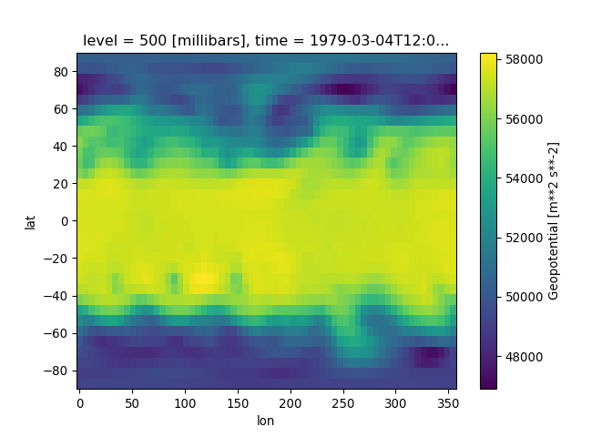
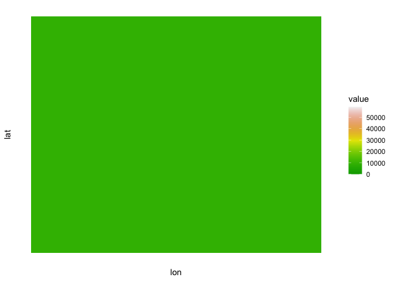

WeatherBench
================
Ty Tuff, ESIIL Data Scientist
2023-05-21

WeatherBench is a valuable resource housed on GitHub, aimed at fostering
the development and evaluation of machine learning models in the field
of weather prediction. Developed by Pangeo Data, a community-driven and
open-source project focused on data-intensive earth science,
WeatherBench seeks to address the current gap in benchmark datasets
specifically designed for weather forecasting.

The WeatherBench repository is centered around a comprehensive dataset
derived from the ERA5 reanalysis data provided by the European Centre
for Medium-Range Weather Forecasts (ECMWF). This data spans several
decades and includes a variety of key atmospheric variables, such as
temperature, pressure, and precipitation, among others. The high spatial
and temporal resolution of the data makes it an excellent resource for
developing and testing weather prediction models.

A unique feature of WeatherBench is that it is not just a dataset, but a
comprehensive benchmarking system. It includes a scoring function to
evaluate predictions, following the common practices in weather
forecasting. This allows for a standardized evaluation of models,
ensuring that different methods can be fairly and directly compared.

Moreover, the repository includes example code using state-of-the-art
machine learning techniques for weather forecasting. This provides a
helpful starting point for those new to the field or looking to compare
their own approaches with established methods.

In summary, WeatherBench represents a significant contribution to the
meteorological and machine learning communities by providing a robust,
standardized platform for the development and comparison of weather
forecasting models. Whether you are a researcher, data scientist,
meteorologist, or student, WeatherBench offers a rich resource to
explore and contribute to this exciting intersection of disciplines.

``` python
import xarray as xr
import matplotlib.pyplot as plt
```

``` bash
wget "https://dataserv.ub.tum.de/s/m1524895/download?path=%2F5.625deg%2Fgeopotential_500&files=geopotential_500_5.625deg.zip" -O geopotential_500_5.625deg.zip --no-check-certificate
```

``` bash
mkdir -p geopotential_500
unzip -d geopotential_500/ geopotential_500_5.625deg.zip
```

``` python
z500 = xr.open_mfdataset('geopotential_500/*.nc', combine='by_coords')
z500
```

<div><svg style="position: absolute; width: 0; height: 0; overflow: hidden">
<defs>
<symbol id="icon-database" viewBox="0 0 32 32">
<path d="M16 0c-8.837 0-16 2.239-16 5v4c0 2.761 7.163 5 16 5s16-2.239 16-5v-4c0-2.761-7.163-5-16-5z"></path>
<path d="M16 17c-8.837 0-16-2.239-16-5v6c0 2.761 7.163 5 16 5s16-2.239 16-5v-6c0 2.761-7.163 5-16 5z"></path>
<path d="M16 26c-8.837 0-16-2.239-16-5v6c0 2.761 7.163 5 16 5s16-2.239 16-5v-6c0 2.761-7.163 5-16 5z"></path>
</symbol>
<symbol id="icon-file-text2" viewBox="0 0 32 32">
<path d="M28.681 7.159c-0.694-0.947-1.662-2.053-2.724-3.116s-2.169-2.030-3.116-2.724c-1.612-1.182-2.393-1.319-2.841-1.319h-15.5c-1.378 0-2.5 1.121-2.5 2.5v27c0 1.378 1.122 2.5 2.5 2.5h23c1.378 0 2.5-1.122 2.5-2.5v-19.5c0-0.448-0.137-1.23-1.319-2.841zM24.543 5.457c0.959 0.959 1.712 1.825 2.268 2.543h-4.811v-4.811c0.718 0.556 1.584 1.309 2.543 2.268zM28 29.5c0 0.271-0.229 0.5-0.5 0.5h-23c-0.271 0-0.5-0.229-0.5-0.5v-27c0-0.271 0.229-0.5 0.5-0.5 0 0 15.499-0 15.5 0v7c0 0.552 0.448 1 1 1h7v19.5z"></path>
<path d="M23 26h-14c-0.552 0-1-0.448-1-1s0.448-1 1-1h14c0.552 0 1 0.448 1 1s-0.448 1-1 1z"></path>
<path d="M23 22h-14c-0.552 0-1-0.448-1-1s0.448-1 1-1h14c0.552 0 1 0.448 1 1s-0.448 1-1 1z"></path>
<path d="M23 18h-14c-0.552 0-1-0.448-1-1s0.448-1 1-1h14c0.552 0 1 0.448 1 1s-0.448 1-1 1z"></path>
</symbol>
</defs>
</svg>
<style>/* CSS stylesheet for displaying xarray objects in jupyterlab.
 *
 */

:root {
  --xr-font-color0: var(--jp-content-font-color0, rgba(0, 0, 0, 1));
  --xr-font-color2: var(--jp-content-font-color2, rgba(0, 0, 0, 0.54));
  --xr-font-color3: var(--jp-content-font-color3, rgba(0, 0, 0, 0.38));
  --xr-border-color: var(--jp-border-color2, #e0e0e0);
  --xr-disabled-color: var(--jp-layout-color3, #bdbdbd);
  --xr-background-color: var(--jp-layout-color0, white);
  --xr-background-color-row-even: var(--jp-layout-color1, white);
  --xr-background-color-row-odd: var(--jp-layout-color2, #eeeeee);
}

html[theme=dark],
body.vscode-dark {
  --xr-font-color0: rgba(255, 255, 255, 1);
  --xr-font-color2: rgba(255, 255, 255, 0.54);
  --xr-font-color3: rgba(255, 255, 255, 0.38);
  --xr-border-color: #1F1F1F;
  --xr-disabled-color: #515151;
  --xr-background-color: #111111;
  --xr-background-color-row-even: #111111;
  --xr-background-color-row-odd: #313131;
}

.xr-wrap {
  display: block !important;
  min-width: 300px;
  max-width: 700px;
}

.xr-text-repr-fallback {
  /* fallback to plain text repr when CSS is not injected (untrusted notebook) */
  display: none;
}

.xr-header {
  padding-top: 6px;
  padding-bottom: 6px;
  margin-bottom: 4px;
  border-bottom: solid 1px var(--xr-border-color);
}

.xr-header > div,
.xr-header > ul {
  display: inline;
  margin-top: 0;
  margin-bottom: 0;
}

.xr-obj-type,
.xr-array-name {
  margin-left: 2px;
  margin-right: 10px;
}

.xr-obj-type {
  color: var(--xr-font-color2);
}

.xr-sections {
  padding-left: 0 !important;
  display: grid;
  grid-template-columns: 150px auto auto 1fr 20px 20px;
}

.xr-section-item {
  display: contents;
}

.xr-section-item input {
  display: none;
}

.xr-section-item input + label {
  color: var(--xr-disabled-color);
}

.xr-section-item input:enabled + label {
  cursor: pointer;
  color: var(--xr-font-color2);
}

.xr-section-item input:enabled + label:hover {
  color: var(--xr-font-color0);
}

.xr-section-summary {
  grid-column: 1;
  color: var(--xr-font-color2);
  font-weight: 500;
}

.xr-section-summary > span {
  display: inline-block;
  padding-left: 0.5em;
}

.xr-section-summary-in:disabled + label {
  color: var(--xr-font-color2);
}

.xr-section-summary-in + label:before {
  display: inline-block;
  content: '►';
  font-size: 11px;
  width: 15px;
  text-align: center;
}

.xr-section-summary-in:disabled + label:before {
  color: var(--xr-disabled-color);
}

.xr-section-summary-in:checked + label:before {
  content: '▼';
}

.xr-section-summary-in:checked + label > span {
  display: none;
}

.xr-section-summary,
.xr-section-inline-details {
  padding-top: 4px;
  padding-bottom: 4px;
}

.xr-section-inline-details {
  grid-column: 2 / -1;
}

.xr-section-details {
  display: none;
  grid-column: 1 / -1;
  margin-bottom: 5px;
}

.xr-section-summary-in:checked ~ .xr-section-details {
  display: contents;
}

.xr-array-wrap {
  grid-column: 1 / -1;
  display: grid;
  grid-template-columns: 20px auto;
}

.xr-array-wrap > label {
  grid-column: 1;
  vertical-align: top;
}

.xr-preview {
  color: var(--xr-font-color3);
}

.xr-array-preview,
.xr-array-data {
  padding: 0 5px !important;
  grid-column: 2;
}

.xr-array-data,
.xr-array-in:checked ~ .xr-array-preview {
  display: none;
}

.xr-array-in:checked ~ .xr-array-data,
.xr-array-preview {
  display: inline-block;
}

.xr-dim-list {
  display: inline-block !important;
  list-style: none;
  padding: 0 !important;
  margin: 0;
}

.xr-dim-list li {
  display: inline-block;
  padding: 0;
  margin: 0;
}

.xr-dim-list:before {
  content: '(';
}

.xr-dim-list:after {
  content: ')';
}

.xr-dim-list li:not(:last-child):after {
  content: ',';
  padding-right: 5px;
}

.xr-has-index {
  font-weight: bold;
}

.xr-var-list,
.xr-var-item {
  display: contents;
}

.xr-var-item > div,
.xr-var-item label,
.xr-var-item > .xr-var-name span {
  background-color: var(--xr-background-color-row-even);
  margin-bottom: 0;
}

.xr-var-item > .xr-var-name:hover span {
  padding-right: 5px;
}

.xr-var-list > li:nth-child(odd) > div,
.xr-var-list > li:nth-child(odd) > label,
.xr-var-list > li:nth-child(odd) > .xr-var-name span {
  background-color: var(--xr-background-color-row-odd);
}

.xr-var-name {
  grid-column: 1;
}

.xr-var-dims {
  grid-column: 2;
}

.xr-var-dtype {
  grid-column: 3;
  text-align: right;
  color: var(--xr-font-color2);
}

.xr-var-preview {
  grid-column: 4;
}

.xr-var-name,
.xr-var-dims,
.xr-var-dtype,
.xr-preview,
.xr-attrs dt {
  white-space: nowrap;
  overflow: hidden;
  text-overflow: ellipsis;
  padding-right: 10px;
}

.xr-var-name:hover,
.xr-var-dims:hover,
.xr-var-dtype:hover,
.xr-attrs dt:hover {
  overflow: visible;
  width: auto;
  z-index: 1;
}

.xr-var-attrs,
.xr-var-data {
  display: none;
  background-color: var(--xr-background-color) !important;
  padding-bottom: 5px !important;
}

.xr-var-attrs-in:checked ~ .xr-var-attrs,
.xr-var-data-in:checked ~ .xr-var-data {
  display: block;
}

.xr-var-data > table {
  float: right;
}

.xr-var-name span,
.xr-var-data,
.xr-attrs {
  padding-left: 25px !important;
}

.xr-attrs,
.xr-var-attrs,
.xr-var-data {
  grid-column: 1 / -1;
}

dl.xr-attrs {
  padding: 0;
  margin: 0;
  display: grid;
  grid-template-columns: 125px auto;
}

.xr-attrs dt,
.xr-attrs dd {
  padding: 0;
  margin: 0;
  float: left;
  padding-right: 10px;
  width: auto;
}

.xr-attrs dt {
  font-weight: normal;
  grid-column: 1;
}

.xr-attrs dt:hover span {
  display: inline-block;
  background: var(--xr-background-color);
  padding-right: 10px;
}

.xr-attrs dd {
  grid-column: 2;
  white-space: pre-wrap;
  word-break: break-all;
}

.xr-icon-database,
.xr-icon-file-text2 {
  display: inline-block;
  vertical-align: middle;
  width: 1em;
  height: 1.5em !important;
  stroke-width: 0;
  stroke: currentColor;
  fill: currentColor;
}
</style><pre class='xr-text-repr-fallback'>&lt;xarray.Dataset&gt;
Dimensions:  (lon: 64, lat: 32, time: 350640)
Coordinates:
    level    int32 500
  * lon      (lon) float64 0.0 5.625 11.25 16.88 ... 337.5 343.1 348.8 354.4
  * lat      (lat) float64 -87.19 -81.56 -75.94 -70.31 ... 75.94 81.56 87.19
  * time     (time) datetime64[ns] 1979-01-01 ... 2018-12-31T23:00:00
Data variables:
    z        (time, lat, lon) float32 dask.array&lt;chunksize=(8760, 32, 64), meta=np.ndarray&gt;
Attributes:
    Conventions:  CF-1.6
    history:      2019-11-10 20:33:23 GMT by grib_to_netcdf-2.14.0: /opt/ecmw...</pre><div class='xr-wrap' style='display:none'><div class='xr-header'><div class='xr-obj-type'>xarray.Dataset</div></div><ul class='xr-sections'><li class='xr-section-item'><input id='section-a649ef6f-7f5f-4c86-81f0-ea4b97a56fa8' class='xr-section-summary-in' type='checkbox' disabled ><label for='section-a649ef6f-7f5f-4c86-81f0-ea4b97a56fa8' class='xr-section-summary'  title='Expand/collapse section'>Dimensions:</label><div class='xr-section-inline-details'><ul class='xr-dim-list'><li><span class='xr-has-index'>lon</span>: 64</li><li><span class='xr-has-index'>lat</span>: 32</li><li><span class='xr-has-index'>time</span>: 350640</li></ul></div><div class='xr-section-details'></div></li><li class='xr-section-item'><input id='section-36c244fa-64b5-4672-a3d6-45254597c2c8' class='xr-section-summary-in' type='checkbox'  checked><label for='section-36c244fa-64b5-4672-a3d6-45254597c2c8' class='xr-section-summary' >Coordinates: <span>(4)</span></label><div class='xr-section-inline-details'></div><div class='xr-section-details'><ul class='xr-var-list'><li class='xr-var-item'><div class='xr-var-name'><span>level</span></div><div class='xr-var-dims'>()</div><div class='xr-var-dtype'>int32</div><div class='xr-var-preview xr-preview'>500</div><input id='attrs-1c5d7ee5-9765-45e5-a9bc-ebda41f2b3ea' class='xr-var-attrs-in' type='checkbox' ><label for='attrs-1c5d7ee5-9765-45e5-a9bc-ebda41f2b3ea' title='Show/Hide attributes'><svg class='icon xr-icon-file-text2'><use xlink:href='#icon-file-text2'></use></svg></label><input id='data-0d9d0aeb-bb4d-4fed-8b1e-a1b498a9b7eb' class='xr-var-data-in' type='checkbox'><label for='data-0d9d0aeb-bb4d-4fed-8b1e-a1b498a9b7eb' title='Show/Hide data repr'><svg class='icon xr-icon-database'><use xlink:href='#icon-database'></use></svg></label><div class='xr-var-attrs'><dl class='xr-attrs'><dt><span>units :</span></dt><dd>millibars</dd><dt><span>long_name :</span></dt><dd>pressure_level</dd></dl></div><div class='xr-var-data'><pre>array(500, dtype=int32)</pre></div></li><li class='xr-var-item'><div class='xr-var-name'><span class='xr-has-index'>lon</span></div><div class='xr-var-dims'>(lon)</div><div class='xr-var-dtype'>float64</div><div class='xr-var-preview xr-preview'>0.0 5.625 11.25 ... 348.8 354.4</div><input id='attrs-78c43323-e605-41cd-ba03-61950efda707' class='xr-var-attrs-in' type='checkbox' disabled><label for='attrs-78c43323-e605-41cd-ba03-61950efda707' title='Show/Hide attributes'><svg class='icon xr-icon-file-text2'><use xlink:href='#icon-file-text2'></use></svg></label><input id='data-a24d889b-6b3b-447b-9d3a-528d150b5633' class='xr-var-data-in' type='checkbox'><label for='data-a24d889b-6b3b-447b-9d3a-528d150b5633' title='Show/Hide data repr'><svg class='icon xr-icon-database'><use xlink:href='#icon-database'></use></svg></label><div class='xr-var-attrs'><dl class='xr-attrs'></dl></div><div class='xr-var-data'><pre>array([  0.   ,   5.625,  11.25 ,  16.875,  22.5  ,  28.125,  33.75 ,  39.375,
        45.   ,  50.625,  56.25 ,  61.875,  67.5  ,  73.125,  78.75 ,  84.375,
        90.   ,  95.625, 101.25 , 106.875, 112.5  , 118.125, 123.75 , 129.375,
       135.   , 140.625, 146.25 , 151.875, 157.5  , 163.125, 168.75 , 174.375,
       180.   , 185.625, 191.25 , 196.875, 202.5  , 208.125, 213.75 , 219.375,
       225.   , 230.625, 236.25 , 241.875, 247.5  , 253.125, 258.75 , 264.375,
       270.   , 275.625, 281.25 , 286.875, 292.5  , 298.125, 303.75 , 309.375,
       315.   , 320.625, 326.25 , 331.875, 337.5  , 343.125, 348.75 , 354.375])</pre></div></li><li class='xr-var-item'><div class='xr-var-name'><span class='xr-has-index'>lat</span></div><div class='xr-var-dims'>(lat)</div><div class='xr-var-dtype'>float64</div><div class='xr-var-preview xr-preview'>-87.19 -81.56 ... 81.56 87.19</div><input id='attrs-a722f25a-2087-4050-b052-cdfbafd396ed' class='xr-var-attrs-in' type='checkbox' disabled><label for='attrs-a722f25a-2087-4050-b052-cdfbafd396ed' title='Show/Hide attributes'><svg class='icon xr-icon-file-text2'><use xlink:href='#icon-file-text2'></use></svg></label><input id='data-69ccf7bb-e8da-438d-9f84-44e69f4ddf90' class='xr-var-data-in' type='checkbox'><label for='data-69ccf7bb-e8da-438d-9f84-44e69f4ddf90' title='Show/Hide data repr'><svg class='icon xr-icon-database'><use xlink:href='#icon-database'></use></svg></label><div class='xr-var-attrs'><dl class='xr-attrs'></dl></div><div class='xr-var-data'><pre>array([-87.1875, -81.5625, -75.9375, -70.3125, -64.6875, -59.0625, -53.4375,
       -47.8125, -42.1875, -36.5625, -30.9375, -25.3125, -19.6875, -14.0625,
        -8.4375,  -2.8125,   2.8125,   8.4375,  14.0625,  19.6875,  25.3125,
        30.9375,  36.5625,  42.1875,  47.8125,  53.4375,  59.0625,  64.6875,
        70.3125,  75.9375,  81.5625,  87.1875])</pre></div></li><li class='xr-var-item'><div class='xr-var-name'><span class='xr-has-index'>time</span></div><div class='xr-var-dims'>(time)</div><div class='xr-var-dtype'>datetime64[ns]</div><div class='xr-var-preview xr-preview'>1979-01-01 ... 2018-12-31T23:00:00</div><input id='attrs-dd83334d-8227-4e10-9aaf-f42aaf511946' class='xr-var-attrs-in' type='checkbox' ><label for='attrs-dd83334d-8227-4e10-9aaf-f42aaf511946' title='Show/Hide attributes'><svg class='icon xr-icon-file-text2'><use xlink:href='#icon-file-text2'></use></svg></label><input id='data-993d17f5-25d4-413f-bc58-f15dc3a4ac9c' class='xr-var-data-in' type='checkbox'><label for='data-993d17f5-25d4-413f-bc58-f15dc3a4ac9c' title='Show/Hide data repr'><svg class='icon xr-icon-database'><use xlink:href='#icon-database'></use></svg></label><div class='xr-var-attrs'><dl class='xr-attrs'><dt><span>long_name :</span></dt><dd>time</dd></dl></div><div class='xr-var-data'><pre>array([&#x27;1979-01-01T00:00:00.000000000&#x27;, &#x27;1979-01-01T01:00:00.000000000&#x27;,
       &#x27;1979-01-01T02:00:00.000000000&#x27;, ..., &#x27;2018-12-31T21:00:00.000000000&#x27;,
       &#x27;2018-12-31T22:00:00.000000000&#x27;, &#x27;2018-12-31T23:00:00.000000000&#x27;],
      dtype=&#x27;datetime64[ns]&#x27;)</pre></div></li></ul></div></li><li class='xr-section-item'><input id='section-258c27bb-f9be-4b56-a0e3-a63a4f17b7cf' class='xr-section-summary-in' type='checkbox'  checked><label for='section-258c27bb-f9be-4b56-a0e3-a63a4f17b7cf' class='xr-section-summary' >Data variables: <span>(1)</span></label><div class='xr-section-inline-details'></div><div class='xr-section-details'><ul class='xr-var-list'><li class='xr-var-item'><div class='xr-var-name'><span>z</span></div><div class='xr-var-dims'>(time, lat, lon)</div><div class='xr-var-dtype'>float32</div><div class='xr-var-preview xr-preview'>dask.array&lt;chunksize=(8760, 32, 64), meta=np.ndarray&gt;</div><input id='attrs-143784fb-25f8-4764-8b60-f93b6220ceab' class='xr-var-attrs-in' type='checkbox' ><label for='attrs-143784fb-25f8-4764-8b60-f93b6220ceab' title='Show/Hide attributes'><svg class='icon xr-icon-file-text2'><use xlink:href='#icon-file-text2'></use></svg></label><input id='data-c234a454-13e7-41fe-b576-ddf038e19ab4' class='xr-var-data-in' type='checkbox'><label for='data-c234a454-13e7-41fe-b576-ddf038e19ab4' title='Show/Hide data repr'><svg class='icon xr-icon-database'><use xlink:href='#icon-database'></use></svg></label><div class='xr-var-attrs'><dl class='xr-attrs'><dt><span>units :</span></dt><dd>m**2 s**-2</dd><dt><span>long_name :</span></dt><dd>Geopotential</dd><dt><span>standard_name :</span></dt><dd>geopotential</dd></dl></div><div class='xr-var-data'><table>
    <tr>
        <td>
            <table>
                <thead>
                    <tr>
                        <td> </td>
                        <th> Array </th>
                        <th> Chunk </th>
                    </tr>
                </thead>
                <tbody>
                    
                    <tr>
                        <th> Bytes </th>
                        <td> 2.68 GiB </td>
                        <td> 68.62 MiB </td>
                    </tr>
                    
                    <tr>
                        <th> Shape </th>
                        <td> (350640, 32, 64) </td>
                        <td> (8784, 32, 64) </td>
                    </tr>
                    <tr>
                        <th> Count </th>
                        <td> 120 Tasks </td>
                        <td> 40 Chunks </td>
                    </tr>
                    <tr>
                    <th> Type </th>
                    <td> float32 </td>
                    <td> numpy.ndarray </td>
                    </tr>
                </tbody>
            </table>
        </td>
        <td>
        <svg width="156" height="146" style="stroke:rgb(0,0,0);stroke-width:1" >

  <!-- Horizontal lines -->
  <line x1="10" y1="0" x2="80" y2="70" style="stroke-width:2" />
  <line x1="10" y1="25" x2="80" y2="96" style="stroke-width:2" />

  <!-- Vertical lines -->
  <line x1="10" y1="0" x2="10" y2="25" style="stroke-width:2" />
  <line x1="13" y1="3" x2="13" y2="28" />
  <line x1="17" y1="7" x2="17" y2="32" />
  <line x1="20" y1="10" x2="20" y2="36" />
  <line x1="24" y1="14" x2="24" y2="39" />
  <line x1="27" y1="17" x2="27" y2="43" />
  <line x1="31" y1="21" x2="31" y2="46" />
  <line x1="34" y1="24" x2="34" y2="50" />
  <line x1="38" y1="28" x2="38" y2="53" />
  <line x1="41" y1="31" x2="41" y2="57" />
  <line x1="47" y1="37" x2="47" y2="62" />
  <line x1="50" y1="40" x2="50" y2="66" />
  <line x1="54" y1="44" x2="54" y2="69" />
  <line x1="57" y1="47" x2="57" y2="73" />
  <line x1="61" y1="51" x2="61" y2="76" />
  <line x1="64" y1="54" x2="64" y2="80" />
  <line x1="68" y1="58" x2="68" y2="83" />
  <line x1="71" y1="61" x2="71" y2="87" />
  <line x1="75" y1="65" x2="75" y2="90" />
  <line x1="80" y1="70" x2="80" y2="96" style="stroke-width:2" />

  <!-- Colored Rectangle -->
  <polygon points="10.0,0.0 80.58823529411765,70.58823529411765 80.58823529411765,96.00085180870013 10.0,25.412616514582485" style="fill:#8B4903A0;stroke-width:0"/>

  <!-- Horizontal lines -->
  <line x1="10" y1="0" x2="35" y2="0" style="stroke-width:2" />
  <line x1="13" y1="3" x2="38" y2="3" />
  <line x1="17" y1="7" x2="42" y2="7" />
  <line x1="20" y1="10" x2="46" y2="10" />
  <line x1="24" y1="14" x2="49" y2="14" />
  <line x1="27" y1="17" x2="53" y2="17" />
  <line x1="31" y1="21" x2="56" y2="21" />
  <line x1="34" y1="24" x2="60" y2="24" />
  <line x1="38" y1="28" x2="63" y2="28" />
  <line x1="41" y1="31" x2="67" y2="31" />
  <line x1="47" y1="37" x2="72" y2="37" />
  <line x1="50" y1="40" x2="76" y2="40" />
  <line x1="54" y1="44" x2="79" y2="44" />
  <line x1="57" y1="47" x2="83" y2="47" />
  <line x1="61" y1="51" x2="86" y2="51" />
  <line x1="64" y1="54" x2="90" y2="54" />
  <line x1="68" y1="58" x2="93" y2="58" />
  <line x1="71" y1="61" x2="97" y2="61" />
  <line x1="75" y1="65" x2="100" y2="65" />
  <line x1="80" y1="70" x2="106" y2="70" style="stroke-width:2" />

  <!-- Vertical lines -->
  <line x1="10" y1="0" x2="80" y2="70" style="stroke-width:2" />
  <line x1="35" y1="0" x2="106" y2="70" style="stroke-width:2" />

  <!-- Colored Rectangle -->
  <polygon points="10.0,0.0 35.41261651458248,0.0 106.00085180870013,70.58823529411765 80.58823529411765,70.58823529411765" style="fill:#8B4903A0;stroke-width:0"/>

  <!-- Horizontal lines -->
  <line x1="80" y1="70" x2="106" y2="70" style="stroke-width:2" />
  <line x1="80" y1="96" x2="106" y2="96" style="stroke-width:2" />

  <!-- Vertical lines -->
  <line x1="80" y1="70" x2="80" y2="96" style="stroke-width:2" />
  <line x1="106" y1="70" x2="106" y2="96" style="stroke-width:2" />

  <!-- Colored Rectangle -->
  <polygon points="80.58823529411765,70.58823529411765 106.00085180870013,70.58823529411765 106.00085180870013,96.00085180870013 80.58823529411765,96.00085180870013" style="fill:#ECB172A0;stroke-width:0"/>

  <!-- Text -->
  <text x="93.294544" y="116.000852" font-size="1.0rem" font-weight="100" text-anchor="middle" >64</text>
  <text x="126.000852" y="83.294544" font-size="1.0rem" font-weight="100" text-anchor="middle" transform="rotate(0,126.000852,83.294544)">32</text>
  <text x="35.294118" y="80.706734" font-size="1.0rem" font-weight="100" text-anchor="middle" transform="rotate(45,35.294118,80.706734)">350640</text>
</svg>
        </td>
    </tr>
</table></div></li></ul></div></li><li class='xr-section-item'><input id='section-59145d09-3860-47b5-8df8-400ee0732438' class='xr-section-summary-in' type='checkbox'  checked><label for='section-59145d09-3860-47b5-8df8-400ee0732438' class='xr-section-summary' >Attributes: <span>(2)</span></label><div class='xr-section-inline-details'></div><div class='xr-section-details'><dl class='xr-attrs'><dt><span>Conventions :</span></dt><dd>CF-1.6</dd><dt><span>history :</span></dt><dd>2019-11-10 20:33:23 GMT by grib_to_netcdf-2.14.0: /opt/ecmwf/eccodes/bin/grib_to_netcdf -o /cache/data5/adaptor.mars.internal-1573408778.8616278-11514-5-32bb1559-bce6-4a86-9ae4-60f0d33d9246.nc /cache/tmp/32bb1559-bce6-4a86-9ae4-60f0d33d9246-adaptor.mars.internal-1573408778.8624167-11514-2-tmp.grib</dd></dl></div></li></ul></div></div>

``` python

plt.clf()
# Plot an example
z500.z.isel(time=1500).plot();
plt.show()
```



``` python
plt.clf()
# To speed things up we will just take the mean for 2016
climatology = z500.sel(time=slice('2016', '2018')).mean('time').load()
climatology.z.plot()

plt.show()
```


``` r
library(RCurl)
library(ncdf4)
library(ggplot2)
library(reshape2)
library(tidync)

# Set options to skip SSL verification
download_opts <- list(ssl.verifypeer = FALSE, ssl.verifyhost = FALSE)

# Download the dataset
bin_data <- getBinaryURL("https://dataserv.ub.tum.de/s/m1524895/download?path=%2F5.625deg%2Fgeopotential_500&files=geopotential_500_5.625deg.zip", .opts = download_opts)

# Write the downloaded data to a file
writeBin(bin_data, "geopotential_500_5.625deg.zip")

# Unzip the downloaded file
unzip("geopotential_500_5.625deg.zip", exdir = "geopotential_500/")

# Load multiple NetCDF files into R
filenames <- list.files(path = "geopotential_500", full.names = TRUE, pattern = "*.nc")

# Use tidync to read the first NetCDF file
z500_first <- tidync(filenames[[1]]) %>% hyper_tibble()

# Melt the data frame to make it compatible with ggplot2
z500_melt <- melt(z500_first, id.vars = c("lon", "lat")) 

ggplot(z500_melt, aes(lon, lat, fill = value)) + 
   geom_tile() +
   scale_fill_gradientn(colors = terrain.colors(1000)) +
   theme_minimal() +
   theme(axis.text = element_blank(),
         axis.ticks = element_blank(),
         panel.grid = element_blank())
```


