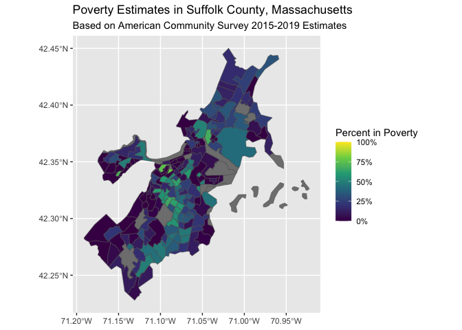
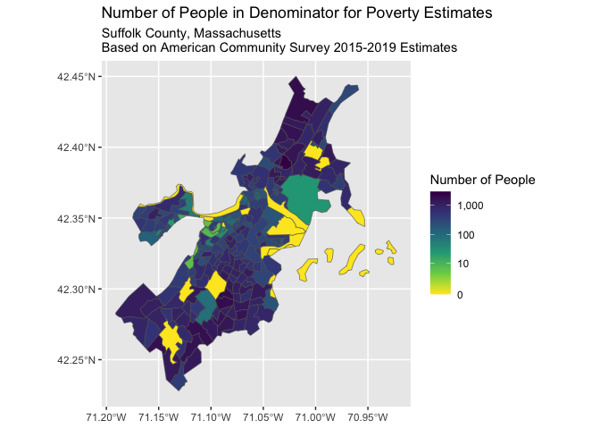

US Census
================

``` r
# example code for downloading poverty measures from the American Community
# Survey through tidycensus and visualizing them through maps

# load the packages we'll use for this section
library(tidycensus)
library(tidyverse)
```

    ── Attaching core tidyverse packages ──────────────────────── tidyverse 2.0.0 ──
    ✔ dplyr     1.1.2     ✔ readr     2.1.4
    ✔ forcats   1.0.0     ✔ stringr   1.5.0
    ✔ ggplot2   3.4.2     ✔ tibble    3.2.1
    ✔ lubridate 1.9.2     ✔ tidyr     1.3.0
    ✔ purrr     1.0.1     
    ── Conflicts ────────────────────────────────────────── tidyverse_conflicts() ──
    ✖ dplyr::filter() masks stats::filter()
    ✖ dplyr::lag()    masks stats::lag()
    ℹ Use the conflicted package (<http://conflicted.r-lib.org/>) to force all conflicts to become errors

``` r
library(sf)
```

    Linking to GEOS 3.10.2, GDAL 3.4.2, PROJ 8.2.1; sf_use_s2() is TRUE

``` r
library(RColorBrewer)
library(mapview)

# download the data from the ACS using the get_acs method from tidycensus
# 
# the B05010_002E variable refers to the count of residents who live in
# households with household income below the poverty line; the B05010_001E
# variable refers to the count of residents for whom household income was
# ascertained by the ACS, e.g. the relevant denominator.
# 
poverty <- get_acs(
  state = 'MA',
  county = '025', # this is the FIPS code for Suffolk County, MA
  geography = 'tract',
  year = 2019, # this indicates the 2015-2019 5-year acs 
  geometry = TRUE,
  variables = c(
    in_poverty = 'B05010_002E', 
    total_pop_for_poverty_estimates = 'B05010_001E') 
)
```

    Getting data from the 2015-2019 5-year ACS

    Warning: • You have not set a Census API key. Users without a key are limited to 500
    queries per day and may experience performance limitations.
    ℹ For best results, get a Census API key at
    http://api.census.gov/data/key_signup.html and then supply the key to the
    `census_api_key()` function to use it throughout your tidycensus session.
    This warning is displayed once per session.

    Downloading feature geometry from the Census website.  To cache shapefiles for use in future sessions, set `options(tigris_use_cache = TRUE)`.


      |                                                                            
      |                                                                      |   0%
      |                                                                            
      |=                                                                     |   1%
      |                                                                            
      |=                                                                     |   2%
      |                                                                            
      |==                                                                    |   2%
      |                                                                            
      |==                                                                    |   3%
      |                                                                            
      |===                                                                   |   4%
      |                                                                            
      |====                                                                  |   5%
      |                                                                            
      |====                                                                  |   6%
      |                                                                            
      |=====                                                                 |   6%
      |                                                                            
      |=====                                                                 |   7%
      |                                                                            
      |=====                                                                 |   8%
      |                                                                            
      |======                                                                |   9%
      |                                                                            
      |=======                                                               |  10%
      |                                                                            
      |=======                                                               |  11%
      |                                                                            
      |========                                                              |  11%
      |                                                                            
      |========                                                              |  12%
      |                                                                            
      |=========                                                             |  13%
      |                                                                            
      |==========                                                            |  14%
      |                                                                            
      |==========                                                            |  15%
      |                                                                            
      |===========                                                           |  15%
      |                                                                            
      |===========                                                           |  16%
      |                                                                            
      |============                                                          |  17%
      |                                                                            
      |============                                                          |  18%
      |                                                                            
      |=============                                                         |  18%
      |                                                                            
      |=============                                                         |  19%
      |                                                                            
      |==============                                                        |  20%
      |                                                                            
      |===============                                                       |  21%
      |                                                                            
      |===============                                                       |  22%
      |                                                                            
      |================                                                      |  22%
      |                                                                            
      |================                                                      |  23%
      |                                                                            
      |=================                                                     |  24%
      |                                                                            
      |==================                                                    |  25%
      |                                                                            
      |==================                                                    |  26%
      |                                                                            
      |===================                                                   |  26%
      |                                                                            
      |===================                                                   |  27%
      |                                                                            
      |====================                                                  |  28%
      |                                                                            
      |====================                                                  |  29%
      |                                                                            
      |=====================                                                 |  30%
      |                                                                            
      |=====================                                                 |  31%
      |                                                                            
      |======================                                                |  31%
      |                                                                            
      |======================                                                |  32%
      |                                                                            
      |=======================                                               |  33%
      |                                                                            
      |========================                                              |  34%
      |                                                                            
      |========================                                              |  35%
      |                                                                            
      |=========================                                             |  35%
      |                                                                            
      |=========================                                             |  36%
      |                                                                            
      |==========================                                            |  37%
      |                                                                            
      |==========================                                            |  38%
      |                                                                            
      |===========================                                           |  38%
      |                                                                            
      |===========================                                           |  39%
      |                                                                            
      |============================                                          |  40%
      |                                                                            
      |=============================                                         |  41%
      |                                                                            
      |==============================                                        |  42%
      |                                                                            
      |==============================                                        |  43%
      |                                                                            
      |===============================                                       |  44%
      |                                                                            
      |================================                                      |  45%
      |                                                                            
      |================================                                      |  46%
      |                                                                            
      |=================================                                     |  47%
      |                                                                            
      |==================================                                    |  48%
      |                                                                            
      |==================================                                    |  49%
      |                                                                            
      |===================================                                   |  50%
      |                                                                            
      |===================================                                   |  51%
      |                                                                            
      |====================================                                  |  51%
      |                                                                            
      |====================================                                  |  52%
      |                                                                            
      |======================================                                |  54%
      |                                                                            
      |======================================                                |  55%
      |                                                                            
      |=======================================                               |  55%
      |                                                                            
      |=======================================                               |  56%
      |                                                                            
      |========================================                              |  57%
      |                                                                            
      |========================================                              |  58%
      |                                                                            
      |=========================================                             |  58%
      |                                                                            
      |==========================================                            |  60%
      |                                                                            
      |===========================================                           |  61%
      |                                                                            
      |===========================================                           |  62%
      |                                                                            
      |============================================                          |  62%
      |                                                                            
      |============================================                          |  63%
      |                                                                            
      |=============================================                         |  64%
      |                                                                            
      |==============================================                        |  65%
      |                                                                            
      |===============================================                       |  67%
      |                                                                            
      |================================================                      |  68%
      |                                                                            
      |================================================                      |  69%
      |                                                                            
      |=================================================                     |  69%
      |                                                                            
      |=================================================================     |  93%
      |                                                                            
      |==================================================================    |  95%
      |                                                                            
      |===================================================================   |  96%
      |                                                                            
      |====================================================================  |  97%
      |                                                                            
      |====================================================================  |  98%
      |                                                                            
      |===================================================================== |  98%
      |                                                                            
      |======================================================================| 100%

``` r
# we're going to recode the variable names to more human-readable names to 
# make it easier to work with the data in subsequent steps
poverty <- poverty %>% 
  mutate(
    variable = recode(variable,
                     # you may notice that tidycensus drops the 'E' from the 
                     # end of the variable code names
                     B05010_002 = 'in_poverty',
                     B05010_001 = 'total_pop_for_poverty_estimates'))

# pivot the data wider so that the in_poverty and
# total_pop_for_poverty_estimates; this follows the "tidy" format and approach
# where each row corresponds to an observation.
# 
# because the pivot_wider method can mess up your data when your data contains
# geometry/shapefile information, we will remove the geomemtry information
# and add it back in later
poverty_geometry <- poverty %>% select(GEOID) %>% unique() # save the geometry data
poverty <- poverty %>% 
  sf::st_drop_geometry() %>% # remove geometry data
  tidyr::pivot_wider(
    id_cols = GEOID,
    names_from = variable,
    values_from = c(estimate, moe))

# calculate the proportion in poverty
poverty <- poverty %>% 
  mutate(
    proportion_in_poverty = estimate_in_poverty / estimate_total_pop_for_poverty_estimates,
    percent_in_poverty = proportion_in_poverty * 100)

# add the geometry back in -- 
# make sure to merge the data into the sf object with the sf object on the 
# left hand side so the output has the sf type including your geometry data
poverty <- poverty_geometry %>% 
  left_join(poverty)
```

    Joining with `by = join_by(GEOID)`

``` r
# visualize our point estimates 
ggplot(poverty, aes(fill = proportion_in_poverty)) +
  geom_sf() +
  scale_fill_viridis_c(label = scales::percent_format(),
                       limits = c(0, 1)) +
  labs(fill = "Percent in Poverty") +
  ggtitle("Poverty Estimates in Suffolk County, Massachusetts",
          subtitle = "Based on American Community Survey 2015-2019 Estimates")
```



``` r
# visualize the denominator counts -- 
# of significance, note that there are several census tracts where the
# denominator is 0 resulting in NaN estimates for the percent in poverty.
ggplot(poverty, aes(fill = estimate_total_pop_for_poverty_estimates)) + 
  geom_sf() + 
  scale_fill_viridis_c(label = scales::comma_format(), direction = -1, 
                       breaks = c(0, 10, 100, 1000), trans = "log1p") + 
  labs(fill = "Number of People") + 
  ggtitle("Number of People in Denominator for Poverty Estimates", 
          paste0("Suffolk County, Massachusetts\n",
          "Based on American Community Survey 2015-2019 Estimates"))
```


