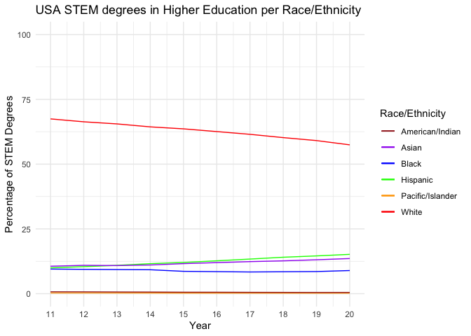

National Center for Education Statistics
================
Ty Tuff, ESIIL Data Scientist
2023-05-21

The National Center for Education Statistics (NCES) is the primary
federal entity in the United States responsible for collecting and
analyzing data related to education. It is part of the U.S. Department
of Education and the Institute of Education Sciences. NCES provides a
wealth of data resources on a variety of topics. Here are some of the
main types of data you can find through NCES:
<https://nces.ed.gov/datatools/>

Assessments: NCES conducts several major assessments, including the
National Assessment of Educational Progress (NAEP), the Programme for
International Student Assessment (PISA), and the Trends in International
Mathematics and Science Study (TIMSS), among others. These assessments
provide data on student performance in various subjects, which can be
used to compare the educational performance of students in the U.S. with
that of students in other countries.

Early Childhood: NCES collects data on early childhood education
programs, enrollment, and outcomes. This includes data from the Early
Childhood Longitudinal Study (ECLS) and the National Household Education
Surveys Program (NHES).

Elementary/Secondary: NCES offers data on a wide range of topics related
to elementary and secondary education, including student achievement,
school demographics, school finance, teacher qualifications, and more.

Postsecondary: NCES provides extensive data on postsecondary education
in the U.S., including data on enrollments, graduation rates, degrees
conferred, finances, institutional characteristics, and many other
topics. This includes data from the Integrated Postsecondary Education
Data System (IPEDS) and the National Postsecondary Student Aid Study
(NPSAS).

Library: NCES maintains data on libraries in the U.S., including
academic libraries, public libraries, school libraries, and state
library agencies. International: In addition to U.S. data, NCES provides
international data that allows for comparative studies of education
systems worldwide.

Surveys & Programs: NCES conducts numerous surveys and longitudinal
studies that provide valuable data on a wide range of educational
topics.

Data Tools: NCES provides several data tools, such as the College
Navigator and the School District Demographics System, that allow users
to interactively explore the data.

All these datasets are publicly available and can be accessed via the
NCES website. The data can be used by policymakers, researchers,
educators, and the general public to inform decision-making and research
in education.

### STEM degrees

The dataset denoted as Table 318.45 provides detailed information about
the number and percentage distribution of Science, Technology,
Engineering, and Mathematics (STEM) degrees and certificates conferred
by postsecondary institutions in the United States. The data spans
academic years 2011-12 through 2020-21.

This dataset offers a breakdown of STEM degrees/certificates conferred
across multiple categories:

Race/Ethnicity: The dataset categorizes recipients by their
racial/ethnic groups. The categories provided in this dataset include
White, Black, Hispanic, Asian/Pacific Islander, American/Indian, and
individuals of two or more races.

Level of Degree/Certificate: The data distinguishes between different
levels of academic achievement, such as undergraduate (associate and
bachelor’s degrees) and graduate (master’s and doctoral degrees) levels,
as well as non-degree certificates.

Sex of Student: The data is also divided by the gender of the students
who received these degrees or certificates, allowing for a comparison of
STEM degree attainment between male and female students.

Overall, this dataset provides a comprehensive overview of the
demographic distribution of STEM degree and certificate recipients in
the U.S. over a decade. Such data is crucial for understanding trends in
education, informing policy and decision-making, and addressing
disparities in the STEM field.

R code:

``` r
# Load the necessary libraries
library(tidyverse)
library(httr)
library(readxl)

# Download the dataset
url <- "https://nces.ed.gov/programs/digest/d22/tables/xls/tabn318.45.xlsx"
output_file <- "stem_degrees.xlsx"
GET(url, write_disk(output_file, overwrite = TRUE))
```

    Response [https://nces.ed.gov/programs/digest/d22/tables/xls/tabn318.45.xlsx]
      Date: 2023-05-15 17:52
      Status: 200
      Content-Type: application/vnd.openxmlformats-officedocument.spreadsheetml.sheet
      Size: 49.5 kB
    <ON DISK>  /Users/ty/Documents/Github/data-library/docs/education/NCES/stem_degrees.xlsx

``` r
# Load the data from the Excel file
data <- readxl::read_excel(output_file)

# Rename the columns
names(data)[c(1,12:20)] <- c("sex_and_year", "Total", "White", "Black", "Hispanic", "Total_Islander", "Asian_Islander", "Pacific_Islander", "American_Indian", "Two_or_more_races")

# Preprocess the data
stem_degrees <- data %>%
  dplyr::select(sex_and_year, Total, White, Black, Hispanic, Total_Islander, Asian_Islander, Pacific_Islander, American_Indian, Two_or_more_races) %>%
  filter(!row_number() %in% c(1:6)) %>%
  filter(row_number() %in% c(1:10)) 

# Convert character columns to numeric
stem_degrees[,2:10] <- stem_degrees[,2:10] %>%
  mutate_if(is.character, as.numeric)

# Adjust the "sex_and_year" column
stem_degrees[,1] <- c(11:20)

# Plot the data
ggplot(data = stem_degrees, aes(x = sex_and_year, y = Total)) +
  geom_line(aes(y = White, col = "White")) +
  geom_line(aes(y = Black, col = "Black")) +
  geom_line(aes(y = Hispanic, col = "Hispanic")) +
  geom_line(aes(y = Asian_Islander, col = "Asian")) +
  geom_line(aes(y = Pacific_Islander, col = "Pacific/Islander")) +
  geom_line(aes(y = American_Indian, col = "American/Indian")) +
  scale_x_continuous(breaks = c(11:20)) +
  theme_minimal() +
  ylim(0, 100) +
  scale_color_manual(values = c("White" = "red", "Black" = "blue", "Hispanic" = "green", "Asian" = "purple", "Pacific/Islander" = "orange", "American/Indian" = "brown"),
                     name = "Race/Ethnicity") +
  labs(title = "USA STEM degrees in Higher Education per Race/Ethnicity",
       x = "Year",
       y = "Percentage of STEM Degrees")
```



Python code:

``` python
import pandas as pd
import matplotlib.pyplot as plt
import openpyxl

# Download and read the data
url = "https://nces.ed.gov/programs/digest/d22/tables/xls/tabn318.45.xlsx"
data = pd.read_excel(url)

# Rename columns
data.rename(columns={
    data.columns[0]: "sex_and_year", 
    data.columns[11]: "Total", 
    data.columns[12]: "White",
    data.columns[13]: "Black",
    data.columns[14]: "Hispanic",
    data.columns[15]: "Total_Islander",
    data.columns[16]: "Asian_Islander",
    data.columns[17]: "Pacific_Islander",
    data.columns[18]: "American_Indian",
    data.columns[19]: "Two_or_more_races"
}, inplace=True)

# Filter data
stem_degrees = data[6:16].copy()
stem_degrees = stem_degrees[["sex_and_year", "Total", "White", "Black", "Hispanic", "Total_Islander", "Asian_Islander", "Pacific_Islander", "American_Indian", "Two_or_more_races"]]

# Convert columns to numeric
for col in stem_degrees.columns[1:]:
    stem_degrees[col] = pd.to_numeric(stem_degrees[col], errors='coerce')

# Replace "sex_and_year" column
stem_degrees["sex_and_year"] = range(11, 21)

# Plotting
plt.figure(figsize=(10, 6))
for col in stem_degrees.columns[2:]:
    plt.plot(stem_degrees["sex_and_year"], stem_degrees[col], label=col)
plt.legend()
plt.grid(True)
plt.title("USA STEM degrees in Higher Education per Race/Ethnicity")
plt.xlabel("Year")
plt.ylabel("Percentage of STEM Degrees")
plt.ylim(0, 100)
```

    (0.0, 100.0)

``` python
plt.show()
```


