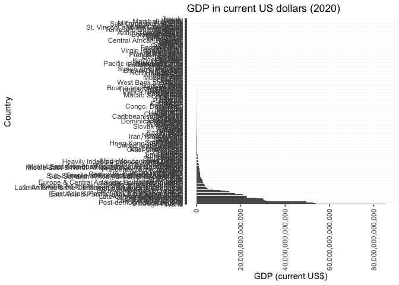
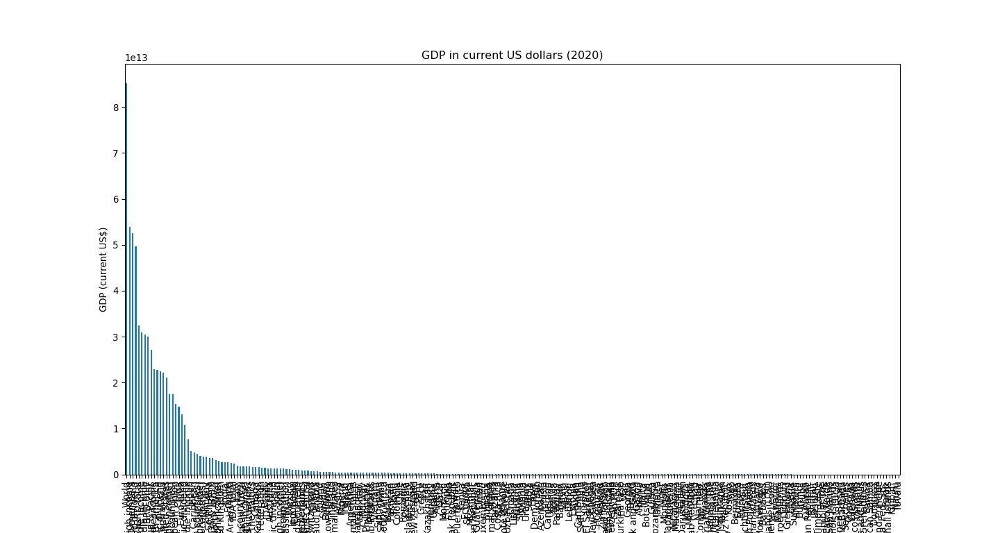

governance indicators
================

The Worldwide Governance Indicators (WGI) dataset provides aggregate
governance indicators for over 200 countries and territories for six
dimensions of governance: voice and accountability, political stability,
government effectiveness, regulatory quality, rule of law, and control
of corruption. The dataset is updated annually and is available for
download in various formats, including Excel and CSV.

https://info.worldbank.org/governance/wgi/
https://papers.ssrn.com/sol3/papers.cfm?abstract_id=1682130

R code:

``` r
library(knitr)
```

List of possible indicators

``` r
library(httr)
library(jsonlite)

# Define the base URL and parameters
base_url <- "https://api.worldbank.org/v2/indicators"
format <- "json"
per_page <- 1000

# Create the full URL
url <- paste0(base_url, "?format=", format, "&per_page=", per_page)

# Make an API request
response <- GET(url)

# Check the status of the response
if (http_status(response)$category == "Success") {
  # Parse the response
  data <- content(response, "text", encoding = "UTF-8")
  data_json <- fromJSON(data)
  
  # Extract the relevant data
  indicators <- data.frame(data_json[[2]])
  
  # Print the first few rows of the data
  kable(head(indicators))
} else {
  cat("Failed to retrieve data:", http_status(response)$message, "\n")
}
```

    Warning in `[<-.data.frame`(`*tmp*`, , j, value = structure(list(id =
    structure(c("37", : provided 2 variables to replace 1 variables

| id                   | name                                    | unit | source | sourceNote                                                                                                                                                    | sourceOrganization                                                    | topics       |
|:---------------------|:----------------------------------------|:-----|:-------|:--------------------------------------------------------------------------------------------------------------------------------------------------------------|:----------------------------------------------------------------------|:-------------|
| 1.0.HCount.1.90usd   | Poverty Headcount (\$1.90 a day)        |      | 37     | The poverty headcount index measures the proportion of the population with daily per capita income (in 2011 PPP) below the poverty line.                      | LAC Equity Lab tabulations of SEDLAC (CEDLAS and the World Bank).     | 11 , Poverty |
| 1.0.HCount.2.5usd    | Poverty Headcount (\$2.50 a day)        |      | 37     | The poverty headcount index measures the proportion of the population with daily per capita income (in 2005 PPP) below the poverty line.                      | LAC Equity Lab tabulations of SEDLAC (CEDLAS and the World Bank).     | 11 , Poverty |
| 1.0.HCount.Mid10to50 | Middle Class (\$10-50 a day) Headcount  |      | 37     | The poverty headcount index measures the proportion of the population with daily per capita income (in 2005 PPP) below the poverty line.                      | LAC Equity Lab tabulations of SEDLAC (CEDLAS and the World Bank).     | 11 , Poverty |
| 1.0.HCount.Ofcl      | Official Moderate Poverty Rate-National |      | 37     | The poverty headcount index measures the proportion of the population with daily per capita income below the official poverty line developed by each country. | LAC Equity Lab tabulations of data from National Statistical Offices. | 11 , Poverty |
| 1.0.HCount.Poor4uds  | Poverty Headcount (\$4 a day)           |      | 37     | The poverty headcount index measures the proportion of the population with daily per capita income (in 2005 PPP) below the poverty line.                      | LAC Equity Lab tabulations of SEDLAC (CEDLAS and the World Bank).     | 11 , Poverty |
| 1.0.HCount.Vul4to10  | Vulnerable (\$4-10 a day) Headcount     |      | 37     | The poverty headcount index measures the proportion of the population with daily per capita income (in 2005 PPP) below the poverty line.                      | LAC Equity Lab tabulations of SEDLAC (CEDLAS and the World Bank).     | 11 , Poverty |

Download one of those indicators and flatten into a table.

``` r
library(httr)
library(jsonlite)
library(ggplot2)
library(tidyverse)
```

    ── Attaching core tidyverse packages ──────────────────────── tidyverse 2.0.0 ──
    ✔ dplyr     1.1.2     ✔ readr     2.1.4
    ✔ forcats   1.0.0     ✔ stringr   1.5.0
    ✔ lubridate 1.9.2     ✔ tibble    3.2.1
    ✔ purrr     1.0.1     ✔ tidyr     1.3.0
    ── Conflicts ────────────────────────────────────────── tidyverse_conflicts() ──
    ✖ dplyr::filter()  masks stats::filter()
    ✖ purrr::flatten() masks jsonlite::flatten()
    ✖ dplyr::lag()     masks stats::lag()
    ℹ Use the conflicted package (<http://conflicted.r-lib.org/>) to force all conflicts to become errors

``` r
# Define the base URL and parameters
base_url <- "https://api.worldbank.org/v2/country/all/indicator"
indicator <- "NY.GDP.MKTP.CD" # Example indicator (GDP in current US dollars)
date_range <- "2020:2020" # Filter only for the year 2020
format <- "json"
per_page <- 1000

# Create the full URL
url <- paste0(base_url, "/", indicator, "?date=", date_range, "&format=", format, "&per_page=", per_page)

# Make an API request
response <- GET(url)

# Check the status of the response
if (http_status(response)$category == "Success") {
  # Parse the response
  data <- content(response, "text", encoding = "UTF-8")
  data_json <- fromJSON(data)
  
  # Extract the relevant data and flatten the data frame
  indicators <- data.frame(data_json[[2]])
  indicators_flat <- indicators %>% 
    unnest(cols = c(country, indicator), names_sep = "_") %>%
    select(countryiso3code, country_value, date, value)

  # Remove rows with missing values
  indicators_filtered <- indicators_flat[!is.na(indicators_flat$value),]

  
  
  # Create a plot for GDP in 2020
  ggplot(indicators_filtered, aes(x = reorder(country_value, -value), y = value)) +
    geom_bar(stat = "identity") +
    theme(axis.text.x = element_text(angle = 90, hjust = 1, vjust = 0.5)) +
    labs(title = "GDP in current US dollars (2020)", x = "Country", y = "GDP (current US$)") +
    coord_flip() +
    scale_y_continuous(labels = scales::comma)
} else {
  cat("Failed to retrieve data:", http_status(response)$message, "\n")
}
```



``` r
library(knitr)
kable(indicators_filtered)
```

| countryiso3code | country_value                                        | date |        value |
|:----------------|:-----------------------------------------------------|:-----|-------------:|
| AFE             | Africa Eastern and Southern                          | 2020 | 9.341791e+11 |
| AFW             | Africa Western and Central                           | 2020 | 7.847997e+11 |
| ARB             | Arab World                                           | 2020 | 2.491175e+12 |
| CSS             | Caribbean small states                               | 2020 | 6.589681e+10 |
| CEB             | Central Europe and the Baltics                       | 2020 | 1.664903e+12 |
| EAR             | Early-demographic dividend                           | 2020 | 1.085137e+13 |
| EAS             | East Asia & Pacific                                  | 2020 | 2.712731e+13 |
| EAP             | East Asia & Pacific (excluding high income)          | 2020 | 1.748692e+13 |
| TEA             | East Asia & Pacific (IDA & IBRD countries)           | 2020 | 1.746437e+13 |
| EMU             | Euro area                                            | 2020 | 1.308548e+13 |
| ECS             | Europe & Central Asia                                | 2020 | 2.213998e+13 |
| ECA             | Europe & Central Asia (excluding high income)        | 2020 | 2.982627e+12 |
| TEC             | Europe & Central Asia (IDA & IBRD countries)         | 2020 | 3.891717e+12 |
| EUU             | European Union                                       | 2020 | 1.536944e+13 |
| FCS             | Fragile and conflict affected situations             | 2020 | 1.680894e+12 |
| HPC             | Heavily indebted poor countries (HIPC)               | 2020 | 8.032365e+11 |
|                 | High income                                          | 2020 | 5.387455e+13 |
| IBD             | IBRD only                                            | 2020 | 3.006895e+13 |
| IBT             | IDA & IBRD total                                     | 2020 | 3.240440e+13 |
| IDB             | IDA blend                                            | 2020 | 1.002075e+12 |
| IDX             | IDA only                                             | 2020 | 1.336381e+12 |
| IDA             | IDA total                                            | 2020 | 2.335046e+12 |
| LTE             | Late-demographic dividend                            | 2020 | 2.249345e+13 |
| LCN             | Latin America & Caribbean                            | 2020 | 4.742372e+12 |
| LAC             | Latin America & Caribbean (excluding high income)    | 2020 | 3.997651e+12 |
| TLA             | Latin America & the Caribbean (IDA & IBRD countries) | 2020 | 4.494456e+12 |
| LDC             | Least developed countries: UN classification         | 2020 | 1.176577e+12 |
| LMY             | Low & middle income                                  | 2020 | 3.094839e+13 |
|                 | Low income                                           | 2020 | 5.087402e+11 |
|                 | Lower middle income                                  | 2020 | 7.617243e+12 |
| MEA             | Middle East & North Africa                           | 2020 | 3.115703e+12 |
| MNA             | Middle East & North Africa (excluding high income)   | 2020 | 1.274090e+12 |
| TMN             | Middle East & North Africa (IDA & IBRD countries)    | 2020 | 1.258549e+12 |
| MIC             | Middle income                                        | 2020 | 3.046860e+13 |
| NAC             | North America                                        | 2020 | 2.271278e+13 |
| OED             | OECD members                                         | 2020 | 5.251705e+13 |
| OSS             | Other small states                                   | 2020 | 3.783155e+11 |
| PSS             | Pacific island small states                          | 2020 | 9.515995e+09 |
| PST             | Post-demographic dividend                            | 2020 | 4.969780e+13 |
| PRE             | Pre-demographic dividend                             | 2020 | 1.316350e+12 |
| SST             | Small states                                         | 2020 | 4.537283e+11 |
| SAS             | South Asia                                           | 2020 | 3.487013e+12 |
| TSA             | South Asia (IDA & IBRD)                              | 2020 | 3.487013e+12 |
| SSF             | Sub-Saharan Africa                                   | 2020 | 1.719010e+12 |
| SSA             | Sub-Saharan Africa (excluding high income)           | 2020 | 1.717750e+12 |
| TSS             | Sub-Saharan Africa (IDA & IBRD countries)            | 2020 | 1.719010e+12 |
|                 | Upper middle income                                  | 2020 | 2.285137e+13 |
| WLD             | World                                                | 2020 | 8.511634e+13 |
| AFG             | Afghanistan                                          | 2020 | 2.014344e+10 |
| ALB             | Albania                                              | 2020 | 1.513187e+10 |
| DZA             | Algeria                                              | 2020 | 1.450092e+11 |
| ASM             | American Samoa                                       | 2020 | 7.160000e+08 |
| AND             | Andorra                                              | 2020 | 2.891022e+09 |
| AGO             | Angola                                               | 2020 | 5.361907e+10 |
| ATG             | Antigua and Barbuda                                  | 2020 | 1.370281e+09 |
| ARG             | Argentina                                            | 2020 | 3.855402e+11 |
| ARM             | Armenia                                              | 2020 | 1.264170e+10 |
| ABW             | Aruba                                                | 2020 | 2.610039e+09 |
| AUS             | Australia                                            | 2020 | 1.326901e+12 |
| AUT             | Austria                                              | 2020 | 4.352252e+11 |
| AZE             | Azerbaijan                                           | 2020 | 4.269300e+10 |
| BHS             | Bahamas, The                                         | 2020 | 9.699500e+09 |
| BHR             | Bahrain                                              | 2020 | 3.472336e+10 |
| BGD             | Bangladesh                                           | 2020 | 3.739021e+11 |
| BRB             | Barbados                                             | 2020 | 4.671800e+09 |
| BLR             | Belarus                                              | 2020 | 6.137113e+10 |
| BEL             | Belgium                                              | 2020 | 5.252118e+11 |
| BLZ             | Belize                                               | 2020 | 2.080000e+09 |
| BEN             | Benin                                                | 2020 | 1.565155e+10 |
| BMU             | Bermuda                                              | 2020 | 6.887147e+09 |
| BTN             | Bhutan                                               | 2020 | 2.325184e+09 |
| BOL             | Bolivia                                              | 2020 | 3.662984e+10 |
| BIH             | Bosnia and Herzegovina                               | 2020 | 1.995047e+10 |
| BWA             | Botswana                                             | 2020 | 1.493007e+10 |
| BRA             | Brazil                                               | 2020 | 1.448560e+12 |
| BRN             | Brunei Darussalam                                    | 2020 | 1.200583e+10 |
| BGR             | Bulgaria                                             | 2020 | 7.024028e+10 |
| BFA             | Burkina Faso                                         | 2020 | 1.793361e+10 |
| BDI             | Burundi                                              | 2020 | 2.649672e+09 |
| CPV             | Cabo Verde                                           | 2020 | 1.703699e+09 |
| KHM             | Cambodia                                             | 2020 | 2.587280e+10 |
| CMR             | Cameroon                                             | 2020 | 4.077324e+10 |
| CAN             | Canada                                               | 2020 | 1.645423e+12 |
| CYM             | Cayman Islands                                       | 2020 | 5.608989e+09 |
| CAF             | Central African Republic                             | 2020 | 2.326721e+09 |
| TCD             | Chad                                                 | 2020 | 1.071540e+10 |
| CHL             | Chile                                                | 2020 | 2.527272e+11 |
| CHN             | China                                                | 2020 | 1.468767e+13 |
| COL             | Colombia                                             | 2020 | 2.703000e+11 |
| COM             | Comoros                                              | 2020 | 1.225039e+09 |
| COD             | Congo, Dem. Rep.                                     | 2020 | 4.871696e+10 |
| COG             | Congo, Rep.                                          | 2020 | 1.048315e+10 |
| CRI             | Costa Rica                                           | 2020 | 6.215800e+10 |
| CIV             | Cote d’Ivoire                                        | 2020 | 6.134858e+10 |
| HRV             | Croatia                                              | 2020 | 5.747201e+10 |
| CUB             | Cuba                                                 | 2020 | 1.073520e+11 |
| CUW             | Curacao                                              | 2020 | 2.496175e+09 |
| CYP             | Cyprus                                               | 2020 | 2.500845e+10 |
| CZE             | Czechia                                              | 2020 | 2.459746e+11 |
| DNK             | Denmark                                              | 2020 | 3.552224e+11 |
| DJI             | Djibouti                                             | 2020 | 3.181071e+09 |
| DMA             | Dominica                                             | 2020 | 5.042148e+08 |
| DOM             | Dominican Republic                                   | 2020 | 7.884470e+10 |
| ECU             | Ecuador                                              | 2020 | 9.929112e+10 |
| EGY             | Egypt, Arab Rep.                                     | 2020 | 3.652527e+11 |
| SLV             | El Salvador                                          | 2020 | 2.456302e+10 |
| GNQ             | Equatorial Guinea                                    | 2020 | 1.009916e+10 |
| EST             | Estonia                                              | 2020 | 3.137040e+10 |
| SWZ             | Eswatini                                             | 2020 | 3.982226e+09 |
| ETH             | Ethiopia                                             | 2020 | 1.076577e+11 |
| FRO             | Faroe Islands                                        | 2020 | 3.248697e+09 |
| FJI             | Fiji                                                 | 2020 | 4.477040e+09 |
| FIN             | Finland                                              | 2020 | 2.718918e+11 |
| FRA             | France                                               | 2020 | 2.639009e+12 |
| PYF             | French Polynesia                                     | 2020 | 5.709422e+09 |
| GAB             | Gabon                                                | 2020 | 1.531458e+10 |
| GMB             | Gambia, The                                          | 2020 | 1.812169e+09 |
| GEO             | Georgia                                              | 2020 | 1.584292e+10 |
| DEU             | Germany                                              | 2020 | 3.889669e+12 |
| GHA             | Ghana                                                | 2020 | 7.004320e+10 |
| GRC             | Greece                                               | 2020 | 1.889260e+11 |
| GRL             | Greenland                                            | 2020 | 3.076015e+09 |
| GRD             | Grenada                                              | 2020 | 1.043415e+09 |
| GUM             | Guam                                                 | 2020 | 5.886000e+09 |
| GTM             | Guatemala                                            | 2020 | 7.762549e+10 |
| GIN             | Guinea                                               | 2020 | 1.417784e+10 |
| GNB             | Guinea-Bissau                                        | 2020 | 1.431758e+09 |
| GUY             | Guyana                                               | 2020 | 5.471257e+09 |
| HTI             | Haiti                                                | 2020 | 1.450822e+10 |
| HND             | Honduras                                             | 2020 | 2.382784e+10 |
| HKG             | Hong Kong SAR, China                                 | 2020 | 3.449322e+11 |
| HUN             | Hungary                                              | 2020 | 1.571820e+11 |
| ISL             | Iceland                                              | 2020 | 2.169467e+10 |
| IND             | India                                                | 2020 | 2.667688e+12 |
| IDN             | Indonesia                                            | 2020 | 1.058689e+12 |
| IRN             | Iran, Islamic Rep.                                   | 2020 | 2.397356e+11 |
| IRQ             | Iraq                                                 | 2020 | 1.843698e+11 |
| IRL             | Ireland                                              | 2020 | 4.258523e+11 |
| ISR             | Israel                                               | 2020 | 4.132677e+11 |
| ITA             | Italy                                                | 2020 | 1.896755e+12 |
| JAM             | Jamaica                                              | 2020 | 1.381243e+10 |
| JPN             | Japan                                                | 2020 | 5.040108e+12 |
| JOR             | Jordan                                               | 2020 | 4.418230e+10 |
| KAZ             | Kazakhstan                                           | 2020 | 1.710824e+11 |
| KEN             | Kenya                                                | 2020 | 1.006665e+11 |
| KIR             | Kiribati                                             | 2020 | 1.809118e+08 |
| KOR             | Korea, Rep.                                          | 2020 | 1.644313e+12 |
| XKX             | Kosovo                                               | 2020 | 7.716925e+09 |
| KWT             | Kuwait                                               | 2020 | 1.059602e+11 |
| KGZ             | Kyrgyz Republic                                      | 2020 | 7.780875e+09 |
| LAO             | Lao PDR                                              | 2020 | 1.898180e+10 |
| LVA             | Latvia                                               | 2020 | 3.460174e+10 |
| LBN             | Lebanon                                              | 2020 | 3.171213e+10 |
| LSO             | Lesotho                                              | 2020 | 2.231215e+09 |
| LBR             | Liberia                                              | 2020 | 3.039982e+09 |
| LBY             | Libya                                                | 2020 | 5.035731e+10 |
| LIE             | Liechtenstein                                        | 2020 | 6.113951e+09 |
| LTU             | Lithuania                                            | 2020 | 5.684662e+10 |
| LUX             | Luxembourg                                           | 2020 | 7.399259e+10 |
| MAC             | Macao SAR, China                                     | 2020 | 2.545956e+10 |
| MDG             | Madagascar                                           | 2020 | 1.305144e+10 |
| MWI             | Malawi                                               | 2020 | 1.218235e+10 |
| MYS             | Malaysia                                             | 2020 | 3.373379e+11 |
| MDV             | Maldives                                             | 2020 | 3.746322e+09 |
| MLI             | Mali                                                 | 2020 | 1.746539e+10 |
| MLT             | Malta                                                | 2020 | 1.493307e+10 |
| MHL             | Marshall Islands                                     | 2020 | 2.417224e+08 |
| MRT             | Mauritania                                           | 2020 | 8.405491e+09 |
| MUS             | Mauritius                                            | 2020 | 1.140105e+10 |
| MEX             | Mexico                                               | 2020 | 1.090515e+12 |
| FSM             | Micronesia, Fed. Sts.                                | 2020 | 4.080000e+08 |
| MDA             | Moldova                                              | 2020 | 1.185973e+10 |
| MCO             | Monaco                                               | 2020 | 6.739692e+09 |
| MNG             | Mongolia                                             | 2020 | 1.331298e+10 |
| MNE             | Montenegro                                           | 2020 | 4.769861e+09 |
| MAR             | Morocco                                              | 2020 | 1.213481e+11 |
| MOZ             | Mozambique                                           | 2020 | 1.402881e+10 |
| MMR             | Myanmar                                              | 2020 | 7.893026e+10 |
| NAM             | Namibia                                              | 2020 | 1.058159e+10 |
| NRU             | Nauru                                                | 2020 | 1.146266e+08 |
| NPL             | Nepal                                                | 2020 | 3.343367e+10 |
| NLD             | Netherlands                                          | 2020 | 9.097935e+11 |
| NCL             | New Caledonia                                        | 2020 | 9.435530e+09 |
| NZL             | New Zealand                                          | 2020 | 2.117345e+11 |
| NIC             | Nicaragua                                            | 2020 | 1.258697e+10 |
| NER             | Niger                                                | 2020 | 1.374417e+10 |
| NGA             | Nigeria                                              | 2020 | 4.321989e+11 |
| MKD             | North Macedonia                                      | 2020 | 1.236358e+10 |
| NOR             | Norway                                               | 2020 | 3.621983e+11 |
| OMN             | Oman                                                 | 2020 | 7.590940e+10 |
| PAK             | Pakistan                                             | 2020 | 3.004257e+11 |
| PLW             | Palau                                                | 2020 | 2.519000e+08 |
| PAN             | Panama                                               | 2020 | 5.397700e+10 |
| PNG             | Papua New Guinea                                     | 2020 | 2.384827e+10 |
| PRY             | Paraguay                                             | 2020 | 3.543218e+10 |
| PER             | Peru                                                 | 2020 | 2.017051e+11 |
| PHL             | Philippines                                          | 2020 | 3.617511e+11 |
| POL             | Poland                                               | 2020 | 5.994492e+11 |
| PRT             | Portugal                                             | 2020 | 2.290319e+11 |
| PRI             | Puerto Rico                                          | 2020 | 1.030203e+11 |
| QAT             | Qatar                                                | 2020 | 1.444114e+11 |
| ROU             | Romania                                              | 2020 | 2.513620e+11 |
| RUS             | Russian Federation                                   | 2020 | 1.489362e+12 |
| RWA             | Rwanda                                               | 2020 | 1.018435e+10 |
| WSM             | Samoa                                                | 2020 | 8.689045e+08 |
| SMR             | San Marino                                           | 2020 | 1.541204e+09 |
| STP             | Sao Tome and Principe                                | 2020 | 4.725510e+08 |
| SAU             | Saudi Arabia                                         | 2020 | 7.033678e+11 |
| SEN             | Senegal                                              | 2020 | 2.449316e+10 |
| SRB             | Serbia                                               | 2020 | 5.335648e+10 |
| SYC             | Seychelles                                           | 2020 | 1.261199e+09 |
| SLE             | Sierra Leone                                         | 2020 | 4.063289e+09 |
| SGP             | Singapore                                            | 2020 | 3.452959e+11 |
| SVK             | Slovak Republic                                      | 2020 | 1.066968e+11 |
| SVN             | Slovenia                                             | 2020 | 5.370680e+10 |
| SLB             | Solomon Islands                                      | 2020 | 1.536148e+09 |
| SOM             | Somalia                                              | 2020 | 6.883000e+09 |
| ZAF             | South Africa                                         | 2020 | 3.376197e+11 |
| ESP             | Spain                                                | 2020 | 1.276963e+12 |
| LKA             | Sri Lanka                                            | 2020 | 8.534911e+10 |
| KNA             | St. Kitts and Nevis                                  | 2020 | 8.845259e+08 |
| LCA             | St. Lucia                                            | 2020 | 1.516016e+09 |
| VCT             | St. Vincent and the Grenadines                       | 2020 | 8.721346e+08 |
| SDN             | Sudan                                                | 2020 | 2.703459e+10 |
| SUR             | Suriname                                             | 2020 | 2.911807e+09 |
| SWE             | Sweden                                               | 2020 | 5.470542e+11 |
| CHE             | Switzerland                                          | 2020 | 7.399136e+11 |
| SYR             | Syrian Arab Republic                                 | 2020 | 1.107980e+10 |
| TJK             | Tajikistan                                           | 2020 | 8.133997e+09 |
| TZA             | Tanzania                                             | 2020 | 6.240971e+10 |
| THA             | Thailand                                             | 2020 | 4.996818e+11 |
| TLS             | Timor-Leste                                          | 2020 | 2.158393e+09 |
| TGO             | Togo                                                 | 2020 | 7.574637e+09 |
| TON             | Tonga                                                | 2020 | 4.848067e+08 |
| TTO             | Trinidad and Tobago                                  | 2020 | 2.105943e+10 |
| TUN             | Tunisia                                              | 2020 | 4.253783e+10 |
| TUR             | Turkiye                                              | 2020 | 7.202894e+11 |
| TCA             | Turks and Caicos Islands                             | 2020 | 9.245830e+08 |
| TUV             | Tuvalu                                               | 2020 | 5.505471e+07 |
| UGA             | Uganda                                               | 2020 | 3.760037e+10 |
| UKR             | Ukraine                                              | 2020 | 1.566179e+11 |
| ARE             | United Arab Emirates                                 | 2020 | 3.494730e+11 |
| GBR             | United Kingdom                                       | 2020 | 2.704609e+12 |
| USA             | United States                                        | 2020 | 2.106047e+13 |
| URY             | Uruguay                                              | 2020 | 5.356076e+10 |
| UZB             | Uzbekistan                                           | 2020 | 5.989431e+10 |
| VUT             | Vanuatu                                              | 2020 | 8.968799e+08 |
| VNM             | Vietnam                                              | 2020 | 3.466158e+11 |
| VIR             | Virgin Islands (U.S.)                                | 2020 | 4.204000e+09 |
| PSE             | West Bank and Gaza                                   | 2020 | 1.553170e+10 |
| ZMB             | Zambia                                               | 2020 | 1.811063e+10 |
| ZWE             | Zimbabwe                                             | 2020 | 2.150970e+10 |

Python code:

``` python
import requests
import pandas as pd
import matplotlib.pyplot as plt

# Define the base URL and parameters
base_url = "https://api.worldbank.org/v2/country/all/indicator"
indicator = "NY.GDP.MKTP.CD"  # Example indicator (GDP in current US dollars)
date_range = "2020:2020"  # Filter only for the year 2020
params = {
    "format": "json",
    "date": date_range,
    "per_page": 1000,
}

# Create the full URL
url = f"{base_url}/{indicator}"

# Make an API request
response = requests.get(url, params=params)

# Check the status of the response
if response.status_code == 200:
    # Parse the response
    data_json = response.json()

    # Extract the relevant data and flatten the data frame
    indicators = pd.json_normalize(data_json[1])
    indicators_flat = indicators[["countryiso3code", "country.value", "date", "value"]]

    # Remove rows with missing values
    indicators_filtered = indicators_flat.dropna(subset=["value"])

    # Create a plot for GDP in 2020
    indicators_filtered = indicators_filtered.sort_values(by="value", ascending=False)
    plot = indicators_filtered.plot.bar(
        x="country.value", y="value", figsize=(15, 8), legend=None
    )
    plot.set_title("GDP in current US dollars (2020)")
    plot.set_xlabel("Country")
    plot.set_ylabel("GDP (current US$)")
    plt.xticks(rotation=90)
    plt.show()
else:
    print("Failed to retrieve data:", response.status_code)
```

    Text(0.5, 1.0, 'GDP in current US dollars (2020)')
    Text(0.5, 0, 'Country')
    Text(0, 0.5, 'GDP (current US$)')
    (array([  0,   1,   2,   3,   4,   5,   6,   7,   8,   9,  10,  11,  12,
            13,  14,  15,  16,  17,  18,  19,  20,  21,  22,  23,  24,  25,
            26,  27,  28,  29,  30,  31,  32,  33,  34,  35,  36,  37,  38,
            39,  40,  41,  42,  43,  44,  45,  46,  47,  48,  49,  50,  51,
            52,  53,  54,  55,  56,  57,  58,  59,  60,  61,  62,  63,  64,
            65,  66,  67,  68,  69,  70,  71,  72,  73,  74,  75,  76,  77,
            78,  79,  80,  81,  82,  83,  84,  85,  86,  87,  88,  89,  90,
            91,  92,  93,  94,  95,  96,  97,  98,  99, 100, 101, 102, 103,
           104, 105, 106, 107, 108, 109, 110, 111, 112, 113, 114, 115, 116,
           117, 118, 119, 120, 121, 122, 123, 124, 125, 126, 127, 128, 129,
           130, 131, 132, 133, 134, 135, 136, 137, 138, 139, 140, 141, 142,
           143, 144, 145, 146, 147, 148, 149, 150, 151, 152, 153, 154, 155,
           156, 157, 158, 159, 160, 161, 162, 163, 164, 165, 166, 167, 168,
           169, 170, 171, 172, 173, 174, 175, 176, 177, 178, 179, 180, 181,
           182, 183, 184, 185, 186, 187, 188, 189, 190, 191, 192, 193, 194,
           195, 196, 197, 198, 199, 200, 201, 202, 203, 204, 205, 206, 207,
           208, 209, 210, 211, 212, 213, 214, 215, 216, 217, 218, 219, 220,
           221, 222, 223, 224, 225, 226, 227, 228, 229, 230, 231, 232, 233,
           234, 235, 236, 237, 238, 239, 240, 241, 242, 243, 244, 245, 246,
           247, 248, 249, 250, 251]), [Text(0, 0, 'World'), Text(1, 0, 'High income'), Text(2, 0, 'OECD members'), Text(3, 0, 'Post-demographic dividend'), Text(4, 0, 'IDA & IBRD total'), Text(5, 0, 'Low & middle income'), Text(6, 0, 'Middle income'), Text(7, 0, 'IBRD only'), Text(8, 0, 'East Asia & Pacific'), Text(9, 0, 'Upper middle income'), Text(10, 0, 'North America'), Text(11, 0, 'Late-demographic dividend'), Text(12, 0, 'Europe & Central Asia'), Text(13, 0, 'United States'), Text(14, 0, 'East Asia & Pacific (excluding high income)'), Text(15, 0, 'East Asia & Pacific (IDA & IBRD countries)'), Text(16, 0, 'European Union'), Text(17, 0, 'China'), Text(18, 0, 'Euro area'), Text(19, 0, 'Early-demographic dividend'), Text(20, 0, 'Lower middle income'), Text(21, 0, 'Japan'), Text(22, 0, 'Latin America & Caribbean'), Text(23, 0, 'Latin America & the Caribbean (IDA & IBRD countries)'), Text(24, 0, 'Latin America & Caribbean (excluding high income)'), Text(25, 0, 'Europe & Central Asia (IDA & IBRD countries)'), Text(26, 0, 'Germany'), Text(27, 0, 'South Asia'), Text(28, 0, 'South Asia (IDA & IBRD)'), Text(29, 0, 'Middle East & North Africa'), Text(30, 0, 'Europe & Central Asia (excluding high income)'), Text(31, 0, 'United Kingdom'), Text(32, 0, 'India'), Text(33, 0, 'France'), Text(34, 0, 'Arab World'), Text(35, 0, 'IDA total'), Text(36, 0, 'Italy'), Text(37, 0, 'Sub-Saharan Africa (IDA & IBRD countries)'), Text(38, 0, 'Sub-Saharan Africa'), Text(39, 0, 'Sub-Saharan Africa (excluding high income)'), Text(40, 0, 'Fragile and conflict affected situations'), Text(41, 0, 'Central Europe and the Baltics'), Text(42, 0, 'Canada'), Text(43, 0, 'Korea, Rep.'), Text(44, 0, 'Russian Federation'), Text(45, 0, 'Brazil'), Text(46, 0, 'IDA only'), Text(47, 0, 'Australia'), Text(48, 0, 'Pre-demographic dividend'), Text(49, 0, 'Spain'), Text(50, 0, 'Middle East & North Africa (excluding high income)'), Text(51, 0, 'Middle East & North Africa (IDA & IBRD countries)'), Text(52, 0, 'Least developed countries: UN classification'), Text(53, 0, 'Mexico'), Text(54, 0, 'Indonesia'), Text(55, 0, 'IDA blend'), Text(56, 0, 'Africa Eastern and Southern'), Text(57, 0, 'Netherlands'), Text(58, 0, 'Heavily indebted poor countries (HIPC)'), Text(59, 0, 'Africa Western and Central'), Text(60, 0, 'Switzerland'), Text(61, 0, 'Turkiye'), Text(62, 0, 'Saudi Arabia'), Text(63, 0, 'Poland'), Text(64, 0, 'Sweden'), Text(65, 0, 'Belgium'), Text(66, 0, 'Low income'), Text(67, 0, 'Thailand'), Text(68, 0, 'Small states'), Text(69, 0, 'Austria'), Text(70, 0, 'Nigeria'), Text(71, 0, 'Ireland'), Text(72, 0, 'Israel'), Text(73, 0, 'Argentina'), Text(74, 0, 'Other small states'), Text(75, 0, 'Bangladesh'), Text(76, 0, 'Egypt, Arab Rep.'), Text(77, 0, 'Norway'), Text(78, 0, 'Philippines'), Text(79, 0, 'Denmark'), Text(80, 0, 'United Arab Emirates'), Text(81, 0, 'Vietnam'), Text(82, 0, 'Singapore'), Text(83, 0, 'Hong Kong SAR, China'), Text(84, 0, 'South Africa'), Text(85, 0, 'Malaysia'), Text(86, 0, 'Pakistan'), Text(87, 0, 'Finland'), Text(88, 0, 'Colombia'), Text(89, 0, 'Chile'), Text(90, 0, 'Romania'), Text(91, 0, 'Czechia'), Text(92, 0, 'Iran, Islamic Rep.'), Text(93, 0, 'Portugal'), Text(94, 0, 'New Zealand'), Text(95, 0, 'Peru'), Text(96, 0, 'Greece'), Text(97, 0, 'Iraq'), Text(98, 0, 'Kazakhstan'), Text(99, 0, 'Hungary'), Text(100, 0, 'Ukraine'), Text(101, 0, 'Algeria'), Text(102, 0, 'Qatar'), Text(103, 0, 'Morocco'), Text(104, 0, 'Ethiopia'), Text(105, 0, 'Cuba'), Text(106, 0, 'Slovak Republic'), Text(107, 0, 'Kuwait'), Text(108, 0, 'Puerto Rico'), Text(109, 0, 'Kenya'), Text(110, 0, 'Ecuador'), Text(111, 0, 'Sri Lanka'), Text(112, 0, 'Myanmar'), Text(113, 0, 'Dominican Republic'), Text(114, 0, 'Guatemala'), Text(115, 0, 'Oman'), Text(116, 0, 'Luxembourg'), Text(117, 0, 'Bulgaria'), Text(118, 0, 'Ghana'), Text(119, 0, 'Caribbean small states'), Text(120, 0, 'Tanzania'), Text(121, 0, 'Costa Rica'), Text(122, 0, 'Belarus'), Text(123, 0, "Cote d'Ivoire"), Text(124, 0, 'Uzbekistan'), Text(125, 0, 'Croatia'), Text(126, 0, 'Lithuania'), Text(127, 0, 'Panama'), Text(128, 0, 'Slovenia'), Text(129, 0, 'Angola'), Text(130, 0, 'Uruguay'), Text(131, 0, 'Serbia'), Text(132, 0, 'Libya'), Text(133, 0, 'Congo, Dem. Rep.'), Text(134, 0, 'Jordan'), Text(135, 0, 'Azerbaijan'), Text(136, 0, 'Tunisia'), Text(137, 0, 'Cameroon'), Text(138, 0, 'Uganda'), Text(139, 0, 'Bolivia'), Text(140, 0, 'Paraguay'), Text(141, 0, 'Bahrain'), Text(142, 0, 'Latvia'), Text(143, 0, 'Nepal'), Text(144, 0, 'Lebanon'), Text(145, 0, 'Estonia'), Text(146, 0, 'Sudan'), Text(147, 0, 'Cambodia'), Text(148, 0, 'Macao SAR, China'), Text(149, 0, 'Cyprus'), Text(150, 0, 'El Salvador'), Text(151, 0, 'Senegal'), Text(152, 0, 'Papua New Guinea'), Text(153, 0, 'Honduras'), Text(154, 0, 'Iceland'), Text(155, 0, 'Zimbabwe'), Text(156, 0, 'Trinidad and Tobago'), Text(157, 0, 'Afghanistan'), Text(158, 0, 'Bosnia and Herzegovina'), Text(159, 0, 'Lao PDR'), Text(160, 0, 'Zambia'), Text(161, 0, 'Burkina Faso'), Text(162, 0, 'Mali'), Text(163, 0, 'Georgia'), Text(164, 0, 'Benin'), Text(165, 0, 'West Bank and Gaza'), Text(166, 0, 'Gabon'), Text(167, 0, 'Albania'), Text(168, 0, 'Malta'), Text(169, 0, 'Botswana'), Text(170, 0, 'Haiti'), Text(171, 0, 'Guinea'), Text(172, 0, 'Mozambique'), Text(173, 0, 'Jamaica'), Text(174, 0, 'Niger'), Text(175, 0, 'Mongolia'), Text(176, 0, 'Madagascar'), Text(177, 0, 'Armenia'), Text(178, 0, 'Nicaragua'), Text(179, 0, 'North Macedonia'), Text(180, 0, 'Malawi'), Text(181, 0, 'Brunei Darussalam'), Text(182, 0, 'Moldova'), Text(183, 0, 'Mauritius'), Text(184, 0, 'Syrian Arab Republic'), Text(185, 0, 'Chad'), Text(186, 0, 'Namibia'), Text(187, 0, 'Congo, Rep.'), Text(188, 0, 'Rwanda'), Text(189, 0, 'Equatorial Guinea'), Text(190, 0, 'Bahamas, The'), Text(191, 0, 'Pacific island small states'), Text(192, 0, 'New Caledonia'), Text(193, 0, 'Mauritania'), Text(194, 0, 'Tajikistan'), Text(195, 0, 'Kyrgyz Republic'), Text(196, 0, 'Kosovo'), Text(197, 0, 'Togo'), Text(198, 0, 'Bermuda'), Text(199, 0, 'Somalia'), Text(200, 0, 'Monaco'), Text(201, 0, 'Liechtenstein'), Text(202, 0, 'Guam'), Text(203, 0, 'French Polynesia'), Text(204, 0, 'Cayman Islands'), Text(205, 0, 'Guyana'), Text(206, 0, 'Montenegro'), Text(207, 0, 'Barbados'), Text(208, 0, 'Fiji'), Text(209, 0, 'Virgin Islands (U.S.)'), Text(210, 0, 'Sierra Leone'), Text(211, 0, 'Eswatini'), Text(212, 0, 'Maldives'), Text(213, 0, 'Faroe Islands'), Text(214, 0, 'Djibouti'), Text(215, 0, 'Greenland'), Text(216, 0, 'Liberia'), Text(217, 0, 'Suriname'), Text(218, 0, 'Andorra'), Text(219, 0, 'Burundi'), Text(220, 0, 'Aruba'), Text(221, 0, 'Curacao'), Text(222, 0, 'Central African Republic'), Text(223, 0, 'Bhutan'), Text(224, 0, 'Lesotho'), Text(225, 0, 'Timor-Leste'), Text(226, 0, 'Belize'), Text(227, 0, 'Gambia, The'), Text(228, 0, 'Cabo Verde'), Text(229, 0, 'San Marino'), Text(230, 0, 'Solomon Islands'), Text(231, 0, 'St. Lucia'), Text(232, 0, 'Guinea-Bissau'), Text(233, 0, 'Antigua and Barbuda'), Text(234, 0, 'Seychelles'), Text(235, 0, 'Comoros'), Text(236, 0, 'Grenada'), Text(237, 0, 'Turks and Caicos Islands'), Text(238, 0, 'Vanuatu'), Text(239, 0, 'St. Kitts and Nevis'), Text(240, 0, 'St. Vincent and the Grenadines'), Text(241, 0, 'Samoa'), Text(242, 0, 'American Samoa'), Text(243, 0, 'Dominica'), Text(244, 0, 'Tonga'), Text(245, 0, 'Sao Tome and Principe'), Text(246, 0, 'Micronesia, Fed. Sts.'), Text(247, 0, 'Palau'), Text(248, 0, 'Marshall Islands'), Text(249, 0, 'Kiribati'), Text(250, 0, 'Nauru'), Text(251, 0, 'Tuvalu')])



Both the R and Python code achieve the same goal of fetching GDP data
for the year 2020, processing the data, and plotting a bar chart.
However, there are some differences in terms of libraries and syntax:

Libraries: In R, we used the httr, jsonlite, ggplot2, and tidyverse
packages to handle HTTP requests, JSON parsing, data manipulation, and
plotting. In Python, we used the requests, pandas, and matplotlib
libraries for similar tasks. Data manipulation: In R, we used the
unnest() function from the tidyverse package to flatten the data frame,
while in Python, we used the pd.json_normalize() function from the
pandas library. Both methods provide a convenient way to flatten nested
JSON data into a tabular format. Plotting: In R, we used the ggplot2
package to create the bar plot, while in Python, we used matplotlib. The
syntax and structure of the plotting code differ between the two
languages, but they both produce similar visualizations. Error handling:
In R, we used the http_status() function to check the status of the
response, whereas in Python, we used the status_code attribute of the
response object. Both methods allow for checking the success of the API
request. In summary, both R and Python offer powerful tools and
libraries for working with API data, data manipulation, and
visualization. The choice between the two languages depends on personal
preferences, the specific use case, and the existing skill set of the
user.
