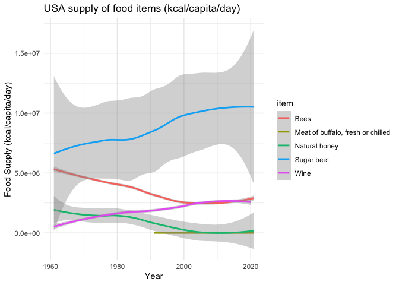

Food Balance Sheets
================

FAOSTAT, maintained by the Food and Agriculture Organization (FAO) of
the United Nations, is the world’s largest and most comprehensive
statistical database on food, agriculture, and hunger. Its goal is to
provide high-quality and accessible data to promote better understanding
and informed decision-making regarding food security and nutrition,
agricultural production, and natural resource use worldwide.

Here are some key aspects of FAOSTAT:

Wide Scope: FAOSTAT covers domains such as agricultural production,
trade, food security, emissions, land use, and many more. It provides
data for over 245 countries and territories, from 1961 onwards.

Ease of Access: The data is freely accessible to anyone with an internet
connection, and can be easily downloaded in different formats or
accessed via an API.

Comprehensive Data: FAOSTAT provides comprehensive data on various
aspects related to food and agriculture. This includes data on
agricultural inputs, crop production, livestock and livestock products,
organic agriculture, forestry production, emissions, and more.

Regularly Updated: The database is regularly updated, ensuring that
users have access to the most recent data.

Multilingual: The FAOSTAT website is available in multiple languages,
including English, Spanish, French, and Chinese, making it more
accessible to users worldwide.

Researchers, policymakers, and organizations use FAOSTAT data for a wide
range of purposes, from monitoring global food security and predicting
future food trends to developing policies and interventions in
agriculture, forestry, and fisheries.

## Food Balance Sheets (FBS)

The Food Balance Sheets (FBS) dataset presents a comprehensive picture
of the pattern of a country’s food supply during a specified reference
period, typically a year. The FBS shows for each food item (like wheat,
rice, milk, meat, etc.) - the sources of supply (production, imports,
and stock changes) and its utilization (exports, feed, seed, processing,
waste, and other uses), leading to the final category of ‘food available
for human consumption’. https://www.fao.org/home/en

The FBS provides essential information on a country’s food system,
allowing for a better understanding of food flows, food availability,
and changes in eating habits over time. The data can be used to assess
nutritional patterns and to develop strategies for food security and
sustainable food systems.

The data available include values for over 245 countries and territories
from 1961 onwards. It includes information on crop and livestock
products, including both primary and processed products. The values are
given in terms of mass quantity (tonnes), and in some cases, you can
also find caloric value (kcal) and protein and fat content (g).

R code:

``` r
# Load necessary libraries
library(FAOSTAT)
library(ggplot2)
library(dplyr)

data_folder <- "data_raw" 
dir.create(data_folder)
```

    Warning in dir.create(data_folder): 'data_raw' already exists

``` r
crop_production <- get_faostat_bulk(code = "QCL", data_folder = data_folder) # Show the structure of the data
str(crop_production)

saveRDS(crop_production, "data_raw/crop_production_e_all_data.rds")
```

``` r
# Now you can load your local version of the data from the RDS file 
crop_production <- readRDS("data_raw/crop_production_e_all_data.rds")
print(levels(factor(crop_production$item)))
```

      [1] "Abaca, manila hemp, raw"                                                                                      
      [2] "Agave fibres, raw, n.e.c."                                                                                    
      [3] "Almonds, in shell"                                                                                            
      [4] "Anise, badian, coriander, cumin, caraway, fennel and juniper berries, raw"                                    
      [5] "Apples"                                                                                                       
      [6] "Apricots"                                                                                                     
      [7] "Areca nuts"                                                                                                   
      [8] "Artichokes"                                                                                                   
      [9] "Asparagus"                                                                                                    
     [10] "Asses"                                                                                                        
     [11] "Avocados"                                                                                                     
     [12] "Balata, gutta-percha, guayule, chicle and similar natural gums in primary forms or in plates, sheets or strip"
     [13] "Bambara beans, dry"                                                                                           
     [14] "Bananas"                                                                                                      
     [15] "Barley"                                                                                                       
     [16] "Beans, dry"                                                                                                   
     [17] "Beef and Buffalo Meat, primary"                                                                               
     [18] "Beer of barley, malted"                                                                                       
     [19] "Bees"                                                                                                         
     [20] "Beeswax"                                                                                                      
     [21] "Blueberries"                                                                                                  
     [22] "Brazil nuts, in shell"                                                                                        
     [23] "Broad beans and horse beans, dry"                                                                             
     [24] "Broad beans and horse beans, green"                                                                           
     [25] "Buckwheat"                                                                                                    
     [26] "Buffalo"                                                                                                      
     [27] "Buffalo fat, unrendered"                                                                                      
     [28] "Butter and Ghee"                                                                                              
     [29] "Butter and ghee of sheep milk"                                                                                
     [30] "Butter of buffalo milk"                                                                                       
     [31] "Butter of cow milk"                                                                                           
     [32] "Butter of goat milk"                                                                                          
     [33] "Buttermilk, dry"                                                                                              
     [34] "Cabbages"                                                                                                     
     [35] "Camels"                                                                                                       
     [36] "Canary seed"                                                                                                  
     [37] "Cantaloupes and other melons"                                                                                 
     [38] "Carrots and turnips"                                                                                          
     [39] "Cashew nuts, in shell"                                                                                        
     [40] "Cashewapple"                                                                                                  
     [41] "Cassava leaves"                                                                                               
     [42] "Cassava, fresh"                                                                                               
     [43] "Castor oil seeds"                                                                                             
     [44] "Cattle"                                                                                                       
     [45] "Cattle and Buffaloes"                                                                                         
     [46] "Cattle fat, unrendered"                                                                                       
     [47] "Cauliflowers and broccoli"                                                                                    
     [48] "Cereals n.e.c."                                                                                               
     [49] "Cereals, primary"                                                                                             
     [50] "Cheese (All Kinds)"                                                                                           
     [51] "Cheese from milk of buffalo, fresh or processed"                                                              
     [52] "Cheese from milk of goats, fresh or processed"                                                                
     [53] "Cheese from milk of sheep, fresh or processed"                                                                
     [54] "Cheese from skimmed cow milk"                                                                                 
     [55] "Cheese from whole cow milk"                                                                                   
     [56] "Cherries"                                                                                                     
     [57] "Chestnuts, in shell"                                                                                          
     [58] "Chick peas, dry"                                                                                              
     [59] "Chickens"                                                                                                     
     [60] "Chicory roots"                                                                                                
     [61] "Chillies and peppers, dry (Capsicum spp., Pimenta spp.), raw"                                                 
     [62] "Chillies and peppers, green (Capsicum spp. and Pimenta spp.)"                                                 
     [63] "Cinnamon and cinnamon-tree flowers, raw"                                                                      
     [64] "Citrus Fruit, Total"                                                                                          
     [65] "Cloves (whole stems), raw"                                                                                    
     [66] "Cocoa beans"                                                                                                  
     [67] "Coconut oil"                                                                                                  
     [68] "Coconuts, in shell"                                                                                           
     [69] "Coffee, green"                                                                                                
     [70] "Coir, raw"                                                                                                    
     [71] "Cotton lint, ginned"                                                                                          
     [72] "Cotton seed"                                                                                                  
     [73] "Cottonseed oil"                                                                                               
     [74] "Cow peas, dry"                                                                                                
     [75] "Cranberries"                                                                                                  
     [76] "Cream, fresh"                                                                                                 
     [77] "Cucumbers and gherkins"                                                                                       
     [78] "Currants"                                                                                                     
     [79] "Dates"                                                                                                        
     [80] "Ducks"                                                                                                        
     [81] "Edible offal of buffalo, fresh, chilled or frozen"                                                            
     [82] "Edible offal of cattle, fresh, chilled or frozen"                                                             
     [83] "Edible offal of goat, fresh, chilled or frozen"                                                               
     [84] "Edible offal of pigs, fresh, chilled or frozen"                                                               
     [85] "Edible offal of sheep, fresh, chilled or frozen"                                                              
     [86] "Edible offals of camels and other camelids, fresh, chilled or frozen"                                         
     [87] "Edible offals of horses and other equines,  fresh, chilled or frozen"                                         
     [88] "Edible roots and tubers with high starch or inulin content, n.e.c., fresh"                                    
     [89] "Eggplants (aubergines)"                                                                                       
     [90] "Eggs from other birds in shell, fresh, n.e.c."                                                                
     [91] "Eggs Primary"                                                                                                 
     [92] "Evaporated & Condensed Milk"                                                                                  
     [93] "Fat of camels"                                                                                                
     [94] "Fat of pigs"                                                                                                  
     [95] "Fibre Crops, Fibre Equivalent"                                                                                
     [96] "Figs"                                                                                                         
     [97] "Flax, processed but not spun"                                                                                 
     [98] "Fonio"                                                                                                        
     [99] "Fruit Primary"                                                                                                
    [100] "Game meat, fresh, chilled or frozen"                                                                          
    [101] "Geese"                                                                                                        
    [102] "Ghee from buffalo milk"                                                                                       
    [103] "Ghee from cow milk"                                                                                           
    [104] "Ginger, raw"                                                                                                  
    [105] "Goat fat, unrendered"                                                                                         
    [106] "Goats"                                                                                                        
    [107] "Gooseberries"                                                                                                 
    [108] "Grapes"                                                                                                       
    [109] "Green corn (maize)"                                                                                           
    [110] "Green garlic"                                                                                                 
    [111] "Green tea (not fermented), black tea (fermented) and partly fermented tea"                                    
    [112] "Groundnut oil"                                                                                                
    [113] "Groundnuts, excluding shelled"                                                                                
    [114] "Hazelnuts, in shell"                                                                                          
    [115] "Hempseed"                                                                                                     
    [116] "Hen eggs in shell, fresh"                                                                                     
    [117] "Hop cones"                                                                                                    
    [118] "Horse meat, fresh or chilled"                                                                                 
    [119] "Horses"                                                                                                       
    [120] "Jojoba seeds"                                                                                                 
    [121] "Jute, raw or retted"                                                                                          
    [122] "Kapok fibre, raw"                                                                                             
    [123] "Kapok fruit"                                                                                                  
    [124] "Kapokseed in shell"                                                                                           
    [125] "Karite nuts (sheanuts)"                                                                                       
    [126] "Kenaf, and other textile bast fibres, raw or retted"                                                          
    [127] "Kiwi fruit"                                                                                                   
    [128] "Kola nuts"                                                                                                    
    [129] "Leeks and other alliaceous vegetables"                                                                        
    [130] "Lemons and limes"                                                                                             
    [131] "Lentils, dry"                                                                                                 
    [132] "Lettuce and chicory"                                                                                          
    [133] "Linseed"                                                                                                      
    [134] "Locust beans (carobs)"                                                                                        
    [135] "Lupins"                                                                                                       
    [136] "Maize (corn)"                                                                                                 
    [137] "Mangoes, guavas and mangosteens"                                                                              
    [138] "Margarine and shortening"                                                                                     
    [139] "Maté leaves"                                                                                                  
    [140] "Meat of asses, fresh or chilled"                                                                              
    [141] "Meat of buffalo, fresh or chilled"                                                                            
    [142] "Meat of camels, fresh or chilled"                                                                             
    [143] "Meat of cattle with the bone, fresh or chilled"                                                               
    [144] "Meat of chickens, fresh or chilled"                                                                           
    [145] "Meat of ducks, fresh or chilled"                                                                              
    [146] "Meat of geese, fresh or chilled"                                                                              
    [147] "Meat of goat, fresh or chilled"                                                                               
    [148] "Meat of mules, fresh or chilled"                                                                              
    [149] "Meat of other domestic camelids, fresh or chilled"                                                            
    [150] "Meat of other domestic rodents, fresh or chilled"                                                             
    [151] "Meat of pig with the bone, fresh or chilled"                                                                  
    [152] "Meat of pigeons and other birds n.e.c., fresh, chilled or frozen"                                             
    [153] "Meat of rabbits and hares, fresh or chilled"                                                                  
    [154] "Meat of sheep, fresh or chilled"                                                                              
    [155] "Meat of turkeys, fresh or chilled"                                                                            
    [156] "Meat, Poultry"                                                                                                
    [157] "Meat, Total"                                                                                                  
    [158] "Melonseed"                                                                                                    
    [159] "Milk, Total"                                                                                                  
    [160] "Millet"                                                                                                       
    [161] "Mixed grain"                                                                                                  
    [162] "Molasses"                                                                                                     
    [163] "Mules and hinnies"                                                                                            
    [164] "Mushrooms and truffles"                                                                                       
    [165] "Mustard seed"                                                                                                 
    [166] "Natural honey"                                                                                                
    [167] "Natural rubber in primary forms"                                                                              
    [168] "Nutmeg, mace, cardamoms, raw"                                                                                 
    [169] "Oats"                                                                                                         
    [170] "Oil of linseed"                                                                                               
    [171] "Oil of maize"                                                                                                 
    [172] "Oil of palm kernel"                                                                                           
    [173] "Oil of sesame seed"                                                                                           
    [174] "Oil palm fruit"                                                                                               
    [175] "Oilcrops, Cake Equivalent"                                                                                    
    [176] "Oilcrops, Oil Equivalent"                                                                                     
    [177] "Okra"                                                                                                         
    [178] "Olive oil"                                                                                                    
    [179] "Olives"                                                                                                       
    [180] "Onions and shallots, dry (excluding dehydrated)"                                                              
    [181] "Onions and shallots, green"                                                                                   
    [182] "Oranges"                                                                                                      
    [183] "Other beans, green"                                                                                           
    [184] "Other berries and fruits of the genus vaccinium n.e.c."                                                       
    [185] "Other camelids"                                                                                               
    [186] "Other citrus fruit, n.e.c."                                                                                   
    [187] "Other fibre crops, raw, n.e.c."                                                                               
    [188] "Other fruits, n.e.c."                                                                                         
    [189] "Other meat n.e.c. (excluding mammals), fresh, chilled or frozen"                                              
    [190] "Other nuts (excluding wild edible nuts and groundnuts), in shell, n.e.c."                                     
    [191] "Other oil seeds, n.e.c."                                                                                      
    [192] "Other pome fruits"                                                                                            
    [193] "Other pulses n.e.c."                                                                                          
    [194] "Other rodents"                                                                                                
    [195] "Other stimulant, spice and aromatic crops, n.e.c."                                                            
    [196] "Other stone fruits"                                                                                           
    [197] "Other sugar crops n.e.c."                                                                                     
    [198] "Other tropical fruits, n.e.c."                                                                                
    [199] "Other vegetables, fresh n.e.c."                                                                               
    [200] "Palm kernels"                                                                                                 
    [201] "Palm oil"                                                                                                     
    [202] "Papayas"                                                                                                      
    [203] "Peaches and nectarines"                                                                                       
    [204] "Pears"                                                                                                        
    [205] "Peas, dry"                                                                                                    
    [206] "Peas, green"                                                                                                  
    [207] "Pepper (Piper spp.), raw"                                                                                     
    [208] "Peppermint, spearmint"                                                                                        
    [209] "Persimmons"                                                                                                   
    [210] "Pig fat, rendered"                                                                                            
    [211] "Pigeon peas, dry"                                                                                             
    [212] "Pineapples"                                                                                                   
    [213] "Pistachios, in shell"                                                                                         
    [214] "Plantains and cooking bananas"                                                                                
    [215] "Plums and sloes"                                                                                              
    [216] "Pomelos and grapefruits"                                                                                      
    [217] "Poppy seed"                                                                                                   
    [218] "Potatoes"                                                                                                     
    [219] "Poultry Birds"                                                                                                
    [220] "Pulses, Total"                                                                                                
    [221] "Pumpkins, squash and gourds"                                                                                  
    [222] "Pyrethrum, dried flowers"                                                                                     
    [223] "Quinces"                                                                                                      
    [224] "Quinoa"                                                                                                       
    [225] "Rabbits and hares"                                                                                            
    [226] "Ramie, raw or retted"                                                                                         
    [227] "Rape or colza seed"                                                                                           
    [228] "Rapeseed or canola oil, crude"                                                                                
    [229] "Raspberries"                                                                                                  
    [230] "Raw cane or beet sugar (centrifugal only)"                                                                    
    [231] "Raw hides and skins of buffaloes"                                                                             
    [232] "Raw hides and skins of cattle"                                                                                
    [233] "Raw hides and skins of goats or kids"                                                                         
    [234] "Raw hides and skins of sheep or lambs"                                                                        
    [235] "Raw milk of buffalo"                                                                                          
    [236] "Raw milk of camel"                                                                                            
    [237] "Raw milk of cattle"                                                                                           
    [238] "Raw milk of goats"                                                                                            
    [239] "Raw milk of sheep"                                                                                            
    [240] "Raw silk (not thrown)"                                                                                        
    [241] "Rice"                                                                                                         
    [242] "Roots and Tubers, Total"                                                                                      
    [243] "Rye"                                                                                                          
    [244] "Safflower seed"                                                                                               
    [245] "Safflower-seed oil, crude"                                                                                    
    [246] "Seed cotton, unginned"                                                                                        
    [247] "Sesame seed"                                                                                                  
    [248] "Sheep"                                                                                                        
    [249] "Sheep and Goat Meat"                                                                                          
    [250] "Sheep and Goats"                                                                                              
    [251] "Sheep fat, unrendered"                                                                                        
    [252] "Shorn wool, greasy, including fleece-washed shorn wool"                                                       
    [253] "Silk-worm cocoons suitable for reeling"                                                                       
    [254] "Sisal, raw"                                                                                                   
    [255] "Skim Milk & Buttermilk, Dry"                                                                                  
    [256] "Skim milk and whey powder"                                                                                    
    [257] "Skim milk of cows"                                                                                            
    [258] "Skim milk, condensed"                                                                                         
    [259] "Skim milk, evaporated"                                                                                        
    [260] "Snails, fresh, chilled, frozen, dried, salted or in brine, except sea snails"                                 
    [261] "Sorghum"                                                                                                      
    [262] "Sour cherries"                                                                                                
    [263] "Soya bean oil"                                                                                                
    [264] "Soya beans"                                                                                                   
    [265] "Spinach"                                                                                                      
    [266] "Strawberries"                                                                                                 
    [267] "String beans"                                                                                                 
    [268] "Sugar beet"                                                                                                   
    [269] "Sugar cane"                                                                                                   
    [270] "Sugar Crops Primary"                                                                                          
    [271] "Sunflower seed"                                                                                               
    [272] "Sunflower-seed oil, crude"                                                                                    
    [273] "Sweet potatoes"                                                                                               
    [274] "Swine / pigs"                                                                                                 
    [275] "Tallow"                                                                                                       
    [276] "Tallowtree seeds"                                                                                             
    [277] "Tangerines, mandarins, clementines"                                                                           
    [278] "Taro"                                                                                                         
    [279] "Tea leaves"                                                                                                   
    [280] "Tomatoes"                                                                                                     
    [281] "Treenuts, Total"                                                                                              
    [282] "Triticale"                                                                                                    
    [283] "True hemp, raw or retted"                                                                                     
    [284] "Tung nuts"                                                                                                    
    [285] "Turkeys"                                                                                                      
    [286] "Unmanufactured tobacco"                                                                                       
    [287] "Vanilla, raw"                                                                                                 
    [288] "Vegetables Primary"                                                                                           
    [289] "Vetches"                                                                                                      
    [290] "Walnuts, in shell"                                                                                            
    [291] "Watermelons"                                                                                                  
    [292] "Wheat"                                                                                                        
    [293] "Whey, condensed"                                                                                              
    [294] "Whey, dry"                                                                                                    
    [295] "Whole milk powder"                                                                                            
    [296] "Whole milk, condensed"                                                                                        
    [297] "Whole milk, evaporated"                                                                                       
    [298] "Wine"                                                                                                         
    [299] "Yams"                                                                                                         
    [300] "Yautia"                                                                                                       
    [301] "Yoghurt"                                                                                                      

``` r
subset <- crop_production %>% 
  filter(item %in% c("Wine","Meat of buffalo, fresh or chilled", "Bees","Sugar beet", "Natural honey")) %>% 
  filter(area == "United States of America")

# Plot the data
ggplot(subset, aes(x = year, y = value, colour=item)) +
  geom_smooth() +
  labs(
    title = "USA supply of food items (kcal/capita/day)",
    x = "Year",
    y = "Food Supply (kcal/capita/day)"
  ) + theme_minimal()
```


