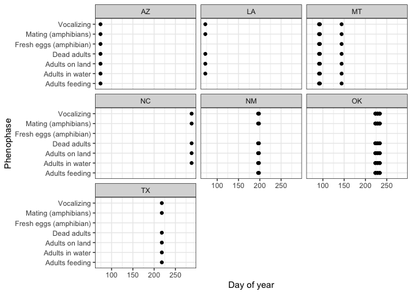

National phenology network
================

This data set contains data from the [USA National Phenology
Network](https://www.usanpn.org/about).

In R, we need 2 packages to download and visualize the data. First,
check if the packages are already installed. Install them if they are
not:

``` r
packages <- c("tidyverse", "devtools") 
new.packages <- packages[!(packages %in% installed.packages()[,"Package"])] 
if(length(new.packages)>0) install.packages(new.packages)
```

Then, load them and install
‘[rnpn](https://rdrr.io/cran/rnpn/f/README.md)’, an R client for
interacting with the USA National Phenology Network data web services.

``` r
lapply(packages, library, character.only = TRUE)
```

    ── Attaching packages ─────────────────────────────────────── tidyverse 1.3.0 ──

    ✔ ggplot2 3.4.1     ✔ purrr   0.3.4
    ✔ tibble  3.2.1     ✔ dplyr   1.0.9
    ✔ tidyr   1.1.2     ✔ stringr 1.4.0
    ✔ readr   1.4.0     ✔ forcats 0.5.0

    ── Conflicts ────────────────────────────────────────── tidyverse_conflicts() ──
    ✖ dplyr::filter() masks stats::filter()
    ✖ dplyr::lag()    masks stats::lag()

    Loading required package: usethis

    [[1]]
     [1] "forcats"   "stringr"   "dplyr"     "purrr"     "readr"     "tidyr"    
     [7] "tibble"    "ggplot2"   "tidyverse" "stats"     "graphics"  "grDevices"
    [13] "utils"     "datasets"  "methods"   "base"     

    [[2]]
     [1] "devtools"  "usethis"   "forcats"   "stringr"   "dplyr"     "purrr"    
     [7] "readr"     "tidyr"     "tibble"    "ggplot2"   "tidyverse" "stats"    
    [13] "graphics"  "grDevices" "utils"     "datasets"  "methods"   "base"     

``` r
install_github("usa-npn/rnpn")
```

    Skipping install of 'rnpn' from a github remote, the SHA1 (0dff444e) has not changed since last install.
      Use `force = TRUE` to force installation

``` r
library(rnpn)
```

Download data about Woodhouse’s toads:

``` r
toads <- npn_download_status_data(request_source='Your Name',years = c(2000:2020), species_id=c(237))
```

    using a custom handler function.

    opening curl input connection.


     Found 0 records...

    closing curl input connection.

    using a custom handler function.

    opening curl input connection.


     Found 0 records...

    closing curl input connection.

    using a custom handler function.

    opening curl input connection.


     Found 0 records...

    closing curl input connection.

    using a custom handler function.

    opening curl input connection.


     Found 0 records...

    closing curl input connection.

    using a custom handler function.

    opening curl input connection.


     Found 0 records...

    closing curl input connection.

    using a custom handler function.

    opening curl input connection.


     Found 0 records...

    closing curl input connection.

    using a custom handler function.

    opening curl input connection.


     Found 0 records...

    closing curl input connection.

    using a custom handler function.

    opening curl input connection.


     Found 0 records...

    closing curl input connection.

    using a custom handler function.

    opening curl input connection.


     Found 0 records...

    closing curl input connection.

    using a custom handler function.

    opening curl input connection.


     Found 0 records...

    closing curl input connection.

    using a custom handler function.

    opening curl input connection.


     Found 5 records...

    closing curl input connection.

    using a custom handler function.

    opening curl input connection.


     Found 59 records...

    closing curl input connection.

    using a custom handler function.

    opening curl input connection.


     Found 0 records...

    closing curl input connection.

    using a custom handler function.

    opening curl input connection.


     Found 14 records...

    closing curl input connection.

    using a custom handler function.

    opening curl input connection.


     Found 7 records...

    closing curl input connection.

    using a custom handler function.

    opening curl input connection.


     Found 7 records...

    closing curl input connection.

    using a custom handler function.

    opening curl input connection.


     Found 0 records...

    closing curl input connection.

    using a custom handler function.

    opening curl input connection.


     Found 0 records...

    closing curl input connection.

    using a custom handler function.

    opening curl input connection.


     Found 0 records...

    closing curl input connection.

    using a custom handler function.

    opening curl input connection.


     Found 0 records...

    closing curl input connection.

    using a custom handler function.

    opening curl input connection.


     Found 0 records...

    closing curl input connection.

Plot phenophases as a function of DOY per state:

``` r
ggplot(toads) +
  geom_point(aes(day_of_year, phenophase_description)) +
  facet_wrap(.~state) +
  theme_bw() +
  xlab('Day of year') +
  ylab('Phenophase')
```


