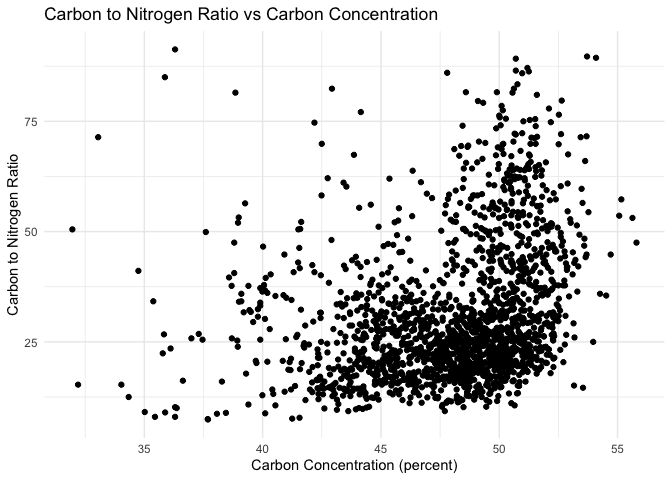

neon
================

``` r
library(neonUtilities)
library(ggplot2)

foliar <- loadByProduct(dpID="DP1.10026.001", site="all", 
                        package="expanded", check.size=F,
                        token=my_token)
```

    Finding available files

      |                                                                            
      |                                                                      |   0%
      |                                                                            
      |=                                                                     |   1%
      |                                                                            
      |==                                                                    |   2%
      |                                                                            
      |===                                                                   |   4%
      |                                                                            
      |===                                                                   |   5%
      |                                                                            
      |====                                                                  |   6%
      |                                                                            
      |=====                                                                 |   7%
      |                                                                            
      |======                                                                |   9%
      |                                                                            
      |=======                                                               |  10%
      |                                                                            
      |========                                                              |  11%
      |                                                                            
      |=========                                                             |  12%
      |                                                                            
      |=========                                                             |  13%
      |                                                                            
      |==========                                                            |  15%
      |                                                                            
      |===========                                                           |  16%
      |                                                                            
      |============                                                          |  17%
      |                                                                            
      |=============                                                         |  18%
      |                                                                            
      |==============                                                        |  20%
      |                                                                            
      |===============                                                       |  21%
      |                                                                            
      |===============                                                       |  22%
      |                                                                            
      |================                                                      |  23%
      |                                                                            
      |=================                                                     |  24%
      |                                                                            
      |==================                                                    |  26%
      |                                                                            
      |===================                                                   |  27%
      |                                                                            
      |====================                                                  |  28%
      |                                                                            
      |====================                                                  |  29%
      |                                                                            
      |=====================                                                 |  30%
      |                                                                            
      |======================                                                |  32%
      |                                                                            
      |=======================                                               |  33%
      |                                                                            
      |========================                                              |  34%
      |                                                                            
      |=========================                                             |  35%
      |                                                                            
      |==========================                                            |  37%
      |                                                                            
      |==========================                                            |  38%
      |                                                                            
      |===========================                                           |  39%
      |                                                                            
      |============================                                          |  40%
      |                                                                            
      |=============================                                         |  41%
      |                                                                            
      |==============================                                        |  43%
      |                                                                            
      |===============================                                       |  44%
      |                                                                            
      |================================                                      |  45%
      |                                                                            
      |================================                                      |  46%
      |                                                                            
      |=================================                                     |  48%
      |                                                                            
      |==================================                                    |  49%
      |                                                                            
      |===================================                                   |  50%
      |                                                                            
      |====================================                                  |  51%
      |                                                                            
      |=====================================                                 |  52%
      |                                                                            
      |======================================                                |  54%
      |                                                                            
      |======================================                                |  55%
      |                                                                            
      |=======================================                               |  56%
      |                                                                            
      |========================================                              |  57%
      |                                                                            
      |=========================================                             |  59%
      |                                                                            
      |==========================================                            |  60%
      |                                                                            
      |===========================================                           |  61%
      |                                                                            
      |============================================                          |  62%
      |                                                                            
      |============================================                          |  63%
      |                                                                            
      |=============================================                         |  65%
      |                                                                            
      |==============================================                        |  66%
      |                                                                            
      |===============================================                       |  67%
      |                                                                            
      |================================================                      |  68%
      |                                                                            
      |=================================================                     |  70%
      |                                                                            
      |==================================================                    |  71%
      |                                                                            
      |==================================================                    |  72%
      |                                                                            
      |===================================================                   |  73%
      |                                                                            
      |====================================================                  |  74%
      |                                                                            
      |=====================================================                 |  76%
      |                                                                            
      |======================================================                |  77%
      |                                                                            
      |=======================================================               |  78%
      |                                                                            
      |=======================================================               |  79%
      |                                                                            
      |========================================================              |  80%
      |                                                                            
      |=========================================================             |  82%
      |                                                                            
      |==========================================================            |  83%
      |                                                                            
      |===========================================================           |  84%
      |                                                                            
      |============================================================          |  85%
      |                                                                            
      |=============================================================         |  87%
      |                                                                            
      |=============================================================         |  88%
      |                                                                            
      |==============================================================        |  89%
      |                                                                            
      |===============================================================       |  90%
      |                                                                            
      |================================================================      |  91%
      |                                                                            
      |=================================================================     |  93%
      |                                                                            
      |==================================================================    |  94%
      |                                                                            
      |===================================================================   |  95%
      |                                                                            
      |===================================================================   |  96%
      |                                                                            
      |====================================================================  |  98%
      |                                                                            
      |===================================================================== |  99%
      |                                                                            
      |======================================================================| 100%

    Downloading files totaling approximately 87.967028 MB
    Downloading 82 files

      |                                                                            
      |                                                                      |   0%
      |                                                                            
      |=                                                                     |   1%
      |                                                                            
      |==                                                                    |   2%
      |                                                                            
      |===                                                                   |   4%
      |                                                                            
      |===                                                                   |   5%
      |                                                                            
      |====                                                                  |   6%
      |                                                                            
      |=====                                                                 |   7%
      |                                                                            
      |======                                                                |   9%
      |                                                                            
      |=======                                                               |  10%
      |                                                                            
      |========                                                              |  11%
      |                                                                            
      |=========                                                             |  12%
      |                                                                            
      |==========                                                            |  14%
      |                                                                            
      |==========                                                            |  15%
      |                                                                            
      |===========                                                           |  16%
      |                                                                            
      |============                                                          |  17%
      |                                                                            
      |=============                                                         |  19%
      |                                                                            
      |==============                                                        |  20%
      |                                                                            
      |===============                                                       |  21%
      |                                                                            
      |================                                                      |  22%
      |                                                                            
      |================                                                      |  23%
      |                                                                            
      |=================                                                     |  25%
      |                                                                            
      |==================                                                    |  26%
      |                                                                            
      |===================                                                   |  27%
      |                                                                            
      |====================                                                  |  28%
      |                                                                            
      |=====================                                                 |  30%
      |                                                                            
      |======================                                                |  31%
      |                                                                            
      |======================                                                |  32%
      |                                                                            
      |=======================                                               |  33%
      |                                                                            
      |========================                                              |  35%
      |                                                                            
      |=========================                                             |  36%
      |                                                                            
      |==========================                                            |  37%
      |                                                                            
      |===========================                                           |  38%
      |                                                                            
      |============================                                          |  40%
      |                                                                            
      |=============================                                         |  41%
      |                                                                            
      |=============================                                         |  42%
      |                                                                            
      |==============================                                        |  43%
      |                                                                            
      |===============================                                       |  44%
      |                                                                            
      |================================                                      |  46%
      |                                                                            
      |=================================                                     |  47%
      |                                                                            
      |==================================                                    |  48%
      |                                                                            
      |===================================                                   |  49%
      |                                                                            
      |===================================                                   |  51%
      |                                                                            
      |====================================                                  |  52%
      |                                                                            
      |=====================================                                 |  53%
      |                                                                            
      |======================================                                |  54%
      |                                                                            
      |=======================================                               |  56%
      |                                                                            
      |========================================                              |  57%
      |                                                                            
      |=========================================                             |  58%
      |                                                                            
      |=========================================                             |  59%
      |                                                                            
      |==========================================                            |  60%
      |                                                                            
      |===========================================                           |  62%
      |                                                                            
      |============================================                          |  63%
      |                                                                            
      |=============================================                         |  64%
      |                                                                            
      |==============================================                        |  65%
      |                                                                            
      |===============================================                       |  67%
      |                                                                            
      |================================================                      |  68%
      |                                                                            
      |================================================                      |  69%
      |                                                                            
      |=================================================                     |  70%
      |                                                                            
      |==================================================                    |  72%
      |                                                                            
      |===================================================                   |  73%
      |                                                                            
      |====================================================                  |  74%
      |                                                                            
      |=====================================================                 |  75%
      |                                                                            
      |======================================================                |  77%
      |                                                                            
      |======================================================                |  78%
      |                                                                            
      |=======================================================               |  79%
      |                                                                            
      |========================================================              |  80%
      |                                                                            
      |=========================================================             |  81%
      |                                                                            
      |==========================================================            |  83%
      |                                                                            
      |===========================================================           |  84%
      |                                                                            
      |============================================================          |  85%
      |                                                                            
      |============================================================          |  86%
      |                                                                            
      |=============================================================         |  88%
      |                                                                            
      |==============================================================        |  89%
      |                                                                            
      |===============================================================       |  90%
      |                                                                            
      |================================================================      |  91%
      |                                                                            
      |=================================================================     |  93%
      |                                                                            
      |==================================================================    |  94%
      |                                                                            
      |===================================================================   |  95%
      |                                                                            
      |===================================================================   |  96%
      |                                                                            
      |====================================================================  |  98%
      |                                                                            
      |===================================================================== |  99%
      |                                                                            
      |======================================================================| 100%

    Unpacking zip files using 1 cores.
    Stacking table cfc_elementsSummary
    Stacking table lig_externalSummary
    Stacking table cfc_chlorophyllParameters
    Stacking table cfc_chlorophyllSummary
    Stacking table bgc_CNiso_externalSummary
    Stacking operation across a single core.
    Stacking table cfc_chemistrySubsampling
    Stacking table cfc_chlorophyll
    Stacking table cfc_elements
    Stacking table cfc_fieldData
    Stacking table cfc_lignin
    Stacking table cfc_LMA
    Stacking table cfc_shapefile
    Stacking table vst_mappingandtagging
    Stacking table cfc_carbonNitrogen
    Copied the most recent publication of validation file to /stackedFiles
    Copied the most recent publication of categoricalCodes file to /stackedFiles
    Copied the most recent publication of variable definition file to /stackedFiles
    Finished: Stacked 14 data tables and 4 metadata tables!
    Stacking took 6.924111 secs

``` r
names(foliar)
```

     [1] "bgc_CNiso_externalSummary" "categoricalCodes_10026"   
     [3] "cfc_carbonNitrogen"        "cfc_chemistrySubsampling" 
     [5] "cfc_chlorophyll"           "cfc_chlorophyllParameters"
     [7] "cfc_chlorophyllSummary"    "cfc_elements"             
     [9] "cfc_elementsSummary"       "cfc_fieldData"            
    [11] "cfc_lignin"                "cfc_LMA"                  
    [13] "cfc_shapefile"             "issueLog_10026"           
    [15] "lig_externalSummary"       "readme_10026"             
    [17] "validation_10026"          "variables_10026"          
    [19] "vst_mappingandtagging"    

``` r
ggplot(foliar$cfc_carbonNitrogen, aes(x = carbonPercent, y = CNratio)) +
  geom_point() +
  labs(title = "Carbon to Nitrogen Ratio vs Carbon Concentration",
       x = "Carbon Concentration (percent)",
       y = "Carbon to Nitrogen Ratio") +
  theme_minimal()
```

    Warning: Removed 96 rows containing missing values (`geom_point()`).



``` python
import os
import pandas as pd
import numpy as np
import matplotlib.pyplot as plt
from neon_api_tools.api_tools import neon_api_tools

# Set your NEON API token
my_token = "your_neon_api_token_here"

# Instantiate the API tools object
neon_tools = neon_api_tools()

# Download the NEON foliar data
foliar = neon_tools.loadByProduct(dpID="DP1.10026.001", site="all",
                                  package="expanded", check_size=False,
                                  token=my_token)

# Get the foliar dataframe
foliar_df = foliar['cfc_carbonNitrogen']

# Plot the carbon to nitrogen ratio against the carbon concentration
fig, ax = plt.subplots()
ax.scatter(foliar_df['carbonPercent'], foliar_df['CNratio'])
ax.set_xlabel("Carbon Concentration (percent)")
ax.set_ylabel("Carbon to Nitrogen Ratio")
ax.set_title("Carbon to Nitrogen Ratio vs Carbon Concentration")
plt.show()
```
