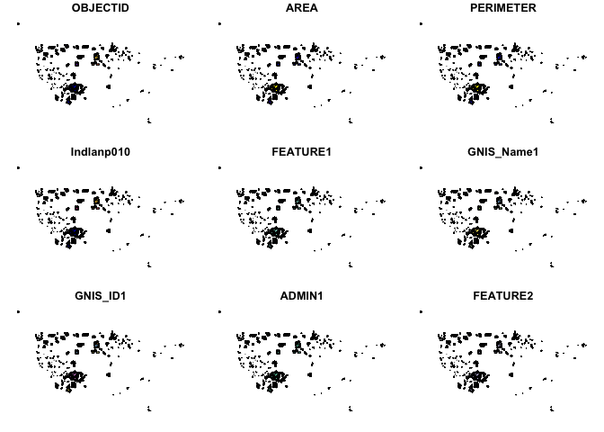

National Atlas - Indian Lands of the United States dataset
================

In this example, we will download and analyze the National Atlas -
Indian Lands of the United States dataset in both R and Python. We will
read the dataset and count the number of Indian lands per state.

R: In R, we’ll use the ‘sf’ package to read the Shapefile and the
‘dplyr’ package to process the data.

R code:

``` r
# Install and load necessary libraries

library(sf)
```

    Linking to GEOS 3.10.2, GDAL 3.4.2, PROJ 8.2.1; sf_use_s2() is TRUE

``` r
library(dplyr)
```


    Attaching package: 'dplyr'

    The following objects are masked from 'package:stats':

        filter, lag

    The following objects are masked from 'package:base':

        intersect, setdiff, setequal, union

``` r
# Download the Indian Lands dataset
url <- "https://prd-tnm.s3.amazonaws.com/StagedProducts/Small-scale/data/Boundaries/indlanp010g.shp_nt00968.tar.gz"
temp_file <- tempfile(fileext = ".tar.gz")
download.file(url, temp_file, mode = "wb")
untar(temp_file, exdir = tempdir())

# Read the Shapefile
shapefile_path <- file.path(tempdir(), "indlanp010g.shp")
indian_lands <- read_sf(shapefile_path)

# Count the number of Indian lands per state
# state_counts <- indian_lands %>%
#   group_by(STATE) %>%
#   summarize(count = n())

plot(indian_lands)
```

    Warning: plotting the first 9 out of 23 attributes; use max.plot = 23 to plot
    all



Python: In Python, we’ll use the ‘geopandas’ and ‘pandas’ libraries to
read the Shapefile and process the data.

Python code:

``` python
import geopandas as gpd
import pandas as pd
import requests
import tarfile
import os
from io import BytesIO

# Download the Indian Lands dataset
url = "https://prd-tnm.s3.amazonaws.com/StagedProducts/Small-scale/data/Boundaries/indlanp010g.shp_nt00966.tar.gz"
response = requests.get(url)
tar_file = tarfile.open(fileobj=BytesIO(response.content), mode='r:gz')

# Extract Shapefile
temp_dir = "temp"
if not os.path.exists(temp_dir):
    os.makedirs(temp_dir)

tar_file.extractall(path=temp_dir)
shapefile_path = os.path.join(temp_dir, "indlanp010g.shp")

# Read the Shapefile
indian_lands = gpd.read_file(shapefile_path)

# Count the number of Indian lands per state
state_counts = indian_lands.groupby("STATE").size().reset_index(name="count")

print(state_counts)
```

Both R and Python codes download the dataset and read the Shapefile
using the respective packages. They then group the data by the ‘STATE’
attribute and calculate the count of Indian lands per state.
