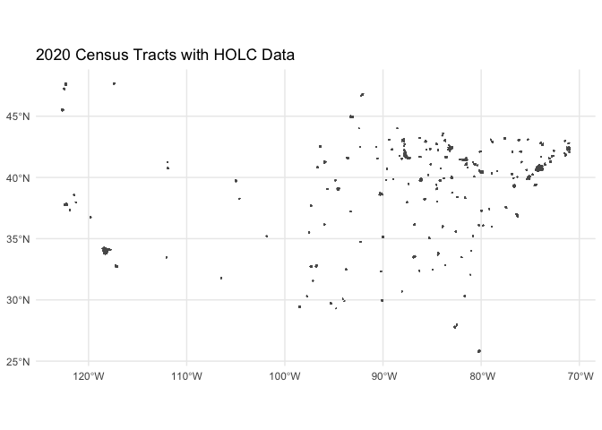

Historic Redlining
================

## Richmond example

The Census Home Owners’ Loan Corporation (HOLC) dataset, available on
GitHub, is a valuable resource containing historical data about the
process of redlining in the United States. Redlining is a discriminatory
practice that involves denying loans or insurance to people living in
specific neighborhoods, often based on race or ethnicity. The dataset
provides details on the HOLC risk classifications, neighborhood
boundaries, and descriptions for over 200 cities across the United
States from the 1930s.

Historic redlining data refers to data from the Home Owners’ Loan
Corporation (HOLC) that created residential security maps in the 1930s,
which contributed to racial segregation and disinvestment in minority
neighborhoods. One popular source for this data is the Mapping
Inequality project (https://dsl.richmond.edu/panorama/redlining/).

In this example, we’ll download historic redlining data for Philadelphia
in the form of a GeoJSON file and analyze the data in R and Python.

R: In R, we’ll use the ‘sf’ and ‘dplyr’ packages to read and process the
GeoJSON data.

R code:

``` r
# Install and load necessary libraries]
library(knitr)
library(sf)
library(dplyr)

# Download historic redlining data for Philadelphia
url <- "https://dsl.richmond.edu/panorama/redlining/static/downloads/geojson/PAPhiladelphia1937.geojson"
philly_geojson <- read_sf(url)

# Count the number of areas per HOLC grade
grade_counts <- philly_geojson %>%
  group_by(holc_grade) %>%
  summarize(count = n())

kable(philly_geojson)
```

| name | holc_id | holc_grade | area_description_data                                                                                                                                                                                                                                                                                                                                                                                                                                                                                                                                                                                                                                                                                                                                                                                                                                                                                                                                                                                                                                                                                                                                                                                                                                                                                                                                                                            | geometry                     |
|:-----|:--------|:-----------|:-------------------------------------------------------------------------------------------------------------------------------------------------------------------------------------------------------------------------------------------------------------------------------------------------------------------------------------------------------------------------------------------------------------------------------------------------------------------------------------------------------------------------------------------------------------------------------------------------------------------------------------------------------------------------------------------------------------------------------------------------------------------------------------------------------------------------------------------------------------------------------------------------------------------------------------------------------------------------------------------------------------------------------------------------------------------------------------------------------------------------------------------------------------------------------------------------------------------------------------------------------------------------------------------------------------------------------------------------------------------------------------------------|:-----------------------------|
| NA   | A1      | A          | { “1”: “Sub Phila A 1”, “2”: “Rolling”, “3”: “Highly desirable, well restricted residential area.”, “4”: “No sewers.”, “7”: ” 1934-36 55 very few rentals June 1937 \$8,600-100,000 70 “,”13”: “upward”, “14”: “\$15,000-25,000 houses predominate”, “15”: “David C. Snyder June 11 7”, “10a”: “good”, “10b”: “few units”, “10c”: ““,”11a”: “singles \$15000-\$20000”, “11b”: “30-40 houses”, “12a”: “yes”, “12b”: “yes”, “5a”: “Execs. - Professional”, “5b”: “over \$5,000”, “5c”: “None”, “5d”: “No”, “5e”: “desirables”, “5f”: “no”, “5g”: “slowly”, “6a”: “single detached”, “6b”: “stone-brick”, “6c”: “1-15”, “6d”: “good”, “8a”: “50”, “8b”: “95”, “8c”: “over 80”, “9a”: “fair”, “9b”: “singles \$10,000”, “9c”: “fair” }                                                                                                                                                                                                                                                                                                                                                                                                                                                                                                                                                                                                                                                               | MULTIPOLYGON (((-75.12338 4… |
| NA   | A2      | A          | { “1”: “Sub. Phila. Elkins Park A 2”, “2”: “Rolling”, “3”: “Good transportation - desirable residential area of good character.”, “4”: “None”, “7”: “10,000-up \$20,000 150 1934-46 6500-up 12,000 60 75 50 June 1937 \$7,500-up 15,000 75 100 67”, “13”: “static to upward”, “14”: “Many residents of Elkin Park commute to New York City.”, “15”: “David C. Snyder June 11, 7”, “10a”: “good”, “10b”: “anything”, “10c”: “good”, “11a”: “Singles \$12,000-\$15,000”, “11b”: “50 houses”, “12a”: “yes”, “12b”: “yes”, “5a”: “Execs - Professional”, “5b”: “over \$5,000”, “5c”: “no”, “5d”: “no”, “5e”: “desirables”, “5f”: “no”, “5g”: “slowly”, “6a”: “single- twins”, “6b”: “stone-brick-frame”, “6c”: “25 yrs.”, “6d”: “good”, “8a”: “60”, “8b”: “100”, “8c”: “over 80”, “9a”: “good”, “9b”: “Single \$13,000-15,000”, “9c”: “good” }                                                                                                                                                                                                                                                                                                                                                                                                                                                                                                                                                       | MULTIPOLYGON (((-75.12882 4… |
| NA   | A3      | A          | { “1”: “Philadelphia A 3”, “2”: “Rolling-level”, “3”: “Direct rail transportation- Homogeneous development of desirable residential area.”, “4”: “No”, “7”: ” very few rental units 1933-34 June 1937 \$8000.- \$25,000 “,”13”: “upward”, “14”: “Property around R.R. station not quite as high grade. Singles average \$20,000, Twins average \$10,000. High grade area recently developed. Not quite as accessible as west Germantown section.”, “15”: “Doherty June 3 7”, “10a”: “good”, “10b”: “limited number of units \$10,000-\$20,000”, “10c”: ““,”11a”: “Twins & singles”, “11b”: “100 houses”, “12a”: “yes”, “12b”: “yes”, “5a”: “Junior Executives- Professional men”, “5b”: “\$3000.-\$10,000”, “5c”: “no”, “5d”: “no”, “5e”: “no”, “5f”: “no”, “5g”: “moderately”, “6a”: “twins-singles”, “6b”: “stone & brick”, “6c”: “1-20 yrs.”, “6d”: “good”, “8a”: ““,”8b”: ““,”8c”: “over 80”, “9a”: “good”, “9b”: “for new houses \$10,000 twins”, “9c”: “good” }                                                                                                                                                                                                                                                                                                                                                                                                                            | MULTIPOLYGON (((-75.17329 4… |
| NA   | A4      | A          | { “1”: “Philadelphia A 4”, “2”: “Rolling”, “3”: “The finest residential section in the city. Very good schools- Near parks- electrified train transportation.”, “4”: “None”, “7”: “\$15,000- up \$40,000 \$100.00 \$150.00 1933-34 \$8,000- \$20,000 50% \$65.00 \$80.00 55% June 1937 \$10,000-\$100,000 25,000 60-65% \$75.-\$200. \$100.00 65%”, “13”: “static to upward”, “14”: “Shifting of population. People moving further out. Southern end of section has the smaller houses. Buyers still looking for bargains. Practically all available land is held at \$20,000 an acre. Direct roads to center of city. Many large estates in this section.”, “15”: “Doherty June 3 7”, “10a”: “good”, “10b”: “everything”, “10c”: “fair”, “11a”: “single detached”, “11b”: “25 units”, “12a”: “yes”, “12b”: “yes”, “5a”: “Executives- Professional men”, “5b”: “over \$6000.”, “5c”: “no”, “5d”: “no”, “5e”: “no”, “5f”: “no”, “5g”: “slowly”, “6a”: “One family detached”, “6b”: “stone”, “6c”: “1-20 yrs.”, “6d”: “very good”, “8a”: “80”, “8b”: “100”, “8c”: “over 80”, “9a”: “fair”, “9b”: ““,”9c”: “fair” }                                                                                                                                                                                                                                                                                 | MULTIPOLYGON (((-75.19831 4… |
| NA   | A5      | A          | { “1”: “Philadelphia A 5”, “2”: “Rolling”, “3”: “Good transportation- very desirable residential section- well restricted- wooded section”, “4”: “None”, “7”: “\$10,000.00 \$30,000 \$70 \$100 1933-34 \$5,000 \$12,000 40% \$40 \$60 60% June 1937 \$6,000-\$50,000 \$15,000 50% \$50-\$200 \$75 75%”, “13”: “static”, “14”: “German American population- Broad St. properties are not typical of section as a whole. Section is very desirable, but danger of Jewish encroachment is imminent. A fair first grade section.”, “15”: “H.B. Wilson June 14 7”, “10a”: “good”, “10b”: “anything”, “10c”: “good”, “11a”: “stone singles \$12,500”, “11b”: “10-12 units”, “12a”: “yes”, “12b”: “yes”, “5a”: “White collar class”, “5b”: “\$5000. & up”, “5c”: “none”, “5d”: “no”, “5e”: “desirables”, “5f”: “none”, “5g”: “slowly”, “6a”: “single- twins”, “6b”: “brick & stone”, “6c”: “1-20 yrs.”, “6d”: “good”, “8a”: “95”, “8b”: “100”, “8c”: “80”, “9a”: “fair”, “9b”: “single & twins \$9000”, “9c”: “fair” }                                                                                                                                                                                                                                                                                                                                                                                  | MULTIPOLYGON (((-75.1281 40… |
| NA   | A6      | A          | { “1”: “Philadelphia A 6”, “2”: “Level”, “3”: “Desirable industrial section- good transportation. Thrifty class of populace- 2 perks in section.”, “4”: “No”, “7”: “\$4200.-\$8500. \$6,500.00 \$35.-\$65. \$50.00 1933-34 \$2500.-\$4500. \$3,500.00 55% \$25.-\$40 \$32.00 15% June 1937 \$3000.-\$6000. \$4,500.00 70% \$28.-\$50. \$40.00 80%”, “13”: “Static to upward”, “14”: “Most of building in eastern end. High type inhabitants. A fair first grade section.”, “15”: “H.B. Wilson June 14 7”, “10a”: “good”, “10b”: “2 story row- \$40.”, “10c”: “good”, “11a”: “2 story row \$4500.”, “11b”: “100-125 units”, “12a”: “yes”, “12b”: “yes”, “5a”: “White collar-skilled mechanics”, “5b”: “\$1500- \$3000”, “5c”: “nominal”, “5d”: “no”, “5e”: “desirable”, “5f”: “small”, “5g”: “slowly”, “6a”: “2 story row”, “6b”: “brick”, “6c”: “1-25 yrs.”, “6d”: “good”, “8a”: “75”, “8b”: “100”, “8c”: “75”, “9a”: “good”, “9b”: “2 story row-\$4000-\$4500.”, “9c”: “fair” }                                                                                                                                                                                                                                                                                                                                                                                                                 | MULTIPOLYGON (((-75.11494 4… |
| NA   | A7      | A          | { “1”: “Philadelphia A 7”, “2”: “Rolling.”, “3”: “Very high grade section.”, “4”: “Only fair transportation.”, “7”: “8500- 22,500 90-up \$150.00 1934-36 5000- 12,500 55 50-up \$75.& \$80. 50% June 1937 \$6000. up \$15,000 67 65 up \$100 67%”, “13”: “static”, “14”: “Houses west of School House Lane are very large estates. No ground being sold for building. Some old houses have been remodeled.”, “15”: ” “,”10a”: “good”, “10b”: “anything”, “10c”: “good”, “11a”: “singles”, “11b”: “12 units”, “12a”: “yes”, “12b”: “yes”, “5a”: “white collar class”, “5b”: “\$4000. & up”, “5c”: “no”, “5d”: “no”, “5e”: “desirable”, “5f”: “no”, “5g”: ” “,”6a”: “Singles- semi-detached”, “6b”: “brick & stone”, “6c”: “1-20 yrs.”, “6d”: “good”, “8a”: “65”, “8b”: “100”, “8c”: “90”, “9a”: “good”, “9b”: “single - \$12,000- \$15,000”, “9c”: “fair” }                                                                                                                                                                                                                                                                                                                                                                                                                                                                                                                                       | MULTIPOLYGON (((-75.18377 4… |
| NA   | A8      | A          | { “1”: “Philadelphia A 8”, “2”: “Rolling to hilly.”, “3”: “Restricted- close to park- desirable residential section- location well protected against encroachment.”, “4”: “None”, “7”: “\$7000.- \$11,000.00 \$55.-\$110. \$75.00 1934-36 \$4000.- \$5,500.00 50% \$30-\$60. \$35-\$40. 50% June, 1937 \$5000.-\$40,000. \$7,000.00 65% \$40.-\$75. \$50.00 67%”, “13”: “Static”, “14”: “Lower part of section is threatened with Italian expansion- low grade green. Section is a bit spotty, but is definitely first grade. Minimum of traffic in this area, except on Lancaster Avenue and 63rd St., which is largely business.”, “15”: “ADOLF CASPARD June 1st, 7”, “10a”: “Good”, “10b”: “everything”, “10c”: “Good”, “11a”: “2 story rows”, “11b”: “15 houses.”, “12a”: “Yes”, “12b”: “Yes”, “5a”: “Upper middle class.”, “5b”: “over \$4000.”, “5c”: “None”, “5d”: “No”, “5e”: “threatening”, “5f”: “No”, “5g”: ” “,”6a”: “2 sty. rows- singles”, “6b”: “Brick and stone”, “6c”: “15-25 yrs.”, “6d”: “Very good”, “8a”: “100”, “8b”: “100”, “8c”: “80”, “9a”: “Good”, “9b”: “single \*6000-10,000”, “9c”: “Fair” }                                                                                                                                                                                                                                                                        | MULTIPOLYGON (((-75.26204 3… |
| NA   | A9      | A          | { “1”: “SUB \*PHILADELPHIA- Main Line A 9”, “2”: “Level to rolling.”, “3”: “Desirable residential section of better homes on larger lots. Good schools, transportation.”, “4”: “None, except age of property which does not seem to effect general desirability.”, “7”: “\$11,000-up \$22,000 \$80. & up \$150.00 1934-36 \$5,500.-up \$11,000.00 50% \$40. & up \$75.-\$80. 50% June 1937 \$6,500.-up \$12,000.00 55% \$50. & up \$90.00 60%”, “13”: “Static to upward.”, “14”: “Mostly in Lower Merion Township-low taxes, although a good portion of the section is of considerable age, the entire area is considered the most desirable residential section of Philadelphia. Many large estates are mixed in the area and values on such are very high. Sections of the area are somewhat spotty, but the character of the entire section is extremely good.”, “15”: “SLOAN & LYNCH June 16th, 7”, “10a”: “Good”, “10b”: “Anything”, “10c”: “Good”, “11a”: “Singles-twins”, “11b”: “100-125 units”, “12a”: “Yes”, “12b”: “Yes”, “5a”: “Execs.- Professional men”, “5b”: “3000, up”, “5c”: “None”, “5d”: “No”, “5e”: “desirable”, “5f”: “nominal”, “5g”: “slowly”, “6a”: “Singles-a few twins”, “6b”: “Brick-stone-frame”, “6c”: “1 to 40 yrs.”, “6d”: “very good”, “8a”: “50”, “8b”: “100”, “8c”: “80”, “9a”: “Fairly good”, “9b”: “singles-twins-\$10,000-\$15,000”, “9c”: “Fairly good” } | MULTIPOLYGON (((-75.26295 4… |
| NA   | B       | B          | { ““:”” }                                                                                                                                                                                                                                                                                                                                                                                                                                                                                                                                                                                                                                                                                                                                                                                                                                                                                                                                                                                                                                                                                                                                                                                                                                                                                                                                                                                        | MULTIPOLYGON (((-75.26701 3… |
| NA   | B1      | B          | { “1”: “Sub. Phila. B 1”, “2”: “Rolling to level”, “3”: “High- wooded section in part- desirable residential section - fairly good transportation.”, “4”: “Some unimproved streets- no sewers.”, “7”: “\$5,000-11,000 \$7,500 35-60 50 1934-36 2,500-4,500 3,000 40 22-30 25 50 June 1937 3,000-6,000 4,000 55 25-40 35 70”, “13”: “static to upward”, “14”: ““,”15”: “David C. Snyder June 11, 7”, “10a”: “good”, “10b”: “anything”, “10c”: “good”, “11a”: “singles \$4,000”, “11b”: “5-6 units”, “12a”: “yes”, “12b”: “yes”, “5a”: “Skilled mechanics- Clerks”, “5b”: “\$1,200-2,400”, “5c”: “nominal”, “5d”: “none”, “5e”: “desirables”, “5f”: “moderate”, “5g”: “slowly”, “6a”: “single detached”, “6b”: “frame-some brick”, “6c”: “10 yrs.”, “6d”: “good”, “8a”: “50”, “8b”: “99”, “8c”: “65-70”, “9a”: “fair”, “9b”: “singles \$4,000”, “9c”: “fair” }                                                                                                                                                                                                                                                                                                                                                                                                                                                                                                                                     | MULTIPOLYGON (((-75.10932 4… |
| NA   | B10     | B          | { “1”: “Philadelphia B 10”, “2”: “Level”, “3”: “Fairly new section of good character-good transportation-desirable population. Diversified employment of populace.”, “4”: “None”, “7”: “\$6000-7000 \$6,500 \$40-50 \$50 1933-1934 \$3500-4000 \$3,500 55% \$27-40 \$32.50 75% 1937 \$4000-4500 \$4,000 65% \$30-45 \$40 80%”, “13”: “upward”, “14”: “new houses up to \$6500 New construction in 1937 is well ahead of 1936. A good second grade section.”, “15”: “Rawland & Banister June 10 1937”, “10a”: “good”, “10b”: ““,”10c”: ““,”11a”: “2 story rows”, “11b”: “\$50”, “12a”: “yes”, “12b”: “yes”, “5a”: “White collar class”, “5b”: “\$1500-3000”, “5c”: “nominal”, “5d”: “no”, “5e”: “desirable”, “5f”: “nominal”, “5g”: “moderately fast static”, “6a”: “2 story rows”, “6b”: “brick & stone”, “6c”: “1-10 years”, “6d”: “good”, “8a”: “65%”, “8b”: “100%”, “8c”: “70 units”, “9a”: “good”, “9b”: “2 story rows \$4200-6500”, “9c”: “good” }                                                                                                                                                                                                                                                                                                                                                                                                                                          | MULTIPOLYGON (((-75.03081 4… |
| NA   | B11     | B          | { “1”: “Philadelphia B 11”, “2”: “Level”, “3”: “Good transportation- desirable residential area of good people. Good schools (grade)”, “4”: “None”, “7”: “\$4000.-\$11,000 \$8,500.00 \$40.-\$60. \$45.00 1933-34 \$2500.-\$7,000 \$4,000.00 65% \$30.-\$42. \$32.50 75% June 1937 3000.-\$8,000 \$4,500.00 70% \$35.-\$50. \$40.00 90%”, “13”: “static to upward”, “14”: “Tyson Street frontage is good. A fair second grade section.”, “15”: “Rowland & Bamister June 8 7”, “10a”: “good”, “10b”: “2 story rows \$35.-\$40.”, “10c”: “good”, “11a”: “2 story rows- \$5000.-\$5500.”, “11b”: “30 units”, “12a”: “yes”, “12b”: “yes”, “5a”: “White collar class- skilled mechanics”, “5b”: “\$1500.-\$3500.”, “5c”: “none”, “5d”: “no”, “5e”: “desirables”, “5f”: “few”, “5g”: “slowly”, “6a”: “twins- 2 story rows”, “6b”: “brick”, “6c”: “1-50 yrs.”, “6d”: “fair to good”, “8a”: “80”, “8b”: “100”, “8c”: “80”, “9a”: “fair”, “9b”: “2 story rows”, “9c”: “fair to good” }                                                                                                                                                                                                                                                                                                                                                                                                                    | MULTIPOLYGON (((-75.02832 4… |
| NA   | B12     | B          | { “1”: “Philadelphia B 12”, “2”: “Level”, “3”: “Good transportation- fairly modern dwellings. City Park- desirable populace”, “4”: “None”, “7”: “\$4000.-\$9000. \$6,000.00 \$40.-\$55. \$45.00 1933-34 \$2500.-\$5200. \$3,500.00 60% \$25.-\$40. \$30.00 67% June 1937 \$3000.-\$6000. \$4,000.00 65% \$30.-\$45. \$35.00 80%”, “13”: “Static to upward”, “14”: “considerable new building to go in here.”, “15”: “Rowland & Benister June 10 7”, “10a”: “good”, “10b”: “anything”, “10c”: “good”, “11a”: “2 story rows- \$5000.-\$5500.”, “11b”: “50 units”, “12a”: “yes”, “12b”: “yes”, “5a”: “White collar class”, “5b”: “\$1500.-\$3000.”, “5c”: “nominal”, “5d”: “no”, “5e”: “desirables”, “5f”: “nominal”, “5g”: “moderately”, “6a”: “2 story row- some twins”, “6b”: “brick”, “6c”: “1-20 yrs.”, “6d”: “good”, “8a”: “60”, “8b”: “100”, “8c”: “75-80%”, “9a”: “good”, “9b”: “2 story row”, “9c”: “good” }                                                                                                                                                                                                                                                                                                                                                                                                                                                                               | MULTIPOLYGON (((-75.06867 4… |
| NA   | B13     | B          | { “1”: “Philadelphia B 13”, “2”: “Level”, “3”: “Boulevard frontage- restricted to twins or singles.”, “4”: “None”, “7”: “9000-10,000 \$9,500 1933-34 6500-13,500 \$7,000 75% very few rentals June- 1937 \$7500.-\$15,000 \$7,500.00 80%”, “13”: “upward”, “14”: “New Houses range \$8000-\$15,000. Very desirable residential neighborhood. A good second grade section.”, “15”: “Rowland & Banister June 10 7”, “10a”: “good”, “10b”: “anything vacant or available”, “10c”: ““,”11a”: “twins-single”, “11b”: “100 units”, “12a”: “yes”, “12b”: “yes”, “5a”: “White collar class- Junior Executives”, “5b”: “3000.-up”, “5c”: “no”, “5d”: “no”, “5e”: “desirable”, “5f”: “none”, “5g”: “slowly”, “6a”: “singles & twins”, “6b”: “brick & stone”, “6c”: “1-15 yrs.”, “6d”: “good”, “8a”: “80”, “8b”: “100”, “8c”: “over 90”, “9a”: “good”, “9b”: “twins-single- \$8000-\$10,000”, “9c”: “good” }                                                                                                                                                                                                                                                                                                                                                                                                                                                                                                | MULTIPOLYGON (((-75.08407 4… |
| NA   | B14     | B          | { “1”: “Phila.-Olney- Rock B 14”, “2”: “Level”, “3”: “Good transportation- fairly modern houses”, “4”: “Houses are being allowed to depreciate.”, “7”: “\$2500.-\$13,000 \$8,500.00 \$28.-\$65. \$50.00 1934-36 1800-\$4,500 \$3,200.00 32% \$17-\$40. \$30.00 60% June 1937 2000.-\$6,000. \$4,000.00 47% 20.-\$45. \$35.00 70%”, “13”: “static to downward”, “14”: “Section is principally Jewish- Depreciation will be slowed down by good transportation. A fair second grade section, but future is questionable.”, “15”: “H.B. Wilson June 14 7”, “10a”: “good”, “10b”: “2 story row- \$30-\$35”, “10c”: “good”, “11a”: “2 story rows”, “11b”: “nominal”, “12a”: “yes”, “12b”: ““,”5a”: “Commercial employment”, “5b”: “\$1800.-\$4000.”, “5c”: “nominal”, “5d”: “no”, “5e”: “Jewish”, “5f”: “nominal”, “5g”: ” “,”6a”: “2 story row”, “6b”: “brick”, “6c”: “25 yrs.”, “6d”: “Fair”, “8a”: “95”, “8b”: “100”, “8c”: “50”, “9a”: “poor”, “9b”: ““,”9c”: “poor” }                                                                                                                                                                                                                                                                                                                                                                                                                            | MULTIPOLYGON (((-75.13651 4… |
| NA   | B15     | B          | { “1”: “Philadelphia B 15”, “2”: “Level”, “3”: “Very good transportation- near employment. Modern houses- near parks.”, “4”: “Shifting type of population.”, “7”: “\$5000-\$7500. \$6,500.00 \$50-\$65 \$55 1933-66 \$2700.-\$4000. \$3,250.00 50% \$30-\$35 \$30.00 55% 1937 \$3500.-\$5000. \$4,000.00 65% \$35-\$45 \$38.00 70%”, “13”: “static-possibly upward”, “14”: “A heavy shifting of occupants- principally industrial workers. Industrial workers in action in constant turmoil. A modest second grade section.”, “15”: “H.B. Wilson June 14, 7”, “10a”: “good”, “10b”: “\$35-\$40”, “10c”: “good”, “11a”: “none”, “11b”: “none”, “12a”: “yes”, “12b”: ““,”5a”: “Policemen, firemen- industrial workers.”, “5b”: “\$1500.-\$2500”, “5c”: “none”, “5d”: “no”, “5e”: “desirables”, “5f”: “nominal”, “5g”: “slowly”, “6a”: “2 story rows”, “6b”: “brick”, “6c”: “1-10 yrs.”, “6d”: “good”, “8a”: “95”, “8b”: “100”, “8c”: “35-40”, “9a”: “fair”, “9b”: “2 story row-\$4000.”, “9c”: “fair” }                                                                                                                                                                                                                                                                                                                                                                                            | MULTIPOLYGON (((-75.09443 4… |
| NA   | B16     | B          | { “1”: “Philadelphia B 16”, “2”: “Level to rolling”, “3”: “Desirable residential section- fair transportation”, “4”: “None”, “7”: “\$8000-14,000 10,000 65 1934-36 4500-7,000 5,000 50 40 60 June 1937 5000-8,000 6,000 60 40-75 50 75”, “13”: “Static”, “14”: ““,”15”: “W.R. Stinson June 1, 1937”, “10a”: “Good”, “10b”: “2 story rows- \$50”, “10c”: “Good”, “11a”: ““,”11b”: “None”, “12a”: “Yes”, “12b”: “Yes”, “5a”: “White collar class”, “5b”: “1500 to 3000”, “5c”: “Nominal”, “5d”: “No”, “5e”: “Desirables”, “5f”: “Nominal”, “5g”: “slowly”, “6a”: “2 story row- a few twins”, “6b”: “brick-stone”, “6c”: “10-15 years”, “6d”: “Good”, “8a”: “90”, “8b”: “100”, “8c”: “75”, “9a”: “Fair”, “9b”: ““,”9c”: “Fair” }                                                                                                                                                                                                                                                                                                                                                                                                                                                                                                                                                                                                                                                                    | MULTIPOLYGON (((-75.18622 4… |
| NA   | B17     | B          | { “1”: “Manayunk B 17”, “2”: “Level- very high”, “3”: “Continuing to be developed as desirable section.”, “4”: “No- transportation only fair”, “7”: “\$5000.-\$7500. \$6,500.00 \$40.-\$60. \$55 1933-36 \$3000.-\$4000. \$3,600.00 55% \$30.-\$45. \$40.00 72% June 1937 \$3500.-\$5000. \$4,200.00 65% \$30.-\$45. \$40.00 72%”, “13”: “Static to upward”, “14”: “Rentals have not been increased in this section.”, “15”: “Francis E. McGill June 14 7”, “10a”: “good”, “10b”: “anything”, “10c”: “good”, “11a”: “no”, “11b”: “none”, “12a”: “yes”, “12b”: “yes”, “5a”: “White collar class”, “5b”: “\$2500.-\$4500.”, “5c”: “no”, “5d”: “no”, “5e”: “desirable”, “5f”: “nominal”, “5g”: “slowly”, “6a”: “2 story row”, “6b”: “brick”, “6c”: “10 yr”, “6d”: “good”, “8a”: “50”, “8b”: “100”, “8c”: ““,”9a”: “good”, “9b”: “2 story rows- \$4000- \$5000”, “9c”: “good” }                                                                                                                                                                                                                                                                                                                                                                                                                                                                                                                      | MULTIPOLYGON (((-75.2112 40… |
| NA   | B18     | B          | { “1”: “PHILADELPHIA B 18”, “2”: “Rolling.”, “3”: “Close to City Avenue transportation- close to park and open country- restricted section- direct roads to downtown section.”, “4”: “Trolley transportation lacking.”, “7”: “\$6000.-\$25,000 \$11,000 \$55.-\$110. \$70.00 1934-36 \$3200.-\$12,500 \$5,500.00 50% \$30.-\$60. \$35.-\$40. 50% June 1937 \$4000.-\$15,000. \$6,500.00 60% \$40.-\$75. \$45.00 67%”, “13”: “Static”, “14”: “Southern part of section is not quite as high grade. Twins are principally in northern section above Woodbine and Wynfield Avenues. Predominately Jewish for many years, except in northern part above Wynfield Ave.”, “15”: “ADOLF CASPARD June 1st 7”, “10a”: “Good”, “10b”: “everything”, “10c”: “Good”, “11a”: “rows”, “11b”: ““,”12a”: “Yes”, “12b”: “Yes”, “5a”: “Middle class”, “5b”: “\$2000.-\$5000.”, “5c”: “No”, “5d”: “No”, “5e”: “No”, “5f”: “No”, “5g”: “Moderately fast.”, “6a”: “2 sty. rows- twins”, “6b”: “Brick & stone.”, “6c”: “15 years”, “6d”: “Good”, “8a”: “80”, “8b”: “100”, “8c”: “80”, “9a”: “Fair”, “9b”: “2 story row”, “9c”: “Fair” }                                                                                                                                                                                                                                                                                | MULTIPOLYGON (((-75.24546 3… |
| NA   | B18a    | B          | { “1”: “PHILADELPHIA B 18”, “2”: “Hilly.”, “3”: “Restricted above Lansdowne Avenue & Haverford Avenue. Very desirable second class neighborhood. Good transportation.”, “4”: “None, except possible encroachment from Section C-1.”, “7”: “\$5500.-\$8500. \$7,500.00 \$50.-\$65 \$60.00 1934-36 \$3000.-\$4250. \$3,750.00 50% \$25.-\$35. \$30.00 50% June 1937 \$3500.-\$5000. \$4,500.00 60% \$35.-\$45. \$40.00 70%”, “13”: “Static.”, “14”: “Majority of houses do not have garage. Homogeneous character of population. Lancaster Avenue is largely business- also Lansdowne Avenue around 60th. Jewish have overflowed into this section from B18.”, “15”: “ADOLF CASPARD June 1st, 7”, “10a”: “Good”, “10b”: “everything”, “10c”: “Good”, “11a”: “2 story rows”, “11b”: “5 houses.”, “12a”: “Yes”, “12b”: “Yes”, “5a”: “White collar class.”, “5b”: “2000.-4000.”, “5c”: “None”, “5d”: “None”, “5e”: “threatening”, “5f”: “Nominal”, “5g”: ” “,”6a”: “2 story rows”, “6b”: “Brick”, “6c”: “20-25 yrs.”, “6d”: “Fairly good.”, “8a”: “100”, “8b”: “100”, “8c”: “over 80”, “9a”: “Fair”, “9b”: “2 story rows”, “9c”: “Fair” }                                                                                                                                                                                                                                                             | MULTIPOLYGON (((-75.23616 3… |
| NA   | B19     | B          | { “1”: “Philadelphia B 19”, “2”: “Level”, “3”: “Direct transportation to center of city. Fairly desirable residential section-”, “4”: “Changing neighborhood- Section may be expected to undergo a transition period in the next five years. Converted houses along Walnut.”, “7”: “\$2500-6000 4200 40-75 50 1934-46 1750-4200 2800 70 25-40 38 89 June 1937 2000-5000 3200 80 30-50 35 70 1929 1929”, “13”: “Downward”, “14”: “Section on Osage Ave. between 46th and 50th is very good. Infiltration of Jewish, Polish and Italian. Section around Cobbs Creek below Catherine St. in better than balance of the section- values \$9000-\$15,000 in this section and Osage Avenue section mentioned above. Section has passed its peak, but retains considerable value. Pine St. 5000 block is old 3 story rows. 52nd, 56th and 60th are already given over to business”, “15”: “W.R. Stinson June 1 7”, “10a”: “Good”, “10b”: “Everything”, “10c”: “Good”, “11a”: “None”, “11b”: “None”, “12a”: “Yes”, “12b”: ““,”5a”: “White collar class.”, “5b”: “\$1,800-3,000.”, “5c”: “Italian 15”, “5d”: “None”, “5e”: “Foreign- Jewish”, “5f”: “Nominal”, “5g”: ” “,”6a”: “2 story row”, “6b”: “Brick”, “6c”: “25”, “6d”: “Fair- Good on Osage Ave and Cobbs Creek”, “8a”: “100”, “8b”: “98”, “8c”: “65”, “9a”: “Fair”, “9b”: “2 story row- \$3000”, “9c”: “fair” }                                  | MULTIPOLYGON (((-75.20705 3… |
| NA   | B2      | B          | { “1”: “Sub. Phila B 2”, “2”: “Level to rolling- high”, “3”: “Desirable residential section”, “4”: “No sewers- removed from R.R. but near trolley”, “7”: “\$7,500-\$16,000 \$12,500 50-100 60 1934-36 3,500-6,500 5,000 30 30-50 30 50 June 1937 4,000-8,000 6,000 50 35-60 40 67”, “13”: “static upward”, “14”: “Need underdraining throughout”, “15”: “David C. Snyder June 11 7”, “10a”: “good”, “10b”: “anything”, “10c”: “good”, “11a”: “singles \$4,000-\$8,000”, “11b”: “nominal”, “12a”: “yes”, “12b”: “yes”, “5a”: “White collar class, Skilled mechanics”, “5b”: “1,200-2,500”, “5c”: “nominal”, “5d”: “no”, “5e”: “desirable”, “5f”: “nominal”, “5g”: “slowly”, “6a”: “single detached”, “6b”: “frame”, “6c”: “1-15”, “6d”: “good”, “8a”: “50”, “8b”: “100”, “8c”: “Over 75”, “9a”: “fair”, “9b”: “at right prices”, “9c”: “fair” }                                                                                                                                                                                                                                                                                                                                                                                                                                                                                                                                                   | MULTIPOLYGON (((-75.10932 4… |
| NA   | B20     | B          | { “1”: “Philadelphia B 20”, “2”: “Level- rolling”, “3”: “Good transportation- fairly desirable residential section of homes in demand”, “4”: “None”, “7”: “\$6,000.-15,000 9,000 \$50.-\$100. 75 1934-1936 2,200-4,200. 3000 33 25-45 30 40 June 1937 3,200-6,000 4200 45 32.50-60. 40 55 1929 1929”, “13”: “Static”, “14”: “Influx of Jewish has discounted values- moved in during last five years. Well developed section originally- good construction. Better grade of property south of Baltimore.”, “15”: “W.R. Stinson June 1 7”, “10a”: “Good”, “10b”: “Everything”, “10c”: “Good”, “11a”: “None”, “11b”: ““,”12a”: “Yes”, “12b”: ““,”5a”: “Business men”, “5b”: “\$2,800.-\$3,000”, “5c”: “Nominal”, “5d”: “None”, “5e”: “None”, “5f”: “nominal-decreasing”, “5g”: ” “,”6a”: “2 Story Row”, “6b”: “Brick”, “6c”: “10-20”, “6d”: “Good”, “8a”: “100”, “8b”: “100”, “8c”: “75”, “9a”: “Good”, “9b”: “2 story row \$3,500”, “9c”: “Good” }                                                                                                                                                                                                                                                                                                                                                                                                                                                | MULTIPOLYGON (((-75.24093 3… |
| NA   | B24     | B          | { “1”: “SUB-PHILADELPHIA-Narberth B 24”, “2”: “Level to rolling.”, “3”: “Good transportation- low tax rate- desirable residential section.”, “4”: “Older property.”, “7”: “\$4000.-\$18,000. \$8,500.00 \$35.-\$100. \$50.00 1934-36 \$2600.-\$13,000 \$5,000.00 60% \$30.- \$60. \$32 65% June 1937 \$2800.-\$13,000. \$5,500.00 65% \$30.-\$70. \$35.00 70%”, “13”: “Static- slightly downward.”, “14”: “The oldest development on the "main line".”, “15”: “SLOAN & LYNCH June 16th 7”, “10a”: “Good”, “10b”: “anything \$30-\$50”, “10c”: ““,”11a”: “None”, “11b”: ““,”12a”: “Yes”, “12b”: ““,”5a”: “R.R. men- white collar class.”, “5b”: “\$2000.-\$4000.”, “5c”: “Italian 10”, “5d”: “No”, “5e”: “Italian”, “5f”: “moderate”, “5g”: ” “,”6a”: “singles”, “6b”: “Frame- stone- stucco.”, “6c”: “8 to 40 yrs.”, “6d”: “Fair”, “8a”: “95”, “8b”: “100”, “8c”: “75”, “9a”: “Fair”, “9b”: ““,”9c”: “” }                                                                                                                                                                                                                                                                                                                                                                                                                                                                                        | MULTIPOLYGON (((-75.26026 3… |
| NA   | B3      | B          | { “1”: “Sub. Phila.- Glenside B 3”, “2”: “Undulating”, “3”: “Sewers- good transportation- good schools- highly desirable residential section- high elevation.”, “4”: “Almost solidly build- no room for expansion.”, “7”: “\$5,000- \$14,000 40-150 75 1934-36 2,500 7,000 50 20-75 35 45 June 1937 3,000-40,000 8,000 55 25-100 45 60”, “13”: “static to upward”, “14”: “Section between Cliveden and Germantown- Willow Grove Turnpike and Oakdale & Mt. Carmel Ave. is very good.”, “15”: “David C. Snyder June 11 7”, “10a”: “good”, “10b”: “anything”, “10c”: “good”, “11a”: “nominal”, “11b”: “nominal”, “12a”: “yes”, “12b”: ““,”5a”: “White collar class”, “5b”: “2,000-5,000”, “5c”: “nominal”, “5d”: “no”, “5e”: “desirables”, “5f”: “none”, “5g”: ” “,”6a”: “singles”, “6b”: “frame-stone”, “6c”: “10-30 yrs.”, “6d”: “good”, “8a”: “100”, “8b”: “100”, “8c”: “80”, “9a”: “fair”, “9b”: “singles at sacrifice price.”, “9c”: “good” }                                                                                                                                                                                                                                                                                                                                                                                                                                                 | MULTIPOLYGON (((-75.14653 4… |
| NA   | B4      | B          | { “1”: “Sub Phila.-Jenkintown B 4”, “2”: ““,”3”: ““,”4”: ““,”7”: ” “,”13”: ““,”14”: ““,”15”: ” “,”10a”: ““,”10b”: ““,”10c”: ““,”11a”: ““,”11b”: ““,”12a”: ““,”12b”: ““,”5a”: ““,”5b”: ““,”5c”: ” “,”5d”: ” “,”5e”: ““,”5f”: ““,”5g”: ” “,”6a”: ““,”6b”: ““,”6c”: ““,”6d”: ““,”8a”: ““,”8b”: ““,”8c”: ““,”9a”: ““,”9b”: ““,”9c”: “” }                                                                                                                                                                                                                                                                                                                                                                                                                                                                                                                                                                                                                                                                                                                                                                                                                                                                                                                                                                                                                                                             | MULTIPOLYGON (((-75.12243 4… |
| NA   | B5      | B          | { “1”: “Philadelphia B 5”, “2”: “Level to rolling”, “3”: “Fairly desirable residential section- although somewhat old. Good transportation.”, “4”: “Grade schools in Chew Avenue section have about 15% negro children. Many of the streets are very spotty- some backing up to poorer property.”, “7”: “\$6500.-\$35,000 Twins \$12,500 Singles \$25,000 Twins \$75 Singles \$200 1933-34 \$3500.-\$17,500 \$7,000 60% Singles \$15,000 Twins \$40. Singles \$75 55% June 1937 \$4500.-\$20,000 \$7,500 65% Singles \$17,500 Twins \$60. 80% \$100.00”, “13”: “Static”, “14”: “Property on Lincoln Drive in quits high grade but does not warrant a 1st grade rating- values range up to \$20,000. Western part of the section below R.R. has larger houses. Twins showed greater shrinkage than singles. There appears to be little danger of the less desirable element encroaching from yellow and red sections.”, “15”: “Doherty June 3 7”, “10a”: “good”, “10b”: “everything”, “10c”: “good”, “11a”: “none”, “11b”: “nominal”, “12a”: “yes”, “12b”: ““,”5a”: “clerks- white collar class”, “5b”: “2000.- \*10,000”, “5c”: “threatening”, “5d”: “no”, “5e”: “threatening”, “5f”: “nominal”, “5g”: ” “,”6a”: “twins-mixture-rows”, “6b”: “brick”, “6c”: “25 yrs & over”, “6d”: “fairly good”, “8a”: “100”, “8b”: “95”, “8c”: “75”, “9a”: “fair”, “9b”: “twins-singles”, “9c”: “poor” }       | MULTIPOLYGON (((-75.21135 4… |
| NA   | B6      | B          | { “1”: “Philadelphia B 6”, “2”: “Level”, “3”: “Fair transportation”, “4”: “None”, “7”: “\$5000.-\$9000. \$6,500.00 \$75.00 \$65.00 1933034 \$3500.-\$5500. \$4,000.00 65% \$35.00 55% June 1937 \$4000.-\$7000. \$5,000.00 75%-80% \$35.-\$45. \$40.00 60%”, “13”: “Static”, “14”: “New houses in the section predominate. A good second grade section. Section has been built principally in past five years. The entire area is operation building. Building is moving northeast. Considerable room for expansion. The most active building section in city about 450 units being buily in first months of 1937.”, “15”: “in first four months of 1937. H.B. Wilson June 14 7”, “10a”: “good”, “10b”: “anything”, “10c”: “good”, “11a”: “2 story rows- \$4000.-\$6000”, “11b”: “750 units”, “12a”: “yes”, “12b”: ““,”5a”: “White collar class”, “5b”: “\$2000.-\$4000.”, “5c”: “no”, “5d”: “no”, “5e”: “desirable”, “5f”: “no”, “5g”: “rapidly”, “6a”: “2 story rows- twins”, “6b”: “brick”, “6c”: “1-20 yrs.”, “6d”: “good”, “8a”: “40”, “8b”: “100”, “8c”: “over 80”, “9a”: “good”, “9b”: “new constr- \$4000.-\$6000.”, “9c”: “good” }                                                                                                                                                                                                                                                      | MULTIPOLYGON (((-75.16999 4… |
| NA   | B7      | B          | { “1”: “Sub. Phila. Ashbourne B 7”, “2”: ““,”3”: “Desirable section of good character, bus and train transportation.”, “4”: “None except some spotty streets”, “7”: ” “,”13”: ““,”14”: ““,”15”: ” “,”10a”: ““,”10b”: ““,”10c”: ““,”11a”: ““,”11b”: ““,”12a”: ““,”12b”: ““,”5a”: “Middle class”, “5b”: “\$5,000-6,000”, “5c”: “nominal”, “5d”: “no”, “5e”: “desirables”, “5f”: “nominal”, “5g”: “slowly”, “6a”: ““,”6b”: ““,”6c”: ““,”6d”: ““,”8a”: ““,”8b”: ““,”8c”: ““,”9a”: ““,”9b”: ““,”9c”: “” }                                                                                                                                                                                                                                                                                                                                                                                                                                                                                                                                                                                                                                                                                                                                                                                                                                                                                             | MULTIPOLYGON (((-75.11138 4… |
| NA   | B8      | B          | { “1”: “Lawndale-Cheltenham-Fox Chase-Rockledge B 8”, “2”: “Level”, “3”: “Transportation is good-fairly desirable medium class residential.”, “4”: “No sewers in greater portion of section.”, “7”: “\$0 \$7,500 \$35-\$110 \$50 1933-1934 \$2,200 \$4,000 55% \$20-65 \$30 60% June 1937 \$2500-\$15,000 \$4,500 60% \$25-75 \$35 70%”, “13”: “Static to downward”, “14”: “Section is very spotty, not restricted as to type. Property is owned by population of German descent making section more desirable. A fair second grade section.”, “15”: “Rowland & Banister June 10 1937”, “10a”: “good”, “10b”: “anything”, “10c”: “good”, “11a”: “mixture-twins”, “11b”: “125 units”, “12a”: “Limited on old property”, “12b”: “yes”, “5a”: “Skilled mechanics-clerks-white collar class”, “5b”: “\$1200-\$3500”, “5c”: “Nominal”, “5d”: “No”, “5e”: “above-desirable”, “5f”: “nominal”, “5g”: “slowly static”, “6a”: “singles-row-twins-bungalows”, “6b”: “mixed”, “6c”: “10-50”, “6d”: “fairly good”, “8a”: “40%”, “8b”: “100%”, “8c”: “70%”, “9a”: “fairly good”, “9b”: “anything”, “9c”: “fair to good” }                                                                                                                                                                                                                                                                                     | MULTIPOLYGON (((-75.0959 40… |
| NA   | B9      | B          | { “1”: “Somerton-Bustleton B 9”, “2”: ““,”3”: “Quiet suburban developments- fairly desirable country homes of modest character”, “4”: “Transportation to Bustleton is fair-to Somerton good.”, “7”: “\$3,000-\$15,000 \$5,500 very few rentals 1933-1934 \$2000-\$9,000 \$3,700 60% June 1937 \$2500-10,000 \$4,000 75%”, “13”: “static”, “14”: “Somerton is about 15-16 miles from center of city. Sections are desirable to people interested in country homes”, “15”: “Rowland & Banister June 10 1937”, “10a”: “good”, “10b”: “anything that is available”, “10c”: “fair”, “11a”: “none”, “11b”: ““,”12a”: “somewhat limited”, “12b”: ““,”5a”: “clerks, farmers, mechanics”, “5b”: “\$1200-\$3000”, “5c”: “Nominal”, “5d”: “Nominal”, “5e”: “none”, “5f”: “nominal”, “5g”: ” Static”, “6a”: “Singles”, “6b”: “Frame and old stone houses”, “6c”: “10-75”, “6d”: “fair”, “8a”: “55%”, “8b”: “100%”, “8c”: “Over 80%”, “9a”: “Fair”, “9b”: ““,”9c”: “poor” }                                                                                                                                                                                                                                                                                                                                                                                                                                   | MULTIPOLYGON (((-75.02511 4… |
| NA   | C       | C          | { ““:”” }                                                                                                                                                                                                                                                                                                                                                                                                                                                                                                                                                                                                                                                                                                                                                                                                                                                                                                                                                                                                                                                                                                                                                                                                                                                                                                                                                                                        | MULTIPOLYGON (((-75.26701 3… |
| NA   | C1      | C          | { “1”: “Sub-Phila-Willow Grove C 1”, “2”: “Section is the same as C-2 but is further out from center of city.”, “3”: ““,”4”: ““,”7”: ” “,”13”: ““,”14”: ““,”15”: ” “,”10a”: ““,”10b”: ““,”10c”: ““,”11a”: ““,”11b”: ““,”12a”: ““,”12b”: ““,”5a”: ““,”5b”: ““,”5c”: ” “,”5d”: ” “,”5e”: ““,”5f”: ““,”5g”: ” “,”6a”: ““,”6b”: ““,”6c”: ““,”6d”: ““,”8a”: ““,”8b”: ““,”8c”: ““,”9a”: ““,”9b”: ““,”9c”: “” }                                                                                                                                                                                                                                                                                                                                                                                                                                                                                                                                                                                                                                                                                                                                                                                                                                                                                                                                                                                         | MULTIPOLYGON (((-75.11468 4… |
| NA   | C10     | C          | { “1”: “Philadelphia C 10”, “2”: “Level”, “3”: “Good transportation- Industrial plants along river, employs large payrolls.”, “4”: “Obsolescence is marked east of Forresdale Avenue.”, “7”: “\$3000.-\$6000. \$4,500.00 \$30.-\$50. \$40.00 1933-34 \$1600.-\$3000. \$2,200.00 30% \$20.-\$30. \$22.50 55% June 1937 \$2000.-\$4500. \$3,000.00 67% \$25.-\$35. \$30.00 75%”, “13”: “downward”, “14”: “Section West of Frankford Ave. between Orthodox & Cheltenham Ave. and east of Oxford Ave. is of better character and populated by better grade people with values and rentals slightly higher than the balance of the section.”, “15”: “Rowland & Banister June 10 7”, “10a”: “good”, “10b”: “\$25.-\$30.”, “10c”: “good”, “11a”: “nominal”, “11b”: ““,”12a”: “smoewhat limited”, “12b”: ““,”5a”: “skilled mechanics- clerks”, “5b”: “\$1200.-\$2500.”, “5c”: “Italian 5”, “5d”: “yes 1”, “5e”: “lower class”, “5f”: “evidently heavy”, “5g”: ” “,”6a”: “2 story rows”, “6b”: “brick frame”, “6c”: “20-50”, “6d”: “fair”, “8a”: “90”, “8b”: “100”, “8c”: “50”, “9a”: “fair”, “9b”: “2 story rows- \$2500.-\$3000.”, “9c”: “fair” }                                                                                                                                                                                                                                                       | MULTIPOLYGON (((-75.02628 4… |
| NA   | C11     | C          | { “1”: “Sub. Holmesburg C 11”, “2”: “Rolling”, “3”: “Good transportation- near park”, “4”: “Negro section in center of section.”, “7”: “\$5000.-\$8500. \$6,000.00 \$40.-\$65. \$50.00 1933-34 \$3000.-\$5000. \$3,500.00 60% \$25.-\$40. \$30.00 60% June 1937 \$3500.-\$6000. \$4,000.00 67% \$30.-\$45. \$37.50 75%”, “13”: “downward”, “14”: “Italian & negro located along R.R. tracks. Northern part of section not as well built up. Population has been located here for sometime. Negro concentration is affecting values along Welsh Road from Dittman Avenue to Frankford.”, “15”: “Rowland & Banister June 10 7”, “10a”: “good”, “10b”: “anything”, “10c”: “few available”, “11a”: “none”, “11b”: ““,”12a”: “very limited”, “12b”: ““,”5a”: “skilled mecahnics- clerks”, “5b”: “1500.-\$3000.”, “5c”: ” “,”5d”: ” “,”5e”: “Italian”, “5f”: “nominal except for center”, “5g”: ” “,”6a”: “single detached, twins brick”, “6b”: “frame- brick”, “6c”: “5 to 75”, “6d”: “fair to poor along R.R. trails”, “8a”: “50”, “8b”: “100”, “8c”: “90”, “9a”: “poor”, “9b”: ““,”9c”: “poor” }                                                                                                                                                                                                                                                                                                    | MULTIPOLYGON (((-75.0143 40… |
| NA   | C12     | C          | { “1”: “Philadelphia C 12”, “2”: “Level”, “3”: “Suburban development - fair transportation.”, “4”: “Mixture of nondescript houses. No sewers- streets unimproved.”, “7”: “4500-7000 \$5,500.00 35-50 \$45.00 1933-34 2500-4000 \$3,000.00 55% 25-28 \$25.00 55% June 1937 \$3000.-\$4500. \$3,500.00 65% \$25.-\$35. \$30.00 65%”, “13”: “Static”, “14”: “Unrestricted section of nondescript development. River front properties are not good housing. Undesirable people.”, “15”: “Rowland & Banister June 10 7”, “10a”: “good”, “10b”: “single-\$25.-\$35.”, “10c”: “fair”, “11a”: “none”, “11b”: “none”, “12a”: “very limited”, “12b”: ““,”5a”: “clerks- skilled mechanics”, “5b”: “\$1000.-\$2000.”, “5c”: “no 50”, “5d”: “no”, “5e”: “no”, “5f”: “nominal”, “5g”: ” “,”6a”: “single- detached”, “6b”: “frame”, “6c”: “5-25 yrs.”, “6d”: “fair”, “8a”: “50”, “8b”: “100”, “8c”: “75-80”, “9a”: “fair”, “9b”: “single- \$3000.-\$3500.”, “9c”: “fair” }                                                                                                                                                                                                                                                                                                                                                                                                                                      | MULTIPOLYGON (((-74.99179 4… |
| NA   | C13     | C          | { “1”: “Philadelphia C 13”, “2”: “Hilly”, “3”: “Close to better section. Direct transportation to center of city.”, “4”: “Concentration of Italian. Neighborhood is going down.”, “7”: “\$5500.-\$6800. \$6,000.00 \$45.-\$50. \$45.00 1934-36 \$2750.-\$3300. \$3,000.00 50% \$20.-\$25. \$20.00 45% June, 1937 \$3000.-\$4000. \$3,500.00 60% \$30.-\$35. \$30.00 67%”, “13”: “Downward.”, “14”: “Italian section of West Philadelphia. Speculative prices prevail. Spreading out to north threatening values in B-1 section. Negro encroachment from south and east.”, “15”: “Adolf Caspard June 1 7”, “10a”: “Fair”, “10b”: “2 story rows”, “10c”: “Fair”, “11a”: “None”, “11b”: ““,”12a”: “limited”, “12b”: ““,”5a”: “Laborers”, “5b”: “1500”, “5c”: “Italian 50”, “5d”: “No”, “5e”: “Italian”, “5f”: “heavy”, “5g”: ” “,”6a”: “2 story row”, “6b”: “Brick”, “6c”: “35 to 40 yrs.”, “6d”: “Fair”, “8a”: “100”, “8b”: “100”, “8c”: “50”, “9a”: “Poor”, “9b”: “2 story rows”, “9c”: “Poor” }                                                                                                                                                                                                                                                                                                                                                                                                  | MULTIPOLYGON (((-75.22699 3… |
| NA   | C14     | C          | { “1”: “Philadelphia C 14”, “2”: “Level”, “3”: “Close to town- Good transportation”, “4”: “Heavy obsolescence- infiltration of boarding houses- converted dwellings. Many very large out of style houses of questionable value. Threatened with negro encroachment.”, “7”: “\$6000-15,000 8500 50-110 75 1934-36 2500-5000 3000 40 25-50 35 45 June 1937 3000-6000. 3800 45 35-60 45 60”, “13”: “Down”, “14”: “Houses between 51st Street and 59th Street on Florence & Warrington Avenue were built and are settling badly. Infiltration of Jewish into area have depressed values. No demand for large houses in this section. Houses being converted into apartments. Baltimore Avenue is largely business as well as 40th, 52nd, 56th and 60th Streets.”, “15”: “W.R. Stinson June 1, 1937”, “10a”: “Fair”, “10b”: “3 stroy combination Apts on 3rd floor”, “10c”: “fair”, “11a”: “None”, “11b”: ““,”12a”: “very limited”, “12b”: ““,”5a”: “Clerks- R.R. Men- skilled labor”, “5b”: “\$2,200.00”, “5c”: “Nominal”, “5d”: “Threatening”, “5e”: “Threatening”, “5f”: “Moderately heavy”, “5g”: ” Very slowly “,”6a”: “24 3 story rows”, “6b”: “Brick”, “6c”: “35-40 years”, “6d”: “Poor”, “8a”: “100”, “8b”: “85”, “8c”: “50”, “9a”: “Poor”, “9b”: ““,”9c”: “Poor” }                                                                                                                           | MULTIPOLYGON (((-75.19223 3… |
| NA   | C15     | C          | { “1”: “Phila. C 15”, “2”: “Level”, “3”: “Good Transportation- fairly modern homes- close to industrial employment”, “4”: “Surrounded by poorer class sections”, “7”: “\$3200-6000 5000 40-50 42 1934-36 1300-2000 1800 35 20-25 22 55 June 1937 1800-3000 2500 50 30-35 32 75 1929 1929”, “13”: “Downward to static.”, “14”: “Portions was government built during war. Some industry in this section,”, “15”: “W.R. Stinson June 1, 1937”, “10a”: “Good”, “10b”: “Everything”, “10c”: “Good”, “11a”: “None”, “11b”: ““,”12a”: “Yes”, “12b”: ““,”5a”: “Clerks- labor”, “5b”: “1,200”, “5c”: “Italian-Polish 15”, “5d”: “No”, “5e”: “Italians”, “5f”: “Moderate”, “5g”: ” “,”6a”: “2 story row”, “6b”: “Brick”, “6c”: “10-15”, “6d”: “Fair”, “8a”: “100”, “8b”: ““,”8c”: “45”, “9a”: “Fair”, “9b”: “2 story row \$25.00”, “9c”: “Good” }                                                                                                                                                                                                                                                                                                                                                                                                                                                                                                                                                         | MULTIPOLYGON (((-75.23257 3… |
| NA   | C16     | C          | { “1”: “Rittenhouse Square Sect. Phila. C 16”, “2”: “Level”, “3”: “Near commercial area- High class inhabitants-”, “4”: “Encroachment of undesirable element from South.”, “7”: “50,000-100,000 1934-36 few rentals June 1937 \$25,000-\$50,000 50”, “13”: “static-possibly down”, “14”: “Good many apartments of high calibre located here. Highest type residential section in town- many occupants maintaining homes here for occupancy during Season.”, “15”: “James H. Livezly. June 8, 7”, “10a”: “good”, “10b”: “for few units available”, “10c”: “good”, “11a”: “no”, “11b”: ““,”12a”: “yes”, “12b”: ““,”5a”: “Business man- better class”, “5b”: “Over \$5,000.”, “5c”: “none”, “5d”: “none”, “5e”: “no”, “5f”: “no”, “5g”: ” “,”6a”: “3 & 4 story rows”, “6b”: “Stone facing- brownstone”, “6c”: “50-75”, “6d”: “good”, “8a”: “100”, “8b”: “100”, “8c”: “75”, “9a”: “fair”, “9b”: ““,”9c”: “poor” }                                                                                                                                                                                                                                                                                                                                                                                                                                                                                    | MULTIPOLYGON (((-75.16777 3… |
| NA   | C2      | C          | { “1”: “Sub. Phila- Glenside C 2”, “2”: “Level”, “3”: “Good transportation- train and bus- fairly desirable residential section.”, “4”: “Surface water in upper end of section.”, “7”: “\$3,500-18,000 \$6,500 \$25-65 \$45 1934-36 1,700-8,000 2,500 40 15-35 25 55 June 1937 2,000-10,000 3,500 55 20-50 35 80”, “13”: “Static to upward”, “14”: “Section has been static, but is expected to improve. No sewers in the section, although plans are under way to eliminate cesspools.”, “15”: “David C. Snyder June 11 7”, “10a”: “good for cheaper units”, “10b”: “anything”, “10c”: “good”, “11a”: “bungalows”, “11b”: “nominal”, “12a”: “Yes- 60% of offer”, “12b”: “Yes”, “5a”: “Clerks- Junior Execs.”, “5b”: “\$1,200-2,400”, “5c”: “nominal”, “5d”: “no”, “5e”: “Italian- possibly negro.”, “5f”: “fairly heavy”, “5g”: “slowly”, “6a”: “bungalows- singles”, “6b”: “frame”, “6c”: “6-25 yrs.”, “6d”: “fair to good”, “8a”: “50”, “8b”: “98”, “8c”: “70”, “9a”: “fair”, “9b”: “bungalows at 50% of value.”, “9c”: “good for cheaper units” }                                                                                                                                                                                                                                                                                                                                            | MULTIPOLYGON (((-75.18627 4… |
| NA   | C3      | C          | { “1”: “Sub. Phila.- McKinley C 3”, “2”: “Level”, “3”: “nominal”, “4”: “Some colored in section.”, “7”: ” “,”13”: ““,”14”: ““,”15”: ” “,”10a”: ““,”10b”: ““,”10c”: ““,”11a”: ““,”11b”: ““,”12a”: ““,”12b”: ““,”5a”: “Labor- Skilled- Clerks”, “5b”: “\$1,500-2,000”, “5c”: “nominal”, “5d”: “yes 5”, “5e”: “none”, “5f”: ““,”5g”: ” “,”6a”: ““,”6b”: ““,”6c”: ““,”6d”: ““,”8a”: ““,”8b”: ““,”8c”: ““,”9a”: ““,”9b”: ““,”9c”: “” }                                                                                                                                                                                                                                                                                                                                                                                                                                                                                                                                                                                                                                                                                                                                                                                                                                                                                                                                                                | MULTIPOLYGON (((-75.11138 4… |
| NA   | C4      | C          | { “1”: “Philadelphia- Germantown C 4”, “2”: “Level”, “3”: “Germantown section- good R.R. transportation”, “4”: “Negro encroachment- some Italian on Mt. Pleasant Avenue. Influx of less desirable element.”, “7”: “\$4,500-8,500 \$6,500 35-60 55 1934-36 2,500-4,000 3,000 48 20-35 30 55 June 1937 3,000-5,000 4,000 60 25-40 35 65”, “13”: “downward”, “14”: “A very spotty section of many type houses with varying population- one of the oldest developments of Philadelphia. Germantown is practically all business up to Haines Ave.”, “15”: “Doherty June 2 7”, “10a”: “fair to good”, “10b”: “anything \$25-35”, “10c”: “fair”, “11a”: “no”, “11b”: ““,”12a”: “Very limited”, “12b”: ““,”5a”: “Clerks- Skilled and Unskilled Labor”, “5b”: “\$1,200-2,000”, “5c”: “Italian 40”, “5d”: “nominal”, “5e”: “Italian”, “5f”: “moderately heavy”, “5g”: ” “,”6a”: “2 story tows- twins- single- some three story rows”, “6b”: “frame-brick-stone”, “6c”: “50 yrs.”, “6d”: “fair”, “8a”: “100”, “8b”: “100”, “8c”: “50”, “9a”: “poor”, “9b”: “2 story rows- \#3,000-4000”, “9c”: “poor” }                                                                                                                                                                                                                                                                                                     | MULTIPOLYGON (((-75.18903 4… |
| NA   | C5      | C          | { “1”: “Manayunk C 5”, “2”: “Level”, “3”: “Stability of inhabitants in point of staying in the section.”, “4”: “Trolley & subway fare in 13 cents to center of city.”, “7”: “4500-8500 \$6,000.00 \$40- \$65. \$50.00 1935-36 2500-4250 \$3,000.00 50% \$40.-\$65. \$35.00 70% June 1937 \$3000.-\$5000. \$3,500.00 60% \$30.-\$45. \$35.00 70%”, “13”: “Static”, “14”: “Prices increased only in past 6 months. Section is expected to retain desirability.”, “15”: “Francis E. McGill June 14 7”, “10a”: “good”, “10b”: “anything”, “10c”: “good”, “11a”: “none”, “11b”: “none”, “12a”: “yes”, “12b”: ““,”5a”: “Clerks- office people- skilled labor”, “5b”: “\$1200.-\$3000.”, “5c”: “nominal”, “5d”: “no”, “5e”: “desirable”, “5f”: “moderate”, “5g”: ” “,”6a”: “2 story rows- twins”, “6b”: “Brick & stone”, “6c”: “30-50 yrs.”, “6d”: “fairly good”, “8a”: “100”, “8b”: “100”, “8c”: “75”, “9a”: “good”, “9b”: “2 story row- \$3000- \$4000”, “9c”: “good” }                                                                                                                                                                                                                                                                                                                                                                                                                               | MULTIPOLYGON (((-75.22105 4… |
| NA   | C6      | C          | { “1”: “Philadelphia, Pa. C 6”, “2”: “Level”, “3”: “Good transportation, particularly eastern part, -Near to industrial plants of major consequence to entire Philadelphia area.”, “4”: “Nominal”, “7”: “\$3,000 - \$8,000 \$5,500 30-55 45-50 1934-36 \$1,500-\$3,500 \$2,200 40 18-28 22 50 June 1937 \$1,800 - \$4,000 \$2,800 50 20-35 28 55”, “13”: “Static to upward”, “14”: “Concentration of industry - Section held up well during depression - good demand from good class of residents - Industry will diversified - Considered good section for third grade.”, “15”: “W. R. Hutzel June 4, 7”, “10a”: “good”, “10b”: “everything \$28-30”, “10c”: “good”, “11a”: “none”, “11b”: ““,”12a”: “limited to 60% maximum”, “12b”: ““,”5a”: “Skilled labor”, “5b”: “\$1,500-\$1,800.”, “5c”: “nominal”, “5d”: “no”, “5e”: “no”, “5f”: “moderate”, “5g”: ” static”, “6a”: “2 story rows predominate”, “6b”: “brick”, “6c”: “20-40”, “6d”: “fair”, “8a”: “95”, “8b”: “100”, “8c”: “40-45”, “9a”: “fair”, “9b”: “2 story \$2,500”, “9c”: “fair” }                                                                                                                                                                                                                                                                                                                                               | MULTIPOLYGON (((-75.15156 4… |
| NA   | C7      | C          | { “1”: “Philadelphia C 7”, “2”: “Level.”, “3”: “Good transportation- fairly desirable residential section- near large employers along Erie Avenue- large park in section.”, “4”: “Nominal.”, “7”: “\$1500.-\$4500. \$3,000.00 \$25.-\$50. \$30.00 1934-36 \$900.-\$2500. \$1,800.00 60% \$15.-\$30. \$18.00 60% June 1937 \$1000.-\$3000. \$2,000.00 67% \$18.-\$35. \$22.00 70%”, “13”: “Static”, “14”: “Broad Street is business. Italian encroachment is slow from the south.”, “15”: “HARRY HEIDELBERGER. June 7th, 7”, “10a”: “Good”, “10b”: “2 sty. rows - \$20. \$25”, “10c”: “Good”, “11a”: “No”, “11b”: ““,”12a”: “Yes”, “12b”: ““,”5a”: “Skilled laborers-clerks-business men”, “5b”: “900.-\$2000”, “5c”: “Italian 5”, “5d”: “None”, “5e”: ““,”5f”: “moderate to heavy”, “5g”: ” “,”6a”: “2 sty. rows”, “6b”: “Brick”, “6c”: “20 to 40 yrs.”, “6d”: “Fair”, “8a”: “100”, “8b”: “100”, “8c”: “30”, “9a”: “Fair”, “9b”: “2 sty. rows- \$1500-\$2500”, “9c”: “Fair” }                                                                                                                                                                                                                                                                                                                                                                                                                    | MULTIPOLYGON (((-75.15445 4… |
| NA   | C8      | C          | { “1”: “PHILADELPHIA C 8”, “2”: “Level.”, “3”: “Industrial employment nearby- fair residential area- elevated and subway transportation.”, “4”: “Textile industry in section is practically shut down.”, “7”: “\$1800.-\$5500. \$2,800.00 \$18.-\$50. \$25.00 1934-36 \$900.-\$2700. \$1,300.00 45% \$10.-\$27. \$15.00 60% June 1937 \$1000.-\$3000. \$1,500.00 55% \$12.-\$30. \$18.00 67%”, “13”: “Static to downward.”, “14”: “Principally a mill section in eastern end. Front St. is partially business. Cheaper rentals in southern eastern end. Philoo employs a large payroll here. Cuneo Press, Heinz, Crown Cork & Seal (Sub. of American Can) have new plants in the section. A third grade yellow section.”, “15”: “HARRY HEIDELBERGER. June 7th, 7”, “10a”: “Good”, “10b”: “2 sty. rows \$15.-\$20.”, “10c”: “Fair”, “11a”: “None”, “11b”: ““,”12a”: “Yes- Somewhat limited.”, “12b”: ““,”5a”: “Laborers- skills and common”, “5b”: “900.-\$1800.”, “5c”: “Mixture 10”, “5d”: “No”, “5e”: “None”, “5f”: “Moderately heavy.”, “5g”: ” “,”6a”: “2 sty. row. some 3; sty.”, “6b”: “Brick”, “6c”: “20 to 30 yrs.”, “6d”: “Fair to Poor.”, “8a”: “100”, “8b”: “98-99”, “8c”: “20”, “9a”: “Fair”, “9b”: “2 sty. rows \$1000.-\$1800.”, “9c”: “Fair” }                                                                                                                                    | MULTIPOLYGON (((-75.13502 4… |
| NA   | C9      | C          | { “1”: “Philadelphia C 9”, “2”: “Level”, “3”: “Near Sears Roebuck Retail & Wholesale Store”, “4”: “Transportation is poor- no RR’s. 10 cents bus fare to City.”, “7”: “\$4500.-\$7000. \$6,000.00 \$40.-\$55. \$45.00 1933-34 \$2500.-\$3800. \$3,200.00 55% \$25.-\$30. \$25.00 60% June 1937 \$3000.-\$4500. \$3,800.00 65% \$30.-\$40. \$32.-\$35. 75%”, “13”: “static”, “14”: “Wider streets bring better rentals on houses. Rental shortage is reason for high occupancy.”, “15”: “Rowland & Banister June 9 7”, “10a”: “good”, “10b”: “anything”, “10c”: “good”, “11a”: “nominal”, “11b”: ““,”12a”: “yes”, “12b”: ““,”5a”: “clerks- skilled mechanics”, “5b”: “\$1200.-\$2400.”, “5c”: “nominal”, “5d”: “none”, “5e”: “above”, “5f”: “moderately large”, “5g”: ” “,”6a”: “2 story rows”, “6b”: “brick”, “6c”: “15 yrs.”, “6d”: “fair”, “8a”: “60”, “8b”: “100”, “8c”: “40”, “9a”: “fair”, “9b”: “2 story rows- \$3500.”, “9c”: “fair” }                                                                                                                                                                                                                                                                                                                                                                                                                                                    | MULTIPOLYGON (((-75.0844 40… |
| NA   | D1      | D          | { “1”: ” D 1”, “2”: “Same as D-2 except further away from center of city.”, “3”: ““,”4”: ““,”7”: ” “,”13”: ““,”14”: ““,”15”: ” “,”10a”: ““,”10b”: ““,”10c”: ““,”11a”: ““,”11b”: ““,”12a”: ““,”12b”: ““,”5a”: ““,”5b”: ““,”5c”: ” “,”5d”: ” “,”5e”: ““,”5f”: ““,”5g”: ” “,”6a”: ““,”6b”: ““,”6c”: ““,”6d”: ““,”8a”: ““,”8b”: ““,”8c”: ““,”9a”: ““,”9b”: ““,”9c”: “” }                                                                                                                                                                                                                                                                                                                                                                                                                                                                                                                                                                                                                                                                                                                                                                                                                                                                                                                                                                                                                             | MULTIPOLYGON (((-75.11808 4… |
| NA   | D10     | D          | { “1”: “PHILADELPHIA D 10”, “2”: “Sloping up from river- level.”, “3”: “Nominal- some industry along river.”, “4”: “Sewage disposal plant in section- disagreeable odor.”, “7”: “\$1000.-\$5000. \$2,500.00 18-45 \$25.00 1934-36 \$500.-\$2800. \$1,500.00 60% 8-30 \$18.00 70 June 1937 \$500.-\$2800. \$1,500.00 60% \$8.-\$30. \$18.00 70”, “13”: “Downward.”, “14”: “Section is spotty- some fair streets. Richmond Street is practically all business. Employment situation has not permitted rental increases.”, “15”: “HARRY HEIDELBERGER. June 7th, 7”, “10a”: “Good”, “10b”: “2 sty rows \$15-\$20.”, “10c”: “Fair”, “11a”: “No”, “11b”: ““,”12a”: “very limited”, “12b”: ““,”5a”: “Laborers”, “5b”: “600.-\$1000.”, “5c”: “Mixture 50”, “5d”: “Nominal”, “5e”: “Foreign”, “5f”: “heavy”, “5g”: ” “,”6a”: “2 sty, rows, some 3 sty.”, “6b”: “Brick”, “6c”: “30 to 60 yrs.”, “6d”: “Poor to fair.”, “8a”: “95”, “8b”: “97”, “8c”: “30”, “9a”: “Poor”, “9b”: ““,”9c”: “Poor” }                                                                                                                                                                                                                                                                                                                                                                                                           | MULTIPOLYGON (((-75.11322 3… |
| NA   | D11     | D          | { “1”: “PHILADELPHIA D 11”, “2”: “Level.”, “3”: “Good shopping area on Lehigh Avenue and Germantown Avenue. Fairly close to commercial area- good transportation.”, “4”: “Obsolescence- some negro- some foreign.”, “7”: “\$1200.-\$6000. \$2,800.00 \$18.-\$50. \$30.00 1934-36 \$600.-\$2700. \$1,200.00 45% \$10.-\$30. \$18.00 60% June 1937 \$700.-\$3000. \$1,500.00 55% \$12.-\$35. \$20.00 67%”, “13”: “Static to downward.”, “14”: “Front Street is principally business. Many industrial plants in the section. Broad Street and Germantown Avenue are principally business. Some rents have been increased in recent years, but no blanket increases have been instituted. Vacancies are being increased 10% where they warrant it. A fair 4th grade section.”, “15”: “HARRY HEIDELBERGER June 7th, 7”, “10a”: “Good”, “10b”: “2 sty. rows-\$15.-\$25.”, “10c”: “Good”, “11a”: “No”, “11b”: ““,”12a”: “Yes-some-what limited.”, “12b”: ““,”5a”: “Mill workers- clerks.”, “5b”: “800.-\$1800.”, “5c”: “Mixture 30”, “5d”: “Yes 5”, “5e”: “Above”, “5f”: “Fairly heavy”, “5g”: ” “,”6a”: “2 & 3 sty rows”, “6b”: “Brick”, “6c”: “25 to 60 yrs.”, “6d”: “Poor to fair.”, “8a”: “100”, “8b”: “98”, “8c”: “25-30”, “9a”: “Fair”, “9b”: “2 sty. rows- \$1500-\$1800”, “9c”: “Fair” }                                                                                                        | MULTIPOLYGON (((-75.14686 3… |
| NA   | D12     | D          | { “1”: “Philadelphia, Pa. D 12”, “2”: “Level”, “3”: “Close to business- good transportation- subway, busses, trolley.”, “4”: “Negro concentration- heavy absolescence.”, “7”: “\$2,000-\$7,000 \$5,500 28-65 50 1934-36 800-2,800 2,000 35 12-30 20 40 June 1937 1,000-3,200 2,500 45 15-35 25 50”, “13”: “down”, “14”: “The section between Corinthian Avenue and 22nd Street from Poplar to Brown was built 15 yrs. ago- values range up to \$4,000. rents around \$35-45.- Considerable business scattered through this section on main streets. Broad Street is all business.”, “15”: “W.R. Hutzel”, “10a”: “good”, “10b”: “22-25”, “10c”: “good”, “11a”: “nominal to 10%”, “11b”: ““,”12a”: “None except on Corinthian Ave. section”, “12b”: ““,”5a”: “Laborers- Mechanics.”, “5b”: “900-1,800”, “5c”: “nominal”, “5d”: “yes 80”, “5e”: “negro”, “5f”: “very heavy”, “5g”: ” “,”6a”: “3 story row”, “6b”: “brick”, “6c”: “20-65”, “6d”: “poor”, “8a”: “100”, “8b”: “98”, “8c”: “nominal to 10%”, “9a”: “fair”, “9b”: “row- 20 ea.”, “9c”: “poor” }                                                                                                                                                                                                                                                                                                                                          | MULTIPOLYGON (((-75.17752 3… |
| NA   | D13     | D          | { “1”: “Philadelphia, Pa. D 13”, “2”: “Level”, “3”: “Near Park- close to business- good transportation- better 4th grade section.”, “4”: “Heavy obsolescence- large properties.”, “7”: “\$2,200-\$8,500 \$6,000 25-70 55 1,000-3,200 2,200 35 15-30 23 40 June 1937 1,200-4,000 2,800 50 18-40 30-32 55-60”, “13”: “static to downward”, “14”: “Concentration of Jewish in Northern part- Germans in Southern part- Heavy speculation in this section in 1928-1929,- Strawberry Mansion section- heavy foreclosures- 29th Street is not in good condition for renting.”, “15”: “W.W. Hutzel June 4, 7”, “10a”: “good”, “10b”: “2 story row-25-30”, “10c”: “good”, “11a”: “none”, “11b”: ““,”12a”: “Very limited”, “12b”: ““,”5a”: “Labor- Skilled and common.”, “5b”: “900-2,000”, “5c”: “nominal”, “5d”: “nominal”, “5e”: “nominal”, “5f”: “fairly heavy”, “5g”: ” “,”6a”: “3 story row”, “6b”: “brick”, “6c”: “30-60”, “6d”: “fair”, “8a”: “95”, “8b”: “97”, “8c”: “15-20”, “9a”: “fair”, “9b”: “2 story row \$2000-2500”, “9c”: “poor” }                                                                                                                                                                                                                                                                                                                                                      | MULTIPOLYGON (((-75.17371 3… |
| NA   | D14     | D          | { “1”: “Philadelphia D 14”, “2”: “Level.”, “3”: “Good transportation- close to business and industry- schools are ample.”, “4”: “Heavy obsolescence- concentration of negro- many condemned properties- some vandalism.”, “7”: “\$1500.-\$6000. \$2,800.00 \$25.-\$55. \$35.00 1934-36 \$750.-\$3000. \$1,400.00 50% \$15.-\$35. \$22.00 65% June 1937 \$800.-\$3000. \$1,500 55% \$15.-\$35. \$22.00 65%”, “13”: “Downward.”, “14”: “Broad Street is principally business. Only room for building is on property vacated by demolition. Some houses in the section are being held for sale- high vacancy predicated on houses unfit for use. Northern end of section is better. Section is very spotty with colored and white mixed streets. Foreclosures were heavy in this section. A poor 4th grade section.”, “15”: “HARRY HEIDELBERGER June 7th 7”, “10a”: “Good”, “10b”: “2 sty. rows- \$15.-\$25.”, “10c”: “Good”, “11a”: “None”, “11b”: ““,”12a”: “Limited to White.”, “12b”: “None”, “5a”: “Laborers, mill workers.”, “5b”: “800.-\$1500.”, “5c”: “Mixture 50”, “5d”: “Yes 40”, “5e”: “negro”, “5f”: “very heavy”, “5g”: ” “,”6a”: “2 & 3 sty. rows”, “6b”: “Brick”, “6c”: “40 to 80 yrs.”, “6d”: “Poor”, “8a”: “100”, “8b”: “90-95”, “8c”: “15”, “9a”: “Poor”, “9b”: “2 sty. rows- \$800.-\$1500.”, “9c”: “Poor” }                                                                    | MULTIPOLYGON (((-75.14686 3… |
| NA   | D15     | D          | { “1”: “Philadelphia D 15”, “2”: “Level.”, “3”: “Close to business- good transportation- schools are ample.”, “4”: “Heavy obsolescence- concentration of foreigners and some negro.”, “7”: “\$800.-\$5500. \$2,800.00 \$18.-\$50. \$30.00 1934-36 \$400.-\$2700. \$1,400.00 50% \$10.-\$25. \$15.00 50% June 1937 \$500.-\$3000. \$1,500.00 55% \$12.-\$30. \$18.00 60%”, “13”: “Downward.”, “14”: “Some factories in the section. Predominance of lower class Jewish. Polish, Lithuanian, Slavs- general mixture of foreign. 40% 3 sty., 60% 2 sty. Market was lacking in 1933-35. Germantown Avenue, Girard Avenue predominantly business. A poor 4th grade section.”, “15”: “HARRY HEIDELBERGER June 7th, 7”, “10a”: “Fair”, “10b”: “2 sty. rows- \$15.-\$20.”, “10c”: “Fair”, “11a”: “No”, “11b”: ““,”12a”: “limited to white.”, “12b”: ““,”5a”: “Laborers- common & skilled.”, “5b”: “800.-\$1500.”, “5c”: “Mixture 40”, “5d”: “Yes 5”, “5e”: “Above”, “5f”: “Heavy”, “5g”: ” “,”6a”: “2 & 3 sty. rows”, “6b”: “Brick”, “6c”: “40 to 80 yrs.”, “6d”: “Poor to fair.”, “8a”: “100”, “8b”: “90”, “8c”: “15-20”, “9a”: “Poor”, “9b”: “2 sty. rows-\$1200-\$1800.”, “9c”: “Poor” }                                                                                                                                                                                                              | MULTIPOLYGON (((-75.1325 39… |
| NA   | D16     | D          | { “1”: “Philadelphia D 16”, “2”: “Sloping up from the river.”, “3”: “Fair section.”, “4”: “Very old houses- decadence of industry.”, “7”: “\$1000.-\$5000. \$2,500.00 \$15.-\$50. \$30.00 1934-36 \$500.-\$3000. \$1,500.00 60% \$10.-\$30. \$18.00 60% June 1937 \$500.-\$3000. \$1,500.00 60% \$10.-\$30. \$18.00 60%”, “13”: “Downward.”, “14”: “Section is spotty- some fairly good houses. Business is very poor in the section. One of the oldest developments of Philadelphia. Community known as "Fishtown".”, “15”: “HARRY HEIDELBERGER June 7th, 7”, “10a”: “Fair”, “10b”: “2 sty. row- \$15.-\$20.”, “10c”: “Fair”, “11a”: “None”, “11b”: ““,”12a”: “very limited”, “12b”: ““,”5a”: “Skilled and common laborers”, “5b”: “600.-\$1200.”, “5c”: “Mixture 10”, “5d”: “No”, “5e”: “Foreign”, “5f”: “heavy”, “5g”: ” “,”6a”: “2 & 3 sty. row- some singles on small streets”, “6b”: “Brick and frame, 30%”, “6c”: “50 to 75 yrs.”, “6d”: “Poor”, “8a”: “95”, “8b”: “98”, “8c”: “40”, “9a”: “Poor”, “9b”: “2 sty. rows \$1200-\$1500.”, “9c”: “Poor” }                                                                                                                                                                                                                                                                                                                                     | MULTIPOLYGON (((-75.11757 3… |
| NA   | D17     | D          | { “1”: “South Phila. D 17”, “2”: “Level”, “3”: “Good transportation- near employment- subway transportation to Snyder Avenue.”, “4”: “Heavy obsolescence.”, “7”: “\$1,500-\$9,000 \$5,000 20-75 40 1934-36 700-4,500 2,200 45 10-40 22 55 June 1937 1,000-6,000 3,000 60 12-45 25 60”, “13”: “static to downward”, “14”: “Small streets principally 2 story rows. Newer houses are at extreme southern end. Section east of Broad Street is considered fairly desirable. New houses sold readily but buyers are from this section and not of high calibre.”, “15”: “Jas. H. Livezly. June 8, 7”, “10a”: “good”, “10b”: “everything”, “10c”: “good”, “11a”: “2 story row \$5,900.”, “11b”: “15 units”, “12a”: ““,”12b”: ““,”5a”: “Laborer- Skilled and common”, “5b”: “500-2,000”, “5c”: “mixture 60”, “5d”: “yes 10-15”, “5e”: “both above”, “5f”: “heavy”, “5g”: ” “,”6a”: “2-3 story row”, “6b”: “brick”, “6c”: “20-75”, “6d”: “poor”, “8a”: “95”, “8b”: “98”, “8c”: “30-35”, “9a”: “fair”, “9b”: “2 story row \$1,500-\$3,000”, “9c”: “fair” }                                                                                                                                                                                                                                                                                                                                                | MULTIPOLYGON (((-75.17226 3… |
| NA   | D18     | D          | { “1”: “South Philadelphia D 18”, “2”: “Level”, “3”: “Good transportation- close to commercial and industrial area.”, “4”: “Negro encroachment- heavy obsolescence.”, “7”: “\$1,500-\$8,500 \$5,000 20-75 40 1934-36 800-3,500 2,000 40 10-35 20 50 June 1937 1,000-5,000 3,000 60 12-40 22 55”, “13”: “downward”, “14”: “No great demand for property in this section at any time. Many negro families doubled up. Section has been slowly deteriorating for years. Italians are slowly driving negroes out. Small streets are principally 2 story rows. Considerable industry and small business in the section.”, “15”: “Jas. H. Livezly June 8 7”, “10a”: “fair”, “10b”: “3 story rows 25-35”, “10c”: “fair”, “11a”: “no”, “11b”: ““,”12a”: “none”, “12b”: ““,”5a”: “Laborers-common”, “5b”: “750”, “5c”: “Italian 25”, “5d”: “yes 70”, “5e”: “Italian”, “5f”: “heavy”, “5g”: ” “,”6a”: “2-3 story row”, “6b”: “brick”, “6c”: “50-75”, “6d”: “poor”, “8a”: “100”, “8b”: “98”, “8c”: “10”, “9a”: “poor”, “9b”: “3 story rows \$2,200-\$3,000”, “9c”: “poor” }                                                                                                                                                                                                                                                                                                                                 | MULTIPOLYGON (((-75.1776 39… |
| NA   | D19     | D          | { “1”: “South Philadelphia. D 19”, “2”: “Level”, “3”: “Broad St. Subway to Snyder- Girard Estate in center of section is holding up values around it.”, “4”: “Heavy obsolescence.”, “7”: “\$2,500-6,000 \$4,500 25-50 35 1934-36 1,200-2,800 2,000 45 17-30 20 65 June 1937 1,600-3,500 2,500 60 20-35 25 75”, “13”: “static”, “14”: “2 story rows principally on small side streets and southern end. New construction is up to \$6,000. Girard estate is between 18th & 21st from Porter to Passyunk Ave. and is of better grade.”, “15”: “Jas. H. Livezly June 8, 7”, “10a”: “good”, “10b”: “everything”, “10c”: “good”, “11a”: “2 story rows”, “11b”: “nominal”, “12a”: “limited”, “12b”: ““,”5a”: “Laborers- Clerks”, “5b”: “800-2000”, “5c”: “Italian”, “5d”: “nominal 5”, “5e”: “Italian”, “5f”: “moderately heavy”, “5g”: ” “,”6a”: “2 & 3 story rows”, “6b”: “brick”, “6c”: “25-50”, “6d”: “poor to fair”, “8a”: “95”, “8b”: “98-99”, “8c”: “60”, “9a”: “good”, “9b”: “2 story rows \$2200-3500.”, “9c”: “good” }                                                                                                                                                                                                                                                                                                                                                                       | MULTIPOLYGON (((-75.17216 3… |
| NA   | D2      | D          | { “1”: “Sub. Phila. D 2”, “2”: “Level”, “3”: “Train service”, “4”: “Mixture of population of poor class.”, “7”: “\$800-\$10,000 \$5,000 15-65 40 1934-36 500-4,000 1,800 35 10-35 20 50 June 1937 500-5,000 2,500 50 10-40 25 60”, “13”: “Static- may improve”, “14”: “Italians of foreign born predominate. Section is very spotty with a general mixture of all types of houses.”, “15”: “David C. Snyder June 11, 7”, “10a”: “good”, “10b”: “anything up \$35.”, “10c”: “good”, “11a”: “none”, “11b”: “none”, “12a”: “Somewhat limited”, “12b”: ““,”5a”: “Servants- laborers”, “5b”: “500-1,000”, “5c”: “mixture 30”, “5d”: “30 30”, “5e”: “above”, “5f”: “heavy”, “5g”: ” “,”6a”: “rows-semi detached”, “6b”: “frame”, “6c”: “10-50”, “6d”: “poor”, “8a”: “50”, “8b”: “99”, “8c”: “50”, “9a”: “fair”, “9b”: ““,”9c”: “poor” }                                                                                                                                                                                                                                                                                                                                                                                                                                                                                                                                                                | MULTIPOLYGON (((-75.16498 4… |
| NA   | D20     | D          | { “1”: “Philadelphia D 20”, “2”: “Rolling”, “3”: “Close to center of city- good transportation”, “4”: “Heavy obsolescence of property- concentration of Negroes and Italians.”, “7”: “\$2200.-\$3800. \$3,000.00 \$22.-\$65. \$40.00 1934-36 \$1500.-\$2500. \$2,000.00 67% \$12.-\$32. \$20.00 June 1937 \$1500.-\$2500. \$2,000.00 67% \$16.-\$40. \$25.00”, “13”: “Downward.”, “14”: “Section is very spotty- still has some of original owners- some streets are better than indicated but influenced by down trend entire area. 40th, 52nd, 56th, 60th and all of Market Street is predominantly business. Elevated runs out Market St. ”, “15”: “ADOLF CASPARD June 1st, 7”, “10a”: “good”, “10b”: “everything”, “10c”: “good”, “11a”: ““,”11b”: ““,”12a”: “very limited”, “12b”: ““,”5a”: “Laborers”, “5b”: “800-\$1500.”, “5c”: “Italian 25”, “5d”: “Yes 25”, “5e”: “Negro”, “5f”: “heavy”, “5g”: ” slowly “,”6a”: “2 & 3 sty. rows”, “6b”: “Brick”, “6c”: “50 years”, “6d”: “Poor”, “8a”: “100”, “8b”: “95”, “8c”: “35-40”, “9a”: “Poor”, “9b”: ““,”9c”: “Poor” }                                                                                                                                                                                                                                                                                                                       | MULTIPOLYGON (((-75.22602 3… |
| NA   | D21     | D          | { “1”: “Philadelphia D 21”, “2”: “Rolling”, “3”: “Good Transportation”, “4”: “Congested area of mixed population- very small houses of small value”, “7”: “\$2500-5000 3000 \$30-50 40 1934-36 900-2000 1000 33 15-25 20 50 June 1937 1300-2500 1500 50 20-30 25 60”, “13”: “Downward”, “14”: “Many boarded up houses in this section- general mixture of population- low class whites- Italians- negroes- Very narrow streets. Woodland Avenue principally business.”, “15”: “W.R. Stinson June 1 7”, “10a”: “Fair”, “10b”: ““,”10c”: “Poor”, “11a”: “None”, “11b”: ““,”12a”: “None”, “12b”: ““,”5a”: “Laborers- relief”, “5b”: “800”, “5c”: “Italian 10”, “5d”: “Yes 50”, “5e”: “negro”, “5f”: “heavy”, “5g”: ” showly “,”6a”: “2 story row”, “6b”: “brick”, “6c”: “20-30 yrs”, “6d”: “poor”, “8a”: “100”, “8b”: “80”, “8c”: “25”, “9a”: “Poor”, “9b”: ““,”9c”: “Poor” }                                                                                                                                                                                                                                                                                                                                                                                                                                                                                                                       | MULTIPOLYGON (((-75.20851 3… |
| NA   | D22     | D          | { “1”: “Philadelphia D 22”, “2”: “Level- Above river level”, “3”: “Good transportation- close to industry”, “4”: “Concentration of undesirables. Low class whites and negro”, “7”: “\$2500-6500. 4000 \$45-60 50 1934-36 1000-2500 1200 30 20-25 20 40 June 1937 1300-3200 2000 50 28-35 30 60 1929 1929”, “13”: “Downward”, “14”: ““,”15”: “W.R. Stinson June 1 7”, “10a”: “Good”, “10b”: “Good 2 story row- \$30.”, “10c”: “Good”, “11a”: “None”, “11b”: “Nominal”, “12a”: “very limited”, “12b”: ““,”5a”: “Laborers- Relief”, “5b”: “800”, “5c”: “Italian 30”, “5d”: “Yes 35”, “5e”: “Negro”, “5f”: “Very Heavy”, “5g”: ” “,”6a”: “2 story rows”, “6b”: “Brick”, “6c”: “10-30 yrs.”, “6d”: “Poor to fair”, “8a”: “100”, “8b”: “80”, “8c”: “35”, “9a”: “Poor”, “9b”: ““,”9c”: “Poor” }                                                                                                                                                                                                                                                                                                                                                                                                                                                                                                                                                                                                         | MULTIPOLYGON (((-75.24286 3… |
| NA   | D23     | D          | { “1”: “Philadelphia D 23”, “2”: “Low-flat”, “3”: “Nothing”, “4”: “No sewers- undesirable negro section of very poor property. Flood hazard- Vandalism. 8 feet below river level”, “7”: “\$1500-4000 2500 12-40 30 1934-36 No market 200 ? 5-15 10 33 June 1937 700-1500 1000 40 8-25 20 67 1929 2929”, “13”: “Downward”, “14”: “Considered the worst section in Philadelphia. During 1933-1934 rentals were not collected in lieu of upkeep of property; in some cases tenants were paid to stay. Speculators are not operating in this area.”, “15”: “W.R. Stinson June 1, 1937”, “10a”: “Good”, “10b”: “Everything”, “10c”: “Good”, “11a”: “Shacks”, “11b”: “Nominal”, “12a”: “none”, “12b”: “none”, “5a”: “Laborers- Relief”, “5b”: “600”, “5c”: “Polish-Italian 15”, “5d”: “Yes 80”, “5e”: “above”, “5f”: “Very heavy”, “5g”: “slowly”, “6a”: “one family shacks”, “6b”: “frame”, “6c”: “20 years”, “6d”: “Very poor”, “8a”: “60”, “8b”: “80”, “8c”: “25”, “9a”: “Poor”, “9b”: ““,”9c”: “Poor” }                                                                                                                                                                                                                                                                                                                                                                                            | MULTIPOLYGON (((-75.2502 39… |
| NA   | D3      | D          | { “1”: “Sub-Phila-La Motte D 3”, “2”: “High grade negro-more land around houses-good transportation”, “3”: “obsolescence”, “4”: ““,”7”: “3,000-5,000 3,000 25-40 28 1,600-2,500 1,500 50 16-22 18 65 2,000-3,000 2,000 65 20-25 22 75”, “13”: “downward”, “14”: ““,”15”: ” “,”10a”: “poor”, “10b”: ““,”10c”: ““,”11a”: “no”, “11b”: ““,”12a”: “no”, “12b”: ““,”5a”: “Servants-gardiners”, “5b”: “500-1000”, “5c”: “No”, “5d”: “yes 100”, “5e”: “negro”, “5f”: “moderate”, “5g”: ” yes”, “6a”: “semi-detached & single”, “6b”: “frame-brick”, “6c”: “40”, “6d”: “poor”, “8a”: “50”, “8b”: “100”, “8c”: “50”, “9a”: “poor”, “9b”: ““,”9c”: “” }                                                                                                                                                                                                                                                                                                                                                                                                                                                                                                                                                                                                                                                                                                                                                    | MULTIPOLYGON (((-75.14076 4… |
| NA   | D4      | D          | { “1”: “Philadelphia D 4”, “2”: “Level to rolling”, “3”: “Heavy obsolescence of property- crowded area of low areas population.”, “4”: ““,”7”: “\$1200.-\$2000. \$1,500.00 \$15.-\$25. \$20.00 1933-34 \$650.-\$900. \$750.00 50% \$8.-\$15. \$10.00 50% June 1937 \$700.-\$1000. \$800.00 55% \$10.-\$18 \$15.00 75%”, “13”: “downward”, “14”: “Section is blighted and demolition is recommended- originally housed mill workers.”, “15”: “Doherty June 3 7”, “10a”: “good”, “10b”: “anything”, “10c”: “good”, “11a”: “no”, “11b”: ““,”12a”: “very limited”, “12b”: ““,”5a”: “Laborers- relief”, “5b”: “600”, “5c”: “mixture 30”, “5d”: “yes 70”, “5e”: “Italian”, “5f”: “heavy”, “5g”: ” “,”6a”: “3 story row”, “6b”: “brick plastered”, “6c”: “50-65 yrs.”, “6d”: “poor”, “8a”: “100”, “8b”: “90”, “8c”: “10-15”, “9a”: “poor”, “9b”: “speculators only”, “9c”: “poor” }                                                                                                                                                                                                                                                                                                                                                                                                                                                                                                                     | MULTIPOLYGON (((-75.16895 4… |
| NA   | D4b     | D          | { “1”: ” D 4-b”, “2”: “Same as D-4 except solid negro of good character.”, “3”: ““,”4”: ““,”7”: ” “,”13”: ““,”14”: ““,”15”: ” “,”10a”: ““,”10b”: ““,”10c”: ““,”11a”: ““,”11b”: ““,”12a”: ““,”12b”: ““,”5a”: ““,”5b”: ““,”5c”: ” “,”5d”: ” “,”5e”: ““,”5f”: ““,”5g”: ” “,”6a”: ““,”6b”: ““,”6c”: ““,”6d”: ““,”8a”: ““,”8b”: ““,”8c”: ““,”9a”: ““,”9b”: ““,”9c”: “” }                                                                                                                                                                                                                                                                                                                                                                                                                                                                                                                                                                                                                                                                                                                                                                                                                                                                                                                                                                                                                              | MULTIPOLYGON (((-75.18202 4… |
| NA   | D4c     | D          | { “1”: ” D 4c &d”, “2”: “same as D-4 except solid negro and Italian of fair character”, “3”: ““,”4”: ““,”7”: ” “,”13”: ““,”14”: ““,”15”: ” “,”10a”: ““,”10b”: ““,”10c”: ““,”11a”: ““,”11b”: ““,”12a”: ““,”12b”: ““,”5a”: ““,”5b”: ““,”5c”: ” “,”5d”: ” “,”5e”: ““,”5f”: ““,”5g”: ” “,”6a”: ““,”6b”: ““,”6c”: ““,”6d”: ““,”8a”: ““,”8b”: ““,”8c”: ““,”9a”: ““,”9b”: ““,”9c”: “” }                                                                                                                                                                                                                                                                                                                                                                                                                                                                                                                                                                                                                                                                                                                                                                                                                                                                                                                                                                                                                 | MULTIPOLYGON (((-75.15782 4… |
| NA   | D4d     | D          | { “1”: ” D 4 c&d”, “2”: “same as D-4 except solid negro and Italian of fair character”, “3”: ““,”4”: ““,”7”: ” “,”13”: ““,”14”: ““,”15”: ” “,”10a”: ““,”10b”: ““,”10c”: ““,”11a”: ““,”11b”: ““,”12a”: ““,”12b”: ““,”5a”: ““,”5b”: ““,”5c”: ” “,”5d”: ” “,”5e”: ““,”5f”: ““,”5g”: ” “,”6a”: ““,”6b”: ““,”6c”: ““,”6d”: ““,”8a”: ““,”8b”: ““,”8c”: ““,”9a”: ““,”9b”: ““,”9c”: “” }                                                                                                                                                                                                                                                                                                                                                                                                                                                                                                                                                                                                                                                                                                                                                                                                                                                                                                                                                                                                                 | MULTIPOLYGON (((-75.17994 4… |
| NA   | D5      | D          | { “1”: “Manayunk D 5”, “2”: “Rolling”, “3”: “Church influence in the section is holding population and tending to improve class of inhabitants. Several Catholic schools.”, “4”: “Some colored between Manayunk on East, Cotton on South, Terrace on West and Monastery Avenue on North. Negroes on Dupont between Manayunk & Mitchell Avenues.”, “7”: “\$3000.-\$5000. \$4,200 \$25.-\$45. \$30.00 1933-34 \$1400.-\$2300. \$1,800.00 45 \$15.-\$25. \$17.00 55% \$1800.-\$3000. \$2,400.00 60 \$18.-\$30. \$20.00 67%”, “13”: “Static to upward”, “14”: “Old houses are being remodled and new and modern improvements installed- population has refused to move from the district. Foreign born is definitely improving. Graded 4th grade because of age of property. Section is very unusual. Mills in section now running to capacity.”, “15”: “Francis E. McGill June 14 7”, “10a”: “good”, “10b”: “anything \$20-\$25”, “10c”: “good”, “11a”: “none”, “11b”: ““,”12a”: “yes”, “12b”: ““,”5a”: “Mill workers- skilled labor.”, “5b”: “1200.-\$3000.”, “5c”: “Polish 40”, “5d”: “yes 1”, “5e”: “none”, “5f”: “moderate”, “5g”: ” “,”6a”: “2 & 3 story rows”, “6b”: “stone & brick”, “6c”: “50-75 yrs.”, “6d”: “Fair but improving”, “8a”: “100”, “8b”: “100”, “8c”: “70”, “9a”: “fair”, “9b”: “2 story row- \$2400”, “9c”: “good” }                                                         | MULTIPOLYGON (((-75.2074 40… |
| NA   | D6      | D          | { “1”: “Philadelphia, Pa. D 6”, “2”: “Level”, “3”: “New Industry- Good transportation.”, “4”: “Heavy concentration of negro- properties in poor condition.”, “7”: “\$2,500-6,500 \$5,200 25-55 45 1934-36 1,300-3,000 2,200 45 15-27 22 50 June 1937 1,500-4,000 3,000 60 18-35 28 65”, “13”: “downward”, “14”: “Better class negro in this section. Conversion of 3 story houses in here. Close to Gratz High School. Close to good industrial section.”, “15”: “W.R. Hutzel June 4, 7”, “10a”: “good”, “10b”: “2 story row \$28.”, “10c”: “good”, “11a”: “none”, “11b”: ““,”12a”: “none”, “12b”: ““,”5a”: “Laborers”, “5b”: “800-1,500”, “5c”: “Italian- Polish 15”, “5d”: “yes 65-70”, “5e”: “negro”, “5f”: “moderately heavy”, “5g”: ” “,”6a”: “2 & 3 story row”, “6b”: “brick”, “6c”: “20-30 yrs.”, “6d”: “poor to fair”, “8a”: “100”, “8b”: “100”, “8c”: “20-25”, “9a”: “poor”, “9b”: “2 story row \$2,800”, “9c”: “poor” }                                                                                                                                                                                                                                                                                                                                                                                                                                                                | MULTIPOLYGON (((-75.17017 4… |
| NA   | D7      | D          | { “1”: “Philadelphia D 7”, “2”: “Level”, “3”: “Good transportation- near employment- cheap rentals”, “4”: “Heavy obsolesence- Property in rundown condition- General mixture of population.”, “7”: “\$2800.-\$5500. \$4,000.00 \$25.-\$45. \$35.00 1933-34 \$1500.-\$2500. \$2,000.00 50% \$15.-\$25. \$22.00 65% June 1937 \$1500.-\$2500. \$2,000.00 50% \$18.-\$30. \$25.00 70%”, “13”: “downward”, “14”: “Frankford Ave. is all commercial. Considerable industry at lower end. Foreigners concentrated west of Frankford Avenue. Some 3 story rows on main streets. Many old owners in the section.”, “15”: “Rowland & Banister June 10 7”, “10a”: “good”, “10b”: “anything \$80-85”, “10c”: “good”, “11a”: “no”, “11b”: ““,”12a”: “very limited”, “12b”: ““,”5a”: “Labor- skilled & common”, “5b”: “900.-\$1500.”, “5c”: “mixture Italian 15”, “5d”: “yes 10”, “5e”: “negro-Italian”, “5f”: “heavy”, “5g”: ” “,”6a”: “2 story rows”, “6b”: “brick”, “6c”: “25-75”, “6d”: “poor to fair”, “8a”: “100”, “8b”: “100”, “8c”: “50”, “9a”: “poor to fair”, “9b”: ““,”9c”: “poor” }                                                                                                                                                                                                                                                                                                               | MULTIPOLYGON (((-75.09231 4… |
| NA   | D8      | D          | { “1”: “Philadelphia D 8”, “2”: “Rolling”, “3”: “Suburban atmosphere”, “4”: “A very poor section of obsolete houses in poor condition.”, “7”: “\$1500.-\$3000. \$2,000.00 \$12.-\$25. \$15.00 1934-36 \$700.-\$1500. \$1,000.00 50% \$10.-\$20. \$12.00 80% June 1937 \$700.-\$1500. \$1,000.00 50% \$10.-\$20. \$12.00 80%”, “13”: “down”, “14”: “Has not spread out for sometime, but the poor neighborhood is affecting values in adjacent area.”, “15”: “Rowland & Banister June 10 7”, “10a”: “fair”, “10b”: “singles &”, “10c”: “fair”, “11a”: “none”, “11b”: ““,”12a”: “no”, “12b”: ““,”5a”: “laborers”, “5b”: “500.-\$1000.”, “5c”: “Italian 30”, “5d”: “yes 70”, “5e”: “both above”, “5f”: “heavy”, “5g”: ” “,”6a”: “single & twins”, “6b”: “frame”, “6c”: “50-70 yrs.”, “6d”: “poor”, “8a”: “75”, “8b”: “95”, “8c”: “10-20”, “9a”: “poor”, “9b”: ““,”9c”: “poor” }                                                                                                                                                                                                                                                                                                                                                                                                                                                                                                                     | MULTIPOLYGON (((-75.02312 4… |
| NA   | D9      | D          | { “1”: “PHILADELPHIA D 9”, “2”: “Level.”, “3”: “Elevated transportation- good business section on Frankford and Kensington Avenues.”, “4”: “Old section.”, “7”: “\$1500.-\$4000. \$2,500.00 \$22.-\$45 \$28.00 1934-36 \$900.-\$2200. \$1,400.00 55% \$12.-\$25. \$15.00 60% June 1937 \$1000.-\$2500. \$1,500.00 60% \$15.-\$30. \$20.00 70%”, “13”: “Static.”, “14”: “Many textile mills are located here. Industry is somewhat stagnant in the area at present. Section is spotty with some properties in fairly good condition.”, “15”: “HARRY HEIDEBERGER June 7th, 7”, “10a”: “Good”, “10b”: “2 sty. row-\$15.-\$25”, “10c”: “Good”, “11a”: “No”, “11b”: ““,”12a”: “Yes, within limits”, “12b”: ““,”5a”: “Mechanics, clerks, millworkers”, “5b”: “600.-\$1500.”, “5c”: “Nominal”, “5d”: “No”, “5e”: “None”, “5f”: “Heavy”, “5g”: ” “,”6a”: “2 & 3 sty. rows”, “6b”: “Brick”, “6c”: “30 to 60 yrs.”, “6d”: “Fair”, “8a”: “90”, “8b”: “99”, “8c”: “20”, “9a”: “Fair”, “9b”: “2 sty. row- \$1200.-\$2000”, “9c”: “Fair” }                                                                                                                                                                                                                                                                                                                                                                     | MULTIPOLYGON (((-75.08773 3… |
| NA   | E1      | A          | { “1”: ” “,”2”: ““,”3”: ““,”4”: ““,”7”: ” “,”13”: ““,”14”: ““,”15”: ” “,”10a”: ““,”10b”: ““,”10c”: ““,”11a”: ““,”11b”: ““,”12a”: ““,”12b”: ““,”5a”: ““,”5b”: ““,”5c”: ” “,”5d”: ” “,”5e”: ““,”5f”: ““,”5g”: ” “,”6a”: ““,”6b”: ““,”6c”: ““,”6d”: ““,”8a”: ““,”8b”: ““,”8c”: ““,”9a”: ““,”9b”: ““,”9c”: “” }                                                                                                                                                                                                                                                                                                                                                                                                                                                                                                                                                                                                                                                                                                                                                                                                                                                                                                                                                                                                                                                                                      | MULTIPOLYGON (((-75.14076 4… |
| NA   | E2      | B          | { “1”: “Suburban Philadelphia, Pa. B E-2”, “2”: “Rolling”, “3”: “Not known at present”, “4”: ““,”7”: ” “,”13”: ““,”14”: “Two story houses in the field under \$10,000.”, “15”: ” “,”10a”: ““,”10b”: ““,”10c”: ““,”11a”: ““,”11b”: ““,”12a”: ““,”12b”: ““,”5a”: ““,”5b”: ““,”5c”: ” “,”5d”: ” “,”5e”: ““,”5f”: ““,”5g”: ” “,”6a”: ““,”6b”: ““,”6c”: ““,”6d”: ““,”8a”: ““,”8b”: ““,”8c”: ““,”9a”: ““,”9b”: ““,”9c”: “” }                                                                                                                                                                                                                                                                                                                                                                                                                                                                                                                                                                                                                                                                                                                                                                                                                                                                                                                                                                           | MULTIPOLYGON (((-75.16999 4… |
| NA   | E3      | B          | { “1”: “Suburban Philadelphia, Pa. B \# E-3”, “2”: “Rolling.”, “3”: ““,”4”: ““,”7”: ” “,”13”: ““,”14”: “Sparsely settled area whose immediate development questionable but because of its location will undoubtedly take its character from Ashburner.”, “15”: ” “,”10a”: ““,”10b”: ““,”10c”: ““,”11a”: ““,”11b”: ““,”12a”: ““,”12b”: ““,”5a”: ““,”5b”: ““,”5c”: ” “,”5d”: ” “,”5e”: ““,”5f”: ““,”5g”: ” “,”6a”: ““,”6b”: ““,”6c”: ““,”6d”: ““,”8a”: ““,”8b”: ““,”8c”: ““,”9a”: ““,”9b”: ““,”9c”: “” }                                                                                                                                                                                                                                                                                                                                                                                                                                                                                                                                                                                                                                                                                                                                                                                                                                                                                           | MULTIPOLYGON (((-75.10615 4… |
| NA   | E4      | B          | { “1”: “Suburban Philadelphia, Pa. B E-4”, “2”: “Rolling ground.”, “3”: ““,”4”: ““,”7”: ” “,”13”: ““,”14”: “Sparksely settled area with street lay-outs. In view of the limited territory, the section appears to be the next for volumn building of two story dwellings to sell under 10,000 dollars.”, “15”: ” “,”10a”: ““,”10b”: ““,”10c”: ““,”11a”: ““,”11b”: ““,”12a”: ““,”12b”: ““,”5a”: ““,”5b”: ““,”5c”: ” “,”5d”: ” “,”5e”: ““,”5f”: ““,”5g”: ” “,”6a”: ““,”6b”: ““,”6c”: ““,”6d”: ““,”8a”: ““,”8b”: ““,”8c”: ““,”9a”: ““,”9b”: ““,”9c”: “” }                                                                                                                                                                                                                                                                                                                                                                                                                                                                                                                                                                                                                                                                                                                                                                                                                                           | MULTIPOLYGON (((-75.0844 40… |
| NA   | E5      | C          | { “1”: “Suburban Philadelphia, Pa. C \#E-6”, “2”: “Rolling Ground”, “3”: ““,”4”: ““,”7”: ” “,”13”: ““,”14”: “Very sparsely settled section because of its distance from the center of the city, expected to take its general character from C-12 immediately adjacent.”, “15”: ” “,”10a”: ““,”10b”: ““,”10c”: ““,”11a”: ““,”11b”: ““,”12a”: ““,”12b”: ““,”5a”: ““,”5b”: ““,”5c”: ” “,”5d”: “Yes (Scattered)”, “5e”: ““,”5f”: ““,”5g”: ” “,”6a”: ““,”6b”: ““,”6c”: ““,”6d”: ““,”8a”: ““,”8b”: ““,”8c”: ““,”9a”: ““,”9b”: ““,”9c”: “” }                                                                                                                                                                                                                                                                                                                                                                                                                                                                                                                                                                                                                                                                                                                                                                                                                                                            | MULTIPOLYGON (((-75.0118 40… |
| NA   | E6      | B          | { “1”: “Suburban Philadelphia, Pa. B E-6”, “2”: “Rolling”, “3”: ““,”4”: ““,”7”: ” “,”13”: ““,”14”: “Most of the ground in this section is controlled by the Houston Estate. Development will be quite high grade but generally speaking people are not anxious to move to this particular area.”, “15”: ” “,”10a”: ““,”10b”: ““,”10c”: ““,”11a”: ““,”11b”: ““,”12a”: ““,”12b”: ““,”5a”: ““,”5b”: ““,”5c”: ” “,”5d”: ” “,”5e”: ““,”5f”: ““,”5g”: ” “,”6a”: ““,”6b”: ““,”6c”: ““,”6d”: ““,”8a”: ““,”8b”: ““,”8c”: ““,”9a”: ““,”9b”: ““,”9c”: “” }                                                                                                                                                                                                                                                                                                                                                                                                                                                                                                                                                                                                                                                                                                                                                                                                                                                  | MULTIPOLYGON (((-75.22736 4… |
| NA   | E7      | B          | { “1”: “Suburban Philadelphia, Pa. B E-7”, “2”: ““,”3”: ““,”4”: ““,”7”: ” “,”13”: ““,”14”: “Similar in character to Section E-6 but may develop largely of less expensive houses.”, “15”: ” “,”10a”: ““,”10b”: ““,”10c”: ““,”11a”: ““,”11b”: ““,”12a”: ““,”12b”: ““,”5a”: ““,”5b”: ““,”5c”: ” “,”5d”: ” “,”5e”: ““,”5f”: ““,”5g”: ” “,”6a”: ““,”6b”: ““,”6c”: ““,”6d”: ““,”8a”: ““,”8b”: ““,”8c”: ““,”9a”: ““,”9b”: ““,”9c”: “” }                                                                                                                                                                                                                                                                                                                                                                                                                                                                                                                                                                                                                                                                                                                                                                                                                                                                                                                                                                | MULTIPOLYGON (((-75.21486 4… |

``` r
plot(grade_counts)
```


Python: In Python, we’ll use the ‘geopandas’ library to read and process
the GeoJSON data.

Python code:

``` python
# Install necessary libraries


import geopandas as gpd

# Download historic redlining data for Philadelphia
url = "https://dsl.richmond.edu/panorama/redlining/static/downloads/geojson/PAPhiladelphia1937.geojson"
philly_geojson = gpd.read_file(url)

# Count the number of areas per HOLC grade
grade_counts = philly_geojson["holc_grade"].value_counts()
print(grade_counts)
```

    B    28
    D    26
    C    18
    A    10
    Name: holc_grade, dtype: int64

In conclusion, both R and Python offer efficient ways to download and
process historic redlining data in the form of GeoJSON files. The ‘sf’
package in R provides a simple way to read and manipulate spatial data,
while the ‘geopandas’ library in Python offers similar functionality.
The ‘dplyr’ package in R can be used for data manipulation and analysis,
and Python’s built-in functions like value_counts() can be used for
aggregating data. Depending on your preferred programming language and
environment, both options can be effective for working with historic
redlining data.

## Per census track

Downloading and plotting the dataset in R:

R code:

``` r
# Load libraries
library(sf)
library(ggplot2)

# Download the dataset
url <- "https://raw.githubusercontent.com/americanpanorama/Census_HOLC_Research/main/2020_Census_Tracts/Tracts_2020_HOLC.geojson"
holc_data <- st_read(url)
```

    Reading layer `Tracts_2020_HOLC' from data source 
      `https://raw.githubusercontent.com/americanpanorama/Census_HOLC_Research/main/2020_Census_Tracts/Tracts_2020_HOLC.geojson' 
      using driver `GeoJSON'
    Simple feature collection with 42074 features and 9 fields
    Geometry type: MULTIPOLYGON
    Dimension:     XY
    Bounding box:  xmin: -122.7675 ymin: 25.70537 xmax: -70.94938 ymax: 47.72251
    Geodetic CRS:  WGS 84

``` r
kable(head(holc_data))
```

| OBJECTID | GISJOIN        | neighborho |  SUM_Perc | FIRST_holc_grade | MAX_state | MAX_city   | Shape_Length | Shape_Area | geometry                     |
|---------:|:---------------|-----------:|----------:|:-----------------|:----------|:-----------|-------------:|-----------:|:-----------------------------|
|        1 | G0100730000100 |        180 | 0.0929688 | D                | AL        | Birmingham |     3336.386 |   709582.0 | MULTIPOLYGON (((-86.71213 3… |
|        2 | G0100730000100 |        181 | 0.1616926 | D                | AL        | Birmingham |     7731.381 |  1234059.9 | MULTIPOLYGON (((-86.72188 3… |
|        3 | G0100730000100 |        182 | 0.1703257 | D                | AL        | Birmingham |     6111.241 |  1300062.3 | MULTIPOLYGON (((-86.72644 3… |
|        4 | G0100730000100 |        185 | 0.2582595 | C                | AL        | Birmingham |     7905.510 |  1971178.6 | MULTIPOLYGON (((-86.71611 3… |
|        5 | G0100730000100 |        187 | 0.0419889 | B                | AL        | Birmingham |     3422.128 |   320481.6 | MULTIPOLYGON (((-86.70262 3… |
|        6 | G0100730000300 |        182 | 0.8398497 | D                | AL        | Birmingham |     6759.741 |  1745630.8 | MULTIPOLYGON (((-86.73525 3… |

``` r
# Plot the data
ggplot() +
  geom_sf(data = holc_data) +
  theme_minimal() +
  ggtitle("2020 Census Tracts with HOLC Data")
```



Downloading and plotting the dataset in Python:

Python code:

``` python
# Import libraries
import geopandas as gpd

# Download the dataset
url = "https://raw.githubusercontent.com/americanpanorama/Census_HOLC_Research/main/2020_Census_Tracts/Tracts_2020_HOLC.geojson"
holc_data = gpd.read_file(url)

# Display the data as a table
print(holc_data)

# Plot the data
holc_data.plot()
plot.title("2020 Census Tracts with HOLC Data")
plot.show()
```

In both R and Python, the code downloads the dataset, reads the
Shapefile, and plots the data using ggplot2 in R and geopandas in
Python. Make sure to install the necessary packages before running the
code.
