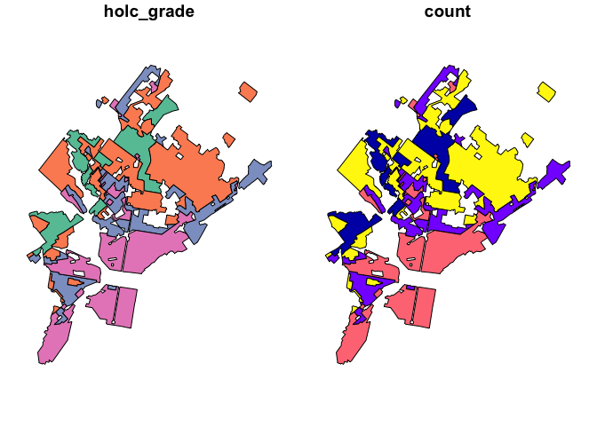

Historic Redlining
================

Historic redlining data refers to data from the Home Owners’ Loan
Corporation (HOLC) that created residential security maps in the 1930s,
which contributed to racial segregation and disinvestment in minority
neighborhoods. One popular source for this data is the Mapping
Inequality project (https://dsl.richmond.edu/panorama/redlining/).

In this example, we’ll download historic redlining data for Philadelphia
in the form of a GeoJSON file and analyze the data in R and Python.

R: In R, we’ll use the ‘sf’ and ‘dplyr’ packages to read and process the
GeoJSON data.

R code:

``` r
# Install and load necessary libraries]
library(knitr)
library(sf)
```

    Linking to GEOS 3.10.2, GDAL 3.4.2, PROJ 8.2.1; sf_use_s2() is TRUE

``` r
library(dplyr)
```


    Attaching package: 'dplyr'

    The following objects are masked from 'package:stats':

        filter, lag

    The following objects are masked from 'package:base':

        intersect, setdiff, setequal, union

``` r
# Download historic redlining data for Philadelphia
url <- "https://dsl.richmond.edu/panorama/redlining/static/downloads/geojson/PAPhiladelphia1937.geojson"
philly_geojson <- read_sf(url)

# Count the number of areas per HOLC grade
grade_counts <- philly_geojson %>%
  group_by(holc_grade) %>%
  summarize(count = n())

kable(grade_counts)
```

| holc_grade | count | geometry                     |
|:-----------|------:|:-----------------------------|
| A          |    10 | MULTIPOLYGON (((-75.17199 4… |
| B          |    28 | MULTIPOLYGON (((-75.26824 3… |
| C          |    18 | MULTIPOLYGON (((-75.22233 4… |
| D          |    26 | MULTIPOLYGON (((-75.16804 3… |

``` r
plot(grade_counts)
```



Python: In Python, we’ll use the ‘geopandas’ library to read and process
the GeoJSON data.

Python code:

``` python
# Install necessary libraries


import geopandas as gpd

# Download historic redlining data for Philadelphia
url = "https://dsl.richmond.edu/panorama/redlining/static/downloads/geojson/PAPhiladelphia1937.geojson"
philly_geojson = gpd.read_file(url)

# Count the number of areas per HOLC grade
grade_counts = philly_geojson["holc_grade"].value_counts()
print(grade_counts)
```

    B    28
    D    26
    C    18
    A    10
    Name: holc_grade, dtype: int64

In conclusion, both R and Python offer efficient ways to download and
process historic redlining data in the form of GeoJSON files. The ‘sf’
package in R provides a simple way to read and manipulate spatial data,
while the ‘geopandas’ library in Python offers similar functionality.
The ‘dplyr’ package in R can be used for data manipulation and analysis,
and Python’s built-in functions like value_counts() can be used for
aggregating data. Depending on your preferred programming language and
environment, both options can be effective for working with historic
redlining data.
