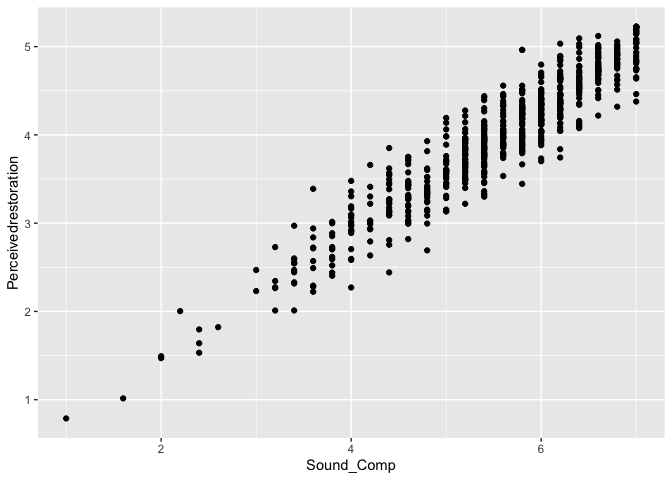

dryad
================
Ty Tuff, ESIIL Data Scientist
2023-05-21

Dryad is a repository of curated, open access, data files associated
with published articles in the sciences and social sciences. To access a
dataset, you’ll first need to choose a dataset and get its DOI (Digital
Object Identifier) or a direct link to download the dataset. In this
example, we’ll use a dataset called “The phantom chorus: birdsong boosts
human well-being in protected areas” by Dr. Clinton Francis with DOI:
10.5061/dryad.vmcvdncs3.

https://datadryad.org/stash/dataset/doi:10.5061/dryad.wwpzgmsgx

Citation

Francis, Clinton (2020), The phantom chorus: birdsong boosts human
well-being in protected areas, Dryad, Dataset,
https://doi.org/10.5061/dryad.wwpzgmsgx

Abstract

Spending time in nature is known to benefit human health and well-being,
but evidence is mixed as to whether biodiversity or perceptions of
biodiversity contribute to these benefits. Perhaps more importantly,
little is known about the sensory modalities by which humans perceive
biodiversity and obtain benefits from their interactions with nature.
Here, we used a “phantom bird song chorus” consisting of hidden speakers
to experimentally increase audible birdsong biodiversity during “on” and
“off” (i.e., ambient conditions) blocks on two trails to study the role
of audition in biodiversity perception and self-reported well-being
among hikers. Hikers exposed to the phantom chorus reported higher
levels of restorative effects compared to those that experienced ambient
conditions on both trails; however, increased restorative effects were
directly linked to the phantom chorus on one trail and indirectly linked
to the phantom chorus on the other trail through perceptions of avian
biodiversity. Our findings add to a growing body of evidence linking
mental health to nature experiences and suggest that audition is an
important modality by which natural environments confer restorative
effects. Finally, our results suggest that maintaining or improving
natural soundscapes within protected areas may be an important component
to maximizing human experiences.

R code:

``` r
install.packages("rdryad")
install.packages("ggplot2")
```

``` r
library(rdryad)
library(ggplot2)


search_results <- dryad_datasets()
print(search_results$data)

# Get the first DOI from the search results
doi <-  "https://doi.org/10.5061/dryad.wwpzgmsgx"
clean_doi <- gsub("https://doi.org/", "", doi)

files <- dryad_download(clean_doi)
print(files)
a <- unlist(files)
short_files <- as.data.frame(a)[,1]

# Identify the CSV file from the extracted files
csv_file <- list.files("/Users/ty/Library/Caches/R/rdryad/10_5061_dryad_wwpzgmsgx", pattern = ".csv", full.names = TRUE)[2]

# Read the CSV data
data <- read.csv(csv_file)

ggplot(data=data, aes(y=Perceivedrestoration, Sound_Comp)) +
  geom_point()
```



``` python
import requests
import pandas as pd
import matplotlib.pyplot as plt
import io

# Search for datasets related to the term "habitat"
base_url = "https://datadryad.org/api/v2/datasets?"
params = {"query": "habitat"}

response = requests.get(base_url, params=params)
search_results = response.json()
print(search_results)

# Get the first DOI from the search results
doi = "https://doi.org/10.5061/dryad.wwpzgmsgx"
clean_doi = doi.replace("https://doi.org/", "")

# Download the dataset
files_url = f"https://datadryad.org/api/v2/datasets/{clean_doi}/download"
response = requests.get(files_url)
files = response.json()
print(files)

# Identify the CSV file from the extracted files
csv_file_url = None
for file in files['data']:
    if '.csv' in file['attributes']['name']:
        csv_file_url = file['links']['download']
        break

# Read the CSV data
response = requests.get(csv_file_url)
data = pd.read_csv(io.StringIO(response.text))

# Plot the data using pandas and matplotlib
# Replace 'Perceivedrestoration' and 'Sound_Comp' with the actual column names in your dataset
ax = data.plot(x='Perceivedrestoration', y='Sound_Comp', kind='scatter')
ax.set_xlabel('Perceivedrestoration')
ax.set_ylabel('Sound_Comp')
plt.show()
```
