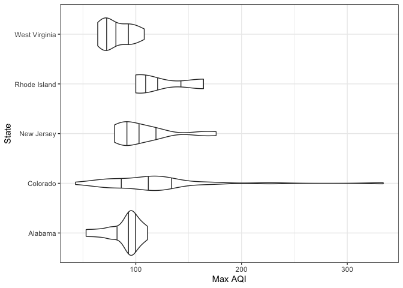
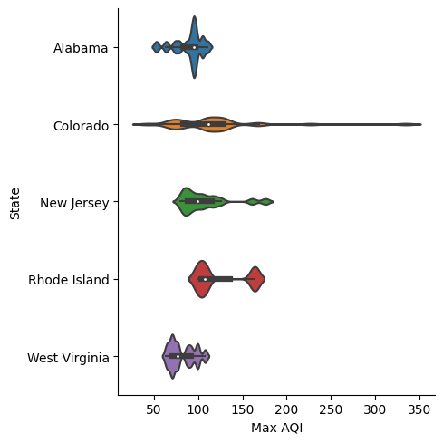

# EPA air data

This data set developed by the Environmental Protection Agency (EPA) contains air quality data per county. Other related data sets are available [here](https://aqs.epa.gov/aqsweb/airdata/download_files.html#AQI).

In R, we need 2 packages to download and visualize the data. First, check if the packages are already installed. Install them if they are not:

``` r
packages <- c("tidyverse", "httr") 
new.packages <- packages[!(packages %in% installed.packages()[,"Package"])] 
if(length(new.packages)>0) install.packages(new.packages) 
```

Then, load them:

``` r
lapply(packages, library, character.only = TRUE)
```

```         
── Attaching packages ─────────────────────────────────────── tidyverse 1.3.0 ──

✔ ggplot2 3.4.1     ✔ purrr   0.3.4
✔ tibble  3.2.1     ✔ dplyr   1.0.9
✔ tidyr   1.1.2     ✔ stringr 1.4.0
✔ readr   1.4.0     ✔ forcats 0.5.0

── Conflicts ────────────────────────────────────────── tidyverse_conflicts() ──
✖ dplyr::filter() masks stats::filter()
✖ dplyr::lag()    masks stats::lag()

[[1]]
 [1] "forcats"   "stringr"   "dplyr"     "purrr"     "readr"     "tidyr"    
 [7] "tibble"    "ggplot2"   "tidyverse" "stats"     "graphics"  "grDevices"
[13] "utils"     "datasets"  "methods"   "base"     

[[2]]
 [1] "httr"      "forcats"   "stringr"   "dplyr"     "purrr"     "readr"    
 [7] "tidyr"     "tibble"    "ggplot2"   "tidyverse" "stats"     "graphics" 
[13] "grDevices" "utils"     "datasets"  "methods"   "base"     
```

Download the data set:

``` r
url <- "https://aqs.epa.gov/aqsweb/airdata/annual_aqi_by_county_2022.zip" 
aqi <- GET(url) 
data_file <-"aqi.zip" 
writeBin(content(aqi, "raw"), data_file)

# Unzip the file
unzip(data_file)
```

Read the data set:

``` r
aqi <- read_csv('annual_aqi_by_county_2022.csv')
```

```         
── Column specification ────────────────────────────────────────────────────────
cols(
  State = col_character(),
  County = col_character(),
  Year = col_double(),
  `Days with AQI` = col_double(),
  `Good Days` = col_double(),
  `Moderate Days` = col_double(),
  `Unhealthy for Sensitive Groups Days` = col_double(),
  `Unhealthy Days` = col_double(),
  `Very Unhealthy Days` = col_double(),
  `Hazardous Days` = col_double(),
  `Max AQI` = col_double(),
  `90th Percentile AQI` = col_double(),
  `Median AQI` = col_double(),
  `Days CO` = col_double(),
  `Days NO2` = col_double(),
  `Days Ozone` = col_double(),
  `Days PM2.5` = col_double(),
  `Days PM10` = col_double()
)
```

Select 5 states and make violin plots of the maximum air quality index per county in 2022:

``` r
aqi_5_states <- aqi %>% 
  filter(State %in% c("Alabama", "Colorado", "New Jersey", "Rhode Island", "West Virginia")) 

ggplot(aqi_5_states) +
  geom_violin(aes(x = `Max AQI`, y = State), draw_quantiles = c(.25, .5, .75)) +
  theme_bw() +
  ylab("State")
```



In Python, we need 5 libraries to download and visualize the data.

``` python
import requests 
import zipfile
import pandas as pd
import seaborn as sns
import matplotlib.pyplot as plt
```

Download the data set:

``` python
url = "https://aqs.epa.gov/aqsweb/airdata/annual_aqi_by_county_2022.zip" 
aqi = requests.get(url)
data_file = "aqi.zip"
with open(data_file, 'wb') as f:
    f.write(aqi.content)
    data_file = "aqi.zip"

# Unzip the file
```

```         
20589
```

``` python
with zipfile.ZipFile(data_file, 'r') as zip_ref:
    zip_ref.extractall()
```

Read it:

``` python
csv_file = "annual_aqi_by_county_2022.csv" 
aqi = pd.read_csv(csv_file)
```

Select 5 states and make violin plots of the maximum air quality index per county in 2022:

``` python
states = ["Alabama", "Colorado", "New Jersey", "Rhode Island", "West Virginia"]
aqi_5_states = aqi[aqi['State'].isin(states)]

plt.figure()
sns.catplot(data=aqi_5_states, x='Max AQI', y='State', kind='violin', bw=.15)
```


