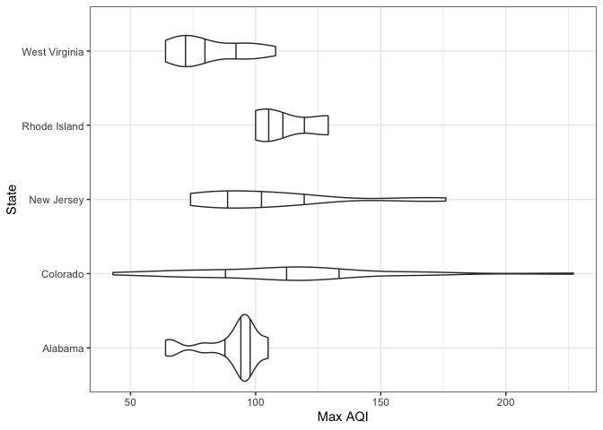
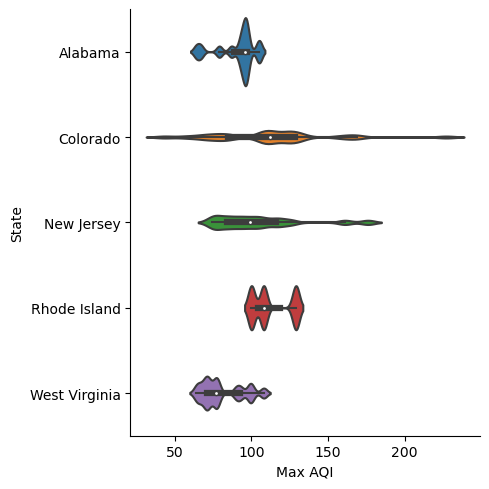

EPA air data
================
Virginia Iglesias, ESIIL Data Scientist
2023-05-21

The United States Environmental Protection Agency (EPA) is at the
forefront of monitoring and protecting the country’s environment, and
one of its critical areas of focus is air quality. As part of its
efforts, the EPA has developed a comprehensive dataset that contains
detailed information on air quality across the counties in the United
States.

This dataset provides an in-depth look at various air quality metrics at
the county level, making it a rich source of information for
researchers, policymakers, and environmentalists. The dataset includes
data on pollutants such as particulate matter (PM2.5 and PM10), nitrogen
dioxide, sulfur dioxide, carbon monoxide, and ozone, among others. These
pollutants are key indicators of air quality and have direct
implications for human health and environmental wellbeing.

But the EPA’s data offerings don’t stop with this dataset. Several
related datasets are readily available on the EPA’s Air Quality System
(AQS) site, which you can find
[here](https://aqs.epa.gov/aqsweb/airdata/download_files.html#AQI).
These additional resources provide further granularity and different
perspectives on air quality, including data on the Air Quality Index
(AQI), daily summaries, annual summaries, and more.

These datasets offer a comprehensive suite of information for anyone
interested in understanding the state of air quality in the United
States. Whether for academic research, environmental policy development,
public health studies, or personal interest, the EPA’s air quality
datasets provide valuable insights into the state of the nation’s air
and the challenges we face in keeping it clean.

In R, we need 2 packages to download and visualize the data. First,
check if the packages are already installed. Install them if they are
not:

``` r
packages <- c("tidyverse", "httr") 
new.packages <- packages[!(packages %in% installed.packages()[,"Package"])] 
if(length(new.packages)>0) install.packages(new.packages) 
```

Then, load them:

``` r
lapply(packages, library, character.only = TRUE)
```

Download the data set:

``` r
url <- "https://aqs.epa.gov/aqsweb/airdata/annual_aqi_by_county_2022.zip" 
aqi <- GET(url) 
data_file <-"aqi.zip" 
writeBin(content(aqi, "raw"), data_file)

# Unzip the file
unzip(data_file)
```

Read the data set:

``` r
aqi <- read_csv('annual_aqi_by_county_2022.csv')
```

Select 5 states and make violin plots of the maximum air quality index
per county in 2022:

``` r
aqi_5_states <- aqi %>% 
  filter(State %in% c("Alabama", "Colorado", "New Jersey", "Rhode Island", "West Virginia")) 

ggplot(aqi_5_states) +
  geom_violin(aes(x = `Max AQI`, y = State), draw_quantiles = c(.25, .5, .75)) +
  theme_bw() +
  ylab("State")
```



In Python, we need 5 libraries to download and visualize the data.

``` python
import requests 
import zipfile
import pandas as pd
import seaborn as sns
import matplotlib.pyplot as plt
```

Download the data set:

``` python
url = "https://aqs.epa.gov/aqsweb/airdata/annual_aqi_by_county_2022.zip" 
aqi = requests.get(url)
data_file = "aqi.zip"
with open(data_file, 'wb') as f:
    f.write(aqi.content)
    data_file = "aqi.zip"

# Unzip the file
```

``` python
with zipfile.ZipFile(data_file, 'r') as zip_ref:
    zip_ref.extractall()
```

Read it:

``` python
csv_file = "annual_aqi_by_county_2022.csv" 
aqi = pd.read_csv(csv_file)
```

Select 5 states and make violin plots of the maximum air quality index
per county in 2022:

``` python
states = ["Alabama", "Colorado", "New Jersey", "Rhode Island", "West Virginia"]
aqi_5_states = aqi[aqi['State'].isin(states)]

plt.figure()
sns.catplot(data=aqi_5_states, x='Max AQI', y='State', kind='violin', bw=.15)
```


