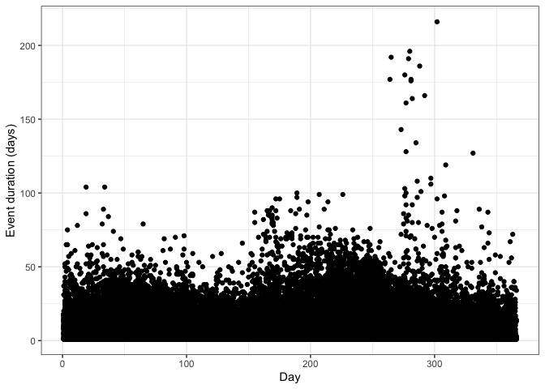
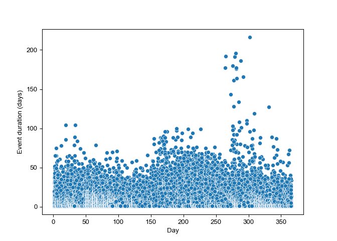

FIRED
================
Virginia Iglesias, ESIIL Data Scientist
2023-05-21

The Fire Event Delineation (FIRED) data set is a significant
contribution to the field of environmental science, specifically in the
study and monitoring of wildfires. Covering an extensive period from
November 2001 to January 2022, this data set provides comprehensive
spatial information about wildfire events in the conterminous United
States, making it an invaluable resource for researchers, policymakers,
and environmental practitioners alike.

The FIRED product is unique as it offers both event-level and
daily-level polygons of wildfire incidents. This dual-level detail
allows for precise spatial and temporal mapping and tracking of wildfire
occurrences. Event-level polygons encapsulate the entire spatial extent
of individual fire events, whereas daily-level polygons provide
day-to-day progression information for each fire, effectively
illustrating the development and spread of fires over time.

This data set contains event- and daily-level polygons for the [Fire
Event
Delineation](https://scholar.colorado.edu/concern/datasets/d504rm74m)
(FIRED) product for the conterminous US from November 2001 to January
2022. You can find more information
[here](https://www.mdpi.com/2072-4292/12/21/3498).

In R, we need 3 packages to download and visualize the data. First,
check if the packages are already installed. Install them if they are
not:

``` r
packages <- c("tidyverse", "httr", "sf") 
new.packages <- packages[!(packages %in% installed.packages()[,"Package"])] 
if(length(new.packages)>0) install.packages(new.packages) 
```

Then, load them:

``` r
lapply(packages, library, character.only = TRUE)
```

Download the data set:

``` r
url <- "https://scholar.colorado.edu/downloads/zw12z650d" 
fired <- GET(url) 
data_file <-"fired.zip" 
writeBin(content(fired, "raw"), data_file)

# Unzip the file
unzip(data_file)
```

Read the data set:

``` r
fired <- st_read("fired_conus_ak_to_January_2022_gpkg_shp/conus_ak_to2022001_events.shp") 
```

Plot fire duration as a function of ignition day:

``` r
ggplot(fired) +
  geom_point(aes(ig_day, event_dur)) +
  theme_bw() +
  xlab('Day') +
  ylab('Event duration (days)')
```



In Python, we need 5 libraries to download and visualize the data.

``` python
import requests 
import zipfile 
import geopandas as gpd 
import matplotlib.pyplot as plt
import seaborn as sns
```

Download the data set:

``` python
url = "https://scholar.colorado.edu/downloads/zw12z650d"
fired = requests.get(url)
data_file = "fired.zip"
with open(data_file, 'wb') as f:
    f.write(fired.content)

# Unzip the file
```

``` python
with zipfile.ZipFile(data_file, 'r') as zip_ref:
    zip_ref.extractall()
```

Read it:

``` python
fired = gpd.read_file("fired_conus_ak_to_January_2022_gpkg_shp/conus_ak_to2022001_events.shp")
```

Plot fire duration as a function of ignition day:

``` python
plt.figure()
sns.scatterplot(data=fired, x='ig_day', y='event_dur')
sns.set_style('whitegrid')
plt.xlabel('Day')
plt.ylabel('Event duration (days)')
plt.show()
```


