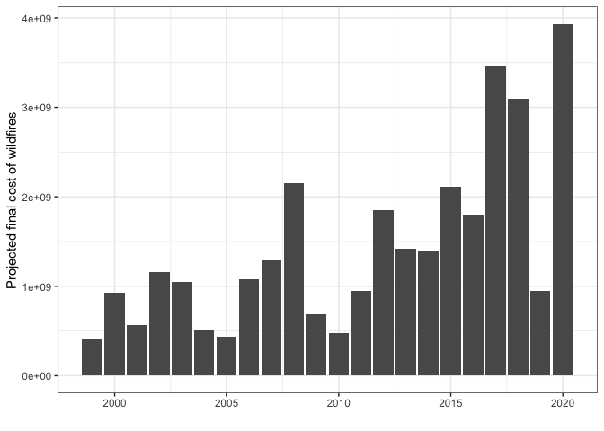
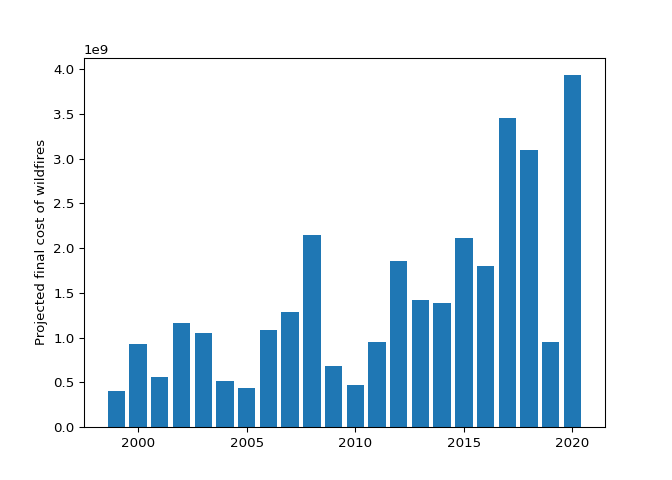

# ICS-209-Plus

This is an all-hazards data set mined from the US National Incident Management System (1999-2020). You can find more information [here](https://www.nature.com/articles/s41597-023-01955-0#code-availability)).

In R, we need 2 packages to download and visualize the data. First, check if the packages are already installed. Install them if they are not:

``` r
packages <- c("tidyverse", "httr") 
new.packages <- packages[!(packages %in% installed.packages()[,"Package"])] 
if(length(new.packages)>0) install.packages(new.packages) 
```

Then, load them:

``` r
lapply(packages, library, character.only = TRUE)
```

```         
── Attaching packages ─────────────────────────────────────── tidyverse 1.3.0 ──

✔ ggplot2 3.4.1     ✔ purrr   0.3.4
✔ tibble  3.2.1     ✔ dplyr   1.0.9
✔ tidyr   1.1.2     ✔ stringr 1.4.0
✔ readr   1.4.0     ✔ forcats 0.5.0

── Conflicts ────────────────────────────────────────── tidyverse_conflicts() ──
✖ dplyr::filter() masks stats::filter()
✖ dplyr::lag()    masks stats::lag()

[[1]]
 [1] "forcats"   "stringr"   "dplyr"     "purrr"     "readr"     "tidyr"    
 [7] "tibble"    "ggplot2"   "tidyverse" "stats"     "graphics"  "grDevices"
[13] "utils"     "datasets"  "methods"   "base"     

[[2]]
 [1] "httr"      "forcats"   "stringr"   "dplyr"     "purrr"     "readr"    
 [7] "tidyr"     "tibble"    "ggplot2"   "tidyverse" "stats"     "graphics" 
[13] "grDevices" "utils"     "datasets"  "methods"   "base"     
```

Download the data set containing wildfire information:

``` r
url <- "https://figshare.com/ndownloader/articles/19858927/versions/3" 
ics <- GET(url) 
data_file <-"ics.zip" 
writeBin(content(ics, "raw"), data_file)

# Unzip the file
unzip(data_file)
unzip('ics209plus-wildfire.zip')
```

Read the data set:

``` r
csvs <- list.files('ics209plus-wildfire',
                   full.names = T)[5]
ics <- read.csv(csvs)
```

Calculate the annual cost of wildfires and plot:

``` r
ics_sum  <-  ics %>% 
  group_by(START_YEAR) %>% 
  summarise(cost = sum(PROJECTED_FINAL_IM_COST, na.rm = T)) 

ggplot(ics_sum) +
  geom_bar(aes(START_YEAR, cost),
           stat = 'identity') +
  theme_bw() +
  xlab("") +
  ylab("Estimated final cost of wildfires")
```



In Python, we need 6 libraries to download and visualize the data.

``` python
import requests 
import zipfile 
import matplotlib.pyplot as plt
import pandas as pd
import os
import glob
```

Download the data set containing wildfire information:

``` python
url = "https://figshare.com/ndownloader/articles/19858927/versions/3" 
ics = requests.get(url)
data_file = "ics.zip"
with open(data_file, 'wb') as f:
    f.write(ics.content)

# Unzip the file
```

```         
516191541
```

``` python
with zipfile.ZipFile(data_file, 'r') as zip_ref:
    zip_ref.extractall()
with zipfile.ZipFile('ics209plus-wildfire.zip', 'r') as zip_ref:
    zip_ref.extractall()
```

Read the data set:

``` python
csvs = glob.glob('ics209plus-wildfire' + '/*')[8]

ics = pd.read_csv(csvs, low_memory = False)
```

Calculate the annual cost of wildfires and plot:

``` python
ics_sum = ics.groupby('START_YEAR').agg(cost=('PROJECTED_FINAL_IM_COST', 'sum')).reset_index()

plt.figure()
plt.bar(ics_sum['START_YEAR'], ics_sum['cost'])
```

```         
<BarContainer object of 22 artists>
```

``` python
plt.xlabel("")
plt.ylabel("Projected final cost of wildfires")
plt.show()
```


