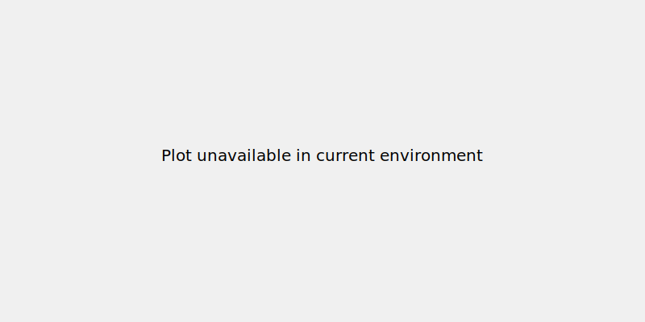

---
tags:
- hazards
- epica_dome_c_ch4
- innovation-summit-2025
---

EPICA Dome C Methane (CH₄) Records
================

The EPICA Dome C ice core, drilled in East Antarctica, preserves greenhouse gas concentrations across the last ~800,000 years. Methane (CH₄) trapped in air bubbles provides a high-resolution record of atmospheric composition that links climate shifts, glacial–interglacial cycles, and biogeochemical processes. These long records are foundational for paleoclimate research and critical for contextualizing modern greenhouse gas trends.



## Why this matters

* Tracks methane variability across eight glacial–interglacial cycles.
* Provides essential data for carbon cycle models and climate change attribution.
* Serves as a reference point for comparing modern methane increases to natural variability.

## Access methods

* **Provider:** NOAA NCEI Paleoclimatology Program
* **Dataset:** [EDC CH₄ 2008 file](https://www.ncei.noaa.gov/pub/data/paleo/icecore/antarctica/epica_domec/edc-ch4-2008-noaa.txt)
* **Format(s):** Plain text table (whitespace-delimited)
* **Auth:** None required
* **Rate limits:** Open public access

---

## Quickstart: R

```r
# install.packages(c("readr","dplyr","ggplot2"))
library(readr); library(dplyr); library(ggplot2)

url <- "https://www.ncei.noaa.gov/pub/data/paleo/icecore/antarctica/epica_domec/edc-ch4-2008-noaa.txt"

# NOAA files have headers and comments starting with #
dat <- read_table(url, comment = "#", col_names = TRUE, show_col_types = FALSE)

# Clean column names (likely "age_yrBP" and "CH4_ppb")
names(dat) <- tolower(names(dat))

ggplot(dat, aes(x = age_yrbp, y = ch4_ppb)) +
  geom_point(size = 0.6, alpha = 0.7) +
  scale_x_reverse() +
  labs(
    title = "EPICA Dome C Methane Record",
    x = "Years Before Present (BP)",
    y = "CH₄ concentration (ppb)"
  ) +
  theme_minimal()
```

---

## Quickstart: Python

```python
import pandas as pd
import matplotlib.pyplot as plt

url = "https://www.ncei.noaa.gov/pub/data/paleo/icecore/antarctica/epica_domec/edc-ch4-2008-noaa.txt"

# NOAA paleoclimate files: comments start with '#'
df = pd.read_csv(url, delim_whitespace=True, comment="#", na_values=["-9999"])

# Inspect and standardize column names
df.columns = df.columns.str.lower()

plt.figure(figsize=(8,4))
plt.scatter(df["age_yrbp"], df["ch4_ppb"], s=6, alpha=0.6)
plt.gca().invert_xaxis()
plt.xlabel("Years Before Present (BP)")
plt.ylabel("CH₄ concentration (ppb)")
plt.title("EPICA Dome C Methane Record")
plt.tight_layout()
plt.show()
```

---

## Parameters & tips

* **Column meanings**: `age_yrBP` = years before present (1950 CE), `ch4_ppb` = methane concentration in parts per billion.
* **Units**: Time in years BP, gas concentrations in ppb.
* **Common gotcha**: Files contain long headers; always use `comment="#"` when parsing.

## License & citation

* **Citation**: Loulergue, L. et al. 2008. *EPICA Dome C Ice Core 800 KYr Methane Data*. NOAA National Centers for Environmental Information.
* **DOI:** [10.1594/PANGAEA.683655](https://doi.org/10.1594/PANGAEA.683655)
* **License:** Public domain / Open access (NOAA).

## Related datasets

* [Vostok Ice Core CO₂](https://www.ncei.noaa.gov/access/paleo-search/study/2446)
* [EPICA Dome C CO₂](https://www.ncei.noaa.gov/pub/data/paleo/icecore/antarctica/epica_domec/edc-co2-2008-noaa.txt)

*Last update: 2025-08-28*
