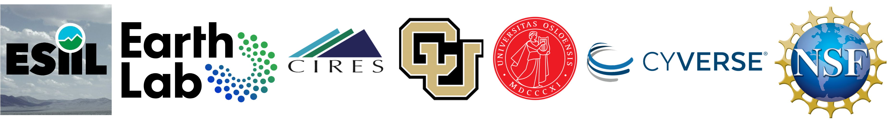

ESIIL data library and vignette repository
================

Welcome to the Environmental Data Science Innovation and Inclusion Lab
(ESIIL) Data Library! As an NSF-funded national synthesis center, ESIIL
is dedicated to fostering collaboration between biological and computer
sciences to drive innovation and inclusivity across the two diciplines.
Our data library features a diverse range of datasets, each with its own
dedicated web page. To help you get started, we provide easy-to-use R
and Python code snippets for downloading and working with each dataset.
For more advanced users, we also offer comprehensive tutorials and
vignettes tailored to individual datasets. Explore our rich collection
and unlock the power of environmental data for your research today!

## Acknowledgments

This work is funded by the National Science Foundation (NSF Award Number
<a href="https://www.nsf.gov/awardsearch/showAward?AWD_ID=2153040&HistoricalAwards=false" target="_blank">DBI-2153040</a>).
