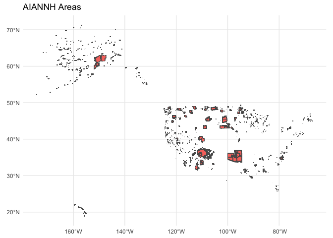
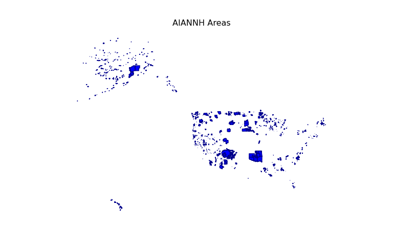
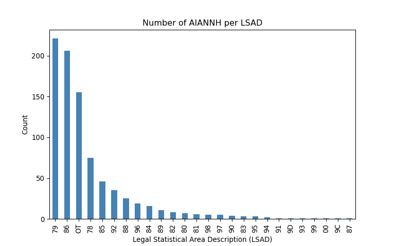

American Indian and Alaska Native Areas
================
Ty Tuff, ESIIL Data Scientist
2023-05-21

The National American Indian/Alaska Native/Native Hawaiian (AIANNH)
Areas Shapefile is a dataset that provides a comprehensive view of the
geographic, demographic, and cultural landscape of Indigenous
communities in the United States. This unique resource comprises diverse
legal entities, encompassing federally recognized American Indian
reservations, off-reservation trust lands, Alaska Native regional
corporations, and Native Hawaiian homelands.

<https://catalog.data.gov/dataset/tiger-line-shapefile-2020-nation-u-s-american-indian-alaska-native-native-hawaiian-aiannh-areas>

These entities hold a rich tapestry of diverse cultures, languages, and
histories, each with unique stories to tell and invaluable wisdom to
impart. The AIANNH Areas Shapefile is more than just a collection of
data; it is a detailed map of vibrant communities and proud nations,
embodying the resilience and enduring spirit of the Indigenous peoples
of America.

For researchers, policy makers, educators, and anyone with a vested
interest in understanding these communities and their contributions to
the broader cultural fabric of the United States, this dataset serves as
a vital resource. Its depth and breadth offer unprecedented insights
into the geographic boundaries that define these communities, the
demographic characteristics that diversify them, and the cultural
aspects that unify and distinguish them.

From the wild expanses of Alaska to the lush tropical landscapes of
Hawaii, and across the vast American mainland, the AIANNH Areas
Shapefile traces the footsteps of the First Nations. By diving into this
dataset, you are not only exploring data, but also appreciating the rich
tapestry of cultures that form an integral part of the United States’
historical, present, and future narrative.

## LSAD

Legal/Statistical Area Description (LSAD) is a classification that the
U.S. Census Bureau uses to define the legal and statistical entities for
geographic areas. It is a code that represents the type, function, or
status of a geographic entity.

For example, in the context of American Indian, Alaska Native, and
Native Hawaiian Areas (AIANNHA), the LSAD can represent the following
classifications:

“RS” for Reservation (Federal) “OK” for Oklahoma Tribal Statistical Area
“SD” for State Designated Tribal Statistical Area “RC” for Alaska Native
Regional Corporation, and others.

R code:

``` r
# Install and load necessary libraries
library(sf)
library(dplyr)
library(knitr)
library(ggplot2)

# Download dataset from source
url <- "https://www2.census.gov/geo/tiger/TIGER2020/AIANNH/tl_2020_us_aiannh.zip"
temp_file <- tempfile(fileext = ".zip")
download.file(url, temp_file, mode = "wb")
unzip(temp_file, exdir = tempdir())

# Read the Shapefile
shapefile_path <- file.path(tempdir(), "tl_2020_us_aiannh.shp")
aiannh <- read_sf(shapefile_path)


# Plot the count per LSAD
ggplot() +
  geom_sf(data = aiannh, aes( fill="steelblue")) +
  theme_minimal() +
  labs(title = "AIANNH Areas")+ theme(legend.position = "none")
```



``` r
# Count the number of AIANNH per legal statistical area description (LSAD)
state_counts <- aiannh %>%
  group_by(LSAD) %>%
  summarize(count = n()) 


# Plot the count per LSAD
ggplot(state_counts, aes(x = reorder(LSAD, -count), y = count)) +
  geom_bar(stat = "identity", fill = "steelblue") +
  theme_minimal() +
  labs(x = "Legal Statistical Area Description (LSAD)", 
       y = "Count", 
       title = "Number of AIANNH per LSAD") +
  theme(axis.text.x = element_text(angle = 90, hjust = 1))
```


Python code:

``` python
# Import necessary libraries
import os
import geopandas as gpd
import pandas as pd
import matplotlib.pyplot as plt
import urllib.request
import zipfile
from tempfile import TemporaryDirectory

# Download dataset from source
url = "https://www2.census.gov/geo/tiger/TIGER2020/AIANNH/tl_2020_us_aiannh.zip"
with TemporaryDirectory() as tmpdirname:
    zip_path = os.path.join(tmpdirname, "tl_2020_us_aiannh.zip")
    shapefile_path = os.path.join(tmpdirname, "tl_2020_us_aiannh.shp")
    
    # Download and unzip the file
    urllib.request.urlretrieve(url, zip_path)
    with zipfile.ZipFile(zip_path, 'r') as zip_ref:
        zip_ref.extractall(tmpdirname)
    
    # Read the Shapefile
    aiannh = gpd.read_file(shapefile_path)

# Create a map of the AIANNH areas
```

``` python
aiannh.plot(color="blue", edgecolor="darkblue")
plt.title("AIANNH Areas")
plt.axis("off")  # to turn off the axis
```

``` python
plt.show()

# Count the number of AIANNH per LSAD
```



``` python
state_counts = aiannh['LSAD'].value_counts().reset_index()
state_counts.columns = ['LSAD', 'Count']  # rename columns

# Create a bar plot of the count per LSAD
state_counts = state_counts.sort_values(by='Count', ascending=False)  # sort by Count
state_counts.plot(x='LSAD', y='Count', kind='bar', legend=None, color="steelblue")
plt.title("Number of AIANNH per LSAD")
plt.xlabel("Legal Statistical Area Description (LSAD)")
plt.ylabel("Count")
plt.xticks(rotation=90)
```

``` python
plt.show()
```


