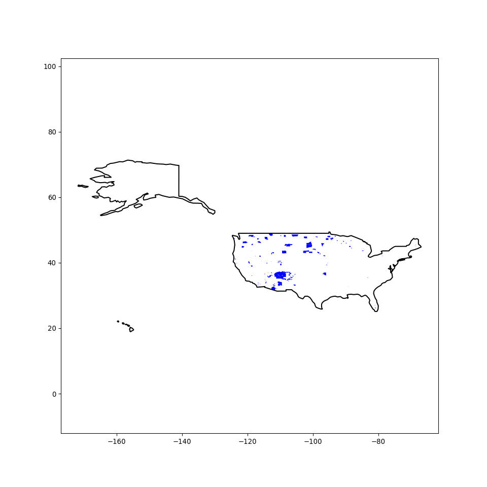

National Atlas - Indian Lands of the United States dataset
================
Ty Tuff, ESIIL Data Scientist
2023-05-21

The “National Atlas - Indian Lands of the United States” dataset is a
comprehensive geographical resource that presents the locations and
extents of lands associated with Native American tribes recognized by
the U.S. government. It encompasses lands managed by these tribes under
the oversight of the U.S. Bureau of Indian Affairs, lands held in trust
by the U.S. for specific tribes, as well as other types of recognized
tribal lands. <https://www.loc.gov/resource/g3701e.ct003648r/>

This dataset offers vital spatial information for educators,
policymakers, researchers, and others interested in learning about and
engaging with Native American tribal lands. Its intent is to facilitate
enhanced awareness and understanding of the rich cultural heritage and
sovereignty of these Indigenous and Tribal Nations.

As such, it serves not only as a tool for geographical reference, but
also as a resource that contributes to a deeper understanding of the
history, diversity, and contemporary life of Native American tribes
across the United States.

R: In R, we’ll use the ‘sf’ package to read the Shapefile and the
‘dplyr’ package to process the data.

R code:

``` r
# Install and load necessary libraries

library(sf)
library(dplyr)
library(USAboundaries)
library(ggplot2)

# Download the Indian Lands dataset
url <- "https://prd-tnm.s3.amazonaws.com/StagedProducts/Small-scale/data/Boundaries/indlanp010g.shp_nt00968.tar.gz"
temp_file <- tempfile(fileext = ".tar.gz")
download.file(url, temp_file, mode = "wb")
untar(temp_file, exdir = tempdir())

# Read the Shapefile
shapefile_path <- file.path(tempdir(), "indlanp010g.shp")
indian_lands <- read_sf(shapefile_path)

states <- us_states(map_date = NULL) # for contemporary boundaries
counties <- us_counties(map_date = NULL) # for contemporary boundaries


bbox <- st_bbox(indian_lands)

# Extract the xmin, xmax, ymin, and ymax values
xmin <- bbox[1]
xmax <- bbox[3]
ymin <- bbox[2]
ymax <- bbox[4]

ggplot(data= indian_lands) + 
  geom_sf(data=states, fill=NA, color="grey70", size=0.2) +
  geom_sf(data=counties, fill=NA, color="grey90", size=0.1) +
  geom_sf(data=indian_lands, fill="cornflowerblue", color="darkblue") +
  coord_sf(xlim=c(xmin, xmax), ylim=c(ymin, ymax)) + 
  theme_minimal() +  # Use minimal theme
  theme(legend.position = "none") 
```


Python: In Python, we’ll use the ‘geopandas’ and ‘pandas’ libraries to
read the Shapefile and process the data.

Python code:

``` python

import geopandas as gpd
import matplotlib.pyplot as plt
import contextily as ctx
from urllib.request import urlretrieve
import os
import tarfile
import tempfile

# Download the Indian Lands dataset
url = "https://prd-tnm.s3.amazonaws.com/StagedProducts/Small-scale/data/Boundaries/indlanp010g.shp_nt00968.tar.gz"
temp_file, _ = urlretrieve(url)
tar = tarfile.open(temp_file, "r:gz")
tar.extractall(path=tempfile.gettempdir())
tar.close()

# Read the Shapefile
shapefile_path = os.path.join(tempfile.gettempdir(), "indlanp010g.shp")
indian_lands = gpd.read_file(shapefile_path)

# Set CRS
indian_lands = indian_lands.set_crs("EPSG:4326", allow_override=True)

# Get the US map with state boundaries
us_map = gpd.read_file(gpd.datasets.get_path('naturalearth_lowres'))
us_map = us_map[us_map.name == 'United States of America'].set_crs("EPSG:4326")

# Plot
fig, ax = plt.subplots(figsize=(10,10))
us_map.boundary.plot(ax=ax, color='black')
```

``` python
indian_lands.plot(ax=ax, color='blue')
```

``` python
plt.axis('equal')
```

``` python
plt.show()
```


