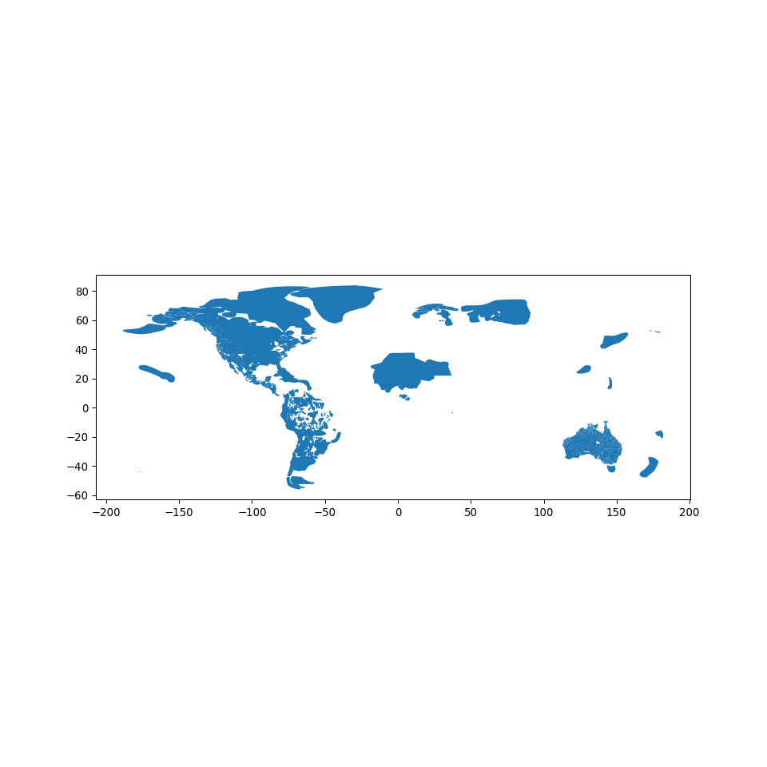
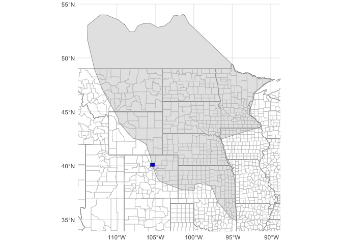

Native lands Digital
================

We are grateful to have the opportunity to work with data provided by
Native Land Digital https://native-land.ca/maps/languages/lakotayapi/.
This data represents territories, languages, and treaties associated
with Indigenous nations across North America and other parts of the
world.

This rich dataset is more than just a collection of shapes, names, or
historical facts. Each entry represents a living community with a rich
history, vibrant culture, and ongoing connection to the lands and waters
that sustain them. The boundaries and names reflect deep relationships
between these communities and their homelands—relationships that predate
colonial borders and continue to be meaningful today.

Working with this data should be a continual reminder of the resilience
and diversity of Indigenous nations, as well as the ongoing struggles
they face to protect their rights, languages, and cultures. It’s also a
reminder of our responsibilities in acknowledging Indigenous lands,
respecting treaty rights, and supporting Indigenous sovereignty.

It is crucial to recognize that this data is not comprehensive nor
infallible. Despite the utmost care taken by Native Land Digital,
errors, omissions, or misrepresentations may exist, reflecting the
complex and often contentious nature of Indigenous histories and
geographies. It’s also important to note that Indigenous peoples have
diverse perspectives on the sharing and mapping of their lands,
languages, and cultures.

We encourage users of this data to learn more about the nations,
territories, languages, and treaties it represents, and to seek out and
respect Indigenous perspectives in their work. Always remember that
behind each data point is a community, a culture, and a history that
deserves our respect and understanding.

Finally, we acknowledge and express our gratitude to Native Land Digital
for their work in compiling and sharing this data. This work is a
powerful tool for education, reconciliation, and the affirmation of
Indigenous presence across the globe.

## Download from Native Land API

Please be aware that as part of this tutorial, we encountered challenges
when attempting to directly download and load the data from the Native
Land API using R due to its specific formatting. As a solution, we
turned to Python, which allowed for a more straightforward handling of
this dataset. Specifically, we used Python to download the data from the
API, convert it into a GeoDataFrame, and save it as a GeoJSON file. This
intermediate GeoJSON file was then successfully loaded into R for
further analysis. While this may seem like an extra step, it effectively
resolves the issue encountered in R, and facilitates a smooth
integration of the data into our R-based workflow. This approach
underscores the utility of being versatile in multiple programming
languages, as each language has its own strengths and may be more suited
to different tasks.

``` python
import requests
import geopandas as gpd
from shapely.geometry import shape
import matplotlib.pyplot as plt

# Send GET request to the API
response = requests.get("https://native-land.ca/api/index.php?maps=languages")

# The API returns a list of features
features = response.json()

# Filter out features with inconsistent coordinate dimensionality
filtered_features = []
for feature in features:
    try:
        # Attempt to construct a shapely shape from the geometry
        shape(feature['geometry'])
        filtered_features.append(feature)
    except ValueError:
        # If the shape construction fails due to a ValueError, skip this feature
        pass

# Wrap filtered features in a dictionary to create a valid GeoJSON
```

``` python
data_geojson = {"type": "FeatureCollection", "features": filtered_features}

# Convert the GeoJSON to a GeoDataFrame
data_gdf = gpd.GeoDataFrame.from_features(data_geojson)

data_gdf.to_file("data.geojson", driver='GeoJSON')

# Plot the data
```

``` python
data_gdf.plot(figsize=(10, 10))
plt.show()
```



## Lakȟótiyapi (Lakota)

The Lakȟótiyapi, also known as the Lakota, are a group of indigenous
people who are part of the Sioux Nation. Historically, the Lakota people
lived in a large region in the central part of North America, spanning
from the Great Lakes in the east to the Rocky Mountains in the west, and
from Canada in the north to the northern part of modern-day Texas in the
south.

A significant aspect of Lakota history is their close association with
the Great Plains of the United States. Originally settled in the upper
Mississippi Region in what is now Minnesota, the Lakota migrated
westward in the late 17th and early 18th centuries as European settlers
pushed inland. This migration led them to the Great Plains, the region
that is often most associated with them.

Their traditional territory on the Great Plains is characterized by vast
grasslands, interrupted by the occasional forest and mountain range,
which made it an ideal location for a hunting and gathering lifestyle.
The Lakota were known as skilled horsemen and hunters, especially of the
American bison.

Please note that while these historical ranges provide a broad overview
of the territories that the Lakota people have lived in, they do not
capture the full depth and complexity of the relationships that
indigenous peoples have with their lands. These relationships are often
dynamic and evolving, and they are shaped by a rich tapestry of history,
culture, language, and spirituality.

For more information about the Lakota people and their language, visit
Native Land Digital’s map at
https://native-land.ca/maps/languages/lakotayapi/.

``` r
library(sf)
```

    Linking to GEOS 3.10.2, GDAL 3.4.2, PROJ 8.2.1; sf_use_s2() is TRUE

``` r
library(dplyr)
```


    Attaching package: 'dplyr'

    The following objects are masked from 'package:stats':

        filter, lag

    The following objects are masked from 'package:base':

        intersect, setdiff, setequal, union

``` r
library(USAboundaries)
library(tidyverse)
```

    ── Attaching core tidyverse packages ──────────────────────── tidyverse 2.0.0 ──
    ✔ forcats   1.0.0     ✔ readr     2.1.4
    ✔ ggplot2   3.4.2     ✔ stringr   1.5.0
    ✔ lubridate 1.9.2     ✔ tibble    3.2.1
    ✔ purrr     1.0.1     ✔ tidyr     1.3.0

    ── Conflicts ────────────────────────────────────────── tidyverse_conflicts() ──
    ✖ dplyr::filter() masks stats::filter()
    ✖ dplyr::lag()    masks stats::lag()
    ℹ Use the conflicted package (<http://conflicted.r-lib.org/>) to force all conflicts to become errors

``` r
states <- us_states(map_date = NULL) # for contemporary boundaries
counties <- us_counties(map_date = NULL) # for contemporary boundaries

native_lands <- read_sf("data.geojson")
str(native_lands)
```

    sf [1,406 × 6] (S3: sf/tbl_df/tbl/data.frame)
     $ Name       : chr [1:1406] "Vosa Vakaviti" "Innu-aimun (Mushuau)" "Innu-aimun (Sheshatshiu)" "Innu-aimun (Mashkuannu)" ...
     $ ID         : int [1:1406] 39194 39002 39001 39000 38992 38975 38960 38959 38958 38957 ...
     $ Slug       : chr [1:1406] "vosa-vakaviti" "innu-aimun-mushuau" "innu-aimun-sheshatshiu" "innu-aimun-mashkuannu" ...
     $ description: chr [1:1406] "https://native-land.ca/maps/languages/vosa-vakaviti/" "https://native-land.ca/maps/languages/innu-aimun-mushuau/" "https://native-land.ca/maps/languages/innu-aimun-sheshatshiu/" "https://native-land.ca/maps/languages/innu-aimun-mashkuannu/" ...
     $ color      : chr [1:1406] "#0e1b82" "#0e1b82" "#0e1b82" "#0e1b82" ...
     $ geometry   :sfc_MULTIPOLYGON of length 1406; first list element: List of 1
      ..$ :List of 1
      .. ..$ : num [1:17, 1:2] 180 181 181 181 182 ...
      ..- attr(*, "class")= chr [1:3] "XY" "MULTIPOLYGON" "sfg"
     - attr(*, "sf_column")= chr "geometry"
     - attr(*, "agr")= Factor w/ 3 levels "constant","aggregate",..: NA NA NA NA NA
      ..- attr(*, "names")= chr [1:5] "Name" "ID" "Slug" "description" ...

``` r
names(native_lands)
```

    [1] "Name"        "ID"          "Slug"        "description" "color"      
    [6] "geometry"   

``` r
data_for_plot <- native_lands %>% 
  filter(Name == "Lakȟótiyapi (Lakota)" )
print(data_for_plot$description)
```

    [1] "https://native-land.ca/maps/languages/lakotayapi/"

``` r
# Calculate the bounding box of data_for_plot
bbox <- st_bbox(data_for_plot)

# Print the bounding box to see its structure
print(bbox)
```

          xmin       ymin       xmax       ymax 
    -113.80642   34.87492  -89.94008   54.06951 

``` r
# Extract the xmin, xmax, ymin, and ymax values
xmin <- bbox[1]
xmax <- bbox[3]
ymin <- bbox[2]
ymax <- bbox[4]

names(counties)[13] <- "state_name_2"
boulder_county <- counties %>%
  filter( namelsad =="Boulder County")

# Add the boundaries to the ggplot
ggplot() + 
  geom_sf(data=data_for_plot) +
  geom_sf(data=states, fill=NA, color="black", size=0.2) +
  geom_sf(data=counties, fill=NA, color="grey", size=0.1) +
  geom_sf(data=boulder_county, fill="Blue") +
  coord_sf(xlim=c(xmin, xmax), ylim=c(ymin, ymax)) + 
  
  theme_minimal()
```



-   Blue polygon is Boulder County, Colorado
