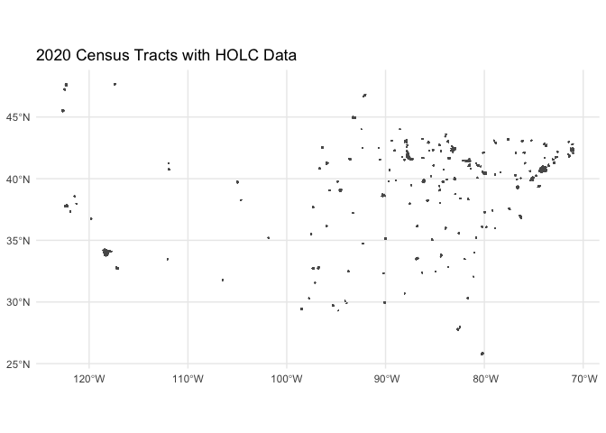

Historic Redlining
================

## Philadelphia example

The Census Home Owners’ Loan Corporation (HOLC) dataset, available on
GitHub, is a valuable resource containing historical data about the
process of redlining in the United States. Redlining is a discriminatory
practice that involves denying loans or insurance to people living in
specific neighborhoods, often based on race or ethnicity. The dataset
provides details on the HOLC risk classifications, neighborhood
boundaries, and descriptions for over 200 cities across the United
States from the 1930s.

Historic redlining data refers to data from the Home Owners’ Loan
Corporation (HOLC) that created residential security maps in the 1930s,
which contributed to racial segregation and disinvestment in minority
neighborhoods. One popular source for this data is the Mapping
Inequality project (https://dsl.richmond.edu/panorama/redlining/).

In this example, we’ll download historic redlining data for Philadelphia
in the form of a GeoJSON file and analyze the data in R and Python.

R: In R, we’ll use the ‘sf’ and ‘dplyr’ packages to read and process the
GeoJSON data.

R code:

``` r
# Install and load necessary libraries]
library(knitr)
library(sf)
library(dplyr)

# Download historic redlining data for Philadelphia
url <- "https://dsl.richmond.edu/panorama/redlining/static/downloads/geojson/PAPhiladelphia1937.geojson"
philly_geojson <- read_sf(url)

# Count the number of areas per HOLC grade
grade_counts <- philly_geojson %>%
  group_by(holc_grade) %>%
  summarize(count = n())

kable(head(philly_geojson))
```

| name | holc_id | holc_grade | area_description_data                                                                                                                                                                                                                                                                                                                                                                                                                                                                                                                                                                                                                                                                                                                                                                                                                                                                                                                                                                                                                                                                                            | geometry                     |
|:-----|:--------|:-----------|:-----------------------------------------------------------------------------------------------------------------------------------------------------------------------------------------------------------------------------------------------------------------------------------------------------------------------------------------------------------------------------------------------------------------------------------------------------------------------------------------------------------------------------------------------------------------------------------------------------------------------------------------------------------------------------------------------------------------------------------------------------------------------------------------------------------------------------------------------------------------------------------------------------------------------------------------------------------------------------------------------------------------------------------------------------------------------------------------------------------------|:-----------------------------|
| NA   | A1      | A          | { “1”: “Sub Phila A 1”, “2”: “Rolling”, “3”: “Highly desirable, well restricted residential area.”, “4”: “No sewers.”, “7”: ” 1934-36 55 very few rentals June 1937 \$8,600-100,000 70 “,”13”: “upward”, “14”: “\$15,000-25,000 houses predominate”, “15”: “David C. Snyder June 11 7”, “10a”: “good”, “10b”: “few units”, “10c”: ““,”11a”: “singles \$15000-\$20000”, “11b”: “30-40 houses”, “12a”: “yes”, “12b”: “yes”, “5a”: “Execs. - Professional”, “5b”: “over \$5,000”, “5c”: “None”, “5d”: “No”, “5e”: “desirables”, “5f”: “no”, “5g”: “slowly”, “6a”: “single detached”, “6b”: “stone-brick”, “6c”: “1-15”, “6d”: “good”, “8a”: “50”, “8b”: “95”, “8c”: “over 80”, “9a”: “fair”, “9b”: “singles \$10,000”, “9c”: “fair” }                                                                                                                                                                                                                                                                                                                                                                               | MULTIPOLYGON (((-75.12338 4… |
| NA   | A2      | A          | { “1”: “Sub. Phila. Elkins Park A 2”, “2”: “Rolling”, “3”: “Good transportation - desirable residential area of good character.”, “4”: “None”, “7”: “10,000-up \$20,000 150 1934-46 6500-up 12,000 60 75 50 June 1937 \$7,500-up 15,000 75 100 67”, “13”: “static to upward”, “14”: “Many residents of Elkin Park commute to New York City.”, “15”: “David C. Snyder June 11, 7”, “10a”: “good”, “10b”: “anything”, “10c”: “good”, “11a”: “Singles \$12,000-\$15,000”, “11b”: “50 houses”, “12a”: “yes”, “12b”: “yes”, “5a”: “Execs - Professional”, “5b”: “over \$5,000”, “5c”: “no”, “5d”: “no”, “5e”: “desirables”, “5f”: “no”, “5g”: “slowly”, “6a”: “single- twins”, “6b”: “stone-brick-frame”, “6c”: “25 yrs.”, “6d”: “good”, “8a”: “60”, “8b”: “100”, “8c”: “over 80”, “9a”: “good”, “9b”: “Single \$13,000-15,000”, “9c”: “good” }                                                                                                                                                                                                                                                                       | MULTIPOLYGON (((-75.12882 4… |
| NA   | A3      | A          | { “1”: “Philadelphia A 3”, “2”: “Rolling-level”, “3”: “Direct rail transportation- Homogeneous development of desirable residential area.”, “4”: “No”, “7”: ” very few rental units 1933-34 June 1937 \$8000.- \$25,000 “,”13”: “upward”, “14”: “Property around R.R. station not quite as high grade. Singles average \$20,000, Twins average \$10,000. High grade area recently developed. Not quite as accessible as west Germantown section.”, “15”: “Doherty June 3 7”, “10a”: “good”, “10b”: “limited number of units \$10,000-\$20,000”, “10c”: ““,”11a”: “Twins & singles”, “11b”: “100 houses”, “12a”: “yes”, “12b”: “yes”, “5a”: “Junior Executives- Professional men”, “5b”: “\$3000.-\$10,000”, “5c”: “no”, “5d”: “no”, “5e”: “no”, “5f”: “no”, “5g”: “moderately”, “6a”: “twins-singles”, “6b”: “stone & brick”, “6c”: “1-20 yrs.”, “6d”: “good”, “8a”: ““,”8b”: ““,”8c”: “over 80”, “9a”: “good”, “9b”: “for new houses \$10,000 twins”, “9c”: “good” }                                                                                                                                            | MULTIPOLYGON (((-75.17329 4… |
| NA   | A4      | A          | { “1”: “Philadelphia A 4”, “2”: “Rolling”, “3”: “The finest residential section in the city. Very good schools- Near parks- electrified train transportation.”, “4”: “None”, “7”: “\$15,000- up \$40,000 \$100.00 \$150.00 1933-34 \$8,000- \$20,000 50% \$65.00 \$80.00 55% June 1937 \$10,000-\$100,000 25,000 60-65% \$75.-\$200. \$100.00 65%”, “13”: “static to upward”, “14”: “Shifting of population. People moving further out. Southern end of section has the smaller houses. Buyers still looking for bargains. Practically all available land is held at \$20,000 an acre. Direct roads to center of city. Many large estates in this section.”, “15”: “Doherty June 3 7”, “10a”: “good”, “10b”: “everything”, “10c”: “fair”, “11a”: “single detached”, “11b”: “25 units”, “12a”: “yes”, “12b”: “yes”, “5a”: “Executives- Professional men”, “5b”: “over \$6000.”, “5c”: “no”, “5d”: “no”, “5e”: “no”, “5f”: “no”, “5g”: “slowly”, “6a”: “One family detached”, “6b”: “stone”, “6c”: “1-20 yrs.”, “6d”: “very good”, “8a”: “80”, “8b”: “100”, “8c”: “over 80”, “9a”: “fair”, “9b”: ““,”9c”: “fair” } | MULTIPOLYGON (((-75.19831 4… |
| NA   | A5      | A          | { “1”: “Philadelphia A 5”, “2”: “Rolling”, “3”: “Good transportation- very desirable residential section- well restricted- wooded section”, “4”: “None”, “7”: “\$10,000.00 \$30,000 \$70 \$100 1933-34 \$5,000 \$12,000 40% \$40 \$60 60% June 1937 \$6,000-\$50,000 \$15,000 50% \$50-\$200 \$75 75%”, “13”: “static”, “14”: “German American population- Broad St. properties are not typical of section as a whole. Section is very desirable, but danger of Jewish encroachment is imminent. A fair first grade section.”, “15”: “H.B. Wilson June 14 7”, “10a”: “good”, “10b”: “anything”, “10c”: “good”, “11a”: “stone singles \$12,500”, “11b”: “10-12 units”, “12a”: “yes”, “12b”: “yes”, “5a”: “White collar class”, “5b”: “\$5000. & up”, “5c”: “none”, “5d”: “no”, “5e”: “desirables”, “5f”: “none”, “5g”: “slowly”, “6a”: “single- twins”, “6b”: “brick & stone”, “6c”: “1-20 yrs.”, “6d”: “good”, “8a”: “95”, “8b”: “100”, “8c”: “80”, “9a”: “fair”, “9b”: “single & twins \$9000”, “9c”: “fair” }                                                                                                  | MULTIPOLYGON (((-75.1281 40… |
| NA   | A6      | A          | { “1”: “Philadelphia A 6”, “2”: “Level”, “3”: “Desirable industrial section- good transportation. Thrifty class of populace- 2 perks in section.”, “4”: “No”, “7”: “\$4200.-\$8500. \$6,500.00 \$35.-\$65. \$50.00 1933-34 \$2500.-\$4500. \$3,500.00 55% \$25.-\$40 \$32.00 15% June 1937 \$3000.-\$6000. \$4,500.00 70% \$28.-\$50. \$40.00 80%”, “13”: “Static to upward”, “14”: “Most of building in eastern end. High type inhabitants. A fair first grade section.”, “15”: “H.B. Wilson June 14 7”, “10a”: “good”, “10b”: “2 story row- \$40.”, “10c”: “good”, “11a”: “2 story row \$4500.”, “11b”: “100-125 units”, “12a”: “yes”, “12b”: “yes”, “5a”: “White collar-skilled mechanics”, “5b”: “\$1500- \$3000”, “5c”: “nominal”, “5d”: “no”, “5e”: “desirable”, “5f”: “small”, “5g”: “slowly”, “6a”: “2 story row”, “6b”: “brick”, “6c”: “1-25 yrs.”, “6d”: “good”, “8a”: “75”, “8b”: “100”, “8c”: “75”, “9a”: “good”, “9b”: “2 story row-\$4000-\$4500.”, “9c”: “fair” }                                                                                                                                 | MULTIPOLYGON (((-75.11494 4… |

``` r
plot(grade_counts)
```


Python: In Python, we’ll use the ‘geopandas’ library to read and process
the GeoJSON data.

Python code:

``` python
# Install necessary libraries


import geopandas as gpd

# Download historic redlining data for Philadelphia
url = "https://dsl.richmond.edu/panorama/redlining/static/downloads/geojson/PAPhiladelphia1937.geojson"
philly_geojson = gpd.read_file(url)

# Count the number of areas per HOLC grade
grade_counts = philly_geojson["holc_grade"].value_counts()
print(grade_counts)
```

    B    28
    D    26
    C    18
    A    10
    Name: holc_grade, dtype: int64

In conclusion, both R and Python offer efficient ways to download and
process historic redlining data in the form of GeoJSON files. The ‘sf’
package in R provides a simple way to read and manipulate spatial data,
while the ‘geopandas’ library in Python offers similar functionality.
The ‘dplyr’ package in R can be used for data manipulation and analysis,
and Python’s built-in functions like value_counts() can be used for
aggregating data. Depending on your preferred programming language and
environment, both options can be effective for working with historic
redlining data.

## Per census track

Downloading and plotting the dataset in R:

R code:

``` r
# Load libraries
library(sf)
library(ggplot2)

# Download the dataset
url <- "https://raw.githubusercontent.com/americanpanorama/Census_HOLC_Research/main/2020_Census_Tracts/Tracts_2020_HOLC.geojson"
holc_data <- st_read(url)
```

    Reading layer `Tracts_2020_HOLC' from data source 
      `https://raw.githubusercontent.com/americanpanorama/Census_HOLC_Research/main/2020_Census_Tracts/Tracts_2020_HOLC.geojson' 
      using driver `GeoJSON'
    Simple feature collection with 42074 features and 9 fields
    Geometry type: MULTIPOLYGON
    Dimension:     XY
    Bounding box:  xmin: -122.7675 ymin: 25.70537 xmax: -70.94938 ymax: 47.72251
    Geodetic CRS:  WGS 84

``` r
kable(head(holc_data))
```

| OBJECTID | GISJOIN        | neighborho |  SUM_Perc | FIRST_holc_grade | MAX_state | MAX_city   | Shape_Length | Shape_Area | geometry                     |
|---------:|:---------------|-----------:|----------:|:-----------------|:----------|:-----------|-------------:|-----------:|:-----------------------------|
|        1 | G0100730000100 |        180 | 0.0929688 | D                | AL        | Birmingham |     3336.386 |   709582.0 | MULTIPOLYGON (((-86.71213 3… |
|        2 | G0100730000100 |        181 | 0.1616926 | D                | AL        | Birmingham |     7731.381 |  1234059.9 | MULTIPOLYGON (((-86.72188 3… |
|        3 | G0100730000100 |        182 | 0.1703257 | D                | AL        | Birmingham |     6111.241 |  1300062.3 | MULTIPOLYGON (((-86.72644 3… |
|        4 | G0100730000100 |        185 | 0.2582595 | C                | AL        | Birmingham |     7905.510 |  1971178.6 | MULTIPOLYGON (((-86.71611 3… |
|        5 | G0100730000100 |        187 | 0.0419889 | B                | AL        | Birmingham |     3422.128 |   320481.6 | MULTIPOLYGON (((-86.70262 3… |
|        6 | G0100730000300 |        182 | 0.8398497 | D                | AL        | Birmingham |     6759.741 |  1745630.8 | MULTIPOLYGON (((-86.73525 3… |

``` r
# Plot the data
ggplot() +
  geom_sf(data = holc_data) +
  theme_minimal() +
  ggtitle("2020 Census Tracts with HOLC Data")
```



Downloading and plotting the dataset in Python:

Python code:

``` python
# Import libraries
import geopandas as gpd

# Download the dataset
url = "https://raw.githubusercontent.com/americanpanorama/Census_HOLC_Research/main/2020_Census_Tracts/Tracts_2020_HOLC.geojson"
holc_data = gpd.read_file(url)

# Display the data as a table
print(holc_data)

# Plot the data
holc_data.plot()
plot.title("2020 Census Tracts with HOLC Data")
plot.show()
```

In both R and Python, the code downloads the dataset, reads the
Shapefile, and plots the data using ggplot2 in R and geopandas in
Python. Make sure to install the necessary packages before running the
code.
