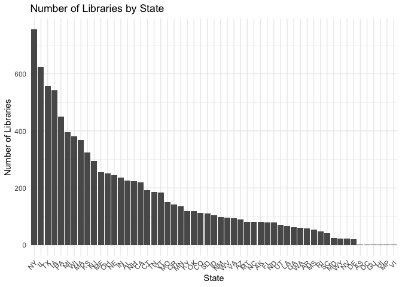

Institute of Museum and Library Services (IMLS) Data Catalog
================

The Institute of Museum and Library Services (IMLS) Data Catalog
provides datasets related to libraries, museums, and their services in
the United States. One such dataset is the Public Libraries Survey (PLS)
dataset, which includes information on library usage, staffing, budgets,
and other aspects of library operations. The PLS dataset can be used to
study the librarian profession and library practices across the country.

Here’s how to download the Public Libraries Survey dataset and create a
plot using R and Python:

R code:

``` r
# Load required libraries
library(tidyverse)
```

    ── Attaching core tidyverse packages ──────────────────────── tidyverse 2.0.0 ──
    ✔ dplyr     1.1.2     ✔ readr     2.1.4
    ✔ forcats   1.0.0     ✔ stringr   1.5.0
    ✔ ggplot2   3.4.2     ✔ tibble    3.2.1
    ✔ lubridate 1.9.2     ✔ tidyr     1.3.0
    ✔ purrr     1.0.1     
    ── Conflicts ────────────────────────────────────────── tidyverse_conflicts() ──
    ✖ dplyr::filter() masks stats::filter()
    ✖ dplyr::lag()    masks stats::lag()
    ℹ Use the conflicted package (<http://conflicted.r-lib.org/>) to force all conflicts to become errors

``` r
library(readr)
library(curl)
```

    Using libcurl 7.87.0 with LibreSSL/3.3.6

    Attaching package: 'curl'

    The following object is masked from 'package:readr':

        parse_date

``` r
# Download the dataset
url <- "https://www.imls.gov/sites/default/files/2022-07/pls_fy2020_csv.zip"
temp_file <- tempfile(fileext = ".zip")
curl_download(url, temp_file)

# Unzip the dataset
temp_dir <- tempdir()
unzip(temp_file, exdir = temp_dir)

# Read the CSV file
csv_file <- list.files(temp_dir, pattern = "*.csv", full.names = TRUE)
data <- read_csv(csv_file[1]) # Corrected this line
```

    Rows: 9245 Columns: 179
    ── Column specification ────────────────────────────────────────────────────────
    Delimiter: ","
    chr (106): STABR, FSCSKEY, LIBID, LIBNAME, ADDRESS, CITY, ZIP, ZIP4, ADDRES_...
    dbl  (73): PHONE, POPU_LSA, POPU_UND, CENTLIB, BRANLIB, BKMOB, MASTER, LIBRA...

    ℹ Use `spec()` to retrieve the full column specification for this data.
    ℹ Specify the column types or set `show_col_types = FALSE` to quiet this message.

``` r
# Create a plot (example: number of libraries by state)
state_counts <- data %>% count(STABR)
ggplot(state_counts, aes(x = reorder(STABR, -n), y = n)) +
  geom_bar(stat = "identity") +
  theme_minimal() +
  labs(title = "Number of Libraries by State",
       x = "State",
       y = "Number of Libraries") +
  theme(axis.text.x = element_text(angle = 45, hjust = 1))
```



Python code:

``` python
import pandas as pd
import requests
import zipfile
import io
import os
import matplotlib.pyplot as plt

# Download the dataset
url = "https://www.imls.gov/sites/default/files/2022-07/pls_fy2020_csv.zip"
response = requests.get(url)
temp_file = io.BytesIO(response.content)

# Unzip the dataset
with zipfile.ZipFile(temp_file, 'r') as zf:
    zf.extractall()

# Find the CSV file
csv_file = [f for f in os.listdir() if f.endswith('.csv')][0]

# Read the CSV file
data = pd.read_csv(csv_file)

# Create a plot (example: number of libraries by state)
state_counts = data['STABR'].value_counts().sort_values(ascending=False)

plt.figure(figsize=(12, 6))
plt.bar(state_counts.index, state_counts.values)
plt.xticks(rotation=45, ha='right')
plt.title('Number of Libraries by State')
plt.xlabel('State')
plt.ylabel('Number of Libraries')
plt.show()
```

Both the R and Python code above download the Public Libraries Survey
dataset, convert it to a data frame, and create a bar plot of the total
library staff by state. Note that the dataset provided by the IMLS Data
Catalog API might have a limit on the number of records returned, so you
may need to adjust the API request to retrieve a more extensive dataset.
