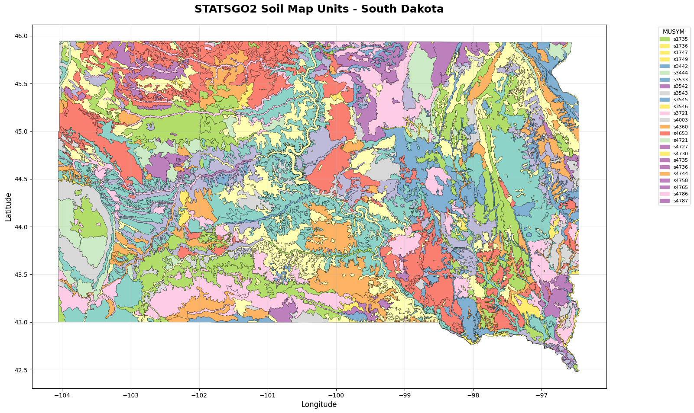

## Tutorial: Exploring Soil Data from the NRCS Web Soil Survey (WSS)

This notebook demonstrates how to download, extract, and visualize soil data from the Natural Resources Conservation Service (NRCS) Web Soil Survey (WSS). We will focus on the STATSGO2 dataset for South Dakota.

The Web Soil Survey (WSS) is a valuable resource for accessing soil data and information compiled by the National Cooperative Soil Survey.

Here are the links to the data we will be using:

*   **Link to Data:** https://websoilsurvey.sc.egov.usda.gov/DSD/Download/Cache/STATSGO2/wss_gsmsoil_SD_[2016-10-13].zip
*   **Description of Data:** https://www.nrcs.usda.gov/sites/default/files/2022-08/SSURGO-Metadata-Table-Column-Descriptions-Report.pdf

The data is provided as a zip file containing spatial data (shapefiles) and tabular data (text files).

### Installing dependencies

We need to install the necessary Python libraries to work with spatial data and dataframes. We will use `pandas` for data manipulation, `geopandas` for working with geospatial data, and `matplotlib` for plotting.


```python
# uncomment the following code
#!pip install pandas==2.2.2 geopandas==0.14.3 fiona==1.9.6 matplotlib==3.8.4 requests==2.32.3 seaborn==0.13.2
```

    Requirement already satisfied: pandas==2.2.2 in /usr/local/lib/python3.11/dist-packages (2.2.2)
    Requirement already satisfied: geopandas==0.14.3 in /usr/local/lib/python3.11/dist-packages (0.14.3)
    Requirement already satisfied: fiona==1.9.6 in /usr/local/lib/python3.11/dist-packages (1.9.6)
    Requirement already satisfied: matplotlib==3.8.4 in /usr/local/lib/python3.11/dist-packages (3.8.4)
    Requirement already satisfied: requests==2.32.3 in /usr/local/lib/python3.11/dist-packages (2.32.3)
    Requirement already satisfied: seaborn==0.13.2 in /usr/local/lib/python3.11/dist-packages (0.13.2)
    Requirement already satisfied: numpy>=1.23.2 in /usr/local/lib/python3.11/dist-packages (from pandas==2.2.2) (2.0.2)
    Requirement already satisfied: python-dateutil>=2.8.2 in /usr/local/lib/python3.11/dist-packages (from pandas==2.2.2) (2.9.0.post0)
    Requirement already satisfied: pytz>=2020.1 in /usr/local/lib/python3.11/dist-packages (from pandas==2.2.2) (2025.2)
    Requirement already satisfied: tzdata>=2022.7 in /usr/local/lib/python3.11/dist-packages (from pandas==2.2.2) (2025.2)
    Requirement already satisfied: packaging in /usr/local/lib/python3.11/dist-packages (from geopandas==0.14.3) (24.2)
    Requirement already satisfied: pyproj>=3.3.0 in /usr/local/lib/python3.11/dist-packages (from geopandas==0.14.3) (3.7.1)
    Requirement already satisfied: shapely>=1.8.0 in /usr/local/lib/python3.11/dist-packages (from geopandas==0.14.3) (2.1.1)
    Requirement already satisfied: attrs>=19.2.0 in /usr/local/lib/python3.11/dist-packages (from fiona==1.9.6) (25.3.0)
    Requirement already satisfied: certifi in /usr/local/lib/python3.11/dist-packages (from fiona==1.9.6) (2025.7.9)
    Requirement already satisfied: click~=8.0 in /usr/local/lib/python3.11/dist-packages (from fiona==1.9.6) (8.2.1)
    Requirement already satisfied: click-plugins>=1.0 in /usr/local/lib/python3.11/dist-packages (from fiona==1.9.6) (1.1.1.2)
    Requirement already satisfied: cligj>=0.5 in /usr/local/lib/python3.11/dist-packages (from fiona==1.9.6) (0.7.2)
    Requirement already satisfied: six in /usr/local/lib/python3.11/dist-packages (from fiona==1.9.6) (1.17.0)
    Requirement already satisfied: contourpy>=1.0.1 in /usr/local/lib/python3.11/dist-packages (from matplotlib==3.8.4) (1.3.2)
    Requirement already satisfied: cycler>=0.10 in /usr/local/lib/python3.11/dist-packages (from matplotlib==3.8.4) (0.12.1)
    Requirement already satisfied: fonttools>=4.22.0 in /usr/local/lib/python3.11/dist-packages (from matplotlib==3.8.4) (4.58.5)
    Requirement already satisfied: kiwisolver>=1.3.1 in /usr/local/lib/python3.11/dist-packages (from matplotlib==3.8.4) (1.4.8)
    Requirement already satisfied: pillow>=8 in /usr/local/lib/python3.11/dist-packages (from matplotlib==3.8.4) (11.2.1)
    Requirement already satisfied: pyparsing>=2.3.1 in /usr/local/lib/python3.11/dist-packages (from matplotlib==3.8.4) (3.2.3)
    Requirement already satisfied: charset-normalizer<4,>=2 in /usr/local/lib/python3.11/dist-packages (from requests==2.32.3) (3.4.2)
    Requirement already satisfied: idna<4,>=2.5 in /usr/local/lib/python3.11/dist-packages (from requests==2.32.3) (3.10)
    Requirement already satisfied: urllib3<3,>=1.21.1 in /usr/local/lib/python3.11/dist-packages (from requests==2.32.3) (2.4.0)


### Import packages

Now, let's import the necessary libraries into our notebook.


```python
import os
import zipfile
import pandas as pd
import geopandas as gpd
import matplotlib.pyplot as plt
import requests
import numpy as np
import matplotlib.patches as mpatches
import seaborn as sns
from IPython.display import display
import matplotlib as mpl
```

## Read in Data from WSS

We will now download the data from the Web Soil Survey.

Set the URL of the zip file and the desired local path for the downloaded file and the extraction directory.


```python
url = "https://websoilsurvey.sc.egov.usda.gov/DSD/Download/Cache/STATSGO2/wss_gsmsoil_SD_[2016-10-13].zip"
zip_path = "wss_gsmsoil_SD.zip"
extract_dir = "soil_data_sd"
```

Display the paths to confirm they are set correctly.


```python
print(f"Downloading from: {url}")
print(f"Local zip file: {zip_path}")
print(f"Extract directory: {extract_dir}")
```

    Downloading from: https://websoilsurvey.sc.egov.usda.gov/DSD/Download/Cache/STATSGO2/wss_gsmsoil_SD_[2016-10-13].zip
    Local zip file: wss_gsmsoil_SD.zip
    Extract directory: soil_data_sd


Download the zip file from the specified URL.


```python
print("Downloading zip file...")

response = requests.get(url, stream=True)

with open(zip_path, 'wb') as f:
    for chunk in response.iter_content(chunk_size=8192):
        f.write(chunk)

print(f" Downloaded: {zip_path}")
```

    Downloading zip file...
     Downloaded: wss_gsmsoil_SD.zip


Extract the contents of the downloaded zip file to the specified directory.


```python
print(f"\nExtracting to: {extract_dir}")

with zipfile.ZipFile(zip_path, 'r') as zip_ref:
    zip_ref.extractall(extract_dir)
print("Extraction complete")
```

    
    Extracting to: soil_data_sd
    ✅ Extraction complete


List the files within the extracted directory to see the dataset structure.


```python
print("\nFiles in extracted directory:")
print("-" * 40)
for root, dirs, files in os.walk(extract_dir):
    for file in files:
        file_path = os.path.join(root, file)
        rel_path = os.path.relpath(file_path, extract_dir)
        print(f"  {rel_path}")
```

    
    Files in extracted directory:
    ----------------------------------------
      wss_gsmsoil_SD_[2016-10-13]/soil_metadata_us.txt
      wss_gsmsoil_SD_[2016-10-13]/readme.txt
      wss_gsmsoil_SD_[2016-10-13]/soildb_US_2003.mdb
      wss_gsmsoil_SD_[2016-10-13]/soil_metadata_us.xml
      wss_gsmsoil_SD_[2016-10-13]/spatial/gsmsoilmu_a_sd.dbf
      wss_gsmsoil_SD_[2016-10-13]/spatial/version.txt
      wss_gsmsoil_SD_[2016-10-13]/spatial/gsmsoilmu_a_sd.shp
      wss_gsmsoil_SD_[2016-10-13]/spatial/gsmsoilmu_a_sd.prj
      wss_gsmsoil_SD_[2016-10-13]/spatial/gsmsoilmu_a_sd.shx
      wss_gsmsoil_SD_[2016-10-13]/tabular/chstrgrp.txt
      wss_gsmsoil_SD_[2016-10-13]/tabular/mstab.txt
      wss_gsmsoil_SD_[2016-10-13]/tabular/sdvattribute.txt
      wss_gsmsoil_SD_[2016-10-13]/tabular/cfprod.txt
      wss_gsmsoil_SD_[2016-10-13]/tabular/cpmat.txt
      wss_gsmsoil_SD_[2016-10-13]/tabular/ctxfmoth.txt
      wss_gsmsoil_SD_[2016-10-13]/tabular/msrsdet.txt
      wss_gsmsoil_SD_[2016-10-13]/tabular/csmoist.txt
      wss_gsmsoil_SD_[2016-10-13]/tabular/chfrags.txt
      wss_gsmsoil_SD_[2016-10-13]/tabular/cerosnac.txt
      wss_gsmsoil_SD_[2016-10-13]/tabular/cstemp.txt
      wss_gsmsoil_SD_[2016-10-13]/tabular/sainterp.txt
      wss_gsmsoil_SD_[2016-10-13]/tabular/csmorhpp.txt
      wss_gsmsoil_SD_[2016-10-13]/tabular/version.txt
      wss_gsmsoil_SD_[2016-10-13]/tabular/chaashto.txt
      wss_gsmsoil_SD_[2016-10-13]/tabular/muareao.txt
      wss_gsmsoil_SD_[2016-10-13]/tabular/csfrags.txt
      wss_gsmsoil_SD_[2016-10-13]/tabular/sdvfolder.txt
      wss_gsmsoil_SD_[2016-10-13]/tabular/cpwndbrk.txt
      wss_gsmsoil_SD_[2016-10-13]/tabular/ltext.txt
      wss_gsmsoil_SD_[2016-10-13]/tabular/csmorgc.txt
      wss_gsmsoil_SD_[2016-10-13]/tabular/crstrcts.txt
      wss_gsmsoil_SD_[2016-10-13]/tabular/chydcrit.txt
      wss_gsmsoil_SD_[2016-10-13]/tabular/chtexmod.txt
      wss_gsmsoil_SD_[2016-10-13]/tabular/ceplants.txt
      wss_gsmsoil_SD_[2016-10-13]/tabular/mucrpyd.txt
      wss_gsmsoil_SD_[2016-10-13]/tabular/sacatlog.txt
      wss_gsmsoil_SD_[2016-10-13]/tabular/mstabcol.txt
      wss_gsmsoil_SD_[2016-10-13]/tabular/chtextur.txt
      wss_gsmsoil_SD_[2016-10-13]/tabular/chunifie.txt
      wss_gsmsoil_SD_[2016-10-13]/tabular/ctxmoicl.txt
      wss_gsmsoil_SD_[2016-10-13]/tabular/chdsuffx.txt
      wss_gsmsoil_SD_[2016-10-13]/tabular/chtexgrp.txt
      wss_gsmsoil_SD_[2016-10-13]/tabular/sdvfolderattribute.txt
      wss_gsmsoil_SD_[2016-10-13]/tabular/ctext.txt
      wss_gsmsoil_SD_[2016-10-13]/tabular/cinterp.txt
      wss_gsmsoil_SD_[2016-10-13]/tabular/chconsis.txt
      wss_gsmsoil_SD_[2016-10-13]/tabular/distlmd.txt
      wss_gsmsoil_SD_[2016-10-13]/tabular/cecoclas.txt
      wss_gsmsoil_SD_[2016-10-13]/tabular/ccancov.txt
      wss_gsmsoil_SD_[2016-10-13]/tabular/comp.txt
      wss_gsmsoil_SD_[2016-10-13]/tabular/chstr.txt
      wss_gsmsoil_SD_[2016-10-13]/tabular/muaggatt.txt
      wss_gsmsoil_SD_[2016-10-13]/tabular/msidxmas.txt
      wss_gsmsoil_SD_[2016-10-13]/tabular/csmormr.txt
      wss_gsmsoil_SD_[2016-10-13]/tabular/distimd.txt
      wss_gsmsoil_SD_[2016-10-13]/tabular/lareao.txt
      wss_gsmsoil_SD_[2016-10-13]/tabular/csmorss.txt
      wss_gsmsoil_SD_[2016-10-13]/tabular/msidxdet.txt
      wss_gsmsoil_SD_[2016-10-13]/tabular/cfprodo.txt
      wss_gsmsoil_SD_[2016-10-13]/tabular/legend.txt
      wss_gsmsoil_SD_[2016-10-13]/tabular/msrsmas.txt
      wss_gsmsoil_SD_[2016-10-13]/tabular/ctreestm.txt
      wss_gsmsoil_SD_[2016-10-13]/tabular/ccrpyd.txt
      wss_gsmsoil_SD_[2016-10-13]/tabular/cgeomord.txt
      wss_gsmsoil_SD_[2016-10-13]/tabular/msdomdet.txt
      wss_gsmsoil_SD_[2016-10-13]/tabular/cpmatgrp.txt
      wss_gsmsoil_SD_[2016-10-13]/tabular/chpores.txt
      wss_gsmsoil_SD_[2016-10-13]/tabular/chorizon.txt
      wss_gsmsoil_SD_[2016-10-13]/tabular/msdommas.txt
      wss_gsmsoil_SD_[2016-10-13]/tabular/cmonth.txt
      wss_gsmsoil_SD_[2016-10-13]/tabular/distmd.txt
      wss_gsmsoil_SD_[2016-10-13]/tabular/sdvalgorithm.txt
      wss_gsmsoil_SD_[2016-10-13]/tabular/ctxfmmin.txt
      wss_gsmsoil_SD_[2016-10-13]/tabular/chtext.txt
      wss_gsmsoil_SD_[2016-10-13]/tabular/mutext.txt
      wss_gsmsoil_SD_[2016-10-13]/tabular/mapunit.txt
      wss_gsmsoil_SD_[2016-10-13]/tabular/cdfeat.txt


To get a little background on the files and data we can view the readme file


```python
# Umcomment the following code to see the readme
# readme_file_path = os.path.join(extract_dir, "wss_gsmsoil_SD_[2016-10-13]", "readme.txt")

# with open(readme_file_path, 'r') as f:
#     readme_content = f.read()
# print(readme_content)
```

    ********************************************************************************
    ****  Index
    ********************************************************************************
    
    Export Contents
    Export Types
          Area of Interest (AOI)
          SSURGO
          STATSGO2
    Unzipping Your Export
    Importing the Tabular Data into a SSURGO Template Database
          Why Import the Tabular Data into a SSURGO Template Database?
          Microsoft Access Version Considerations and Security Related Issues
                Trusted Locations
                Macro Settings
          Importing Tabular Data
    Spatial Data
          Spatial Data Format and Coordinate System
          Utilizing Soil Spatial Data
    Terminology
          Area of Interest (AOI)
          Soil Survey Area
          SSURGO Template Database
          SSURGO
          STATSGO2
    Obtaining Help
    
    ********************************************************************************
    ****  Export Contents
    ********************************************************************************
    
    This export includes the following U.S. General Soil Map data:
    
    Spatial extent:         South Dakota
    SSA symbol:             US
    SSA name:               United States
    SSA version:            3
    SSA version est.:       10/13/2016 12:28:22 PM
    Spatial format:         ESRI Shapefile
    Coordinate system:      Geographic Coordinate System (WGS84)
    
    This export also includes the following MS Access SSURGO template database:
    
    Template DB name:       soildb_US_2003.mdb
    Template DB version:    36
    Template DB state:      US
    MS Access version:      Access 2003
    
    
    ********************************************************************************
    ****  Export Types
    ********************************************************************************
    
    Three types of data exports are available.  See the "Terminology" section for 
    descriptions of "Area of Interest," "SSURGO," and "STATSGO2."
    
        ****************************************************************************
        ****  Area of Interest (AOI)
        ****************************************************************************
        
        The data in an Area of Interest export include the following for a 
        user-defined area of interest:
    
              Soil Tabular Data
              Map Unit Polygons (where available)
              Map Unit Lines (where available)
              Map Unit Points (where available)
              Special Feature Lines (where available)
              Special Feature Points (where available)
              Special Feature Descriptions (where available)
    		  Soil Thematic Map Data (where available)
    
        An AOI export can be downloaded from the "Your AOI (SSURGO)" section under 
        the "Download Soils Data" tab in the Web Soil Survey.
    
        The name of the export zip file will be in the form 
        wss_aoi_YYYY-MM-DD_HH-MM-SS.zip, e.g. wss_aoi_2012-09-24_12-59-37.zip.
    
        Note that the data for an Area of Interest is always SSURGO data.  
        Currently, the Web Soil Survey does not include an option to create an area 
        of interest for STATSGO2 data.
        
        ****************************************************************************
        ****  SSURGO
        ****************************************************************************
        
        The data in a SSURGO export include the following for a soil survey area:
    
              Soil Tabular Data
              Soil Survey Area Boundary Polygon
              Map Unit Polygons (where available)
              Map Unit Lines (where available)
              Map Unit Points (where available)
              Special Feature Lines (where available)
              Special Feature Points (where available)
              Special Feature Descriptions (where available)
    
        A SSURGO export can be downloaded from the "Soil Survey Area (SSURGO)" 
        section under the "Download Soils Data" tab in the Web Soil Survey.
    
        The export zip file will be named in the form soil_**###.zip, where ** is 
        a two character state or territory Federal Information Processing Standard 
        (FIPS) code, in uppercase, and ### is a three digit, zero-filled integer, 
        e.g. soil_NE079.zip.
        
        ****************************************************************************
        ****  STATSGO2
        ****************************************************************************
        
        The data included in a STATSGO2 export include the following:
    
              Soil Tabular Data
              Map Unit Polygons
    
        A STATSGO2 export can be downloaded from the "U.S. General Soil Map 
        (STATSGO2)" section under the "Download Soils Data" tab in the Web Soil 
        Survey.
    
        If data for the entire STATSGO2 coverage is downloaded, the export zip file 
        will be named gmsoil_us.zip.
    
        If data for only a single state is downloaded, the export zip file will be 
        named in the form gmsoil_**.zip, where ** is a two character state FIPS 
        code in lowercase, e.g. gmsoil_ne.zip.
    
    ********************************************************************************
    ****  Unzipping Your Export
    ********************************************************************************
    
    See the "Terminology" section for descriptions of a "Soil Survey Area" and a 
    "SSURGO template database."
    
    Each data export (see "Export Types" section) is provided in a single zip file.  
    The file unzips to a set of directories and files.  The following example is 
    typical (a copy of soil_metadata_*.txt and soil_metadata_*.xml will be present 
    for each SSURGO soil survey area included in an export):
    
          spatial (a directory)
          tabular (a directory)
    	  thematic (a directory, only present in AOI exports)
          readme.txt (an instance of this document)
          soil_metadata_*.txt
          soil_metadata_*.xml
          soildb_*.mdb (a conditionally present SSURGO template database)
    
    The spatial data files for your export, if any, will reside in a directory 
    named "spatial."
    
    The tabular data files for your export will reside in a directory named 
    "tabular."
    
    The thematic map data files for your export, if any, will reside in a directory 
    named "thematic."
    
    The readme.txt file is an instance of the file you are currently reading.  
    Except for the "Export Contents" section, this file is identical for all 
    exports.
    
    The soil_metadata_*.txt file contains Federal Geographic Data Committee (FGDC) 
    metadata (http://www.fgdc.gov/metadata) for each soil survey area, state, or 
    country for which data was included in your export.  The file is in text 
    (ASCII) format.  The "*" will be replaced by a soil survey area symbol 
    (e.g. "ne079"), "us," or a two character U.S. state FIPS code in lowercase.  
    Your export may include more than one of these files.
    
    The soil_metadata_*.xml file contains Federal Geographic Data Committee (FGDC) 
    metadata (http://www.fgdc.gov/metadata) for each soil survey area, state, or 
    country for which data was included in your export.  The file is in XML format. 
    The "*" will be replaced by either a soil survey area symbol (e.g. "ne079"), 
    "us," or a two character U.S. state FIPS code in lowercase.  Your export may 
    include more than one of these files.
    
    The soildb_*.mdb file is an instance of a SSURGO template database.  The "*" 
    will be replaced by either "US" or a two character state or territory FIPS code 
    in uppercase.  This file will be present unless you specifically requested an 
    export that doesn't include a SSURGO template database.
    
    ********************************************************************************
    ****  Importing the Tabular Data into a SSURGO Template Database
    ********************************************************************************
    
    See the "Terminology" section for a description of "SSURGO template database."
    
        ****************************************************************************
        ****  Why Import the Tabular Data into a SSURGO Template Database?
        ****************************************************************************
        
        The tabular data is exported as a set of files in "ASCII delimited" format. 
        These ASCII delimited files do not include column headers.  Typically, it 
        is not feasible to work with the tabular data in this format.  Instead, you 
        should import the data from these files into the accompanying SSURGO 
        template database. 
    
        Importing the data into a SSURGO template database establishes the proper 
        relationships between the various soil survey data entities.  It also 
        provides access to a number of prewritten reports that display related data 
        in a meaningful way and gives you the option to create your own queries and 
        reports.  Creating queries and reports requires additional knowledge by the 
        user.
        
        ****************************************************************************
        ****  Microsoft Access Version Considerations and Security Related Issues
        ****************************************************************************
        
        All SSURGO template databases are in Microsoft Access 2002/2003 format.  
        Although this doesn't prevent you from opening them in Access 2007 or 
        Access 2010, the default security settings for Access 2007 or 2010 may 
        initially prevent the macros in the template database from working.  If you 
        get a security warning when you open a SSURGO template database, e.g. a 
        warning that the database is read-only, you may need to change your 
        Microsoft Access security settings.
    
        To check and/or adjust your Microsoft Access security settings in Access 
        2007 or 2010, start Access, click the Office Button at the top left of the 
        Access window, and then click the button labeled "Access Options" at the 
        bottom of the form.  From the "Access Options" dialog, select 
        "Trust Center" from the options to the left, and then select the button 
        labeled "Trust Center Settings" to the right.
    
        After selecting "Trusted Center Settings," you can address a security issue 
        two different ways.  From the left side of the Trust Center dialog, select 
        "Trusted Locations" or "Macro Settings."
        
            ************************************************************************
            ****  Trusted Locations
            ************************************************************************
            
            You can move the SSURGO template database to an existing trusted 
            location (if a trusted location has already been created), or you can 
            add a new trusted location and move the SSURGO template database to 
            that new trusted location.
            
            ************************************************************************
            ****  Macro Settings
            ************************************************************************
            
            Selecting "Enable All Macros" will allow the macros in the SSURGO 
            template database to run, but not without hazard.  Note the associated 
            warning: "not recommended; potentially dangerous code can run."  The 
            SSURGO template database does not contain hazardous code, but other 
            databases might.
    
            If you have trouble using the SSURGO template database, see the 
            "Obtaining Help" section for information on how to contact the Soils 
            Hotline.
            
        ****************************************************************************
        ****  Importing Tabular Data
        ****************************************************************************
        
        When you open a SSURGO template database, the Import Form should display 
        automatically if there are no Microsoft Access security related issues.  
        To import the soil tabular data into the SSURGO template database, enter 
        the location of the "tabular" directory into the blank in the Import Form.  
        Use the fully qualified pathname to the "tabular" directory that you 
        unzipped from your export file.
    
        For example, if your export file was named wss_aoi_2012-09-24_12-59-37.zip 
        and you unzipped the file to C:\soildata\, the fully qualified pathname 
        would be C:\soildata\wss_aoi_2012-09-24_12-59-37\tabular.
    
        The pathname between C:\soildata\ and \tabular varies by export type.  It 
        also varies: 
    
              for Area of Interest exports by export date and time,
              for SSURGO exports by the selected soil survey area, and
              for STATSGO2 exports by your selection of data for the entire U.S. or
              for a single state.
    
        After entering the fully qualified pathname, click the "OK" button.  The 
        import process will start.  The duration of the import process depends on 
        the amount of data being imported.  Most imports take less than 5 minutes, 
        and many take less than 1 minute.  The import for STATSGO2 data for the 
        entire United States takes longer. 
    
        Once the import process completes, the Soil Reports Form should display.
    
    ********************************************************************************
    ****  Spatial Data
    ********************************************************************************
    
        ****************************************************************************
        ****  Spatial Data Format and Coordinate System
        ****************************************************************************
        
        All spatial data is provided in ESRI Shapefile format in WGS84 geographic 
        coordinates.
        
        ****************************************************************************
        ****  Utilizing Soil Spatial Data
        ****************************************************************************
        
        Utilizing soil spatial data without having access to Geographic Information 
        System (GIS) software is effectively impossible.  Even if you have access 
        to GIS software, relating the soil spatial data to the corresponding soil 
        tabular data can be complicated.
    
        For people who have access to supported versions of ESRI's ArcGIS software, 
        we provide a Windows client application that is capable of creating soil 
        thematic maps using ArcMap and the Windows client application.  The name of 
        the application is "Soil Data Viewer."  For additional information see 
        http://www.nrcs.usda.gov/wps/portal/nrcs/detailfull/soils/home/?cid=nrcs142p2_053620.
    
    	An AOI export may contain thematic map data from Web Soil Survey. Each 
    	thematic map (soil property or interpretation) that was created for the AOI 
    	generates a set of files in the "thematic" directory of the export. An 
    	experienced GIS user can join a ratings file from the export with the
    	mapunits in the spatial data to reproduce the colored thematic map.
    
    ********************************************************************************
    ****  Terminology
    ********************************************************************************
    
        ****************************************************************************
        ****  Area of Interest (AOI)
        ****************************************************************************
        
        In the Web Soil Survey, you can create an ad hoc "area of interest" by 
        using the navigation map and its associated tools.  You can pan and zoom to 
        a desired geographic location and then use the AOI drawing tools to 
        manually select an "area of interest."  An "area of interest" must be a 
        single polygon and the maximum area of that polygon (measured in acres) is 
        limited.
        
        ****************************************************************************
        ****  Soil Survey Area
        ****************************************************************************
        
        The SSURGO soil data for the U.S. and its territories are broken up into 
        over 3,000 soil survey areas.  A soil survey area commonly coincides with a 
        single county but may coincide with all or part of multiple counties and 
        may span more than one state.
    
        A soil survey area is identified by a "survey area symbol."  The symbol is 
        a two character state or territory FIPS code combined with a zero-filled, 
        three digit number.  For example, "NE079" is the survey area symbol for 
        Hall County, Nebraska.
    
        Although the STATSGO2 soil data is not partitioned into soil survey areas, 
        STATSGO2 soil data can be downloaded for a particular state or territory.
        
        ****************************************************************************
        ****  SSURGO Template Database
        ****************************************************************************
        
        A SSURGO template database is a Microsoft Access database in which the 
        tables and columns conform to the current SSURGO standard.  Exported soil 
        tabular data can be imported into a SSURGO template database.
    
        A SSURGO template database includes a number of prewritten reports that 
        display related data in a meaningful way.  You also have the option of 
        creating your own queries and reports in the database.  Creating queries 
        and reports requires additional knowledge.
    
        In addition to the national SSURGO template database, many state-specific 
        SSURGO template databases are available.  They typically include additional 
        state-specific reports.
    
        Whenever you export data from the Web Soil Survey, the most appropriate 
        SSURGO template database is automatically included.
        
        ****************************************************************************
        ****  SSURGO
        ****************************************************************************
        
        The SSURGO standard encompasses both tabular and spatial data.  SSURGO 
        spatial data duplicates the original soil survey maps.  This level of 
        mapping is designed for use by landowners and townships and for 
        county-based natural resource planning and management.  The original 
        mapping scales generally ranged from 1:12,000 to 1:63,360.  The original 
        maps from soil survey manuscripts were recompiled to scales of 1:12,000 or 
        1:24,000 for digitizing into the SSURGO format.  SSURGO is the most 
        detailed level of soil mapping published by the National Cooperative Soil 
        Survey.
        
        ****************************************************************************
        ****  STATSGO2
        ****************************************************************************
        
        The U.S. General Soil Map consists of general soil association units.  It 
        was developed by the National Cooperative Soil Survey and supersedes the 
        State Soil Geographic (STATSGO) dataset published in 1994.  STATSGO2 was 
        released in July 2006 and differs from the original STATSGO in that 
        individual state legends were merged into a single national legend, 
        line-join issues at state boundaries were resolved, and some attribute 
        updates and area updates were made.  STATSGO2 consists of a broad-based 
        inventory of soils and nonsoil areas that occur in a repeatable pattern on 
        the landscape and that can be cartographically shown at the scale used for 
        mapping (1:250,000 in the continental U.S., Hawaii, Puerto Rico, and the 
        Virgin Islands and 1:1,000,000 in Alaska).
    
        The same tabular data model is used by both SSURGO and STATSGO2.  STATSGO2, 
        however, does not include soil interpretations.  The "cointerp" table in 
        STATSGO2 will therefore always be empty.
    
    ********************************************************************************
    ****  Obtaining Help
    ********************************************************************************
    
    To learn about the capabilities of a SSURGO template database, open the 
    database, select the Microsoft Access "Reports" tab, and then double click the 
    report titled "How to Understand and Use this Database."
    
    If you require additional assistance, or have any questions whatsoever, please 
    contact the Soils Hotline (soilshotline@lin.usda.gov).
    
    


### Find shapefiles in the extracted directory

We are interested in the spatial data, which is typically stored in shapefiles (`.shp`). Let's find the shapefiles within the extracted data.

You can run the below code to find the shapefiles (`.shp`) or you can look throught the outputed information above for files ending in (`.shp`)


```python
shapefiles = []
for root, dirs, files in os.walk(extract_dir):
    for file in files:
        if file.endswith('.shp'):
            shapefiles.append(os.path.join(root, file))
print(f"Found {len(shapefiles)} shapefiles:")
for shp in shapefiles:
    print(f"  - {os.path.relpath(shp, extract_dir)}")
```

    Found 1 shapefiles:
      - wss_gsmsoil_SD_[2016-10-13]/spatial/gsmsoilmu_a_sd.shp


### Load the soil shapefile

The main soil data is usually contained in a shapefile with a name indicating the spatial extent (e.g., `gsmsoilmu_a_sd.shp` for South Dakota). We will load this shapefile into a GeoDataFrame using `geopandas`.


```python
main_shp = os.path.join(extract_dir, "wss_gsmsoil_SD_[2016-10-13]", "spatial", "gsmsoilmu_a_sd.shp")
gdf = gpd.read_file(main_shp)
```

### Examine the Data

Let's take a closer look at the data we loaded into the GeoDataFrame.

Display the first few rows of the GeoDataFrame to get a quick preview of the data.


```python
pd.set_option('display.max_columns', None)  #Show all columns
display(gdf.head(5))  # Show only the first 5 rows
```


  <div id="df-99767d89-ca2b-4672-ba6c-a0d81098ebae" class="colab-df-container">
    <div>
<style scoped>
    .dataframe tbody tr th:only-of-type {
        vertical-align: middle;
    }

    .dataframe tbody tr th {
        vertical-align: top;
    }

    .dataframe thead th {
        text-align: right;
    }
</style>
<table border="1" class="dataframe">
  <thead>
    <tr style="text-align: right;">
      <th></th>
      <th>AREASYMBOL</th>
      <th>SPATIALVER</th>
      <th>MUSYM</th>
      <th>MUKEY</th>
      <th>geometry</th>
    </tr>
  </thead>
  <tbody>
    <tr>
      <th>0</th>
      <td>US</td>
      <td>3</td>
      <td>s6871</td>
      <td>672359</td>
      <td>POLYGON ((-96.75075 43.50416, -96.75365 43.504...</td>
    </tr>
    <tr>
      <th>1</th>
      <td>US</td>
      <td>3</td>
      <td>s6793</td>
      <td>672281</td>
      <td>POLYGON ((-103.49977 43.32849, -103.50432 43.3...</td>
    </tr>
    <tr>
      <th>2</th>
      <td>US</td>
      <td>3</td>
      <td>s6792</td>
      <td>672280</td>
      <td>POLYGON ((-102.95403 44.33908, -102.95738 44.3...</td>
    </tr>
    <tr>
      <th>3</th>
      <td>US</td>
      <td>3</td>
      <td>s6792</td>
      <td>672280</td>
      <td>POLYGON ((-102.69247 44.36311, -102.69413 44.3...</td>
    </tr>
    <tr>
      <th>4</th>
      <td>US</td>
      <td>3</td>
      <td>s6861</td>
      <td>672349</td>
      <td>POLYGON ((-97.37897 42.86556, -97.38019 42.868...</td>
    </tr>
  </tbody>
</table>
</div>
    <div class="colab-df-buttons">

  <div class="colab-df-container">
    <button class="colab-df-convert" onclick="convertToInteractive('df-99767d89-ca2b-4672-ba6c-a0d81098ebae')"
            title="Convert this dataframe to an interactive table."
            style="display:none;">

  <svg xmlns="http://www.w3.org/2000/svg" height="24px" viewBox="0 -960 960 960">
    <path d="M120-120v-720h720v720H120Zm60-500h600v-160H180v160Zm220 220h160v-160H400v160Zm0 220h160v-160H400v160ZM180-400h160v-160H180v160Zm440 0h160v-160H620v160ZM180-180h160v-160H180v160Zm440 0h160v-160H620v160Z"/>
  </svg>
    </button>

  <style>
    .colab-df-container {
      display:flex;
      gap: 12px;
    }

    .colab-df-convert {
      background-color: #E8F0FE;
      border: none;
      border-radius: 50%;
      cursor: pointer;
      display: none;
      fill: #1967D2;
      height: 32px;
      padding: 0 0 0 0;
      width: 32px;
    }

    .colab-df-convert:hover {
      background-color: #E2EBFA;
      box-shadow: 0px 1px 2px rgba(60, 64, 67, 0.3), 0px 1px 3px 1px rgba(60, 64, 67, 0.15);
      fill: #174EA6;
    }

    .colab-df-buttons div {
      margin-bottom: 4px;
    }

    [theme=dark] .colab-df-convert {
      background-color: #3B4455;
      fill: #D2E3FC;
    }

    [theme=dark] .colab-df-convert:hover {
      background-color: #434B5C;
      box-shadow: 0px 1px 3px 1px rgba(0, 0, 0, 0.15);
      filter: drop-shadow(0px 1px 2px rgba(0, 0, 0, 0.3));
      fill: #FFFFFF;
    }
  </style>

    <script>
      const buttonEl =
        document.querySelector('#df-99767d89-ca2b-4672-ba6c-a0d81098ebae button.colab-df-convert');
      buttonEl.style.display =
        google.colab.kernel.accessAllowed ? 'block' : 'none';

      async function convertToInteractive(key) {
        const element = document.querySelector('#df-99767d89-ca2b-4672-ba6c-a0d81098ebae');
        const dataTable =
          await google.colab.kernel.invokeFunction('convertToInteractive',
                                                    [key], {});
        if (!dataTable) return;

        const docLinkHtml = 'Like what you see? Visit the ' +
          '<a target="_blank" href=https://colab.research.google.com/notebooks/data_table.ipynb>data table notebook</a>'
          + ' to learn more about interactive tables.';
        element.innerHTML = '';
        dataTable['output_type'] = 'display_data';
        await google.colab.output.renderOutput(dataTable, element);
        const docLink = document.createElement('div');
        docLink.innerHTML = docLinkHtml;
        element.appendChild(docLink);
      }
    </script>
  </div>


    <div id="df-82268efc-f720-46ec-add5-1119b2beddb6">
      <button class="colab-df-quickchart" onclick="quickchart('df-82268efc-f720-46ec-add5-1119b2beddb6')"
                title="Suggest charts"
                style="display:none;">

<svg xmlns="http://www.w3.org/2000/svg" height="24px"viewBox="0 0 24 24"
     width="24px">
    <g>
        <path d="M19 3H5c-1.1 0-2 .9-2 2v14c0 1.1.9 2 2 2h14c1.1 0 2-.9 2-2V5c0-1.1-.9-2-2-2zM9 17H7v-7h2v7zm4 0h-2V7h2v10zm4 0h-2v-4h2v4z"/>
    </g>
</svg>
      </button>

<style>
  .colab-df-quickchart {
      --bg-color: #E8F0FE;
      --fill-color: #1967D2;
      --hover-bg-color: #E2EBFA;
      --hover-fill-color: #174EA6;
      --disabled-fill-color: #AAA;
      --disabled-bg-color: #DDD;
  }

  [theme=dark] .colab-df-quickchart {
      --bg-color: #3B4455;
      --fill-color: #D2E3FC;
      --hover-bg-color: #434B5C;
      --hover-fill-color: #FFFFFF;
      --disabled-bg-color: #3B4455;
      --disabled-fill-color: #666;
  }

  .colab-df-quickchart {
    background-color: var(--bg-color);
    border: none;
    border-radius: 50%;
    cursor: pointer;
    display: none;
    fill: var(--fill-color);
    height: 32px;
    padding: 0;
    width: 32px;
  }

  .colab-df-quickchart:hover {
    background-color: var(--hover-bg-color);
    box-shadow: 0 1px 2px rgba(60, 64, 67, 0.3), 0 1px 3px 1px rgba(60, 64, 67, 0.15);
    fill: var(--button-hover-fill-color);
  }

  .colab-df-quickchart-complete:disabled,
  .colab-df-quickchart-complete:disabled:hover {
    background-color: var(--disabled-bg-color);
    fill: var(--disabled-fill-color);
    box-shadow: none;
  }

  .colab-df-spinner {
    border: 2px solid var(--fill-color);
    border-color: transparent;
    border-bottom-color: var(--fill-color);
    animation:
      spin 1s steps(1) infinite;
  }

  @keyframes spin {
    0% {
      border-color: transparent;
      border-bottom-color: var(--fill-color);
      border-left-color: var(--fill-color);
    }
    20% {
      border-color: transparent;
      border-left-color: var(--fill-color);
      border-top-color: var(--fill-color);
    }
    30% {
      border-color: transparent;
      border-left-color: var(--fill-color);
      border-top-color: var(--fill-color);
      border-right-color: var(--fill-color);
    }
    40% {
      border-color: transparent;
      border-right-color: var(--fill-color);
      border-top-color: var(--fill-color);
    }
    60% {
      border-color: transparent;
      border-right-color: var(--fill-color);
    }
    80% {
      border-color: transparent;
      border-right-color: var(--fill-color);
      border-bottom-color: var(--fill-color);
    }
    90% {
      border-color: transparent;
      border-bottom-color: var(--fill-color);
    }
  }
</style>

      <script>
        async function quickchart(key) {
          const quickchartButtonEl =
            document.querySelector('#' + key + ' button');
          quickchartButtonEl.disabled = true;  // To prevent multiple clicks.
          quickchartButtonEl.classList.add('colab-df-spinner');
          try {
            const charts = await google.colab.kernel.invokeFunction(
                'suggestCharts', [key], {});
          } catch (error) {
            console.error('Error during call to suggestCharts:', error);
          }
          quickchartButtonEl.classList.remove('colab-df-spinner');
          quickchartButtonEl.classList.add('colab-df-quickchart-complete');
        }
        (() => {
          let quickchartButtonEl =
            document.querySelector('#df-82268efc-f720-46ec-add5-1119b2beddb6 button');
          quickchartButtonEl.style.display =
            google.colab.kernel.accessAllowed ? 'block' : 'none';
        })();
      </script>
    </div>

    </div>
  </div>


We can look throught this description of the data: https://www.nrcs.usda.gov/sites/default/files/2022-08/SSURGO-Metadata-Table-Column-Descriptions-Report.pdf to find what each column means


### Visualize Soil Data

Let's create a basic map of the soil map units (`MUSYM`) in South Dakota.


```python
# Create the map
soil_column = "MUSYM"
fig, ax = plt.subplots(1, 1, figsize=(16, 12))

# Get unique soil types and create color map
unique_soils = gdf[soil_column].unique()
colors = plt.cm.Set3(np.linspace(0, 1, len(unique_soils)))
color_dict = dict(zip(unique_soils, colors))

# Plot soil polygons
gdf.plot(ax=ax, legend=False,
            color=[color_dict.get(x, 'gray') for x in gdf[soil_column]],
            edgecolor='black', linewidth=0.3)

# Customize the map
ax.set_title('STATSGO2 Soil Map Units - South Dakota',
            fontsize=18, fontweight='bold', pad=20)
ax.set_xlabel('Longitude', fontsize=12)
ax.set_ylabel('Latitude', fontsize=12)
ax.grid(True, alpha=0.3)

# Add legend (top 25 soil types)
legend_elements = [mpatches.Patch(color=color_dict[soil], label=soil)
                    for soil in sorted(unique_soils)[:25]]
ax.legend(handles=legend_elements, loc='upper right',
            bbox_to_anchor=(1.15, 1), fontsize=8, title=f'{soil_column}')

plt.tight_layout()
plt.show()
```


    

    


### Loading and Examining Tabular Data

In addition to the spatial data, the WSS provides tabular data with detailed soil properties. We'll load the `muaggatt.txt` file, which contains aggregated attribute data for the map units.

Since this file does not have a header row, we need to provide the column names manually. These names are based on the data description link provided earlier in the notebook.


```python
# Define the column names for muaggatt.csv (no headers in file)
columns = [
    "musym", "muname", "mustatus", "slopegraddcp", "slopegradwta", "brockdepmin",
    "wtdepannmin", "wtdepaprjunmin", "flodfreqdcd", "flodfreqmax", "pondfreqprs",
    "aws025wta", "aws050wta", "aws0100wta", "aws0150wta", "drclassdcd", "drclasswettest",
    "hydgrpdcd", "iccdcd", "iccdcdpct", "niccdcd", "niccdcdpct", "engdwobdcd",
    "engdwbdcd", "engdwbll", "engdwbml", "engstafdcd", "engstafll", "engstafml",
    "engsldcd", "engsldcp", "englrsdcd", "engcmssdcd", "engcmssmp", "urbrecptdcd",
    "urbrecptwta", "forpehrtdcp", "hydclprs", "awmmfpwwta", "mukey"
]

# Load the muaggatt.csv file (update the path if needed)
muaggatt_path = r"soil_data_sd/wss_gsmsoil_SD_[2016-10-13]/tabular/muaggatt.txt"  # or .txt if that's your file extension
df = pd.read_csv(muaggatt_path, sep="|", engine="python", header=None, names=columns, dtype=str)
```

Now that the data is loaded, let's inspect the first few rows and check the column names to ensure everything loaded correctly.


```python
# Show the first 5 rows of the DataFrame with all columns
print("First 5 rows of df with all columns:")
pd.set_option('display.max_columns', None)  #Show all columns
display(df.head(5))  # Show only the first 5 rows
```

    First 5 rows of df with all columns:


  <div id="df-d5d585dc-b962-4f7a-91b7-16d8caf17652" class="colab-df-container">
    <div>
<style scoped>
    .dataframe tbody tr th:only-of-type {
        vertical-align: middle;
    }

    .dataframe tbody tr th {
        vertical-align: top;
    }

    .dataframe thead th {
        text-align: right;
    }
</style>
<table border="1" class="dataframe">
  <thead>
    <tr style="text-align: right;">
      <th></th>
      <th>musym</th>
      <th>muname</th>
      <th>mustatus</th>
      <th>slopegraddcp</th>
      <th>slopegradwta</th>
      <th>brockdepmin</th>
      <th>wtdepannmin</th>
      <th>wtdepaprjunmin</th>
      <th>flodfreqdcd</th>
      <th>flodfreqmax</th>
      <th>pondfreqprs</th>
      <th>aws025wta</th>
      <th>aws050wta</th>
      <th>aws0100wta</th>
      <th>aws0150wta</th>
      <th>drclassdcd</th>
      <th>drclasswettest</th>
      <th>hydgrpdcd</th>
      <th>iccdcd</th>
      <th>iccdcdpct</th>
      <th>niccdcd</th>
      <th>niccdcdpct</th>
      <th>engdwobdcd</th>
      <th>engdwbdcd</th>
      <th>engdwbll</th>
      <th>engdwbml</th>
      <th>engstafdcd</th>
      <th>engstafll</th>
      <th>engstafml</th>
      <th>engsldcd</th>
      <th>engsldcp</th>
      <th>englrsdcd</th>
      <th>engcmssdcd</th>
      <th>engcmssmp</th>
      <th>urbrecptdcd</th>
      <th>urbrecptwta</th>
      <th>forpehrtdcp</th>
      <th>hydclprs</th>
      <th>awmmfpwwta</th>
      <th>mukey</th>
    </tr>
  </thead>
  <tbody>
    <tr>
      <th>0</th>
      <td>s8369</td>
      <td>Water (s8369)</td>
      <td>NaN</td>
      <td>NaN</td>
      <td>NaN</td>
      <td>NaN</td>
      <td>NaN</td>
      <td>NaN</td>
      <td>NaN</td>
      <td>NaN</td>
      <td>0</td>
      <td>NaN</td>
      <td>NaN</td>
      <td>NaN</td>
      <td>NaN</td>
      <td>NaN</td>
      <td>NaN</td>
      <td>NaN</td>
      <td>NaN</td>
      <td>100</td>
      <td>NaN</td>
      <td>100</td>
      <td>NaN</td>
      <td>NaN</td>
      <td>NaN</td>
      <td>NaN</td>
      <td>NaN</td>
      <td>NaN</td>
      <td>NaN</td>
      <td>NaN</td>
      <td>NaN</td>
      <td>NaN</td>
      <td>NaN</td>
      <td>NaN</td>
      <td>NaN</td>
      <td>NaN</td>
      <td>NaN</td>
      <td>0</td>
      <td>NaN</td>
      <td>657964</td>
    </tr>
    <tr>
      <th>1</th>
      <td>s4003</td>
      <td>Pring-Assinniboine-Archin (s4003)</td>
      <td>NaN</td>
      <td>5</td>
      <td>7.5</td>
      <td>NaN</td>
      <td>NaN</td>
      <td>NaN</td>
      <td>NaN</td>
      <td>NaN</td>
      <td>0</td>
      <td>3.83</td>
      <td>7.21</td>
      <td>12.48</td>
      <td>16.89</td>
      <td>Well drained</td>
      <td>NaN</td>
      <td>B</td>
      <td>NaN</td>
      <td>46</td>
      <td>4</td>
      <td>41</td>
      <td>NaN</td>
      <td>NaN</td>
      <td>NaN</td>
      <td>NaN</td>
      <td>NaN</td>
      <td>NaN</td>
      <td>NaN</td>
      <td>NaN</td>
      <td>NaN</td>
      <td>NaN</td>
      <td>NaN</td>
      <td>NaN</td>
      <td>NaN</td>
      <td>NaN</td>
      <td>NaN</td>
      <td>0</td>
      <td>NaN</td>
      <td>664040</td>
    </tr>
    <tr>
      <th>2</th>
      <td>s4360</td>
      <td>Neldore-Marvan-Bascovy (s4360)</td>
      <td>NaN</td>
      <td>4</td>
      <td>7.4</td>
      <td>38</td>
      <td>NaN</td>
      <td>NaN</td>
      <td>NaN</td>
      <td>NaN</td>
      <td>0</td>
      <td>3.76</td>
      <td>7.01</td>
      <td>10.61</td>
      <td>13.28</td>
      <td>Well drained</td>
      <td>Well drained</td>
      <td>D</td>
      <td>NaN</td>
      <td>60</td>
      <td>6</td>
      <td>42</td>
      <td>NaN</td>
      <td>NaN</td>
      <td>NaN</td>
      <td>NaN</td>
      <td>NaN</td>
      <td>NaN</td>
      <td>NaN</td>
      <td>NaN</td>
      <td>NaN</td>
      <td>NaN</td>
      <td>NaN</td>
      <td>NaN</td>
      <td>NaN</td>
      <td>NaN</td>
      <td>NaN</td>
      <td>0</td>
      <td>NaN</td>
      <td>664397</td>
    </tr>
    <tr>
      <th>3</th>
      <td>s4653</td>
      <td>Winler-Orella-Epsie (s4653)</td>
      <td>NaN</td>
      <td>17</td>
      <td>18.4</td>
      <td>38</td>
      <td>NaN</td>
      <td>NaN</td>
      <td>NaN</td>
      <td>NaN</td>
      <td>0</td>
      <td>2.64</td>
      <td>4.66</td>
      <td>5.33</td>
      <td>5.69</td>
      <td>Well drained</td>
      <td>Well drained</td>
      <td>D</td>
      <td>NaN</td>
      <td>98</td>
      <td>6</td>
      <td>54</td>
      <td>NaN</td>
      <td>NaN</td>
      <td>NaN</td>
      <td>NaN</td>
      <td>NaN</td>
      <td>NaN</td>
      <td>NaN</td>
      <td>NaN</td>
      <td>NaN</td>
      <td>NaN</td>
      <td>NaN</td>
      <td>NaN</td>
      <td>NaN</td>
      <td>NaN</td>
      <td>NaN</td>
      <td>0</td>
      <td>NaN</td>
      <td>664690</td>
    </tr>
    <tr>
      <th>4</th>
      <td>s4721</td>
      <td>Peever-Overly-Nutley-Fargo-Dovray (s4721)</td>
      <td>NaN</td>
      <td>2</td>
      <td>1.7</td>
      <td>NaN</td>
      <td>153</td>
      <td>153</td>
      <td>NaN</td>
      <td>NaN</td>
      <td>0</td>
      <td>4.43</td>
      <td>8.44</td>
      <td>16.15</td>
      <td>23.39</td>
      <td>Well drained</td>
      <td>Moderately well drained</td>
      <td>C</td>
      <td>NaN</td>
      <td>100</td>
      <td>2</td>
      <td>82</td>
      <td>NaN</td>
      <td>NaN</td>
      <td>NaN</td>
      <td>NaN</td>
      <td>NaN</td>
      <td>NaN</td>
      <td>NaN</td>
      <td>NaN</td>
      <td>NaN</td>
      <td>NaN</td>
      <td>NaN</td>
      <td>NaN</td>
      <td>NaN</td>
      <td>NaN</td>
      <td>NaN</td>
      <td>36</td>
      <td>NaN</td>
      <td>665014</td>
    </tr>
  </tbody>
</table>
</div>
    <div class="colab-df-buttons">

  <div class="colab-df-container">
    <button class="colab-df-convert" onclick="convertToInteractive('df-d5d585dc-b962-4f7a-91b7-16d8caf17652')"
            title="Convert this dataframe to an interactive table."
            style="display:none;">

  <svg xmlns="http://www.w3.org/2000/svg" height="24px" viewBox="0 -960 960 960">
    <path d="M120-120v-720h720v720H120Zm60-500h600v-160H180v160Zm220 220h160v-160H400v160Zm0 220h160v-160H400v160ZM180-400h160v-160H180v160Zm440 0h160v-160H620v160ZM180-180h160v-160H180v160Zm440 0h160v-160H620v160Z"/>
  </svg>
    </button>

  <style>
    .colab-df-container {
      display:flex;
      gap: 12px;
    }

    .colab-df-convert {
      background-color: #E8F0FE;
      border: none;
      border-radius: 50%;
      cursor: pointer;
      display: none;
      fill: #1967D2;
      height: 32px;
      padding: 0 0 0 0;
      width: 32px;
    }

    .colab-df-convert:hover {
      background-color: #E2EBFA;
      box-shadow: 0px 1px 2px rgba(60, 64, 67, 0.3), 0px 1px 3px 1px rgba(60, 64, 67, 0.15);
      fill: #174EA6;
    }

    .colab-df-buttons div {
      margin-bottom: 4px;
    }

    [theme=dark] .colab-df-convert {
      background-color: #3B4455;
      fill: #D2E3FC;
    }

    [theme=dark] .colab-df-convert:hover {
      background-color: #434B5C;
      box-shadow: 0px 1px 3px 1px rgba(0, 0, 0, 0.15);
      filter: drop-shadow(0px 1px 2px rgba(0, 0, 0, 0.3));
      fill: #FFFFFF;
    }
  </style>

    <script>
      const buttonEl =
        document.querySelector('#df-d5d585dc-b962-4f7a-91b7-16d8caf17652 button.colab-df-convert');
      buttonEl.style.display =
        google.colab.kernel.accessAllowed ? 'block' : 'none';

      async function convertToInteractive(key) {
        const element = document.querySelector('#df-d5d585dc-b962-4f7a-91b7-16d8caf17652');
        const dataTable =
          await google.colab.kernel.invokeFunction('convertToInteractive',
                                                    [key], {});
        if (!dataTable) return;

        const docLinkHtml = 'Like what you see? Visit the ' +
          '<a target="_blank" href=https://colab.research.google.com/notebooks/data_table.ipynb>data table notebook</a>'
          + ' to learn more about interactive tables.';
        element.innerHTML = '';
        dataTable['output_type'] = 'display_data';
        await google.colab.output.renderOutput(dataTable, element);
        const docLink = document.createElement('div');
        docLink.innerHTML = docLinkHtml;
        element.appendChild(docLink);
      }
    </script>
  </div>


    <div id="df-bf42d223-c803-4f79-b746-6131f594e485">
      <button class="colab-df-quickchart" onclick="quickchart('df-bf42d223-c803-4f79-b746-6131f594e485')"
                title="Suggest charts"
                style="display:none;">

<svg xmlns="http://www.w3.org/2000/svg" height="24px"viewBox="0 0 24 24"
     width="24px">
    <g>
        <path d="M19 3H5c-1.1 0-2 .9-2 2v14c0 1.1.9 2 2 2h14c1.1 0 2-.9 2-2V5c0-1.1-.9-2-2-2zM9 17H7v-7h2v7zm4 0h-2V7h2v10zm4 0h-2v-4h2v4z"/>
    </g>
</svg>
      </button>

<style>
  .colab-df-quickchart {
      --bg-color: #E8F0FE;
      --fill-color: #1967D2;
      --hover-bg-color: #E2EBFA;
      --hover-fill-color: #174EA6;
      --disabled-fill-color: #AAA;
      --disabled-bg-color: #DDD;
  }

  [theme=dark] .colab-df-quickchart {
      --bg-color: #3B4455;
      --fill-color: #D2E3FC;
      --hover-bg-color: #434B5C;
      --hover-fill-color: #FFFFFF;
      --disabled-bg-color: #3B4455;
      --disabled-fill-color: #666;
  }

  .colab-df-quickchart {
    background-color: var(--bg-color);
    border: none;
    border-radius: 50%;
    cursor: pointer;
    display: none;
    fill: var(--fill-color);
    height: 32px;
    padding: 0;
    width: 32px;
  }

  .colab-df-quickchart:hover {
    background-color: var(--hover-bg-color);
    box-shadow: 0 1px 2px rgba(60, 64, 67, 0.3), 0 1px 3px 1px rgba(60, 64, 67, 0.15);
    fill: var(--button-hover-fill-color);
  }

  .colab-df-quickchart-complete:disabled,
  .colab-df-quickchart-complete:disabled:hover {
    background-color: var(--disabled-bg-color);
    fill: var(--disabled-fill-color);
    box-shadow: none;
  }

  .colab-df-spinner {
    border: 2px solid var(--fill-color);
    border-color: transparent;
    border-bottom-color: var(--fill-color);
    animation:
      spin 1s steps(1) infinite;
  }

  @keyframes spin {
    0% {
      border-color: transparent;
      border-bottom-color: var(--fill-color);
      border-left-color: var(--fill-color);
    }
    20% {
      border-color: transparent;
      border-left-color: var(--fill-color);
      border-top-color: var(--fill-color);
    }
    30% {
      border-color: transparent;
      border-left-color: var(--fill-color);
      border-top-color: var(--fill-color);
      border-right-color: var(--fill-color);
    }
    40% {
      border-color: transparent;
      border-right-color: var(--fill-color);
      border-top-color: var(--fill-color);
    }
    60% {
      border-color: transparent;
      border-right-color: var(--fill-color);
    }
    80% {
      border-color: transparent;
      border-right-color: var(--fill-color);
      border-bottom-color: var(--fill-color);
    }
    90% {
      border-color: transparent;
      border-bottom-color: var(--fill-color);
    }
  }
</style>

      <script>
        async function quickchart(key) {
          const quickchartButtonEl =
            document.querySelector('#' + key + ' button');
          quickchartButtonEl.disabled = true;  // To prevent multiple clicks.
          quickchartButtonEl.classList.add('colab-df-spinner');
          try {
            const charts = await google.colab.kernel.invokeFunction(
                'suggestCharts', [key], {});
          } catch (error) {
            console.error('Error during call to suggestCharts:', error);
          }
          quickchartButtonEl.classList.remove('colab-df-spinner');
          quickchartButtonEl.classList.add('colab-df-quickchart-complete');
        }
        (() => {
          let quickchartButtonEl =
            document.querySelector('#df-bf42d223-c803-4f79-b746-6131f594e485 button');
          quickchartButtonEl.style.display =
            google.colab.kernel.accessAllowed ? 'block' : 'none';
        })();
      </script>
    </div>

    </div>
  </div>


We can see from the output that the `muaggatt.txt` file has been loaded into a pandas DataFrame and the columns are named according to the list we provided. The `mukey` column is the unique identifier for each map unit and will be used to link this tabular data to the spatial data.

Before merging the tabular data with the spatial GeoDataFrame, let's standardize the column names in both DataFrames by converting them to lowercase and removing leading/trailing whitespace. This helps prevent issues during the merge operation.

Now, let's merge the `muaggatt` DataFrame (`df`) with the `soil_gdf` GeoDataFrame (`gdf`) based on the common `mukey` column. We will use a left merge to keep all the spatial features and add the corresponding soil attributes.

After merging, we will display the first few rows of the merged GeoDataFrame to see the added columns.


```python
df.columns = df.columns.str.lower().str.strip()
gdf.columns = gdf.columns.str.lower().str.strip()
print("muaggatt columns before standardizing:", df.columns.tolist())
print("geojson columns before standardizing:", gdf.columns.tolist())

gdf = gdf.merge(df, on="mukey", how="left")
```

    muaggatt columns before standardizing: ['musym', 'muname', 'mustatus', 'slopegraddcp', 'slopegradwta', 'brockdepmin', 'wtdepannmin', 'wtdepaprjunmin', 'flodfreqdcd', 'flodfreqmax', 'pondfreqprs', 'aws025wta', 'aws050wta', 'aws0100wta', 'aws0150wta', 'drclassdcd', 'drclasswettest', 'hydgrpdcd', 'iccdcd', 'iccdcdpct', 'niccdcd', 'niccdcdpct', 'engdwobdcd', 'engdwbdcd', 'engdwbll', 'engdwbml', 'engstafdcd', 'engstafll', 'engstafml', 'engsldcd', 'engsldcp', 'englrsdcd', 'engcmssdcd', 'engcmssmp', 'urbrecptdcd', 'urbrecptwta', 'forpehrtdcp', 'hydclprs', 'awmmfpwwta', 'mukey']
    geojson columns before standardizing: ['areasymbol', 'spatialver', 'musym', 'mukey', 'geometry']


```python
pd.set_option('display.max_columns', None)  #Show all columns
display(gdf.head(5))  # Show only the first 5 rows
print("geojson columns before standardizing:", gdf.columns.tolist())
```


  <div id="df-08e29370-575a-47a3-99cd-b507129b1bd7" class="colab-df-container">
    <div>
<style scoped>
    .dataframe tbody tr th:only-of-type {
        vertical-align: middle;
    }

    .dataframe tbody tr th {
        vertical-align: top;
    }

    .dataframe thead th {
        text-align: right;
    }
</style>
<table border="1" class="dataframe">
  <thead>
    <tr style="text-align: right;">
      <th></th>
      <th>areasymbol</th>
      <th>spatialver</th>
      <th>musym_x</th>
      <th>mukey</th>
      <th>geometry</th>
      <th>musym_y</th>
      <th>muname</th>
      <th>mustatus</th>
      <th>slopegraddcp</th>
      <th>slopegradwta</th>
      <th>brockdepmin</th>
      <th>wtdepannmin</th>
      <th>wtdepaprjunmin</th>
      <th>flodfreqdcd</th>
      <th>flodfreqmax</th>
      <th>pondfreqprs</th>
      <th>aws025wta</th>
      <th>aws050wta</th>
      <th>aws0100wta</th>
      <th>aws0150wta</th>
      <th>drclassdcd</th>
      <th>drclasswettest</th>
      <th>hydgrpdcd</th>
      <th>iccdcd</th>
      <th>iccdcdpct</th>
      <th>niccdcd</th>
      <th>niccdcdpct</th>
      <th>engdwobdcd</th>
      <th>engdwbdcd</th>
      <th>engdwbll</th>
      <th>engdwbml</th>
      <th>engstafdcd</th>
      <th>engstafll</th>
      <th>engstafml</th>
      <th>engsldcd</th>
      <th>engsldcp</th>
      <th>englrsdcd</th>
      <th>engcmssdcd</th>
      <th>engcmssmp</th>
      <th>urbrecptdcd</th>
      <th>urbrecptwta</th>
      <th>forpehrtdcp</th>
      <th>hydclprs</th>
      <th>awmmfpwwta</th>
    </tr>
  </thead>
  <tbody>
    <tr>
      <th>0</th>
      <td>US</td>
      <td>3</td>
      <td>s6871</td>
      <td>672359</td>
      <td>POLYGON ((-96.75075 43.50416, -96.75365 43.504...</td>
      <td>s6871</td>
      <td>Graceville-Dempster (s6871)</td>
      <td>NaN</td>
      <td>1</td>
      <td>1.5</td>
      <td>NaN</td>
      <td>NaN</td>
      <td>NaN</td>
      <td>NaN</td>
      <td>NaN</td>
      <td>0</td>
      <td>5.21</td>
      <td>10.22</td>
      <td>19.29</td>
      <td>26.29</td>
      <td>Well drained</td>
      <td>Well drained</td>
      <td>B</td>
      <td>NaN</td>
      <td>96</td>
      <td>2</td>
      <td>50</td>
      <td>NaN</td>
      <td>NaN</td>
      <td>NaN</td>
      <td>NaN</td>
      <td>NaN</td>
      <td>NaN</td>
      <td>NaN</td>
      <td>NaN</td>
      <td>NaN</td>
      <td>NaN</td>
      <td>NaN</td>
      <td>NaN</td>
      <td>NaN</td>
      <td>NaN</td>
      <td>NaN</td>
      <td>8</td>
      <td>NaN</td>
    </tr>
    <tr>
      <th>1</th>
      <td>US</td>
      <td>3</td>
      <td>s6793</td>
      <td>672281</td>
      <td>POLYGON ((-103.49977 43.32849, -103.50432 43.3...</td>
      <td>s6793</td>
      <td>Tilford-Nevee (s6793)</td>
      <td>NaN</td>
      <td>5</td>
      <td>14</td>
      <td>NaN</td>
      <td>NaN</td>
      <td>NaN</td>
      <td>NaN</td>
      <td>NaN</td>
      <td>0</td>
      <td>4.6</td>
      <td>8.67</td>
      <td>16.17</td>
      <td>23.26</td>
      <td>Well drained</td>
      <td>Well drained</td>
      <td>B</td>
      <td>NaN</td>
      <td>100</td>
      <td>3</td>
      <td>36</td>
      <td>NaN</td>
      <td>NaN</td>
      <td>NaN</td>
      <td>NaN</td>
      <td>NaN</td>
      <td>NaN</td>
      <td>NaN</td>
      <td>NaN</td>
      <td>NaN</td>
      <td>NaN</td>
      <td>NaN</td>
      <td>NaN</td>
      <td>NaN</td>
      <td>NaN</td>
      <td>NaN</td>
      <td>1</td>
      <td>NaN</td>
    </tr>
    <tr>
      <th>2</th>
      <td>US</td>
      <td>3</td>
      <td>s6792</td>
      <td>672280</td>
      <td>POLYGON ((-102.95403 44.33908, -102.95738 44.3...</td>
      <td>s6792</td>
      <td>Satanta-Pierre-Nunn (s6792)</td>
      <td>NaN</td>
      <td>4</td>
      <td>6.8</td>
      <td>NaN</td>
      <td>NaN</td>
      <td>NaN</td>
      <td>NaN</td>
      <td>NaN</td>
      <td>0</td>
      <td>4.16</td>
      <td>7.94</td>
      <td>14.91</td>
      <td>21.24</td>
      <td>Well drained</td>
      <td>Well drained</td>
      <td>C</td>
      <td>NaN</td>
      <td>81</td>
      <td>3</td>
      <td>61</td>
      <td>NaN</td>
      <td>NaN</td>
      <td>NaN</td>
      <td>NaN</td>
      <td>NaN</td>
      <td>NaN</td>
      <td>NaN</td>
      <td>NaN</td>
      <td>NaN</td>
      <td>NaN</td>
      <td>NaN</td>
      <td>NaN</td>
      <td>NaN</td>
      <td>NaN</td>
      <td>NaN</td>
      <td>0</td>
      <td>NaN</td>
    </tr>
    <tr>
      <th>3</th>
      <td>US</td>
      <td>3</td>
      <td>s6792</td>
      <td>672280</td>
      <td>POLYGON ((-102.69247 44.36311, -102.69413 44.3...</td>
      <td>s6792</td>
      <td>Satanta-Pierre-Nunn (s6792)</td>
      <td>NaN</td>
      <td>4</td>
      <td>6.8</td>
      <td>NaN</td>
      <td>NaN</td>
      <td>NaN</td>
      <td>NaN</td>
      <td>NaN</td>
      <td>0</td>
      <td>4.16</td>
      <td>7.94</td>
      <td>14.91</td>
      <td>21.24</td>
      <td>Well drained</td>
      <td>Well drained</td>
      <td>C</td>
      <td>NaN</td>
      <td>81</td>
      <td>3</td>
      <td>61</td>
      <td>NaN</td>
      <td>NaN</td>
      <td>NaN</td>
      <td>NaN</td>
      <td>NaN</td>
      <td>NaN</td>
      <td>NaN</td>
      <td>NaN</td>
      <td>NaN</td>
      <td>NaN</td>
      <td>NaN</td>
      <td>NaN</td>
      <td>NaN</td>
      <td>NaN</td>
      <td>NaN</td>
      <td>0</td>
      <td>NaN</td>
    </tr>
    <tr>
      <th>4</th>
      <td>US</td>
      <td>3</td>
      <td>s6861</td>
      <td>672349</td>
      <td>POLYGON ((-97.37897 42.86556, -97.38019 42.868...</td>
      <td>s6861</td>
      <td>Wentworth-Ethan-Egan (s6861)</td>
      <td>NaN</td>
      <td>4</td>
      <td>3.6</td>
      <td>NaN</td>
      <td>NaN</td>
      <td>NaN</td>
      <td>NaN</td>
      <td>NaN</td>
      <td>0</td>
      <td>5.01</td>
      <td>9.74</td>
      <td>19.04</td>
      <td>28.13</td>
      <td>Well drained</td>
      <td>Well drained</td>
      <td>B</td>
      <td>NaN</td>
      <td>92</td>
      <td>2</td>
      <td>36</td>
      <td>NaN</td>
      <td>NaN</td>
      <td>NaN</td>
      <td>NaN</td>
      <td>NaN</td>
      <td>NaN</td>
      <td>NaN</td>
      <td>NaN</td>
      <td>NaN</td>
      <td>NaN</td>
      <td>NaN</td>
      <td>NaN</td>
      <td>NaN</td>
      <td>NaN</td>
      <td>NaN</td>
      <td>13</td>
      <td>NaN</td>
    </tr>
  </tbody>
</table>
</div>
    <div class="colab-df-buttons">

  <div class="colab-df-container">
    <button class="colab-df-convert" onclick="convertToInteractive('df-08e29370-575a-47a3-99cd-b507129b1bd7')"
            title="Convert this dataframe to an interactive table."
            style="display:none;">

  <svg xmlns="http://www.w3.org/2000/svg" height="24px" viewBox="0 -960 960 960">
    <path d="M120-120v-720h720v720H120Zm60-500h600v-160H180v160Zm220 220h160v-160H400v160Zm0 220h160v-160H400v160ZM180-400h160v-160H180v160Zm440 0h160v-160H620v160ZM180-180h160v-160H180v160Zm440 0h160v-160H620v160Z"/>
  </svg>
    </button>

  <style>
    .colab-df-container {
      display:flex;
      gap: 12px;
    }

    .colab-df-convert {
      background-color: #E8F0FE;
      border: none;
      border-radius: 50%;
      cursor: pointer;
      display: none;
      fill: #1967D2;
      height: 32px;
      padding: 0 0 0 0;
      width: 32px;
    }

    .colab-df-convert:hover {
      background-color: #E2EBFA;
      box-shadow: 0px 1px 2px rgba(60, 64, 67, 0.3), 0px 1px 3px 1px rgba(60, 64, 67, 0.15);
      fill: #174EA6;
    }

    .colab-df-buttons div {
      margin-bottom: 4px;
    }

    [theme=dark] .colab-df-convert {
      background-color: #3B4455;
      fill: #D2E3FC;
    }

    [theme=dark] .colab-df-convert:hover {
      background-color: #434B5C;
      box-shadow: 0px 1px 3px 1px rgba(0, 0, 0, 0.15);
      filter: drop-shadow(0px 1px 2px rgba(0, 0, 0, 0.3));
      fill: #FFFFFF;
    }
  </style>

    <script>
      const buttonEl =
        document.querySelector('#df-08e29370-575a-47a3-99cd-b507129b1bd7 button.colab-df-convert');
      buttonEl.style.display =
        google.colab.kernel.accessAllowed ? 'block' : 'none';

      async function convertToInteractive(key) {
        const element = document.querySelector('#df-08e29370-575a-47a3-99cd-b507129b1bd7');
        const dataTable =
          await google.colab.kernel.invokeFunction('convertToInteractive',
                                                    [key], {});
        if (!dataTable) return;

        const docLinkHtml = 'Like what you see? Visit the ' +
          '<a target="_blank" href=https://colab.research.google.com/notebooks/data_table.ipynb>data table notebook</a>'
          + ' to learn more about interactive tables.';
        element.innerHTML = '';
        dataTable['output_type'] = 'display_data';
        await google.colab.output.renderOutput(dataTable, element);
        const docLink = document.createElement('div');
        docLink.innerHTML = docLinkHtml;
        element.appendChild(docLink);
      }
    </script>
  </div>


    <div id="df-c1011c32-a507-4d4a-9001-634c73ea77cb">
      <button class="colab-df-quickchart" onclick="quickchart('df-c1011c32-a507-4d4a-9001-634c73ea77cb')"
                title="Suggest charts"
                style="display:none;">

<svg xmlns="http://www.w3.org/2000/svg" height="24px"viewBox="0 0 24 24"
     width="24px">
    <g>
        <path d="M19 3H5c-1.1 0-2 .9-2 2v14c0 1.1.9 2 2 2h14c1.1 0 2-.9 2-2V5c0-1.1-.9-2-2-2zM9 17H7v-7h2v7zm4 0h-2V7h2v10zm4 0h-2v-4h2v4z"/>
    </g>
</svg>
      </button>

<style>
  .colab-df-quickchart {
      --bg-color: #E8F0FE;
      --fill-color: #1967D2;
      --hover-bg-color: #E2EBFA;
      --hover-fill-color: #174EA6;
      --disabled-fill-color: #AAA;
      --disabled-bg-color: #DDD;
  }

  [theme=dark] .colab-df-quickchart {
      --bg-color: #3B4455;
      --fill-color: #D2E3FC;
      --hover-bg-color: #434B5C;
      --hover-fill-color: #FFFFFF;
      --disabled-bg-color: #3B4455;
      --disabled-fill-color: #666;
  }

  .colab-df-quickchart {
    background-color: var(--bg-color);
    border: none;
    border-radius: 50%;
    cursor: pointer;
    display: none;
    fill: var(--fill-color);
    height: 32px;
    padding: 0;
    width: 32px;
  }

  .colab-df-quickchart:hover {
    background-color: var(--hover-bg-color);
    box-shadow: 0 1px 2px rgba(60, 64, 67, 0.3), 0 1px 3px 1px rgba(60, 64, 67, 0.15);
    fill: var(--button-hover-fill-color);
  }

  .colab-df-quickchart-complete:disabled,
  .colab-df-quickchart-complete:disabled:hover {
    background-color: var(--disabled-bg-color);
    fill: var(--disabled-fill-color);
    box-shadow: none;
  }

  .colab-df-spinner {
    border: 2px solid var(--fill-color);
    border-color: transparent;
    border-bottom-color: var(--fill-color);
    animation:
      spin 1s steps(1) infinite;
  }

  @keyframes spin {
    0% {
      border-color: transparent;
      border-bottom-color: var(--fill-color);
      border-left-color: var(--fill-color);
    }
    20% {
      border-color: transparent;
      border-left-color: var(--fill-color);
      border-top-color: var(--fill-color);
    }
    30% {
      border-color: transparent;
      border-left-color: var(--fill-color);
      border-top-color: var(--fill-color);
      border-right-color: var(--fill-color);
    }
    40% {
      border-color: transparent;
      border-right-color: var(--fill-color);
      border-top-color: var(--fill-color);
    }
    60% {
      border-color: transparent;
      border-right-color: var(--fill-color);
    }
    80% {
      border-color: transparent;
      border-right-color: var(--fill-color);
      border-bottom-color: var(--fill-color);
    }
    90% {
      border-color: transparent;
      border-bottom-color: var(--fill-color);
    }
  }
</style>

      <script>
        async function quickchart(key) {
          const quickchartButtonEl =
            document.querySelector('#' + key + ' button');
          quickchartButtonEl.disabled = true;  // To prevent multiple clicks.
          quickchartButtonEl.classList.add('colab-df-spinner');
          try {
            const charts = await google.colab.kernel.invokeFunction(
                'suggestCharts', [key], {});
          } catch (error) {
            console.error('Error during call to suggestCharts:', error);
          }
          quickchartButtonEl.classList.remove('colab-df-spinner');
          quickchartButtonEl.classList.add('colab-df-quickchart-complete');
        }
        (() => {
          let quickchartButtonEl =
            document.querySelector('#df-c1011c32-a507-4d4a-9001-634c73ea77cb button');
          quickchartButtonEl.style.display =
            google.colab.kernel.accessAllowed ? 'block' : 'none';
        })();
      </script>
    </div>

    </div>
  </div>


    geojson columns before standardizing: ['areasymbol', 'spatialver', 'musym_x', 'mukey', 'geometry', 'musym_y', 'muname', 'mustatus', 'slopegraddcp', 'slopegradwta', 'brockdepmin', 'wtdepannmin', 'wtdepaprjunmin', 'flodfreqdcd', 'flodfreqmax', 'pondfreqprs', 'aws025wta', 'aws050wta', 'aws0100wta', 'aws0150wta', 'drclassdcd', 'drclasswettest', 'hydgrpdcd', 'iccdcd', 'iccdcdpct', 'niccdcd', 'niccdcdpct', 'engdwobdcd', 'engdwbdcd', 'engdwbll', 'engdwbml', 'engstafdcd', 'engstafll', 'engstafml', 'engsldcd', 'engsldcp', 'englrsdcd', 'engcmssdcd', 'engcmssmp', 'urbrecptdcd', 'urbrecptwta', 'forpehrtdcp', 'hydclprs', 'awmmfpwwta']


As you can see in the output above, the GeoDataFrame now includes the attribute columns from the `muaggatt.txt` file, appended to the original spatial data. We can now use these attributes for mapping and analysis.

### Visualizing Soil Attributes

With the merged data, we can now create maps that visualize specific soil attributes across South Dakota. Let's create a map showing the available water storage at 0-150 cm depth (`aws0150wta`). This attribute is important for understanding soil moisture availability for plants.


```python
soil_column = 'aws0150wta'
gdf_overlay = gdf[~gdf[soil_column].isna()].copy()

# Bin the data into 25 ranges (optional, for discrete bins)
num_bins = 25
gdf_overlay['binned'] = pd.cut(
    gdf_overlay[soil_column].astype(float),
    bins=num_bins,
    include_lowest=True
)

# Set up colormap and normalization
cmap = plt.cm.viridis
norm = mpl.colors.Normalize(
    vmin=gdf_overlay[soil_column].astype(float).min(),
    vmax=gdf_overlay[soil_column].astype(float).max()
)

# Plot base map
fig, ax = plt.subplots(1, 1, figsize=(12, 8))
gdf.boundary.plot(ax=ax, color='black', linewidth=0.5)

# Plot overlay (use the original column for a smooth colorbar)
gdf_overlay.plot(
    column=soil_column,
    ax=ax,
    legend=False,  # We'll add a custom colorbar
    cmap=cmap,
    edgecolor='pink'
)

# Create ScalarMappable and add colorbar
sm = mpl.cm.ScalarMappable(cmap=cmap, norm=norm)
sm._A = []  # Required for older matplotlib versions

cbar = fig.colorbar(sm, ax=ax, fraction=0.03, pad=0.04)
cbar.set_label(soil_column)

ax.set_title(f'South Dakota Map with {soil_column} Overlay')
ax.set_axis_off()
plt.show()
```


    

    

