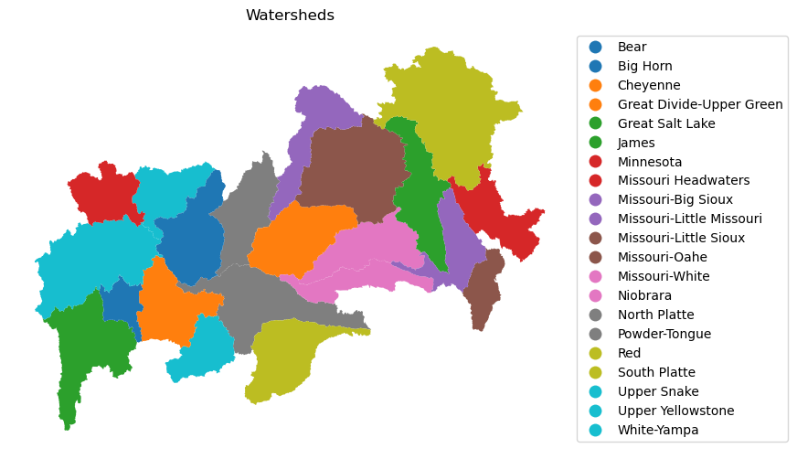

# Watershed Boundaries by Hydrologic Unit Code (HUC)

### Overview
Watersheds are delineated by USGS using a [hydrologic unit code (HUC)](https://nas.er.usgs.gov/hucs.aspx). This provides national hydrologic boundaries. 

**Source:** [<u>Link to data</u>](https://prd-tnm.s3.amazonaws.com/index.html?prefix=StagedProducts/Hydrography/WBD/National/GDB/)

**Notebook Author:** Cassie Buhler


```python
import os
import earthpy as et
import geopandas as gpd

#data url 
url = 'https://prd-tnm.s3.amazonaws.com/StagedProducts/Hydrography/WBD/National/GDB/WBD_National_GDB.zip'

# download data to your machine 
wbd_dir = et.data.get_data(url = url)
wbd_path = os.path.join(wbd_dir, f'WBD_National_GDB.gdb')

# read data
gdf = gpd.read_file(wbd_path, layer = 'WBDHU4', engine='pyogrio')

#print out data 
gdf 
```


<div>
<style scoped>
    .dataframe tbody tr th:only-of-type {
        vertical-align: middle;
    }

    .dataframe tbody tr th {
        vertical-align: top;
    }

    .dataframe thead th {
        text-align: right;
    }
</style>
<table border="1" class="dataframe">
  <thead>
    <tr style="text-align: right;">
      <th></th>
      <th>tnmid</th>
      <th>metasourceid</th>
      <th>sourcedatadesc</th>
      <th>sourceoriginator</th>
      <th>sourcefeatureid</th>
      <th>loaddate</th>
      <th>referencegnis_ids</th>
      <th>areaacres</th>
      <th>areasqkm</th>
      <th>states</th>
      <th>huc4</th>
      <th>name</th>
      <th>globalid</th>
      <th>shape_Length</th>
      <th>shape_Area</th>
      <th>geometry</th>
    </tr>
  </thead>
  <tbody>
    <tr>
      <th>0</th>
      <td>{66B87799-AF14-41BA-9F11-330BF38FA0A5}</td>
      <td>{511D2AC8-11BA-45FC-AB98-F69D693D4C44}</td>
      <td>Watershed Boundary Dataset (WBD)</td>
      <td>Natural Resources and Conservation Service and...</td>
      <td>None</td>
      <td>2024-08-16 11:24:24+00:00</td>
      <td>1384150</td>
      <td>13203421.45</td>
      <td>53432.40</td>
      <td>NM,TX</td>
      <td>1307</td>
      <td>Lower Pecos</td>
      <td>{A41C097B-67A1-416D-9C4B-5C79419D50F8}</td>
      <td>16.748899</td>
      <td>5.057862</td>
      <td>MULTIPOLYGON (((-103.84649 33.01354, -103.8452...</td>
    </tr>
    <tr>
      <th>1</th>
      <td>{ACA0AE30-DBB9-4247-9C7E-9B04B698288B}</td>
      <td>{511D2AC8-11BA-45FC-AB98-F69D693D4C44}</td>
      <td>Watershed Boundary Dataset (WBD)</td>
      <td>Natural Resources and Conservation Service and...</td>
      <td>None</td>
      <td>2024-08-16 11:24:24+00:00</td>
      <td>1385432</td>
      <td>3372434.63</td>
      <td>13647.77</td>
      <td>MX,TX</td>
      <td>1309</td>
      <td>Lower Rio Grande</td>
      <td>{55FE0BC7-43F3-4227-A5EE-AC0F20828622}</td>
      <td>10.835984</td>
      <td>1.232534</td>
      <td>MULTIPOLYGON (((-98.80212 26.95795, -98.79537 ...</td>
    </tr>
    <tr>
      <th>2</th>
      <td>{06AFD216-7C75-4B14-A3FD-327ADC873FCD}</td>
      <td>{511D2AC8-11BA-45FC-AB98-F69D693D4C44}</td>
      <td>Watershed Boundary Dataset (WBD)</td>
      <td>Natural Resources and Conservation Service and...</td>
      <td>None</td>
      <td>2024-08-16 11:24:24+00:00</td>
      <td>1378770</td>
      <td>18423392.00</td>
      <td>74556.89</td>
      <td>TX</td>
      <td>1211</td>
      <td>Nueces-Southwestern Texas Coastal</td>
      <td>{16D89800-EE50-4243-A008-F42664FE5424}</td>
      <td>17.309713</td>
      <td>6.844815</td>
      <td>MULTIPOLYGON (((-100.40903 30.12027, -100.4080...</td>
    </tr>
    <tr>
      <th>3</th>
      <td>{0E918E79-0C68-4381-920B-3A08077F4ED3}</td>
      <td>{31AC21ED-1551-431B-963A-63D44B9887E8}</td>
      <td>None</td>
      <td>U.S. Geological Survey</td>
      <td>None</td>
      <td>2022-01-02 20:20:35+00:00</td>
      <td>None</td>
      <td>8472484.56</td>
      <td>34286.96</td>
      <td>CA</td>
      <td>1806</td>
      <td>Central California Coastal</td>
      <td>{359702D5-6061-47D0-B9DC-B477921BFA5E}</td>
      <td>16.125924</td>
      <td>3.410020</td>
      <td>MULTIPOLYGON (((-122.11788 37.25462, -122.1175...</td>
    </tr>
    <tr>
      <th>4</th>
      <td>{7E32DC94-E57D-4114-A4FA-8F91DCC89CC6}</td>
      <td>{93C374CC-EFFC-4F80-B73B-B02CB768ABCE}</td>
      <td>None</td>
      <td>U.S. Geological Survey</td>
      <td>None</td>
      <td>2022-01-03 14:19:40+00:00</td>
      <td>None</td>
      <td>8861368.04</td>
      <td>35860.72</td>
      <td>CA,MX</td>
      <td>1807</td>
      <td>Southern California Coastal</td>
      <td>{E7C8A802-D2FA-440B-A9BF-9B8D0D0D1BD6}</td>
      <td>18.029736</td>
      <td>3.484674</td>
      <td>MULTIPOLYGON (((-119.10906 34.82364, -119.1086...</td>
    </tr>
    <tr>
      <th>...</th>
      <td>...</td>
      <td>...</td>
      <td>...</td>
      <td>...</td>
      <td>...</td>
      <td>...</td>
      <td>...</td>
      <td>...</td>
      <td>...</td>
      <td>...</td>
      <td>...</td>
      <td>...</td>
      <td>...</td>
      <td>...</td>
      <td>...</td>
      <td>...</td>
    </tr>
    <tr>
      <th>240</th>
      <td>{403D50BA-AB23-4953-A9E3-88D309830AF8}</td>
      <td>None</td>
      <td>None</td>
      <td>None</td>
      <td>None</td>
      <td>2020-11-03 11:01:54+00:00</td>
      <td>None</td>
      <td>11534902.05</td>
      <td>46680.13</td>
      <td>DE,MD,NJ,NY,PA,VA</td>
      <td>0204</td>
      <td>Delaware-Mid Atlantic Coastal</td>
      <td>{0B0689F9-E42B-4307-ADCD-E828096CF5C2}</td>
      <td>23.613899</td>
      <td>4.939448</td>
      <td>MULTIPOLYGON (((-74.59898 42.46011, -74.59866 ...</td>
    </tr>
    <tr>
      <th>241</th>
      <td>{6F1A4B05-D4F4-4CCC-B2F6-3145111E2FA8}</td>
      <td>{511D2AC8-11BA-45FC-AB98-F69D693D4C44}</td>
      <td>Watershed Boundary Dataset (WBD)</td>
      <td>Natural Resources and Conservation Service and...</td>
      <td>None</td>
      <td>2024-08-16 11:24:24+00:00</td>
      <td>970226,977426</td>
      <td>4690028.03</td>
      <td>18979.89</td>
      <td>CT,NJ,NY,RI</td>
      <td>0203</td>
      <td>Lower Hudson-Long Island</td>
      <td>{D9A10A5D-54FE-44CC-B8E5-943E7548DE08}</td>
      <td>15.607259</td>
      <td>2.027672</td>
      <td>MULTIPOLYGON (((-73.02556 41.21327, -73.02548 ...</td>
    </tr>
    <tr>
      <th>242</th>
      <td>{567B48C4-0554-419E-9998-BFCAF8F57203}</td>
      <td>{060BB0D6-9C9A-4919-A859-0787C89C6807}</td>
      <td>None</td>
      <td>U.S. Geological Survey</td>
      <td>None</td>
      <td>2023-04-11 16:22:34+00:00</td>
      <td>None</td>
      <td>3103935.02</td>
      <td>12561.19</td>
      <td>CT,MA,NY,RI</td>
      <td>0110</td>
      <td>Connecticut Coastal</td>
      <td>{FC9F81F3-BF45-4AA7-A2F4-9750D62C0CEB}</td>
      <td>18.418394</td>
      <td>1.358411</td>
      <td>MULTIPOLYGON (((-73.02573 41.21304, -73.02548 ...</td>
    </tr>
    <tr>
      <th>243</th>
      <td>{05AAEB86-3323-432A-96BD-9CF1853E4FD3}</td>
      <td>{511D2AC8-11BA-45FC-AB98-F69D693D4C44}</td>
      <td>Watershed Boundary Dataset (WBD)</td>
      <td>Natural Resources and Conservation Service and...</td>
      <td>None</td>
      <td>2024-08-16 11:24:24+00:00</td>
      <td>366218</td>
      <td>814577.71</td>
      <td>3296.48</td>
      <td>HI</td>
      <td>2009</td>
      <td>Northwestern Hawaiian Islands</td>
      <td>{A43171BA-394F-4EAB-811F-1F5AA41905A9}</td>
      <td>5.849827</td>
      <td>0.297712</td>
      <td>MULTIPOLYGON (((-175.83911 27.99952, -175.8385...</td>
    </tr>
    <tr>
      <th>244</th>
      <td>{8F5E4D6B-CB3B-4C0C-A67F-E9B5E0DC4C67}</td>
      <td>{2F42D1FB-7624-4C17-A5F6-ECFEE2271019}</td>
      <td>Watershed Boundary Dataset (WBD)</td>
      <td>Natural Resources and Conservation Service and...</td>
      <td>None</td>
      <td>2024-10-01 13:20:54+00:00</td>
      <td>1345801</td>
      <td>6304066.54</td>
      <td>25511.67</td>
      <td>LA,TX</td>
      <td>1201</td>
      <td>Sabine</td>
      <td>{C14BC7FB-8A49-4645-9294-570F7481FC9C}</td>
      <td>16.428816</td>
      <td>2.431999</td>
      <td>MULTIPOLYGON (((-96.20544 33.31834, -96.20324 ...</td>
    </tr>
  </tbody>
</table>
<p>245 rows × 16 columns</p>
</div>


## Filtering data 
We want to look at watershed boundaries that overlap in South Dakota. To do so, we will filter the `States` column to only rows that contain `SD`.


```python
filter_sd = gdf['states'].fillna('').str.contains('SD|WY',regex = True)
sd_gdf = gdf[filter_sd]
```

### Plotting data


```python
import matplotlib.pyplot as plt

f, ax = plt.subplots(figsize=(12, 6))
sd_gdf.plot(ax=ax,column="name",legend = True,legend_kwds={"loc": "center left", "bbox_to_anchor": (1, 0.5)})

# Add a title to your plot
ax.set(title="Watersheds")
ax.axis('off') #turning off x/y labels 

plt.show()
```


    

    

