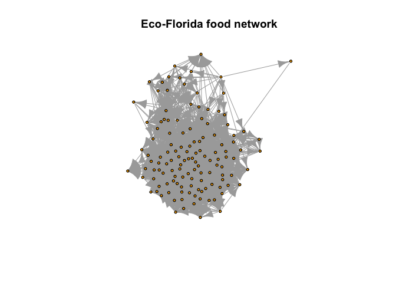
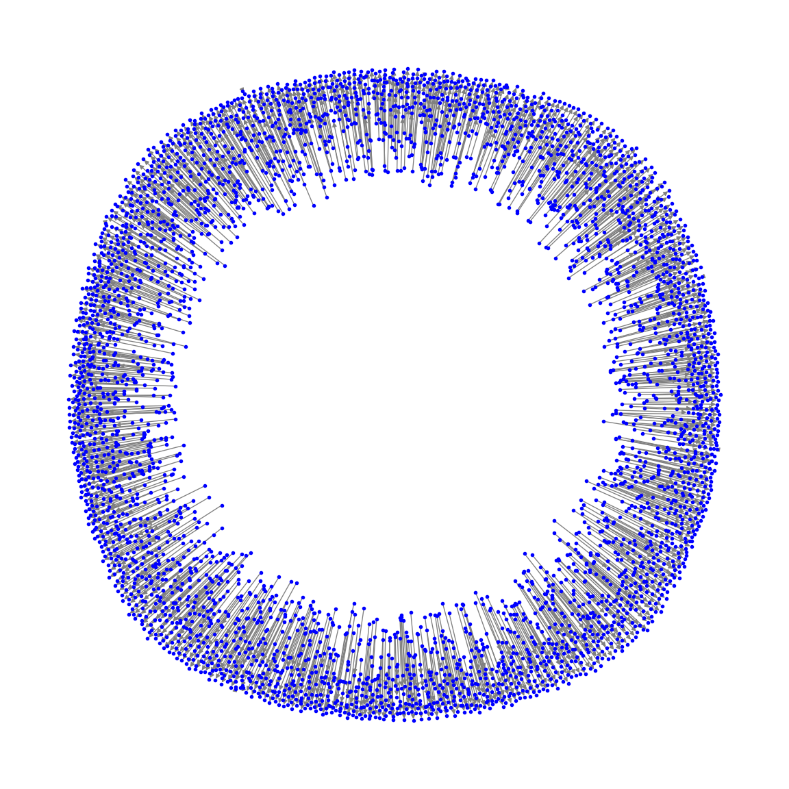

Eco-Florida food network
================

This dataset from the Network Repository, titled “eco-florida,”
represents a food web of the Everglades in South Florida. The nodes in
this network are species or groups of species, and the directed edges
represent predator-prey relationships. The network contains 128 nodes
and 2,102 directed edges.

https://networkrepository.com/index.php

``` r
install.packages("igraph")
install.packages("tidygraph")
install.packages("ggraph")
install.packages("httr")
install.packages("zip")
```

``` r
library(igraph)
```


    Attaching package: 'igraph'

    The following objects are masked from 'package:stats':

        decompose, spectrum

    The following object is masked from 'package:base':

        union

``` r
library(httr)
library(zip)
```


    Attaching package: 'zip'

    The following objects are masked from 'package:utils':

        unzip, zip

``` r
# Download the data
url <- "https://nrvis.com/download/data/eco/eco-florida.zip"
response <- GET(url, write_disk("eco_florida.zip", overwrite = TRUE))

# Unzip the file
unzip("eco_florida.zip", exdir = "eco_florida")

# Read the entire file, excluding the comment line
file_lines <- readLines("eco_florida/eco-florida.edges")
file_lines <- file_lines[-1] # Remove the first line (comment line)

# Write the cleaned data to a new file
writeLines(file_lines, "eco_florida/eco-florida_cleaned.edges")

# Load the cleaned data
data <- read.table("eco_florida/eco-florida_cleaned.edges", col.names = c("from", "to"), row.names = NULL)
```

    Warning in read.table("eco_florida/eco-florida_cleaned.edges", col.names =
    c("from", : header and 'col.names' are of different lengths

``` r
# Create an igraph object
g <- graph_from_data_frame(data, directed = TRUE)

# Remove isolated nodes
g <- delete_vertices(g, V(g)[degree(g) == 0])

# Plot the graph
plot(g, vertex.size = 3, vertex.label = NA, main = "Eco-Florida food network")
```



``` python
import requests
import zipfile
import io
import pandas as pd
import networkx as nx
import matplotlib.pyplot as plt

# Download the data
url = "https://nrvis.com/download/data/eco/eco-florida.zip"
response = requests.get(url)

# Unzip the file
with zipfile.ZipFile(io.BytesIO(response.content)) as zip_file:
    zip_file.extractall("eco_florida")

# Load the data
data = pd.read_csv("eco_florida/eco-florida.edges", sep="\t", skiprows=1, names=["from", "to"])

# Create a NetworkX DiGraph object
G = nx.from_pandas_edgelist(data, "from", "to", create_using=nx.DiGraph())

# Remove isolated nodes
G.remove_nodes_from(list(nx.isolates(G)))

# Plot the graph
plt.figure(figsize=(12, 12))
pos = nx.spring_layout(G, seed=42)
nx.draw(G, pos, node_size=10, node_color="blue", edge_color="gray", with_labels=False)
plt.title("Eco-Florida food network")
plt.show()
```


