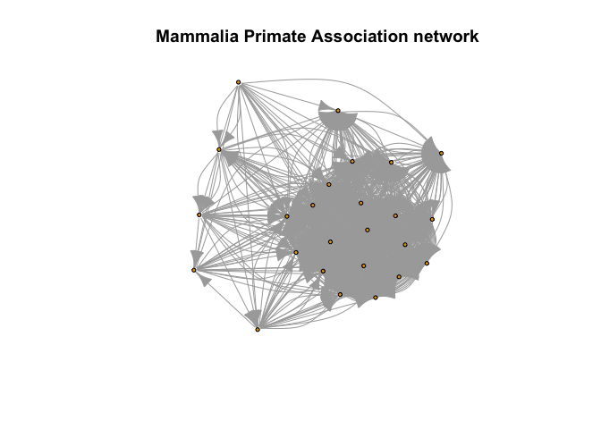

Mammal Primate Association
================

The Mammalia Primate Association dataset, available on the Network
Repository, is a network dataset representing the social interactions
among primates in the Mammalia class. This dataset provides insights
into the complex and diverse relationships between different primate
species within their ecological communities. It consists of 23 nodes
representing the primate species and 18 edges denoting the associations
between these species. The dataset is presented in an undirected graph
format, implying that the relationships between the species are
bidirectional. Researchers and ecologists can use this dataset to
analyze and model the behavioral patterns and social structures of
primates in various habitats. Moreover, the Mammalia Primate Association
dataset has potential applications in understanding how these
interactions affect the overall health and population dynamics of
primate communities and contribute to their survival, reproduction, and
adaptation strategies.

https://networkrepository.com/mammalia-primate-association.php

``` r
library(igraph)
```


    Attaching package: 'igraph'

    The following objects are masked from 'package:stats':

        decompose, spectrum

    The following object is masked from 'package:base':

        union

``` r
library(httr)
library(zip)
```


    Attaching package: 'zip'

    The following objects are masked from 'package:utils':

        unzip, zip

``` r
# Download the data
url <- "https://nrvis.com/download/data/dynamic/mammalia-primate-association.zip"
response <- GET(url, write_disk("mammalia_primate_association.zip", overwrite = TRUE))

# Unzip the file
unzip("mammalia_primate_association.zip", exdir = "mammalia_primate_association")

# Read the entire file, excluding the comment line
file_lines <- readLines("mammalia_primate_association/mammalia-primate-association.edges")
file_lines <- file_lines[-1] # Remove the first line (comment line)

# Write the cleaned data to a new file
writeLines(file_lines, "mammalia_primate_association/mammalia-primate-association_cleaned.edges")

# Load the cleaned data
data <- read.table("mammalia_primate_association/mammalia-primate-association_cleaned.edges", col.names = c("from", "to", "additional_column"), row.names = NULL)
```

    Warning in
    read.table("mammalia_primate_association/mammalia-primate-association_cleaned.edges",
    : header and 'col.names' are of different lengths

``` r
# Create an igraph object
g <- graph_from_data_frame(data, directed = TRUE)

# Remove isolated nodes
g <- delete_vertices(g, V(g)[degree(g) == 0])

# Plot the graph
plot(g, vertex.size = 3, vertex.label = NA, main = "Mammalia Primate Association network")
```


