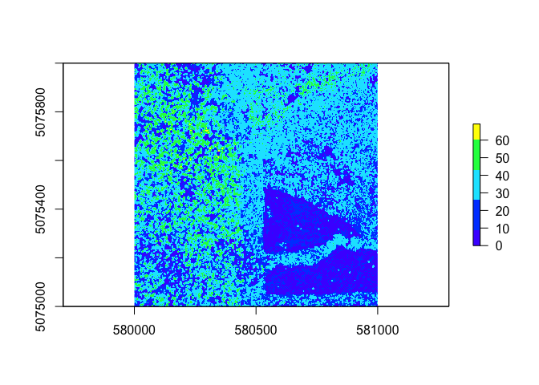

---
tags:
- remote_sensing
- lidar_canopy_height
---

Neon Lidar
================
, NEON
2023-05-21

This code snippet provides instruction on working with two different
NEON data products to estimate tree height:

-   **DP3.30015.001, Ecosystem structure**, aka Canopy Height Model
    (CHM)
-   **DP1.10098.001, Vegetation structure**

The
<a href="https://data.neonscience.org/data-products/DP3.30015.001" target="_blank">CHM
data</a> are derived from the Lidar point cloud data collected by the
remote sensing platform. The
<a href="https://data.neonscience.org/data-products/DP1.10098.001" target="_blank">vegetation
structure data</a> are collected by by field staff on the ground. We
will be using data from the Wind River Experimental Forest NEON field
site located in Washington state. The predominant vegetation there are
tall evergreen conifers.

<div id="ds-objectives" markdown="1">

## Things You’ll Need To Complete This Tutorial

You will need the most current version of R loaded on your computer to
complete this tutorial.

</div>

## 1. Setup

Start by installing and loading packages (if necessary) and setting
options. One of the packages we’ll be using, `geoNEON`, is only
available via GitHub, so it’s installed using the `devtools` package.
The other packages can be installed directly from CRAN.

Installation can be run once, then periodically to get package updates.

``` r
install.packages("neonUtilities")
install.packages("neonOS")
install.packages("sp")
install.packages("raster")
install.packages("devtools")
devtools::install_github("NEONScience/NEON-geolocation/geoNEON")
```

Now load packages. This needs to be done every time you run code. We’ll
also set a working directory for data downloads.

``` r
library(sp)
library(raster)
library(neonUtilities)
library(neonOS)
library(geoNEON)

options(stringsAsFactors=F)
```

## 2. Vegetation structure data

Download the vegetation structure data using the `loadByProduct()`
function in the `neonUtilities` package. Inputs needed to the function
are:

-   `dpID`: data product ID; woody vegetation structure = DP1.10098.001
-   `site`: (vector of) 4-letter site codes; Wind River = WREF
-   `package`: basic or expanded; we’ll download basic here
-   `check.size`: should this function prompt the user with an estimated
    download size? Set to `FALSE` here for ease of processing as a
    script, but good to leave as default `TRUE` when downloading a
    dataset for the first time.

Refer to the
<a href="https://www.neonscience.org/sites/default/files/cheat-sheet-neonUtilities.pdf" target="_blank">cheat
sheet</a> for the `neonUtilities` package for more details if desired.

``` r
veglist <- loadByProduct(dpID="DP1.10098.001", 
                         site="WREF", 
                         package="basic", 
                         check.size = FALSE)
```

Use the `getLocTOS()` function in the `geoNEON` package to get precise
locations for the tagged plants. Refer to the package documentation for
more details.

``` r
vegmap <- getLocTOS(veglist$vst_mappingandtagging, 
                          "vst_mappingandtagging")
```

Now we have the mapped locations of individuals in the
`vst_mappingandtagging` table, and the annual measurements of tree
dimensions such as height and diameter in the `vst_apparentindividual`
table. To bring these measurements together, join the two tables, using
the `joinTableNEON()` function from the `neonOS` package. Refer to the
<a href="https://data.neonscience.org/data-products/DP1.10098.001" target="_blank">Quick
Start Guide</a> for Vegetation structure for more information about the
data tables and the joining instructions `joinTableNEON()` is using.

``` r
veg <- joinTableNEON(veglist$vst_apparentindividual, 
                     vegmap, 
                     name1="vst_apparentindividual",
                     name2="vst_mappingandtagging")
```

Let’s see what the data look like! Make a stem map of the plants in plot
WREF_075. Note that the `circles` argument of the `symbols()` function
expects a radius, but `stemDiameter` is just that, a diameter, so we
will need to divide by two. And `stemDiameter` is in centimeters, but
the mapping scale is in meters, so we also need to divide by 100 to get
the scale right.

``` r
symbols(veg$adjEasting[which(veg$plotID=="WREF_075")], 
        veg$adjNorthing[which(veg$plotID=="WREF_075")], 
        circles=veg$stemDiameter[which(veg$plotID=="WREF_075")]/100/2, 
        inches=F, xlab="Easting", ylab="Northing")
```


And now overlay the estimated uncertainty in the location of each stem,
in blue:

``` r
symbols(veg$adjEasting[which(veg$plotID=="WREF_075")], 
        veg$adjNorthing[which(veg$plotID=="WREF_075")], 
        circles=veg$stemDiameter[which(veg$plotID=="WREF_075")]/100/2, 
        inches=F, xlab="Easting", ylab="Northing")
symbols(veg$adjEasting[which(veg$plotID=="WREF_075")], 
        veg$adjNorthing[which(veg$plotID=="WREF_075")], 
        circles=veg$adjCoordinateUncertainty[which(veg$plotID=="WREF_075")], 
        inches=F, add=T, fg="lightblue")
```


## 3. Canopy height model data

Now we’ll download the CHM tile covering plot WREF_075. Several other
plots are also covered by this tile. We could download all tiles that
contain vegetation structure plots, but in this exercise we’re sticking
to one tile to limit download size and processing time.

The `tileByAOP()` function in the `neonUtilities` package allows for
download of remote sensing tiles based on easting and northing
coordinates, so we’ll give it the coordinates of all the trees in plot
WREF_075 and the data product ID, DP3.30015.001 (note that if WREF_075
crossed tile boundaries, this code would download all relevant tiles).

The download will include several metadata files as well as the data
tile. Load the data tile into the environment using the `raster`
package.

``` r
byTileAOP(dpID="DP3.30015.001", site="WREF", year="2017", 
          easting=veg$adjEasting[which(veg$plotID=="WREF_075")], 
          northing=veg$adjNorthing[which(veg$plotID=="WREF_075")],
          check.size=FALSE)

chm <- raster(paste0( "DP3.30015.001/neon-aop-products/2017/FullSite/D16/2017_WREF_1/L3/DiscreteLidar/CanopyHeightModelGtif/NEON_D16_WREF_DP3_580000_5075000_CHM.tif"))
```

Let’s view the tile.

``` r
plot(chm, col=topo.colors(5))
```


