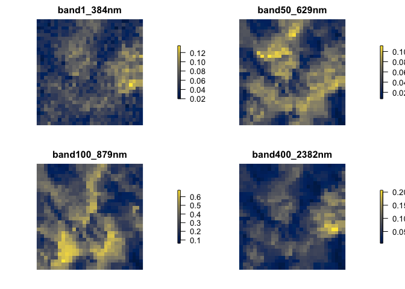
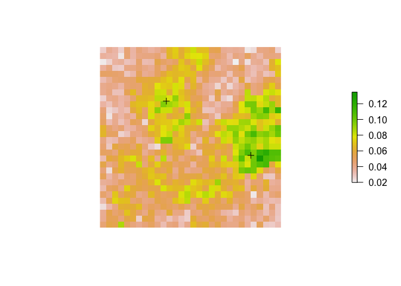
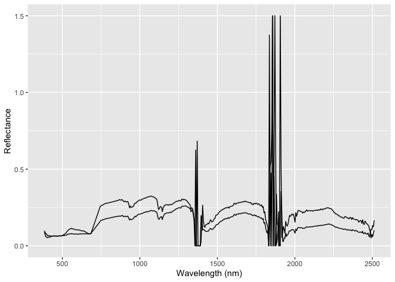

---
tags:
- remote_sensing
- neon_hyperspectral
- innovation-summit-2025
---

NEON Hyperspectral Data
================
, NEON
2023-05-21

neonhs The goal of neonhs is to make data from the National Ecological
Observatory Network (NEON) Airborne Observation Platform (AOP)
hyperspectral instrument easier to use. The NEON AOP collects
hyperspectral imagery via its at a 1 meter spatial resolution for 426
different wavelengths.

``` r
#install.packages('devtools')
devtools::install_github('earthlab/neonhs')


library(neonhs)
library(raster)
library(viridis)
library(sp)
library(tidyverse)

path_to_file <- system.file('extdata', 'ex.h5', package = 'neonhs')
r <- hs_read(path_to_file, bands = c(1, 50, 100, 400))
r

plot(r, col = cividis(100), axes = FALSE, box = FALSE)
```



``` r
pts <- SpatialPointsDataFrame(coords = data.frame(x = c(257025, 257011),
                                                  y = c(4111982, 4111991)), 
                              data = data.frame(id = 1:2),
                              proj4string = CRS(hs_proj4string(path_to_file)))
plot(r[[1]], axes = FALSE, box = FALSE)
plot(pts, add = TRUE)
```



``` r
vals <- hs_extract_pts(path_to_file, pts = pts, bands = 1:426)
vals


vals %>%
  as_tibble() %>%
  dplyr::select(id, starts_with('band')) %>%
  gather(band, reflectance, -id) %>%
  separate(band, c('index', 'wavelength')) %>%
  mutate(wavelength = parse_number(wavelength)) %>%
  ggplot(aes(wavelength, reflectance, group = id)) + 
  geom_line() + 
  xlab('Wavelength (nm)') + 
  ylab('Reflectance')
```



For python, see materials for NEON

<iframe width="100%" height="700" src="https://github.com/NEONScience/NEON-Data-Skills/blob/main/tutorials-in-development/ESIIL_InnovationSummit_2023/Python/hyperspectral/neon_hyperspectral_python.ipynb/" style="border:none" title="Contributed by NEON">
</iframe>

<https://github.com/NEONScience/NEON-Data-Skills/blob/main/tutorials-in-development/ESIIL_InnovationSummit_2023/Python/hyperspectral/neon_hyperspectral_python.ipynb>
