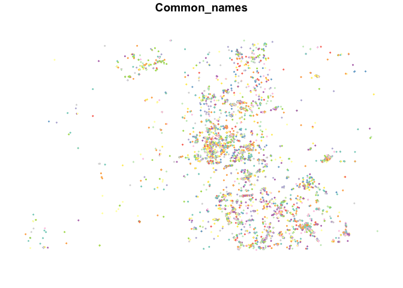

Species Occurrence as points
================

The spocc (Species Occurrence Data) package in R provides a unified
interface to multiple data sources, helping to streamline the process of
obtaining and managing species occurrence records. One of the key data
sources it interfaces with is the Global Biodiversity Information
Facility (GBIF), which is utilized in the provided code.

Starting with the extraction of data from GBIF, the code focuses on the
species ‘Sciurus carolinensis’, collected via the iNaturalist platform.
The collected data is filtered based on geographical coordinates,
providing a localized view of species occurrence.

Using GBIF’s online tool, a more comprehensive dataset is downloaded in
the form of a CSV file. This data, focusing on Boulder county in 2021,
is then cleaned, visualized, and prepared for further analysis. Notably,
the GBIF online tool is preferred for downloading data for multiple
species simultaneously, as this reduces maintenance costs on their end.

The data is further refined by replacing scientific names with their
common counterparts where appropriate, and by reducing the dataset to
only unique entries. The data is then spatially formatted, ready for
further analysis.

A hexagonal grid is subsequently constructed over the occurrence points,
facilitating a more standardized analysis. The choice of a hexagonal
grid, as opposed to a square one, is made due to the more symmetrical
adjacency matrix it offers, ensuring equal adjacency distances.

The species occurrence points are then grouped into their respective
hexagons, and the species richness within each hexagon is visualized.
Species richness, a count of the number of species in an area, is often
used as a proxy to indicate the health and complexity of an ecosystem.

The final output is a visual representation of the species richness for
the year 2021 in Boulder county, presented in a color scheme friendly to
those with color vision deficiencies. This plot offers a clear, visually
appealing insight into the distribution and prevalence of species in the
area, showcasing the utility of the spocc package in handling and
visualizing species occurrence data.

``` r
library("rgdal") 
library("sf")
library('tidyverse')
library('spocc')
library("raster")
library("taxize")
library("data.table")
library("sp")
library("spdep")
library(osmdata)
```

### iNaturalist API

This code is an example showing how to pull data for a single species
from the GBIF database. This is a great way to get data for an
individual species, but GBIF suggests you use their online tool, rather
than their API, for downloading multiple species at one time. You can
set up a for loop to automate a list of species, but that unnecessarily
drives up maintenance costs for GBIF, and they will again point you back
to the online tool.

``` r
# Load required libraries
library(rgbif)
library(janitor)

# Pull data
df <- occ(query = 'Sciurus carolinensis', from = 'gbif',  has_coords = TRUE)

# Convert data to dataframe
df2 <- occ2df(df)

# Check the class of df2
class(df2)

# Clean column names
df3 <- df2 %>% clean_names()

# Filter based on latitude and longitude
df3 <- df3[df3$latitude > 45  & df3$longitude > -74 & df3$longitude < -73 ,,drop=TRUE]
df3
```

### GBIF online download tool

Here I upload the file that I downloaded from gbif.org. To create this
file, I used GBIF’s online tool to draw a bounding box around Boulder
county and specified that I wanted all data with (1) Geographic
coordinates, (2) No known errors, (3) recorded in 2021, and (4)
iNaturalist listed as their provider. The provide that data in the form
of a CSV, which I added to a folder called “rawData” in the working
directory. These data come as a dataframe of occurrence records, which
each record taking a row and different variables taking the columns. The
first thing I do is clean the names using the ‘scrubr’ package. Then I
plot the raw data to make sure they meet my expectations. I’m checking
for anomalies that would be cause by improper loading, like the wrong
spatial extent or unexpectedly empty fields.

``` r
gbif <- fread("rawData/0289344-200613084148143.csv",header=TRUE)

# Load necessary packages
library(ggplot2)
library(USAboundaries)

# Get Colorado state boundary data
colorado_map <- us_states(states = "CO")
colorado_counties <- us_counties(states = "CO", resolution = "high")
# Create a ggplot object with the world map
# Create a ggplot object with the Colorado map
ggplot() + 
  geom_sf(data = colorado_map, fill = "white", color = "gray10", size = 0.2) +
  geom_sf(data = colorado_counties, fill = NA, color = "gray50", linetype = "dotted", size = 0.1) +
  geom_point(data = gbif, aes(x = decimalLongitude, y = decimalLatitude), color = "dodgerblue2", alpha = 0.6, size = 0.1) +
  coord_sf() +
  theme_light(base_size = 10, base_family = "") +
  labs(title = "GBIF Species Occurrences in Colorado",
       subtitle = "Geolocated observations from GBIF database",
       x = "Longitude",
       y = "Latitude")
```


The sci2comm function in R is part of the ‘Taxize’ package, which
provides a suite of tools for taxonomic data from various web sources.
The sci2comm function is designed to convert scientific names into
common names. It can take a vector of scientific names (genus and
species) as input and return the corresponding common names, if they
exist in the database it queries. This can be particularly useful in
fields such as ecology or conservation biology where communicating
findings to a broad audience, that may not be familiar with scientific
names, is important. As of my last update in September 2021, this
function queries databases like ITIS (Integrated Taxonomic Information
System), EOL (Encyclopedia of Life), and Tropicos, among others, to
retrieve the common names.

E-utils users are allowed 3 requests/second without an API key. Create
an API key to increase your e-utils limit to 10 requests/second.

How do I get a key?

First, you will need an NCBI account. Registering is easy. If you
already have an NCBI account, you’re good to go.

To create the key, go to the “Settings” page of your NCBI account.
(Hint: after signing in, simply click on your NCBI username in the upper
right corner of any NCBI page.)

You’ll see a new “API Key Management” area. Click the “Create an API
Key” button, and copy the resulting key. Use the key by adding the
parameter api_key to any E-utilities request.

https://ncbiinsights.ncbi.nlm.nih.gov/2017/11/02/new-api-keys-for-the-e-utilities/

``` r
# Thin to unique
a <- sci2comm(as.character(unique(gbif$verbatimScientificName)), api_key= api_key)
```

``` r
# Make a list of matches between scientific names and common names
common_names <- as.data.frame( unlist(a), byrow=TRUE, ncol=2)
common_names <- cbind( rownames(common_names), common_names)
names(common_names) <- c("verbatimScientificName","common_names")
write.csv(common_names, file="rawData/Common_names.csv")

# Join that list to the dataset
Common_GBIF <- gbif %>% left_join(common_names, by="verbatimScientificName")
Common_GBIF <- Common_GBIF[,c(51,14, 22,23 )] 
Common_GBIF[which(is.na(Common_GBIF$common_names) == TRUE),1] <- Common_GBIF[which(is.na(Common_GBIF$common_names) == TRUE),2]

# Add coordinates
coords = data.frame(
  x=Common_GBIF$decimalLongitude,
  y=Common_GBIF$decimalLatitude
)

# reformat for spatial analysis
GBIF_common_names <- as.data.frame(Common_GBIF$common_names)
names(GBIF_common_names) <- "Common_names"

sp_GBIF <- SpatialPointsDataFrame(coords,GBIF_common_names )
st_GBIF <- st_as_sf(SpatialPointsDataFrame(coords,GBIF_common_names ))

# Plot to check that everything worked
plot(st_GBIF, pch=19, cex=0.25)
```



### Hexagon grid to aggregate data for standardized analysis

Sampling scheme is a critical component to any analysis. I sample the
points above by laying a hexagonal grid over the occurrence points and
aggregating those points into those hex bins for modeling. For a 2D
spatial analysis like the one we’re doing here, I prefer a hexagon
lattice over a square lattice because it has a more symmetrical
adjacency matrix. In a square lattice, the diagonals between cells are
longer than the horizontal and vertical distances. In hexagonal grids,
all adjacency distances are equal. This code creates the hex grid to be
used below for sampling. The extent of this grid is set by the Boulder
County bounding box and he resolution was set to be rather course to
speed up computation time and keep this example light and fast.

``` r
# Define bounding box
 ext <- as(extent(getbb ("Boulder County Colorado")) , "SpatialPolygons")

# Set spatial projection
  crs(ext) <- "EPSG:4326"
  
# Use spsample to measure out a grid of center points within the bounding box  
  h <- spsample(ext, type = "hexagonal", cellsize = 0.01)
    
# convert center points to hexagons
  g <- HexPoints2SpatialPolygons(h, dx = 0.01)
  
# Reformat for easy plotting
  g <- st_as_sf(g)
 
# Plot to check that it's built corrrectly  
  plot(g, lwd=0.1)
```


``` r
# Make the dataset more presentable
  hex_polys <- cbind(seq(1, length(g$geometry)), g)
  colnames(hex_polys) <- c("id_polygons", "geometry") # change colnames
```

### Aggregate iNaturalist data into hex bins

Now that we have iNaturalist data formatted as points and a hex grid
built for sampling those points, it’s time to bin those points into
their appropriate hexagons. I do this using an intersect function that
builds a dataframe by assigning each occurrence point to the hexagonal
polygon that encompasses it’s coordinates. I then group those data by
their new polygon identifier and plot the hexagon grid with a fill color
gradient representing the number of unique occurrence points in that
polygon.

#### Inspect the points overlaying the grid.

``` r
st_crs(st_GBIF) <- crs(hex_polys)
intersection <- st_intersection(x = hex_polys, y = st_GBIF)

int_result <- intersection %>% 
  group_by(id_polygons) 

plot(g, lwd=0.1)
plot(int_result$geometry, pch=19, cex=0.25, col=adjustcolor("cornflowerblue", alpha.f = 0.2), add=TRUE)
```


#### Aggregate points into hex bins

``` r
# Create storage device
species_richness <- rep(0, max(hex_polys$id_polygons))
hex_counts <- cbind(hex_polys, species_richness)

# Count points per hexagon
int_count <- intersection %>% 
  group_by(id_polygons, .drop = FALSE) %>% 
  count()

# Add counts to storage device
hex_counts$species_richness[int_count$id_polygons] <- int_count$n

# Plot
plot(hex_counts$geometry, lwd=0.001, 
     col=grey.colors(max(hex_counts$species_richness), rev = TRUE, start=0, end=1)[hex_counts$species_richness+1])
plot(int_result$geometry, pch=19, cex=0.05, col=adjustcolor("cornflowerblue", alpha.f = 0.2), add=TRUE)
```


#### Plot species richness using a fancy color scheme that works well for color-blind people

A count of the number of species in an area is called species richness.
Species richness is a common proxy variable used to describe differences
between ecosystems or health within a single ecosystem. It provides an
incomplete description of an ecosystem, but species richness is still
frequently used as a good indicator of ecosystem type and health because
more complex ecosystems have more species and so, the number of species
can often approximate complexity and complexity is a defining feature of
ecosystems.

``` r
plot(hex_counts$geometry, lwd=0.001, 
     col=hcl.colors(max(hex_counts$species_richness)+2, palette = "viridis", alpha = NULL, rev = TRUE, fixup = TRUE)[hex_counts$species_richness+1])
```


