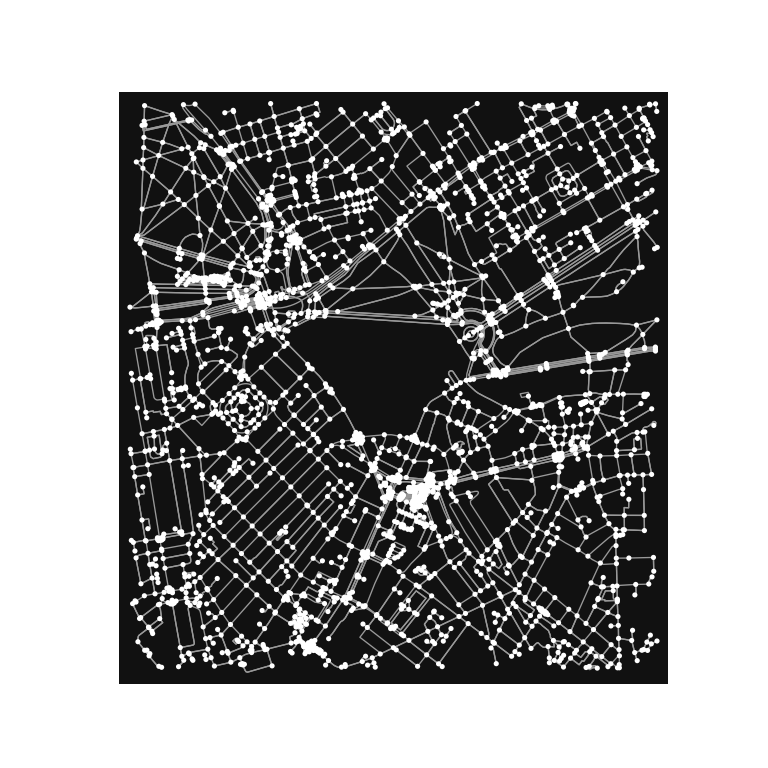

Open Street Map vectors
================

## Basic streetmap from Open Street Map

R Code:

``` r
# Load the "osmdata" package for mapping
library(osmdata)
```

    Data (c) OpenStreetMap contributors, ODbL 1.0. https://www.openstreetmap.org/copyright

``` r
library(tmap)

# Define the map location and zoom level
bbox <- c(left = -0.16, bottom = 51.49, right = -0.13, top = 51.51)

# Get the OpenStreetMap data
osm_data <- opq(bbox) %>% 
  add_osm_feature(key = "highway") %>% 
  osmdata_sf()

# Plot the map using tmap
tm_shape(osm_data$osm_lines) + 
  tm_lines()
```


Python code:

``` python
# Load the "osmnx" package for mapping
import osmnx as ox

# Define the map location and zoom level
bbox = (51.49, -0.16, 51.51, -0.13)

# Get the OpenStreetMap data
osm_data = ox.graph_from_bbox(north=bbox[2], south=bbox[0], east=bbox[3], west=bbox[1], network_type='all')

# Plot the map using osmnx
ox.plot_graph(osm_data)
```

    (<Figure size 1600x1600 with 0 Axes>, <AxesSubplot:>)



In both cases, we define the map location and zoom level, retrieve the
OpenStreetMap data using the specified bounding box, and plot the map.

The main differences between the two approaches are:

Package names and syntax: In R, we use the osmdata package and its
syntax to download and process the OpenStreetMap data, while in Python,
we use the osmnx package and its syntax. Mapping libraries: In R, we use
the tmap package to create a static map of the OpenStreetMap data, while
in Python, we use the built-in ox.plot_graph function from the osmnx
package to plot the map.
