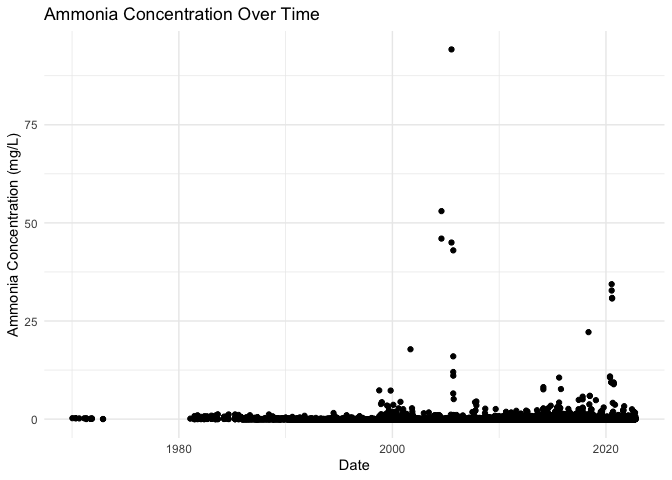
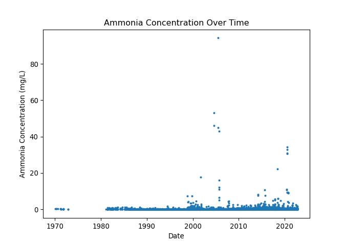

EPA’s Water Quality Data Portal
================

The EPA’s Water Quality Data Portal provides access to water quality
monitoring data from various sources, including federal, state, tribal,
and local organizations. This data covers a wide range of parameters,
such as temperature, pH, dissolved oxygen, and the presence of various
chemicals and pollutants. The portal aggregates data from the Water
Quality Exchange (WQX), the Storage and Retrieval (STORET) Data
Warehouse, and other sources.

The data can be used for various purposes, such as identifying pollution
sources, assessing the effectiveness of water quality management
programs, and understanding the health of aquatic ecosystems. The portal
allows users to search and download data related to specific water
bodies or locations, making it an invaluable resource for water quality
analysis and research.

R

To download and visualize data using R, you can use the httr, xml2,
tidyverse, and ggplot2 packages. First, install them if you haven’t
already:

R code:

``` r
install.packages("httr")
install.packages("xml2")
install.packages("tidyverse")
install.packages("ggplot2")
```

Now you can use the following R script to download the data and create a
plot:

R code:

``` r
library(httr)
library(xml2)
library(tidyverse)
```

    ── Attaching core tidyverse packages ──────────────────────── tidyverse 2.0.0 ──
    ✔ dplyr     1.1.2     ✔ readr     2.1.4
    ✔ forcats   1.0.0     ✔ stringr   1.5.0
    ✔ ggplot2   3.4.2     ✔ tibble    3.2.1
    ✔ lubridate 1.9.2     ✔ tidyr     1.3.0
    ✔ purrr     1.0.1     
    ── Conflicts ────────────────────────────────────────── tidyverse_conflicts() ──
    ✖ dplyr::filter() masks stats::filter()
    ✖ dplyr::lag()    masks stats::lag()
    ℹ Use the conflicted package (<http://conflicted.r-lib.org/>) to force all conflicts to become errors

``` r
library(ggplot2)

# Parameters for the query
state_code <- "US:42" # State code for Pennsylvania
characteristic_name <- "Ammonia" # Water quality characteristic

url <- paste0("https://www.waterqualitydata.us/Result/search?statecode=", state_code, "&characteristicName=", characteristic_name, "&mimeType=csv&zip=yes")

response <- GET(url)

if (status_code(response) == 200) {
  data_file <- "water_quality_data.zip"
  writeBin(content(response, "raw"), data_file)
  cat("Data downloaded successfully.\n")
  
  # Unzip the file and read the CSV
  temp_dir <- tempdir()
  unzip(data_file, exdir = temp_dir)
  csv_file <- list.files(temp_dir, pattern = "*.csv", full.names = TRUE)[1]
  water_quality_data <- read_csv(csv_file)
  
  # Plot the data
  ggplot(water_quality_data, aes(x = ActivityStartDate, y = ResultMeasureValue)) +
    geom_point() +
    labs(title = "Ammonia Concentration Over Time",
         x = "Date",
         y = "Ammonia Concentration (mg/L)") +
    theme_minimal()
} else {
  cat(paste("Error:", status_code(response)), "\n")
}
```

    Data downloaded successfully.

    Warning: One or more parsing issues, call `problems()` on your data frame for details,
    e.g.:
      dat <- vroom(...)
      problems(dat)

    Rows: 57151 Columns: 63
    ── Column specification ────────────────────────────────────────────────────────
    Delimiter: ","
    chr  (31): OrganizationIdentifier, OrganizationFormalName, ActivityIdentifie...
    dbl   (2): ResultMeasureValue, DetectionQuantitationLimitMeasure/MeasureValue
    lgl  (27): ActivityEndDate, ActivityEndTime/Time, ActivityDepthHeightMeasure...
    date  (2): ActivityStartDate, AnalysisStartDate
    time  (1): ActivityStartTime/Time

    ℹ Use `spec()` to retrieve the full column specification for this data.
    ℹ Specify the column types or set `show_col_types = FALSE` to quiet this message.

    Warning: Removed 22581 rows containing missing values (`geom_point()`).



Python code:

``` python
import requests
import pandas as pd
import matplotlib.pyplot as plt
import tempfile
import os
import zipfile

# Parameters for the query
state_code = "US:42" # State code for Pennsylvania
characteristic_name = "Ammonia" # Water quality characteristic

url = f"https://www.waterqualitydata.us/Result/search?statecode={state_code}&characteristicName={characteristic_name}&mimeType=csv&zip=yes"

response = requests.get(url)

if response.status_code == 200:
    data_file = "water_quality_data.zip"
    with open(data_file, "wb") as f:
        f.write(response.content)
    print("Data downloaded successfully.")
    
    # Unzip the file and read the CSV
    with tempfile.TemporaryDirectory() as temp_dir:
        with zipfile.ZipFile(data_file, 'r') as zip_ref:
            zip_ref.extractall(temp_dir)
        csv_file = [os.path.join(temp_dir, f) for f in os.listdir(temp_dir) if f.endswith('.csv')][0]
        water_quality_data = pd.read_csv(csv_file)

    # Plot the data
    water_quality_data['ActivityStartDate'] = pd.to_datetime(water_quality_data['ActivityStartDate'])
    plt.plot(water_quality_data['ActivityStartDate'], water_quality_data['ResultMeasureValue'], marker='o', linestyle='', markersize=2)
    plt.title("Ammonia Concentration Over Time")
    plt.xlabel("Date")
    plt.ylabel("Ammonia Concentration (mg/L)")
    plt.show()

else:
    print(f"Error: {response.status_code}")
```




