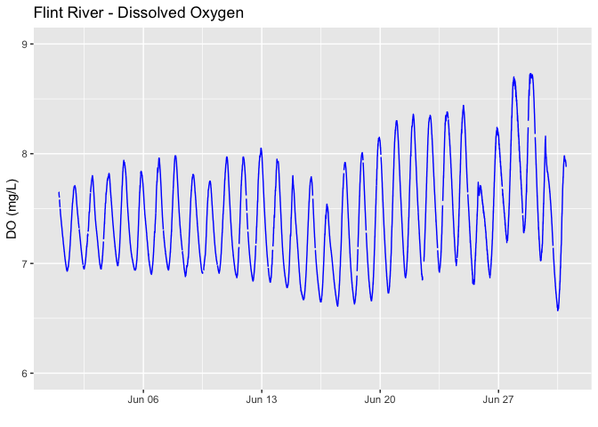

Neon aquatic data
================

The National Ecological Observatory Network (NEON) provides
comprehensive ecological data, including water quality data collected
via specialized equipment known as water quality sondes. These devices
are strategically deployed in various freshwater systems including
streams, lakes, and rivers across different sites to measure a multitude
of water parameters.

At stream sites, the sondes are attached to a post at a fixed depth
relative to the stream bottom. The upstream sensor set, known as S1,
measures specific conductance, dissolved oxygen, pH, chlorophyll, and
turbidity. However, fluorescent dissolved organic matter (fDOM) is not
measured at these locations. The downstream sensor set, S2, monitors the
same parameters as S1 but also includes fDOM.

For larger water bodies, such as lakes and rivers, the sondes are
deployed on buoys. These buoy-deployed multisondes gather data on
specific conductance, dissolved oxygen, pH, chlorophyll, turbidity,
fDOM, and depth. Most of the buoys are equipped with a profiling winch,
allowing the multisonde to collect data from multiple depths every 4
hours and from a parked depth of 0.5 m when not profiling.

An exception to this is the Flint River site (FLNT) due to its high
water velocity. Here, one multisonde is deployed at a fixed depth of 0.5
m below the water surface.

The NEON provides a valuable package, ‘neonUtilities’, to access,
download and prepare these datasets for analysis. This data, which can
be invaluable for researchers studying freshwater systems, contributes
significantly to the understanding of water quality trends, aquatic
ecosystem health, and the impacts of various environmental factors on
water quality.

``` r
library(neonUtilities)
library(ggplot2)
```

For this example let’s download a month of water quality data
(DP1.20288.001) from the Flint River site (FLNT) from June 2022
(2022-06). We’ll download the basic package and we can skip checking the
file size because one month of data will not be very large.

``` r
waq <- loadByProduct(dpID="DP1.20288.001", site="FLNT", 
                     startdate="2022-06", enddate="2022-06", 
                     package="expanded", 
                     release = "RELEASE-2023",
                     check.size = F)
```

``` r
list2env(waq, .GlobalEnv)
```

Now we can plot the dissolved Oxygen time-series. For plotting purposes
we can consider either the `startDateTime`or the `endDateTime` time
stamp. From the **variables_xxxxx** file we can see that these are the
start and end times of the interval over which measurements were
collected. Because water quality is an instantaneous measurement that is
not averaged, these will be the same. Note all NEON data are always in
UTC time. We will also consider the variable `dissolvedOxygen`, which
the **variables_xxxxx** file tells us is the concentration in mg/L.

``` r
doPlot <- ggplot() +
    geom_line(data = waq_instantaneous, 
              aes(endDateTime, dissolvedOxygen), 
              na.rm=TRUE, color="blue") +
  geom_line( na.rm = TRUE) +
    ylim(6, 9) + ylab("DO (mg/L)") +
    xlab(" ") +
  ggtitle("Flint River - Dissolved Oxygen") 
  
  

doPlot
```


