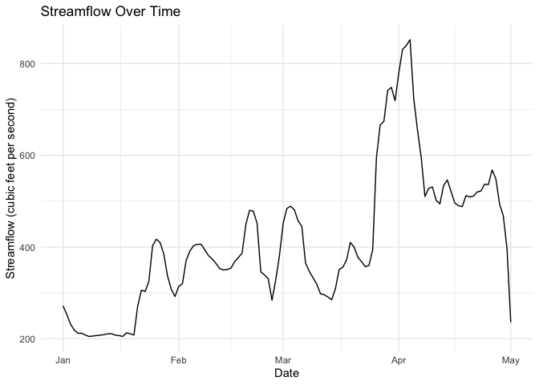

---
tags:
- water
- usgs_water_services
- innovation-summit-2025
---

# USGS Water Services

## Source
- Provider: U.S. Geological Survey
- Access: https://waterservices.usgs.gov/
- License: U.S. Government work (public domain)

## Why it matters
The USGS Water Services API exposes real-time and historical observations for streamflow, groundwater levels, and water quality. These data support research, policy decisions, and situational awareness for water resources.

## Example usage
```python
import requests
import pandas as pd
import matplotlib.pyplot as plt
from datetime import datetime

site = "06759500"
parameterCd = "00060"
startDate = "2023-01-01"
endDate = "2023-05-01"

url = (
    "https://waterservices.usgs.gov/nwis/dv/?format=json&"
    f"sites={site}&startDT={startDate}&endDT={endDate}&parameterCd={parameterCd}"
)
response = requests.get(url)
data = response.json()["value"]["timeSeries"]
if data:
    values = [float(v["value"]) for v in data[0]["values"][0]["value"]]
    dates = [datetime.strptime(v["dateTime"], "%Y-%m-%dT%H:%M:%S.%f") for v in data[0]["values"][0]["value"]]
    df = pd.DataFrame({"Date": dates, "Streamflow": values})
    df.plot(x="Date", y="Streamflow")
    plt.title("Streamflow Over Time")
    plt.ylabel("Streamflow (cubic feet per second)")
    plt.grid(True)
    plt.show()
```
```r
library(dataRetrieval)
library(ggplot2)

site <- "06759500"
parameterCd <- "00060"
startDate <- "2023-01-01"
endDate <- "2023-05-01"

data <- readNWISdv(siteNumbers = site, parameterCd = parameterCd,
                   startDate = startDate, endDate = endDate)

if (nrow(data) > 0) {
  df <- data.frame(Date = as.Date(data$Date),
                   Streamflow = data$X_00060_00003)
  ggplot(df, aes(Date, Streamflow)) +
    geom_line() +
    theme_minimal() +
    labs(title = "Streamflow Over Time",
         y = "Streamflow (cfs)")
} else {
  message("No data available for the specified site and date range.")
}
```

## Visualization


## Harmonization notes
- Time stamps are UTC; convert to local time zones as needed.
- Streamflow units are cubic feet per second.
- Additional parameters available via the same API endpoints.

## References
- [USGS Water Services API](https://waterservices.usgs.gov/)
