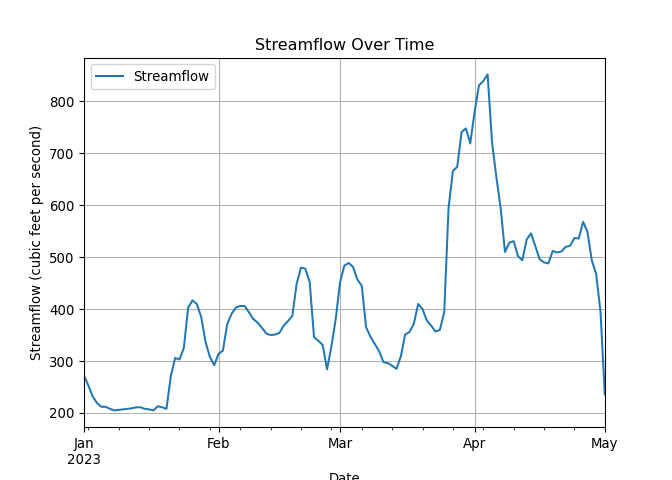

USGS Water Services
================

The United States Geological Survey (USGS) provides APIs for accessing
real-time and historical water data, such as streamflow, groundwater
levels, and water quality measurements. In this example, we will
download the real-time streamflow data for a specific site and create a
plot of the data.

R Code:

``` r
# Load the required libraries
library(dataRetrieval)
library(ggplot2)

# Define the USGS site number for a specific location
site <- "06759500" # Changed to a different site number

# Define the parameter code for streamflow
parameterCd <- "00060"

# Specify the start and end dates for data retrieval
startDate <- "2023-01-01"
endDate <- "2023-05-01"

# Retrieve daily streamflow data for the specified site and date range
data <- readNWISdv(siteNumbers = site, parameterCd = parameterCd, startDate = startDate, endDate = endDate)

if (nrow(data) > 0) {
  # Convert the data to a data frame
  df <- data.frame(Date = as.Date(data$Date),
                   Streamflow = data$X_00060_00003)
  
  # Plot the data
  ggplot(df, aes(x = Date, y = Streamflow)) +
    geom_line() +
    theme_minimal() +
    labs(title = "Streamflow Over Time",
         x = "Date",
         y = "Streamflow (cubic feet per second)")
} else {
  cat("No data available for the specified site and date range.\n")
}
```



``` python
import hydrofunctions as hf
import matplotlib.pyplot as plt
import pandas as pd

# Define the USGS site number for a specific location
site = "06759500"

# Define the parameter code for streamflow
parameterCd = "00060"

# Specify the start and end dates for data retrieval
startDate = "2023-01-01"
endDate = "2023-05-01"

# Retrieve daily streamflow data for the specified site and date range
data = hf.NWIS(site, parameterCd, start_date=startDate, end_date=endDate).get_data()

if not data.empty:
    # Convert the data to a data frame
    df = pd.DataFrame({"Date": data.index, "Streamflow": data["X_00060_00003"]})
    
    # Plot the data
    plt.plot(df["Date"], df["Streamflow"])
    plt.title("Streamflow Over Time")
    plt.xlabel("Date")
    plt.ylabel("Streamflow (cubic feet per second)")
    plt.tight_layout()
    plt.show()
else:
    print("No data available for the specified site and date range.")
```
